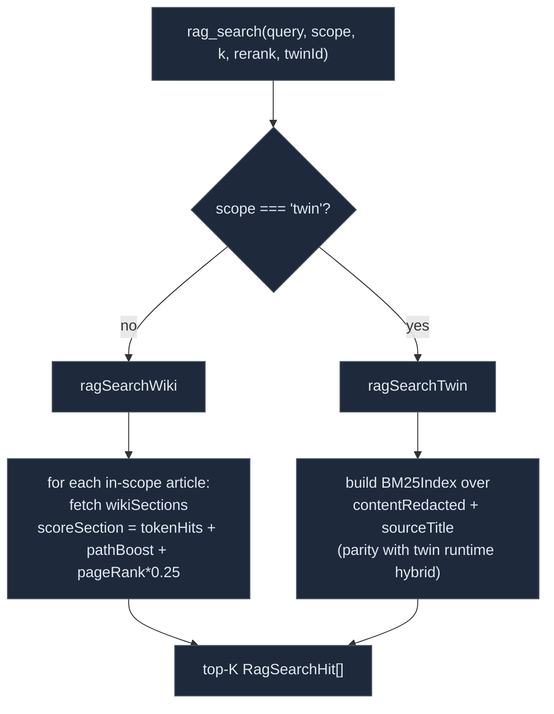

# Knowledge tools

<Status variant="stable">Stable · `lib/external-bridge/handlers/{wiki,rag,runtime,resources}.ts`</Status>

<TLDR>
  Four read-only handlers back the knowledge plane. `wiki_search` (`wiki.ts:57`) ranks module articles by
  weighted token overlap (title ×4, module ×3, summary ×1) plus a `pageRank × 0.5` tie-break.
  `wiki_read` returns the full article by slug. `rag_search` (`rag.ts:66`) is dual-path: wiki sections
  use section-level token overlap + path boost, while `scope=twin` runs a real **BM25** index over the
  twin's redacted chunks. `runtime_query` (`runtime.ts:50`) lists or gets one of five entity families,
  omitting heavy fields in `list` mode. `resources.ts` parses `cognia://kind/id` URIs for the three
  resource families.
</TLDR>

## `wiki_search` — module discovery

`wikiSearch(input): Promise<WikiSearchOutput>` (`wiki.ts:57`). Clamps `k` to `[1, 20]` (default 5).

```ts title="lib/external-bridge/handlers/wiki.ts (scoring)"
// raw = titleHits*4 + moduleHits*3 + summaryHits*1
// return raw + a.pageRank * 0.5     // pageRank as a 0–0.5 tie-break
```

- **Tokenize** the query (`wiki.ts:76`) — split on whitespace/punctuation, keep tokens `length > 1`.
- **Score** each article by weighted token-overlap across title / module / summary (`wiki.ts:110-122`).
- **Tie-break** with `pageRank * 0.5` so structurally-central modules float up on equal overlap.
- **Empty query** → top-K by pageRank alone (`wiki.ts:64-73`), giving a "table of contents" for free.
- Articles scoring `0` are dropped (`wiki.ts:79`); the rest are sliced to `k`. The output reports
  `considered` (candidate count before ranking).

`WikiSearchHit` carries `{ slug, title, module, scope, summary, pageRank, score }`. The agent then feeds
a promising `slug` to `wiki_read`.

## `wiki_read` — full article

`wikiRead({ slug }): Promise<WikiReadOutput | undefined>` (`wiki.ts:170`). Returns
`{ slug, title, module, scope, summary, contentMd, sourceRefs, generatedAt }`, or `undefined` when the
slug is unknown (the server turns that into `{ error: "wiki article '<slug>' not found" }`).
`sourceRefs` are the `file:line` provenance pointers carried from generation.

## `rag_search` — section-level retrieval

`ragSearch(input): Promise<RagSearchOutput>` (`rag.ts:66`). Clamps `k` to `[1, 30]` (default 8). The
`scope` argument selects one of two retrieval engines:



- **Wiki path** (`rag.ts:82-112`) — fetch all articles for the scope, then for each, fetch its
  `wikiSections` and score each section's `bodyMd`: token hits + a `+0.5` boost per matching source-file
  path token + `article.pageRank * 0.25` (`scoreSection`, `rag.ts:161-185`).
- **Twin path** (`rag.ts:126-159`) — build a `BM25Index` over each chunk's `contentRedacted +
  sourceTitle` (`rag.ts:139`) so ranking matches the twin runtime's hybrid retriever, but return the
  chunk's **original** `content` (`rag.ts:154`). Requires `twinId` and the `rag:twin` scope.

<Callout type="warn" title="Twin RAG returns redacted-ranked, original-content chunks">
  The BM25 index is built over `contentRedacted` (PII already replaced with placeholders), keeping the
  retrieval surface private; the returned `content` is the chunk's original text so the external agent
  gets usable context. The `rag:twin` scope is OFF by default precisely because this surface can carry
  personal data.
</Callout>

`RagSearchHit` = `{ filePath, lineStart, lineEnd, content, score, articleSlug? (wiki), twinSourceId? /
twinId? (twin) }`. `rerank` is currently a reserved no-op flag.

## `runtime_query` — entity inventory

`runtimeQuery(input): Promise<RuntimeQueryOutput>` (`runtime.ts:50`). `RuntimeEntityType =
"skill" | "character" | "twin" | "plugin" | "agent-team"`; `op = "list" | "get"`.

| entityType | `list` meta fields | `get` |
| --- | --- | --- |
| `skill` | `isBuiltIn, category, source, status, tags, updatedAt` | full row |
| `character` | `isBuiltIn, updatedAt` | full row |
| `agent-team` | `isBuiltIn, memberCount` | full row |
| `plugin` | `version, status, source, enabled, capabilities` | full row |
| `twin` | `{ kind: "twin" }` | full row |

`list` returns compact `RuntimeListEntry[]` (`{ id, name, description?, meta }`) — it deliberately omits
heavy fields (skill `content`, prompt bodies, full definitions) to keep responses small; `get` returns
the full row by `id`.

### Twin has no table — it's derived

There is no dedicated `twins` table. The twin list de-dups `Character.twinId` values into a `Set`:

```ts title="lib/external-bridge/handlers/runtime.ts:112"
case "twin": {
  const seen = new Set<string>()
  for (const c of await listCharacters()) if (c.twinId) seen.add(c.twinId)
  return Array.from(seen).map((twinId) => ({ id: twinId, name: twinId, meta: { kind: "twin" } }))
}
```

So `runtime_query entityType=twin op=list` returns the set of twin ids referenced by at least one
character — empty if no character is bound to a twin.

## Resources — URI parsing

`resources.ts` (179 lines) exposes the three `cognia://` families. `parseResourceUri` is a tiny,
regex-free splitter:

```ts title="lib/external-bridge/handlers/resources.ts:100"
export function parseResourceUri(uri: string): { kind: string; id: string } | undefined {
  if (!uri.startsWith(SCHEME)) return undefined        // SCHEME = "cognia://"
  const rest = uri.slice(SCHEME.length)
  const idx = rest.indexOf("/")
  if (idx <= 0 || idx === rest.length - 1) return undefined
  return { kind: rest.slice(0, idx), id: rest.slice(idx + 1) }
}
```

Supported kinds are `wiki`, `skill`, `character`. The module also exports `listResources`,
`scopeForResourceUri`, and `readResource`, but in production the [MCP server](./mcp-server#resources--high-level-resourcetemplate)
registers resources directly via the SDK `ResourceTemplate` API and reuses `parseResourceUri` for URI
splitting and the per-article scope derivation.

## Related

<Cards>
  <Card title="Wiki generator" href="./wiki-generator" description="Produces the wikiArticles / wikiSections that wiki_search, wiki_read, and the wiki rag path read." />
  <Card title="Employee Twin" href="../employee-twin" description="The chunks + BM25 retriever that the rag:twin path reuses." />
  <Card title="MCP server" href="./mcp-server" description="How each handler is gated and wrapped into the MCP envelope." />
  <Card title="Action tools" href="./action-tools" description="The other half of the surface — desktop driving and inbox connectors." />
</Cards>
