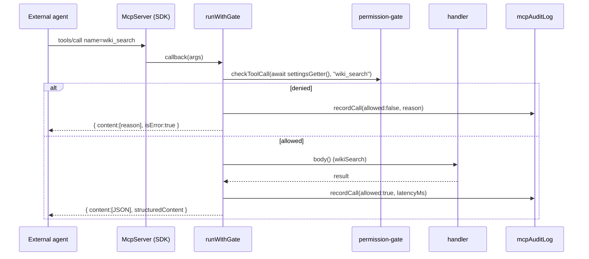

# MCP server

<Status variant="stable">Stable · `lib/external-bridge/mcp-server/server.ts` (~926 lines)</Status>

<TLDR>
  `buildMcpServer(opts)` (`server.ts:58`) builds a `@modelcontextprotocol/sdk` `McpServer` with all of
  Cognia's tools, resources, and prompts pre-wired through the permission gate and audit log. It is
  **transport-agnostic** — the caller supplies stdio / HTTP / in-memory via `server.connect(transport)`.
  Every tool callback funnels through one helper, `runWithGate` (`server.ts:877`): get fresh settings →
  run the gate → dispatch to a handler → record latency + outcome → wrap the result in the MCP `{ content }`
  envelope. A `SettingsGetter` is injected so the server always reads the *current* whitelist, never a
  stale snapshot captured at build time.
</TLDR>

## The factory

```ts title="lib/external-bridge/mcp-server/server.ts:58"
export function buildMcpServer(opts: BuildServerOptions): McpServer {
  const server = new McpServer(opts.serverInfo ?? DEFAULT_SERVER_INFO, {
    capabilities: { tools: {}, resources: {}, prompts: {} },
  })
  registerWikiTools(server, opts.settingsGetter)
  registerRagTool(server, opts.settingsGetter)
  registerRuntimeTool(server, opts.settingsGetter)
  registerComputerUseTool(server, opts.settingsGetter)
  registerConnectorTools(server, opts.settingsGetter)
  registerResources(server, opts.settingsGetter)
  registerPrompts(server)
  return server
}
```

`capabilities` is pre-declared so the SDK's runtime `assertRequestHandlerCapability` check accepts the
low-level `resources/*` handlers. `SettingsGetter` is `() => Promise<ExternalBridgeSettings | undefined>`
(`server.ts:41`) — see [Transports](./transports) for how the sidecar resolves it from
`COGNIA_BRIDGE_SETTINGS`.

## The registered surface

| Kind | Name | Required scope | Registrar |
| --- | --- | --- | --- |
| tool | `wiki_search` | `wiki:cognia` | `registerWikiTools` |
| tool | `wiki_read` | `wiki:cognia` | `registerWikiTools` |
| tool | `rag_search` | `rag:cognia` / `rag:twin` | `registerRagTool` |
| tool | `runtime_query` | per `entityType` | `registerRuntimeTool` |
| tool | `computer_use` | `mcp:computer-use` | `registerComputerUseTool` |
| tool | `connectors_list_adapters` | `inbox:connectors:read` | `registerConnectorTools` |
| tool | `connectors_list_conversations` | `inbox:connectors:read` | `registerConnectorTools` |
| tool | `connectors_get_audit` | `inbox:connectors:read` | `registerConnectorTools` |
| tool | `connectors_export_audit` | `inbox:connectors:read` | `registerConnectorTools` |
| tool | `connectors_list_drafts` | `inbox:connectors:read` | `registerConnectorTools` |
| tool | `connectors_send_message` | `inbox:connectors:send` | `registerConnectorTools` |
| resource | `cognia://wiki/{slug}` | `wiki:cognia` / `wiki:user-repo` | `registerWikiResource` |
| resource | `cognia://skill/{id}` | `runtime:skills` | `registerSkillResource` |
| resource | `cognia://character/{id}` | `runtime:characters` | `registerCharacterResource` |
| prompt | `cognia-howto` | — | `registerPrompts` |
| prompt | `cognia-architecture` | — | `registerPrompts` |

### Tool annotations encode the plane

The five knowledge tools + the connector read tools are registered with
`{ readOnlyHint: true, destructiveHint: false, idempotentHint: true, openWorldHint: false }`.
`computer_use` is the inverse — `{ readOnlyHint: false, destructiveHint: true, idempotentHint: false,
openWorldHint: true }` (`server.ts:251`) — and `connectors_send_message` is
`{ readOnlyHint: false, idempotentHint: false, openWorldHint: true }` (`server.ts:444`). The annotations
tell the client which calls have side effects.

## `runWithGate` — the dispatch pipeline

Every tool callback is a one-liner that delegates to `runWithGate`. The wiki search registration is the
canonical shape:

```ts title="server.ts:101"
async (args) =>
  runWithGate({
    tool: "wiki_search",
    scope: "wiki:cognia",
    check: checkToolCall(await settingsGetter(), "wiki_search"),
    body: () => wikiSearch({ query: args.query, scope: args.scope, k: args.k }),
  })
```



The helper itself (`server.ts:877`):

```ts title="server.ts:877"
async function runWithGate<T>(input: RunWithGateInput<T>): Promise<ToolEnvelope> {
  const start = Date.now()
  if (!input.check.allowed) {
    await recordCall({ tool: input.tool, scope: input.scope, check: input.check, latencyMs: Date.now() - start })
    return { content: [{ type: "text", text: input.check.reason }], isError: true }
  }
  try {
    const result = await input.body()
    await recordCall({ tool: input.tool, scope: input.scope, check: { allowed: true }, latencyMs: Date.now() - start })
    const structured = result !== null && typeof result === "object" && !Array.isArray(result)
      ? (result as Record<string, unknown>) : { value: result }
    return { content: [{ type: "text", text: JSON.stringify(result) }], structuredContent: structured }
  } catch (err) {
    const message = err instanceof Error ? err.message : String(err)
    await recordCall({ tool: input.tool, scope: input.scope, check: { allowed: true }, latencyMs: Date.now() - start, errorMessage: message })
    return { content: [{ type: "text", text: message }], isError: true }
  }
}
```

Three properties worth calling out:

- **Denials and handler exceptions both become `isError: true`** with a human-readable message — the
  agent never gets a silent failure.
- **`structuredContent` must be a JSON object**, so arrays/primitives are wrapped as `{ value: ... }` to
  survive the round-trip without violating the MCP schema.
- **Latency is measured around dispatch** (`Date.now()` before/after `body()`), giving the audit log a
  real `latencyMs` per call.

## Resources — high-level `ResourceTemplate`

Resources use the SDK's `ResourceTemplate("cognia://wiki/{slug}", { list })` API with both a `list`
callback (soft gate) and a `read` callback (hard gate). The wiki `read` path derives the required scope
per article and re-checks it:

```ts title="server.ts:560"
const article = await getWikiArticleBySlug(parts.id)
const requiredScope: BridgeScope =
  article?.scope === "cognia-self" ? "wiki:cognia" : "wiki:user-repo"
const check = checkScope(s, requiredScope)
if (!check.allowed) { /* record + throw check.reason */ }
```

Each `list`/`read` path calls `recordCall` directly (the resource handlers don't go through
`runWithGate`), logging `resources/list:wiki`, `resources/read:skill`, etc. The skill resource renders
through `lib/claude/skills-io.ts:serializeSkill` into SKILL.md; the character resource returns the row
as pretty-printed JSON.

## Prompts — discovery aids

Two `registerPrompt` entries return canned user-message templates (`server.ts:783`):

- **`cognia-howto`** — explains the tool ladder (`wiki_search` → `wiki_read` → `rag_search` →
  `runtime_query`) and the three resource URI families, with a suggested workflow.
- **`cognia-architecture`** — walks the agent through Cognia's major subsystems (External Bridge, Wiki,
  Twin, Connectors, Subscription, Data) and tells it to `wiki_read` + `rag_search` each one.

An external agent pulls these via `prompts/get` and feeds them into its own planning — they are pure
text, gated by nothing.

## Related

<Cards>
  <Card title="Knowledge tools" href="./knowledge-tools" description="The handler bodies behind wiki_search / rag_search / runtime_query / resources." />
  <Card title="Action tools" href="./action-tools" description="computer_use and the six connectors_* handler bodies." />
  <Card title="Permission model" href="./permission-model" description="checkToolCall / checkRuntimeCall / checkRagCall that each callback passes to runWithGate." />
  <Card title="Transports" href="./transports" description="How buildMcpServer is connected to stdio and served over HTTP." />
</Cards>
