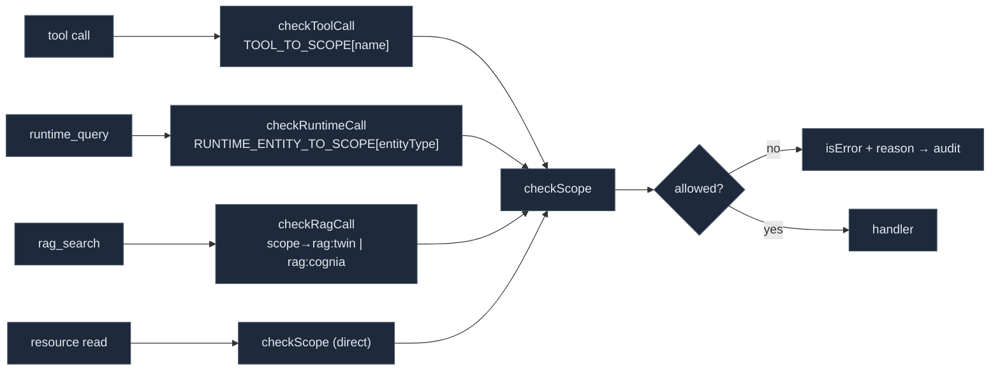

# Permission model

<Status variant="stable">Stable · `lib/external-bridge/permission-gate.ts`</Status>

<TLDR>
  Every MCP call routes through `checkScope` (`permission-gate.ts:25`) before doing any work. Its only
  inputs are the requested `BridgeScope` and the user's `enabledScopes` whitelist from
  `AppSettings.externalBridge`. The whitelist is the **sole** source of truth: there is no implicit
  "enable on first use", and `undefined` settings fail closed. Four thin wrappers normalise the
  different entry points — `checkToolCall` (table lookup), `checkRuntimeCall` (per-`entityType`),
  `checkRagCall` (per-`scope` arg) — onto the same `checkScope`. Resources use a two-tier gate: a
  **soft gate** on `list` (out-of-scope items are hidden) and a **hard gate** on `read` (the scope is
  re-checked even for a known URI).
</TLDR>

## The 13 scopes

One knob per *(capability × content)* pair (`types/wiki/index.ts:37-90`). The Settings UI renders one
toggle per value, iterating `ALL_BRIDGE_SCOPES`.

| Scope | Default | Plane | What it unlocks |
| --- | :---: | --- | --- |
| `wiki:cognia` | ✅ | knowledge | `wiki_search` / `wiki_read` over Cognia's own generated wiki |
| `wiki:user-repo` | ❌ | knowledge | Wiki for user external repos (Phase 3; **disabled in UI**) |
| `rag:cognia` | ✅ | knowledge | Section-level `rag_search` over wiki sections |
| `rag:user-repo` | ❌ | knowledge | `rag_search` over user external repos (Phase 3; **disabled in UI**) |
| `rag:twin` | ❌ | knowledge | `rag_search` over the digital twin's chunks — **private data** |
| `runtime:skills` | ❌ | knowledge | `runtime_query` + `cognia://skill/<id>` resource |
| `runtime:characters` | ❌ | knowledge | `runtime_query` + `cognia://character/<id>` resource |
| `runtime:twins` | ❌ | knowledge | `runtime_query entityType=twin` (id list) |
| `runtime:plugins` | ❌ | knowledge | `runtime_query entityType=plugin` |
| `runtime:agent-teams` | ❌ | knowledge | `runtime_query entityType=agent-team` |
| `mcp:computer-use` | ❌ | **action** | `computer_use` desktop driving (screenshot/click/type/…) |
| `inbox:connectors:read` | ❌ | **action** | The 5 read connector tools (adapters / conversations / audit / drafts) |
| `inbox:connectors:send` | ❌ | **action** | `connectors_send_message` — enqueues an AI reply |

`DEFAULT_ENABLED_SCOPES = ["wiki:cognia", "rag:cognia"]` (`types/wiki/index.ts:93`). The
`read`/`send` split on connectors mirrors the `rag:twin` sensitivity precedent: an operator can grant
observability without enabling automated replies.

## `checkScope` — the gate

```ts title="lib/external-bridge/permission-gate.ts:25"
export function checkScope(
  settings: ExternalBridgeSettings | undefined,
  scope: BridgeScope
): ScopeCheckResult {
  if (!settings) return { allowed: false, reason: "external bridge not configured" }
  if (!settings.enabled) return { allowed: false, reason: "external bridge disabled" }
  if (!settings.enabledScopes.includes(scope)) {
    return { allowed: false, reason: `scope '${scope}' not enabled — toggle it in Settings → External Bridge` }
  }
  return { allowed: true }
}
```

Three fail-closed conditions in order: no settings → no master switch → scope not whitelisted. The
`reason` string is what the external agent sees (as an MCP error) and what lands in the audit row.

## The four entry-point wrappers

Each public surface reaches `checkScope` through a wrapper that resolves the right scope, so the gate
never has to know about tool names or argument shapes.



- **`checkToolCall(settings, name)`** (`:66`) — looks up `TOOL_TO_SCOPE[name]`; an unregistered name is
  denied with `unknown tool '<name>'` so a typo cannot accidentally pass.
- **`checkRuntimeCall(settings, entityType)`** (`:78`) — looks up `RUNTIME_ENTITY_TO_SCOPE[entityType]`;
  unknown entity → `unknown runtime entity`. `runtime_query` needs this because the scope depends on the
  argument, not the tool name.
- **`checkRagCall(settings, ragScope)`** (`:96`) — maps the requested rag scope to a `BridgeScope`:
  `"twin" → rag:twin`, `"user-repo" → rag:user-repo`, and `"cognia-self" | "all" | "" | undefined →
  rag:cognia`. Any other value → `unknown rag scope`.

### The scope tables

```ts title="lib/external-bridge/types.ts:34"
export const TOOL_TO_SCOPE: Record<string, BridgeScope> = {
  wiki_search: "wiki:cognia",
  wiki_read: "wiki:cognia",
  rag_search: "rag:cognia",
  computer_use: "mcp:computer-use",
  connectors_list_adapters: "inbox:connectors:read",
  connectors_list_conversations: "inbox:connectors:read",
  connectors_get_audit: "inbox:connectors:read",
  connectors_export_audit: "inbox:connectors:read",
  connectors_list_drafts: "inbox:connectors:read",
  connectors_send_message: "inbox:connectors:send",
}
```

`runtime_query` is deliberately absent — it carries an `entityType` arg, so `RUNTIME_ENTITY_TO_SCOPE`
(`types.ts:55`) maps `skill → runtime:skills`, `character → runtime:characters`, `twin → runtime:twins`,
`plugin → runtime:plugins`, `agent-team → runtime:agent-teams`.

## Soft vs hard resource gating

Resources are listed and read through two different gate strengths (see [MCP server](./mcp-server) for
the registration code):

| Phase | Gate | Behaviour on out-of-scope |
| --- | --- | --- |
| `resources/list` | **soft** | The item is silently omitted from the listing — no error, the agent just never sees URIs it can't read. |
| `resources/read` | **hard** | `checkScope` runs again even for a known URI; denial throws and the SDK converts it to a JSON-RPC error. |

For wiki resources the required scope is derived per-article from `article.scope`
(`cognia-self → wiki:cognia`, else `wiki:user-repo`), so a single URI family spans two scopes.

## Two layers of defence for `computer_use`

The `mcp:computer-use` scope is only the **first** gate. A call that passes `checkScope` is still forced
through the **automation permission gate** on the Rust side (`Surface::Mcp`) by the `automation_proxy`,
which can independently deny, require consent, and rate-limit. See [Action tools](./action-tools) and
[Transports](./transports#automation-proxy). The two gates are independent: enabling the MCP scope does
not bypass the desktop automation policy.

## Related

<Cards>
  <Card title="MCP server" href="./mcp-server" description="Where the wrappers are wired into each tool/resource callback via runWithGate." />
  <Card title="Audit, storage & settings" href="./audit-and-settings" description="Every gate decision — allow or deny — is recorded in mcpAuditLog." />
  <Card title="Action tools" href="./action-tools" description="The second automation gate that computer_use also has to pass." />
</Cards>
