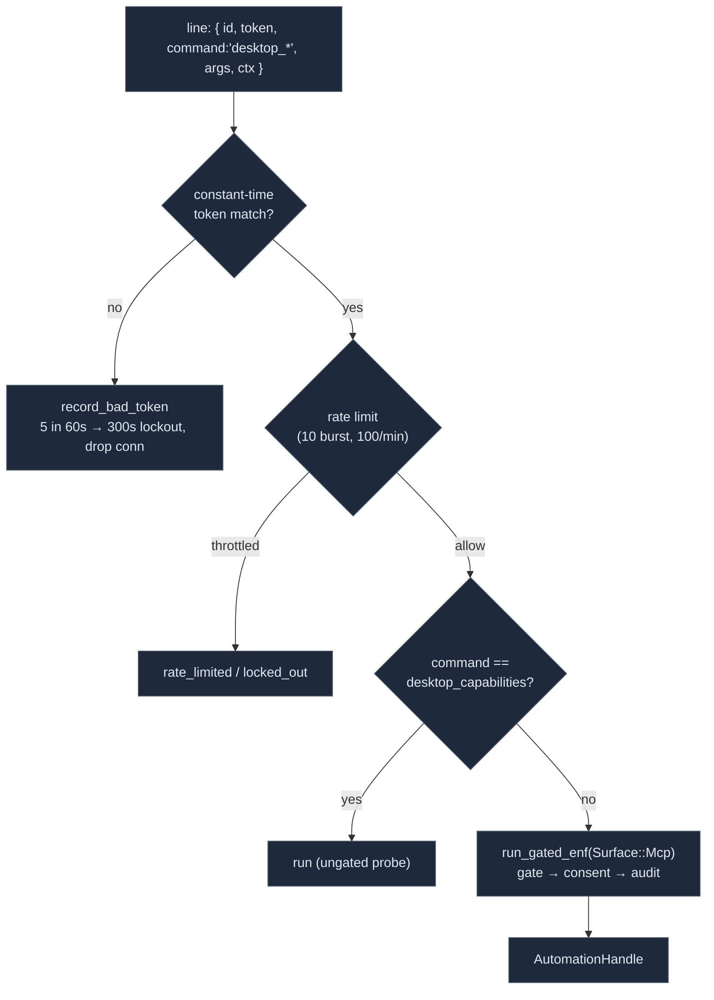

# Transports

<Status variant="stable">Stable · `mcp-server/` + `src-tauri/src/mcp_server/`</Status>

<TLDR>
  The same `buildMcpServer` skeleton is reached two ways. Over **stdio**, a Node sidecar
  (`standalone-entry.ts`) resolves its settings from `COGNIA_BRIDGE_SETTINGS` (bridged) or a JSON file
  (standalone), then `connect()`s the SDK's `StdioServerTransport`. Over **HTTP**, the Tauri Rust side
  (`src-tauri/src/mcp_server/`, axum) binds `127.0.0.1:<port>`, authenticates a bearer token in
  constant time (`subtle`), and forwards each JSON-RPC line to a **long-lived, serial** Node sidecar via
  a `Mutex`-guarded `round_trip`. Four `#[tauri::command]`s expose the lifecycle. When the server starts
  it also spawns an `automation_proxy` — a second 127.0.0.1 socket the sidecar uses for `computer_use`,
  gated by the automation permission gate and rate-limited per peer.
</TLDR>

## stdio — the sidecar entry

`standalone-entry.ts` (98 lines) is the Node CLI that runs the MCP server on stdin/stdout. Its only job
beyond `buildMcpServer` is choosing **where settings come from**, keyed on `COGNIA_BRIDGED`:

```ts title="lib/external-bridge/mcp-server/standalone-entry.ts:77"
export async function runMcpServerStdio(): Promise<void> {
  const server = buildMcpServer({ settingsGetter: resolveSettingsGetter() })
  await server.connect(createStdioTransport())
}
```

| Mode | Condition | Settings source | Freshness |
| --- | --- | --- | --- |
| **bridged** | `COGNIA_BRIDGED` = `"1"` / `"true"` | `COGNIA_BRIDGE_SETTINGS` env (JSON) | parsed **once**, cached — scope changes need a restart |
| **standalone** | otherwise | `${COGNIA_DATA_DIR}/external-bridge.json` | read **on every call** |

`bridgedSettingsGetter` (`:41`) parses the env JSON once and returns `async () => cached`;
`standaloneSettingsGetter` (`:59`) reads the file per call and falls back to
`DEFAULT_EXTERNAL_BRIDGE_SETTINGS` on any error. `transport-stdio.ts` is a 13-line wrapper exporting
`createStdioTransport()` so tests can swap an in-memory transport. The bundled output of this entry is
`cognia-mcp.js`; the Settings UI resolves it at `~/.cognia/cognia-mcp.js` by default
(`external-bridge-section.tsx:78`).

## HTTP — the Tauri/axum server

`src-tauri/src/mcp_server/` is the HTTP transport. It is registered in `src-tauri/src/lib.rs`: the module
at `lib.rs:22`, the state via `.manage(McpServerState::new())` at `lib.rs:214`, and the four commands in
the invoke handler at `lib.rs:534-537`.

```mermaid
flowchart TB
  subgraph Agent["External agent (HTTP)"]
    Client["POST http://127.0.0.1:&lt;port&gt;/mcp<br/>Authorization: Bearer &lt;token&gt;"]
  end
  subgraph Rust["src-tauri/src/mcp_server/"]
    Cmds["commands.rs<br/>mcp_server_start / stop / restart / status"]
    State["mod.rs · McpServerState<br/>Mutex&lt;McpServerInner&gt;"]
    Http["http_server.rs<br/>axum · auth_middleware · graceful shutdown"]
    Side["sidecar.rs · SidecarProcess<br/>tokio::process + Mutex&lt;SidecarIo&gt;"]
    Proxy["automation_proxy.rs<br/>127.0.0.1 socket for computer_use"]
  end
  subgraph Node["Node sidecar (COGNIA_BRIDGED=1)"]
    Entry["standalone-entry.ts → buildMcpServer"]
  end

  Client -->|loopback| Http
  Cmds --> State
  State --> Http
  State --> Side
  State --> Proxy
  Http -->|round_trip(line)| Side
  Side -->|stdin/stdout| Node
  Proxy -. COGNIA_AUTOMATION_PROXY(_TOKEN) .-> Node

  classDef n fill:#1e293b,stroke:#475569,color:#e2e8f0
  class Agent,Rust,Node n
```

### Endpoints

| Method | Path | Auth | Behaviour |
| --- | --- | --- | --- |
| GET | `/healthz` | none | `{ "ok": true, "version": "<CARGO_PKG_VERSION>" }` |
| POST | `/mcp` | bearer | one JSON-RPC line in → one line out (`mcp_post`) |
| POST | `/mcp/sse` | bearer | **501** placeholder — `{ error: "SSE streaming is not implemented in Phase 1; use POST /mcp" }` |

```rust title="src-tauri/src/mcp_server/http_server.rs"
const BODY_LIMIT_BYTES: usize = 1024 * 1024;   // 1 MiB

let app = Router::new()
    .route("/healthz", get(healthz))
    .route("/mcp", post(mcp_post))
    .route("/mcp/sse", post(mcp_sse))
    .layer(from_fn_with_state(state.clone(), auth_middleware))
    .layer(RequestBodyLimitLayer::new(BODY_LIMIT_BYTES))
    .with_state(state);
```

`auth_middleware` (`http_server.rs:168`) bypasses `/healthz`, then extracts `Bearer <token>` and compares
it against `state.token` with `subtle::ConstantTimeEq` — a length mismatch is rejected, and the content
comparison is constant-time to defeat timing attacks. Missing header → 401 `missing bearer token`;
mismatch → 401 `invalid token`. `mcp_post` rejects an empty body with 400 and maps a sidecar failure to
502 Bad Gateway, forwarding the sidecar's response as a raw `serde_json::Value` to avoid field loss from
double-serialization.

### Lifecycle commands

The four `#[tauri::command]`s (`commands.rs`) align 1:1 with `tauri-control.ts`:

| Command | Input | Output | Notes |
| --- | --- | --- | --- |
| `mcp_server_start` | `port` · `token` · `settings_json` · `sidecar_path` (+ `AutomationState`) | `u16` bound port | `port=0` → OS-assigned |
| `mcp_server_stop` | — | `()` | `NotRunning` if already stopped |
| `mcp_server_restart` | same as start | `u16` bound port | best-effort stop + fresh start |
| `mcp_server_status` | — | `McpServerStatus` | `{ running, port, startedAt }` |

```ts title="lib/external-bridge/tauri-control.ts:36"
export async function startMcpServer(args: StartArgs): Promise<number> {
  return transport.call<number>("mcp_server_start", {
    port: args.port, token: args.token,
    settingsJson: JSON.stringify(args.settings), sidecarPath: args.sidecarPath,
  })
}
```

`mcp_server_start` (`commands.rs:26`) also receives the `AutomationState` and forwards
`Enforcement::from_state(&automation)` into `McpServerState::start`, which is how the automation gate
reaches the proxy.

## The sidecar process model

`McpServerState::start` (`mod.rs:108`) validates the token (empty → `TokenMissing`), parses the settings
JSON early (bad → `InvalidSettings`), and guards against double-start (`AlreadyRunning(port)`). Then,
**in order**: spawn the `AutomationProxy` → spawn the sidecar with the proxy's addr/token → spawn the
HTTP listener.

```rust title="src-tauri/src/mcp_server/sidecar.rs (spawn_with_env)"
let mut cmd = Command::new("node");
cmd.arg(sidecar_path)
   .env("COGNIA_BRIDGED", "1")
   .env("COGNIA_BRIDGE_SETTINGS", settings_json);
for (key, value) in extra_env { cmd.env(key, value); }   // COGNIA_AUTOMATION_PROXY(_TOKEN)
cmd.stdin(Stdio::piped()).stdout(Stdio::piped()).stderr(Stdio::inherit())
   .kill_on_drop(true);
```

The process is **long-lived and serial** — a single `Mutex<SidecarIo>` serialises `round_trip`:

```rust title="src-tauri/src/mcp_server/sidecar.rs (round_trip)"
let mut io = self.request_lock.lock().await;   // serialise stdin/stdout
io.stdin.write_all(request.as_bytes()).await?; io.stdin.write_all(b"\n").await?;
io.stdin.flush().await?;
let mut line = String::new();
io.stdout.read_line(&mut line).await?;          // exactly one line back
```

Rationale: the MCP SDK's `StdioServerTransport` is inherently sequential, so multiplexing buys nothing;
a single mutex prevents two concurrent axum handlers from interleaving bytes; and a long lifetime means
V8, the handler modules, and the Dexie adapter initialise only once. `kill_on_drop(true)` guarantees the
child dies when `SidecarProcess` is dropped — `stop` (`mod.rs:188`) `Option::take`s the server tuple,
sends the axum graceful-shutdown signal, and lets the sidecar + proxy drop. `stderr` is inherited, so
sidecar `console.error` flows into the Tauri log. Integration tests use `spawn_echo_for_tests`
(`sidecar.rs`), which early-returns when `node` is not on PATH so CI does not hard-depend on Node.

### Error model

`McpServerError` (`types.rs`, `thiserror`) serialises to a single string for React toasts:
`AlreadyRunning(port)`, `NotRunning`, `Bind { port, source }`, `InvalidSettings(reason)`, `TokenMissing`,
`SidecarSpawn(reason)`, `SidecarIo(reason)`. `McpServerStatus` is `{ running, port, startedAt }` (camelCase
serde) with a `default()` of all-empty/false.

## automation_proxy

`automation_proxy.rs` is a dedicated 127.0.0.1 socket the sidecar uses **only** for `computer_use` — kept
off the MCP stdin/stdout pipe so long `desktop_*` calls can't stall MCP framing. `McpServerState::start`
calls `AutomationProxy::spawn(handle, enforcement)` and forwards `COGNIA_AUTOMATION_PROXY=<addr>` +
`COGNIA_AUTOMATION_PROXY_TOKEN=<hex>` to the sidecar.



Defences (constants at `automation_proxy.rs:57-63`):

- **Token**: 32-byte hex, compared with `subtle::ConstantTimeEq` (`token_matches`). The socket is
  loopback-bound, but the token is the load-bearing defence — same model as the HTTP bearer.
- **Rate limit** (`RATE_LIMIT_BURST = 10`, `RATE_LIMIT_REFILL_PER_SEC = 100/60`): a per-IP token bucket
  so a tight `screenshot` loop can't turn the proxy into a DoS amplifier.
- **Bad-token lockout** (`BAD_TOKEN_THRESHOLD = 5` within `BAD_TOKEN_WINDOW = 60s` → `BAD_TOKEN_LOCKOUT =
  300s`): repeated guesses drop the connection.
- **The gate**: every non-probe command is forced through `dispatcher::run_gated_enf` on `Surface::Mcp`
  (matched on the un-prefixed name, e.g. `click`) — this closes the historical bypass where the proxy
  called the worker directly, recording and enforcing nothing. `desktop_capabilities` is the only ungated
  probe so a client can always discover backend support.

`AutomationProxy::Drop` aborts the listener task and releases the port, so the proxy lives exactly as long
as the MCP sidecar that depends on it.

## Related

<Cards>
  <Card title="Action tools" href="./action-tools" description="The computer_use handler that opens this proxy socket and frames the envelopes." />
  <Card title="MCP server" href="./mcp-server" description="The buildMcpServer skeleton both transports connect." />
  <Card title="Remote Control" href="../remote-control" description="A sibling axum HTTP path with the same bearer-auth + IPC pattern." />
  <Card title="Audit, storage & settings" href="./audit-and-settings" description="The Settings UI that calls startMcpServer with the token + sidecar path." />
</Cards>
