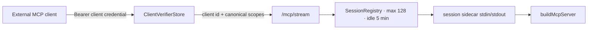
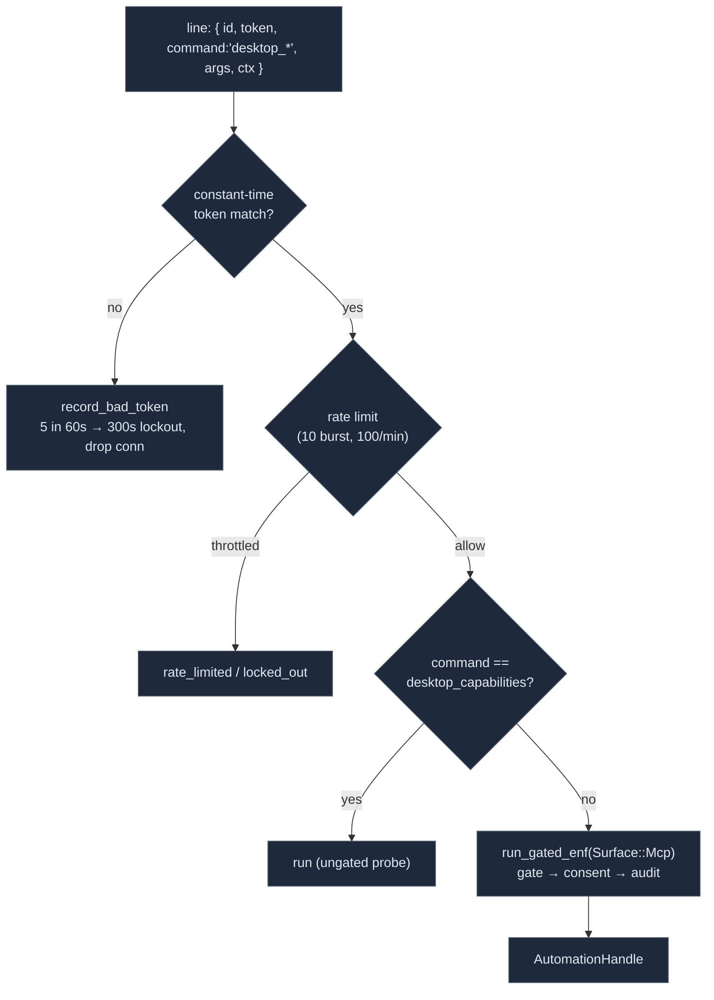

# Transports

<Status variant="stable">Stable · `lib/external-bridge/mcp-server/` + `crates/cognia-mcp-server/`</Status>

<TLDR>
  The same `buildMcpServer` skeleton is available over stdio and the loopback External Bridge.
  The HTTP surface has exactly one MCP path: `GET|POST|DELETE /mcp/stream`. Each bearer credential
  resolves to one client identity and canonical scope set, and every `Mcp-Session-Id` is bound to that
  identity. `/mcp` and `/mcp/sse` are deliberately not mounted. Active sessions are capped at 128,
  idle sessions are reclaimed after five minutes, and excess initializes fail with an explicit 503.
</TLDR>

## stdio — the sidecar entry

`lib/external-bridge/mcp-server/standalone-entry.ts` builds the shared MCP server and connects the SDK's
`StdioServerTransport`. In bridged mode it reads `COGNIA_BRIDGE_SETTINGS`; standalone mode reads the
host data file on each call. The bundled entry is `sidecar/cognia-mcp.mjs`, and Rust resolves the same
path for both spawning and client setup so the advertised command cannot drift from the installed file.

## HTTP — canonical Streamable HTTP

The listener lives in `crates/cognia-mcp-server/`. `http_server.rs` owns loopback binding, DNS-rebinding
protection, authentication, the 1 MiB body limit, and graceful shutdown. `streamable_http.rs` owns MCP
session creation, routing, SSE, idle reclamation, and admission control.



### Endpoints

| Method | Path | Auth | Behaviour |
| --- | --- | --- | --- |
| GET | `/healthz` | none | Liveness only; loopback Host/Origin checks still apply. |
| POST | `/mcp/stream` | per-client bearer | Initialize a session, send JSON-RPC, or receive a response as JSON/SSE. |
| GET | `/mcp/stream` | per-client bearer + session | Long-lived server-to-client SSE stream. |
| DELETE | `/mcp/stream` | per-client bearer + session | Close the session and release its worker. |

```rust title="crates/cognia-mcp-server/src/http_server.rs"
let app = Router::new()
    .route("/healthz", get(healthz))
    .route(
        "/mcp/stream",
        post(streamable_http::post_handler)
            .get(streamable_http::get_handler)
            .delete(streamable_http::delete_handler),
    );
```

The initial JSON-RPC `initialize` request omits `Mcp-Session-Id`; the response returns one. Later calls
must carry it. A notification without `id` returns 202. A normal request returns JSON, while
`Accept: text/event-stream` produces an SSE stream ending after the matching response. A session ID
owned by another client is rejected and credential rotation, revocation, or expiry closes established
sessions.

### Authentication and scopes

The host persists only SHA-256 client credential verifiers. The middleware hashes the supplied bearer,
performs a constant-time digest comparison, checks expiry, then stamps trusted `clientId` and scopes
into the sidecar request. Caller-supplied scope metadata is overwritten. Client scope is intersected
with the host's enabled scopes in the MCP permission gate; no transport-local tool allowlist is used.
The listener also requires loopback `Host` and, when present, a loopback `Origin`.

### Canonical lifecycle

The public control plane is the `external_bridge_*` command family: revisioned configuration,
per-client create/list/rotate/revoke, start/stop/restart, and redacted status. These commands are
manifest-governed and execute through `remote_execution`. Starting loads active client verifiers from
the host security store and calls `McpServerState::start_with_clients`; verifier replacement closes all
sessions so a stale stream cannot outlive a credential change.

The older `mcp_server_*` Tauri lifecycle remains an internal migration seam for the local settings UI.
It is not an HTTP MCP facade and does not re-mount `/mcp` or `/mcp/sse`; its removal is tracked by the
remote API consolidation work.

## Session and process model

`SessionRegistry` admits at most 128 active sessions with a non-blocking semaphore. The permit is held
until the last in-flight reference drops, so deleting a registry row cannot admit excess work while an
SSE/request task still uses the session. Capacity exhaustion returns 503 rather than spawning another
process. A 30-second response timeout bounds synchronous POSTs, a 256-message broadcast channel bounds
per-session fan-out, and a background sweep removes sessions idle for more than five minutes.

Each session currently owns a sidecar child, a single writer lock, and a reader task that broadcasts
stdout lines to POST and GET consumers. `McpServerState` also retains the root sidecar for lifecycle and
managed-process reporting. The planned single-process framed multiplexer is not implemented yet; the
128-session admission limit bounds the current process and memory exposure until that migration lands.

### Error model

Authentication failures are 401, cross-origin or cross-client access is 403, malformed requests are
400, unknown sessions are 404, sidecar spawn/write failures are 502, capacity overload is 503, and a
matching-response timeout is 504. Bodies contain only a short `{ error }` message and never echo bearer
credentials, scopes, command arguments, or results.

## automation_proxy

`automation_proxy.rs` is a dedicated 127.0.0.1 socket the sidecar uses **only** for `computer_use` — kept
off the MCP stdin/stdout pipe so long `desktop_*` calls can't stall MCP framing. `McpServerState::start`
calls `AutomationProxy::spawn(handle, enforcement)` and forwards `COGNIA_AUTOMATION_PROXY=<addr>` +
`COGNIA_AUTOMATION_PROXY_TOKEN=<hex>` to the sidecar.



Defences (constants at `automation_proxy.rs:57-63`):

- **Token**: 32-byte hex, compared with `subtle::ConstantTimeEq` (`token_matches`). The socket is
  loopback-bound, but the token is the load-bearing defence — same model as the HTTP bearer.
- **Rate limit** (`RATE_LIMIT_BURST = 10`, `RATE_LIMIT_REFILL_PER_SEC = 100/60`): a per-IP token bucket
  so a tight `screenshot` loop can't turn the proxy into a DoS amplifier.
- **Bad-token lockout** (`BAD_TOKEN_THRESHOLD = 5` within `BAD_TOKEN_WINDOW = 60s` → `BAD_TOKEN_LOCKOUT =
  300s`): repeated guesses drop the connection.
- **The gate**: every non-probe command is forced through `dispatcher::run_gated_enf` on `Surface::Mcp`
  (matched on the un-prefixed name, e.g. `click`) — this closes the historical bypass where the proxy
  called the worker directly, recording and enforcing nothing. `desktop_capabilities` is the only ungated
  probe so a client can always discover backend support.

`AutomationProxy::Drop` aborts the listener task and releases the port, so the proxy lives exactly as long
as the MCP sidecar that depends on it.

## Related

<Cards>
  <Card title="Action tools" href="./action-tools" description="The computer_use handler that opens this proxy socket and frames the envelopes." />
  <Card title="MCP server" href="./mcp-server" description="The buildMcpServer skeleton both transports connect." />
  <Card title="Companion API" href="../companion-api" description="The canonical authenticated host-control plane." />
  <Card title="Audit, storage & settings" href="./audit-and-settings" description="The Settings UI that calls startMcpServer with the token + sidecar path." />
</Cards>
