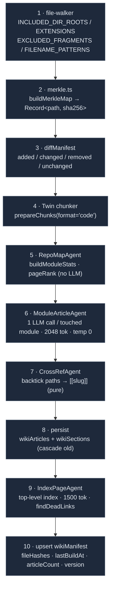

# Wiki generator

<Status variant="stable">Stable · `lib/wiki/` · the content producer for the knowledge plane</Status>

<TLDR>
  `lib/wiki/` is the producer behind `wiki_search` / `wiki_read` / the wiki `rag_search` path. `rebuildWiki`
  (`orchestrator.ts:103`) runs a 10-step pipeline: filter the source tree → SHA-256 Merkle map →
  `diffManifest` (added / changed / removed / unchanged) → reuse the Twin code chunker → four sub-agents
  (`RepoMapAgent` heuristic pageRank, no LLM; `ModuleArticleAgent` one LLM call per module, 2048-token
  cap, temp 0; `CrossRefAgent` pure Markdown post-processor inserting `[[slug]]`; `IndexPageAgent`
  top-level nav, 1500-token cap) → persist to `wikiArticles` + `wikiSections`. Incrementality is the
  default; only the modules touched by changed files get re-generated. A `wikiSchedule` reconciles to a
  single scheduler task so rebuilds can run on a cron.
</TLDR>

## The pipeline



```ts title="lib/wiki/orchestrator.ts:103"
export async function rebuildWiki(deps: WikiOrchestratorDeps, opts: RebuildOptions): Promise<RebuildResult>
// deps: { fs: FileSystem; llm: LlmClient; embed?: EmbedFn }
// opts: { scope: WikiScope; rootDir: string; generatorVersion: string; force?: boolean; moduleTokenBudget?: number }
```

`RebuildResult` reports `{ added, changed, removed, unchanged, articles, indexPage?, errors, durationMs }`.
Module failures are collected into `errors[]` — one broken module never rolls back the build. The optional
`EmbedFn` defaults to `ZERO_EMBEDDING` (`orchestrator.ts:56`), so Phase 1 ranking is token-overlap +
pageRank, not vectors.

## File inclusion rules

A strict whitelist + blacklist + filename patterns, all pure functions in `file-walker.ts`:

```ts title="lib/wiki/file-walker.ts:16"
export const INCLUDED_DIR_ROOTS = ["lib", "app", "components", "hooks", "types"] as const
export const INCLUDED_EXTENSIONS = [".ts", ".tsx", ".rs", ".md", ".mdx"] as const
export const EXCLUDED_FRAGMENTS = [
  "/node_modules/", "/.next/", "/out/", "/dist/", "/coverage/",
  "/.claude/worktrees/", "/components/ui/", "/components/ai-elements/",
] as const
export const EXCLUDED_FILENAME_PATTERNS = [
  /\.test\.[mc]?[jt]sx?$/, /\.spec\.[mc]?[jt]sx?$/, /\.d\.ts$/, /\.stories\.[jt]sx?$/,
]
```

`shouldIncludeFile`, `filterIncludedPaths`, `bucketByModule`, and `moduleToSlug` derive module keys and
slugs. `components/ui/` (shadcn) and `components/ai-elements/` (vendored) are hard-excluded — no
informational value.

## Merkle incrementality

`merkle.ts`: `hashContent` (SHA-256 via SubtleCrypto), `buildMerkleMap(files)` →
`Record<path, sha256>`, and `refreshSubset` for partial updates. The diff itself lives in
`lib/db/wiki-manifest.ts:43`:

```ts title="lib/db/wiki-manifest.ts:43"
export function diffManifest(manifest: WikiManifest | undefined, current: Record<string, string>):
  { added: string[]; changed: string[]; removed: string[]; unchanged: string[] }
```

Only the **touched module set** (modules owning added/changed/removed files) is fed to
`ModuleArticleAgent`; unchanged modules keep their existing articles. `force=true` deletes the whole scope
first (`deleteAllWikiArticlesForScope`); otherwise `deleteStaleWikiArticles` removes articles written by a
mismatched `generatorVersion`.

## The four sub-agents

### RepoMapAgent — heuristic pageRank (no LLM)

Pure functions, no model call. `buildModuleStats(chunks)` aggregates lines/tokens per module; a boost-list
multiplier feeds a normalized `0..1` pageRank.

```ts title="lib/wiki/agents/repo-map-agent.ts:22"
const BOOST_FILES = new Set([
  "index.ts", "index.tsx", "page.tsx", "layout.tsx", "route.ts",
  "mod.rs", "lib.rs", "main.rs", "README.md", "README.mdx",
])
// raw = totalLines × (BOOST_FILES.has(basename) ? 1.5 : 1.0); pageRank = raw / max(raw)
```

`chunksWithinBudget` greedily trims chunks to the per-module token budget. True tree-sitter import-graph
PageRank is deferred to Phase 2.

### ModuleArticleAgent — one call per module

`runModuleArticleAgent` issues a single `llm.complete(moduleArticlePrompt(...), { system: WIKI_SYSTEM_VOICE,
maxTokens: 2048, temperature: 0 })` (`module-article-agent.ts:43`). The model emits H1 + summary +
`## What it does` / `## Public API` / `## Internals` / `## Related`; `assembleArticle` splits the response
into sections and attaches `sourceRefs`.

```ts title="lib/wiki/prompts.ts:16"
export const WIKI_SYSTEM_VOICE =
  "You are documenting a TypeScript codebase for downstream LLM coding agents (Claude Code, Cursor, Cline). " +
  "Your output goes directly into a wiki those agents will RAG-retrieve to understand the code. " +
  "Write in concise, structural Markdown — short headings, bullet lists for enumerations, code references " +
  "as `path/to/file.ts:line`. No marketing language, no apologies, no meta-commentary about your task. " +
  "Every claim must be grounded in the source provided; do not invent helpers, types, or APIs that aren't shown."
```

### CrossRefAgent — pure Markdown post-processor

Lets the model write `` `lib/twin/ingest` `` in prose without knowing slug rules; the post-processor
rewrites it to `[[lib-twin-ingest]]`. `applyCrossRefs(body, index)` masks fenced code blocks, matches
backtick paths, and returns `{ body, linkedSlugs }`.

```ts title="lib/wiki/agents/cross-ref-agent.ts:51"
const BACKTICK_PATH = /`((?:lib|app|components|hooks|types)\/[\w./-]+?)`/g
```

`findDeadLinks(body, knownSlugs)` here only **returns** the unresolved set (soft) — strict validation that
throws happens in IndexPage.

### IndexPageAgent — top-level navigation

`runIndexPageAgent` makes one `llm.complete(..., { maxTokens: 1500, temperature: 0 })` call producing the
top-level index grouped by related modules. `assembleIndexPage` calls `findDeadLinks` and **throws** if any
linked slug is unknown (`index-page-agent.ts:57`); the orchestrator catches and records it rather than
aborting the whole build.

## Provider selection (rebuild-runner)

`rebuild-runner.ts:buildLlmClient` sniffs the active provider from settings, then picks a default model:

| Signal | provider | default model |
| --- | --- | --- |
| `activeProviderId` contains `openai` | openai | `gpt-4o` |
| `activeProviderId` contains `google` | google | `gemini-2.5-pro` |
| `activeProviderId` contains `mistral` | mistral | `mistral-large` |
| `activeProviderId` contains `cohere` | cohere | `command-r-plus` |
| else `apiKey` starts `sk-ant` | anthropic | `claude-sonnet-4-6` |
| else `apiKey` starts `sk-` | openai | `gpt-4o` |
| default | anthropic | `claude-sonnet-4-6` |

`buildTauriFileSystem` implements `FileSystem` via `@tauri-apps/plugin-fs`; `runWikiRebuild` throws
`WebModeError` when `isTauri()` is false — the browser has no real filesystem, so web users can only
consume an already-generated wiki, never produce one.

## Scheduled rebuilds

`schedule/cron-bridge.ts` reconciles `externalBridge.wikiSchedule` to a single scheduler task:

```ts title="lib/wiki/schedule/cron-bridge.ts"
export const WIKI_REBUILD_TASK_ID = "wiki-rebuild::singleton"
const DAILY_CRON  = "0 3 * * *"   // 03:00 daily
const WEEKLY_CRON = "0 3 * * 0"   // 03:00 Sundays
```

`resolveCronExpression(schedule)` maps `mode` → cron (`off → null`, `daily`, `weekly`, `custom` →
validated raw expression). `syncWikiCronToScheduler` creates / updates / deletes the singleton task and
returns the action taken (`created | updated | deleted | skipped | invalid`). The task payload carries the
`force` flag so a scheduled run can ignore cached hashes.

## Export to docs (optional)

`exporter.ts:exportWikiToMarkdown` writes Fumadocs-compatible MDX at `<rootDir>/<scope>/<slug>.mdx` (plus
`<scope>/index.mdx`), with front-matter `title / description / slug / module / scope / pageRank /
generatedAt / generatorVersion`.

## Reuse relationship with Twin

| Reuse? | Part | Why |
| :---: | --- | --- |
| ✅ | `lib/twin/ingest/chunk.ts:prepareChunks` | proven format-aware code chunker |
| ✅ | `lib/twin/distill/llm.ts:LlmClient` | the multi-provider LLM adapter |
| ❌ | the distill pipeline | wiki articles are durable artifacts, not drafts pending review |
| ❌ | PII redaction | Cognia's own source is trusted (user-repo Phase 3 will sanitize) |
| ❌ | twin tables | wiki has its own `wikiArticles` / `wikiSections` |

## Related

<Cards>
  <Card title="Knowledge tools" href="./knowledge-tools" description="wiki_search / wiki_read / rag_search read the tables this pipeline writes." />
  <Card title="Employee Twin" href="../employee-twin" description="The chunker + LlmClient this pipeline reuses." />
  <Card title="Audit, storage & settings" href="./audit-and-settings" description="The wikiArticles / wikiSections / wikiManifest tables + the rebuild card." />
  <Card title="ADR-0008" href="../../adr/0008-external-bridge" description="Wiki spec, PageRank decisions, and prompt design principles." />
</Cards>
