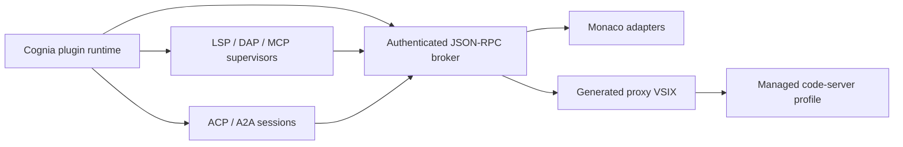

# Managed IDE Extension Platform

<Status variant="beta">Protocol 1.0 · Code 1.128.0 · code-server 4.128.0</Status>

The platform projects one Cognia plugin runtime into Monaco and Pro IDE. A Pro
IDE proxy contains validated declarations, static assets, and platform-owned
bootstrap code; plugin business code never runs in the VS Code extension host.

Each host owns two mutually exclusive profiles. Managed Pro IDE loads pinned
built-ins, the Cognia broker, and signed generated proxies. Native Extensions
IDE loads user-selected Open VSX extensions in a separate process, port,
`user-data-dir`, and `extensions-dir`; it never receives broker credentials.
The profiles do not share extension state, secrets, Workspace Trust, or
capability tickets.

The platform is split into four planes:

- [Authoring and SDK](./authoring): `manifest.ide`, the locked catalog, schema,
  provider families, and proxy generation.
- [Protocol and security](./protocol-security): framing, authentication,
  authorization, storage, webviews, and protocol processes.
- [Operations](./operations): local/remote hosting, transactional updates,
  migration, Dev Mode, and troubleshooting.
- [Compatibility](./compatibility): version policy, explicit exclusions, and
  release gates.

ADR context remains in [ADR-0088](../../adr/0088-pro-ide-code-server).
