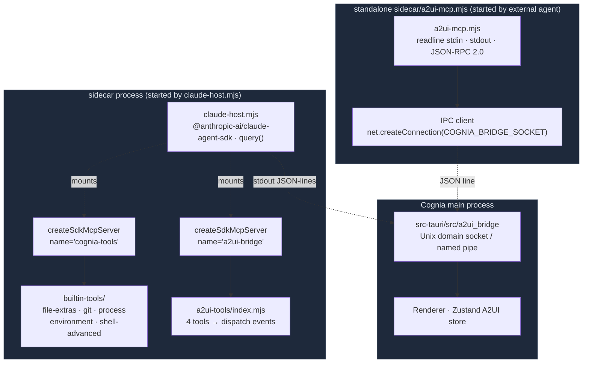

# MCP Server (Sidecar)

<Status variant="stable">A2UI v0.9 · cognia-tools built-in tools</Status>

<TLDR>
  The `sidecar/` directory hosts two entirely different kinds of MCP services: **in-process** SDK
  MCP servers (mounted by `claude-host.mjs` in each Claude Agent SDK session, carrying the five
  categories of `builtin-tools/` plus the A2UI bridge in `a2ui-tools/`), and a **standalone stdio**
  `a2ui-mcp.mjs` (used to let external agents *outside* the Cognia process — Claude Code CLI /
  Cursor / Codex — also create A2UI surfaces). Both share the same tool schema, but communicate
  differently: the former goes through the SDK's `createSdkMcpServer` into an in-process message
  bus, while the latter uses JSON-RPC over newline-delimited stdin/stdout, forwarding dispatch
  events back to the Cognia renderer process's Zustand store via the `COGNIA_BRIDGE_SOCKET` Unix
  domain socket.
</TLDR>

## When to Use

- Attach "extension tools" to the current Claude Agent SDK session: read-only git queries, process listings, file-level hash/diff, controlled shell execution, environment reads.
- Let Claude (or another AI SDK provider) "draw UI" directly inside the chat, producing interactive surfaces (dialog / panel / inline / fullscreen) through the A2UI protocol.
- Let coding agents outside Cognia (Claude Code CLI / Cursor / Codex / Gemini) also control Cognia's A2UI surfaces — i.e. "the outer Claude draws UI for the inner Cognia".

## When NOT to Use

- Exposing Cognia's **wiki / RAG / runtime entities** — that's the [External Bridge](./external-bridge), served by `lib/external-bridge/mcp-server/`.
- Persisting tool results into Dexie — the sidecar does not talk to IndexedDB directly; all persistence must go back through IPC to the main process.

## Architecture

## Key Modules and File Paths

<Files>
  <Folder name="sidecar/" defaultOpen>
    <File name="claude-host.mjs" />
    <File name="a2ui-mcp.mjs" />
    <File name="fetch-interceptor.mjs" />
    <File name="package.json" />
    <Folder name="builtin-tools/">
      <File name="index.mjs" />
      <File name="safety.mjs" />
      <File name="file-extras.mjs" />
      <File name="git.mjs" />
      <File name="process.mjs" />
      <File name="environment.mjs" />
      <File name="shell-advanced.mjs" />
    </Folder>
    <Folder name="a2ui-tools/">
      <File name="index.mjs" />
    </Folder>
    <Folder name="dispatch/">
      <File name="index.mjs" />
      <File name="anthropic.mjs" />
      <File name="ai-sdk.mjs" />
      <File name="event-adapter.mjs" />
      <File name="input-stream.mjs" />
    </Folder>
  </Folder>
</Files>

| File / Directory                   | Responsibility                                                                                                                  |
| ---------------------------------- | ------------------------------------------------------------------------------------------------------------------------------- |
| `claude-host.mjs`                  | Sidecar top-level; wraps Claude Agent SDK's `query()`; mounts builtin-tools and a2ui-tools according to settings                |
| `a2ui-mcp.mjs`                     | Standalone stdio MCP service for external agents; dispatches back through socket                                                |
| `builtin-tools/index.mjs`          | `buildCogniaToolsServer({ enabled })` — assembles in-process MCP server based on user's category toggles                        |
| `builtin-tools/safety.mjs`         | Path traversal guard, shell allow/blocklist, `toolText` / `toolError` response wrappers                                         |
| `builtin-tools/file-extras.mjs`    | `file_hash` / `file_diff` / `file_search` / `content_search` / `file_copy` and 8 other file tools                               |
| `builtin-tools/git.mjs`            | Read-only git subcommands (log, status, diff, blame), using `execFile` to avoid shell injection                                 |
| `builtin-tools/process.mjs`        | Cross-platform process list / query / terminate; Windows uses PowerShell `Get-Process`, POSIX uses `ps`                         |
| `builtin-tools/environment.mjs`    | `list_env` / `get_env` / `system_info`, with `*KEY*/*TOKEN*` patterns redacted by default                                       |
| `builtin-tools/shell-advanced.mjs` | `shell_execute_advanced` — restricted shell with mandatory user approval, stricter than SDK Bash                                |
| `a2ui-tools/index.mjs`             | Four A2UI MCP tools: `a2ui_create_surface` / `a2ui_update_components` / `a2ui_data_model_update` / `a2ui_delete_surface`        |
| `dispatch/`                        | Provider-aware dispatch (anthropic goes through Claude Agent SDK, others through AI SDK); indirectly related to this page's MCP |

`@modelcontextprotocol/sdk` is **not** in `sidecar/package.json` dependencies — it is a transitive dependency of `@anthropic-ai/claude-agent-sdk` (in-process MCP is exposed via `createSdkMcpServer`); `a2ui-mcp.mjs` deliberately avoids importing the SDK, hand-rolling readline + JSON-RPC to keep the standalone sidecar as small as possible.

## Two Kinds of Services Compared

| Dimension      | In-process (builtin-tools / a2ui-tools)                              | Standalone (`a2ui-mcp.mjs`)                                                                          |
| -------------- | -------------------------------------------------------------------- | ---------------------------------------------------------------------------------------------------- |
| Launcher       | Constructed by `claude-host.mjs` at the start of each Claude session | Registered in the external agent's own MCP config, spawned as a child process                        |
| Communication  | SDK in-process message bus (`createSdkMcpServer` returned instance)  | JSON-RPC 2.0 / newline-delimited stdio                                                               |
| Tool set       | 5 builtin-tool categories + 4 A2UI tools                             | 4 A2UI tools only                                                                                    |
| Configuration  | `settings.builtinTools.<category>` toggles + per-character allowlist | Determined by the external agent's MCP config file                                                   |
| Authentication | Claude Agent SDK's `canUseTool` hook + user approval flow            | Full trust of local process; write-back to main process gated by `COGNIA_BRIDGE_SOCKET` reachability |
| Dispatch path  | sidecar stdout JSON-lines → Rust → Renderer                          | Unix socket / named pipe → Rust → Renderer                                                           |
| Failure mode   | SDK error → tool returns `isError: true`                             | Socket unreachable → tool still responds OK, but `dispatched: false` for agent fallback              |

## Data Flow

### In-process: Claude calls `file_hash` during a session

<Steps>
<Step>User sends "compute SHA-256 for README.md" in a Cognia chat.</Step>
<Step>`claude-host.mjs` compiles the current character's `builtinTools` toggles into the `query()` `mcpServers` field: `{ "cognia-tools": buildCogniaToolsServer({ enabled }) }`.</Step>
<Step>Claude decides → initiates `mcp__cognia-tools__file_hash` tool call.</Step>
<Step>SDK validates tool name → calls into the `file_hash` handler in `file-extras.mjs`.</Step>
<Step>Handler runs `safety.mjs:assertPathInside(rootCwd, target)` to prevent traversal, then streams the hash via `crypto.createHash('sha256')`.</Step>
<Step>Returns `toolText({ ok: true, sha256, sizeBytes })` — the standard MCP `CallToolResult` structure.</Step>
<Step>SDK feeds the result back to Claude; Claude writes the reply.</Step>
</Steps>

### In-process: Claude creates an A2UI surface

<Steps>
<Step>`a2ui-tools/index.mjs:buildA2UIBridgeServer({ sessionId, emit })` is constructed at sidecar startup and mounted on `mcpServers["a2ui-bridge"]`.</Step>
<Step>Claude calls `mcp__a2ui-bridge__a2ui_create_surface({ surfaceId: "calc-1", surfaceType: "panel" })`.</Step>
<Step>Handler calls `dispatch({ type: "createSurface", … })` — actually `emit({ type: "a2ui_dispatch", sessionId, message })`, where `emit` is injected by the host and ultimately does `process.stdout.write` of one JSON line.</Step>
<Step>Rust side `a2ui_bridge` receives this stdout event and forwards it to the Renderer Zustand store.</Step>
<Step>React components subscribe to the store → render the surface; subsequent `a2ui_update_components` follows the same path.</Step>
</Steps>

### Standalone: Claude Code CLI controls Cognia through external MCP

<Steps>
<Step>User registers `{ command: "node", args: [".../sidecar/a2ui-mcp.mjs"], env: { COGNIA_BRIDGE_SOCKET: "/tmp/cognia-a2ui.sock" } }` in Claude Code's `~/.claude/mcp.json`.</Step>
<Step>Claude Code spawns this process on startup and immediately sends an `initialize` JSON-RPC.</Step>
<Step>`a2ui-mcp.mjs` parses it and returns `serverInfo: { name: "a2ui-bridge", version: "0.9.0" }` + `capabilities.tools`.</Step>
<Step>At the same time, `connectIpc()` tries `net.createConnection(COGNIA_BRIDGE_SOCKET)`. Connection failure → one stderr log line + enters "detached" mode.</Step>
<Step>Claude Code calls `tools/call name=a2ui_create_surface`. The `TOOL_TO_DISPATCH` table converts args into an internal message, and `dispatch(message)` writes it to the socket.</Step>
<Step>Regardless of socket reachability, the tool response always returns `ok: true`, only appending `note: "running detached; no UI dispatch"` when detached — so the external agent's planning loop doesn't crash just because Cognia isn't running.</Step>
</Steps>

## Tool Inventory

### `cognia-tools` server (in-process, 5 categories)

Tool namespace is `mcp__cognia-tools__<tool>`; category toggles are in Settings → System → Tools.

| Category        | Representative Tools                                                                                                                       | Risk Level                       |
| --------------- | ------------------------------------------------------------------------------------------------------------------------------------------ | -------------------------------- |
| `fileExtras`    | `file_hash` · `file_diff` · `file_info` · `file_search` · `content_search` · `file_copy` · `file_rename` · `directory_create` and 5 others | Medium (write requires approval) |
| `git`           | All read-only — `git status / log / diff / blame / show / branch / remote …`                                                               | Low                              |
| `process`       | `list_processes` · `get_process` · `search_processes` · `start_process` · `terminate_process` (tracked PID only)                           | High (requires approval)         |
| `environment`   | `list_env` (redacted) · `get_env` · `system_info`                                                                                          | Low                              |
| `shellAdvanced` | `shell_execute_advanced` — allow/blocklist + restricted timeout + mandatory approval                                                       | High                             |

Universal constraints (defined in `safety.mjs`):

- Path traversal guard `assertPathInside(rootCwd, target)`, consistent with the Tauri side `src-tauri/src/files.rs:fs_read_workspace_file`.
- Shell allowlist + blocklist + dangerous-pattern three-stage filtering, shared with `lib/ai/tools/shell-tool.ts`.
- Tool responses uniformly wrapped via `toolText({ ok, … })` / `toolError(err, toolName)` into the MCP `CallToolResult`.

### `a2ui-bridge` server (dual in-process + standalone, 4 tools)

| Tool                     | Purpose                                                                               |
| ------------------------ | ------------------------------------------------------------------------------------- |
| `a2ui_create_surface`    | Create a new surface (`surfaceType: "inline" \| "dialog" \| "panel" \| "fullscreen"`) |
| `a2ui_update_components` | Replace the entire component tree on a surface                                        |
| `a2ui_data_model_update` | merge / replace a surface's data model (form values, chart data, table rows)          |
| `a2ui_delete_surface`    | Remove a surface and reclaim resources                                                |

The two forms maintain their schemas in separate code (in-process uses zod, standalone hand-writes JSON Schema), but keep fully identical field names — changes on one side must be synced to the other, or external agents and in-process behavior will diverge.

## Configuration and Extension Points

### Sidecar startup env

| Variable                 | Who Sets                             | Purpose                                                             |
| ------------------------ | ------------------------------------ | ------------------------------------------------------------------- |
| `COGNIA_BRIDGE_SOCKET`   | Cognia Rust at startup               | `a2ui-mcp.mjs` uses it to locate the socket for dispatch write-back |
| `COGNIA_BRIDGED`         | External Bridge HTTP service sidecar | Switches to bridged mode (see [External Bridge](./external-bridge)) |
| `COGNIA_BRIDGE_SETTINGS` | External Bridge HTTP service sidecar | One-shot injected `ExternalBridgeSettings` JSON at startup          |

### Extending new tools into `cognia-tools`

<Steps>
<Step>Add `{ "name": "<tool>", "description": "…" }` under a category in `lib/settings/builtin-tools-data.json`.</Step>
<Step>Register the handler in `sidecar/builtin-tools/<category>.mjs` with `tool("<tool>", "<description>", zodSchemaObj, async (args) => {...})`, and export it into that file's `<category>Tools` array.</Step>
<Step>`builtin-tools/index.mjs` automatically picks up the new tool through `TOOLS_BY_CATEGORY`, assembling it according to the `settings.builtinTools.<category>` toggle.</Step>
<Step>The React settings page (`components/settings/system/builtin-tools-section.tsx`) renders toggles and tool lists from the same JSON — no frontend code changes needed.</Step>
</Steps>

### Adding new A2UI operations

A2UI is a protocol; extending an operation means changing all of:

1. `a2ui-tools/index.mjs` (in-process)
2. `a2ui-mcp.mjs` (standalone)
3. Rust `a2ui_bridge` module event decoding
4. Renderer-side A2UI store reducer

Because both forms share the schema, it's recommended to extract common type sources into `types/a2ui/`.

## Related Subsystems

<Cards>
  <Card
    title="A2UI System"
    href="./a2ui"
    description="Surface rendering, client store, Rust bridge — the two MCP services on this page are its tool entrypoints"
  />
  <Card
    title="Sidecar & Claude SDK"
    href="../core/sidecar-and-claude-sdk"
    description="claude-host.mjs overview, stdio JSON-lines protocol, provider dispatch"
  />
  <Card
    title="External Bridge"
    href="./external-bridge"
    description="Another kind of MCP (exposing Cognia knowledge to the outside); a2ui-mcp.mjs on this page runs in parallel with it"
  />
  <Card
    title="Skills System"
    href="../chat/skills-system"
    description="Skills can constrain character.allowedTools to tighten the toolset discussed on this page"
  />
</Cards>

## Related ADR

- [ADR 0008 — External Bridge (LLM Wiki + MCP server)](../adr/0008-external-bridge) — explains why `a2ui-mcp.mjs` and `cognia-mcp.js` are two separate binaries.

## Known Limitations / Open Issues

- **`a2ui-mcp.mjs` has no SDK dependency**: Hand-rolled JSON-RPC framework, lacking SDK's batch support and partial-result streaming. Works in the short term; long term it should migrate back to `@modelcontextprotocol/sdk` — the External Bridge stdio standardization code can be reused.
- **A2UI schema dual source**: in-process (zod) and standalone (JSON Schema) are written separately, prone to drift. A future phase could use `zod-to-json-schema` to generate both from a single source.
- **Socket reconnection strategy**: Fixed 2 s retry interval with no backoff; while Cognia is restarting, the external agent keeps pinging, which can exhaust file descriptors at high volume.
- **Shell tool whitelist is hardcoded**: `safety.mjs:ALLOWED_COMMANDS` / `BLOCKED_COMMANDS` are baked in, users can't change them; next step is to expose them through settings.
- **Cross-platform differences in process tools**: Windows uses PowerShell (requires `Get-Process` on PS 7+), POSIX uses `ps`; output fields differ between Windows and POSIX, callers cannot assume the full field set.
- **Detached mode is hard to debug**: In standalone mode there are no UI side effects, only a single stderr log line; users struggle to locate "I told Claude to draw UI, why didn't it appear?" — plan is to print the target socket path and connection result at the top of stderr on `a2ui-mcp.mjs` startup.
- **Secret redaction is irreversible**: `environment.mjs:isSecretKey` redacts based on name pattern matching, so names like `MY_TOKEN_FOR_PUBLIC_API` also get masked; users must explicitly pass `revealSecrets: true`.
