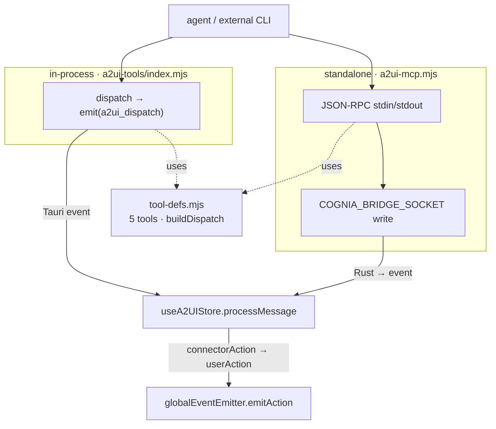

# A2UI MCP Bridge

<Status variant="stable">Stable · 5 tools · single source `tool-defs.mjs` · in-process + standalone</Status>

<TLDR>
  The a2ui-bridge lets an agent **draw interactive UI** through MCP. It exists in two forms that share one
  contract: an **in-process** SDK server (`a2ui-tools/index.mjs`, mounted by the sidecar every session,
  `alwaysLoad: true`) and a **standalone** stdio server (`a2ui-mcp.mjs`, spawned by external CLIs like
  Claude Code or Cursor and talking JSON-RPC over stdin/stdout). Both pull their **five** tool names,
  descriptions, schemas, and dispatch mapping from a single module — `sidecar/a2ui-tools/tool-defs.mjs` —
  so the two servers can never drift (a Node test asserts the contract). The in-process form `emit()`s a
  dispatch event; the standalone form writes it to the `COGNIA_BRIDGE_SOCKET` Unix socket / named pipe.
  Both converge on the renderer's A2UI store. The fifth tool, `a2ui_handle_connector_action`, injects an
  IM user's action onto a surface so browser-side and chat-side users share one flow.
</TLDR>

## One source, two servers

```javascript title="sidecar/a2ui-tools/tool-defs.mjs:43"
export const TOOL_NAMES = [
  "a2ui_create_surface",
  "a2ui_update_components",
  "a2ui_data_model_update",
  "a2ui_delete_surface",
  "a2ui_handle_connector_action",
]
```

| Tool | Dispatch type | Purpose |
| ---- | ------------- | ------- |
| `a2ui_create_surface` | `createSurface` | open a surface (inline / dialog / panel / fullscreen) |
| `a2ui_update_components` | `updateComponents` | replace the component tree (A2UI v0.9 schema) |
| `a2ui_data_model_update` | `dataModelUpdate` | patch/replace form values, chart data, table rows |
| `a2ui_delete_surface` | `deleteSurface` | remove a surface, free resources |
| `a2ui_handle_connector_action` | `connectorAction` | inject an IM-channel user action onto a surface |

`tool-defs.mjs` exports `TOOL_NAMES`, `TOOL_DESCRIPTIONS`, `RAW_INPUT_SCHEMAS` (JSON Schema), a
`rawTools()` helper, and `buildDispatch(name, args)` — the function both servers use to turn tool args into
a dispatch envelope:

```javascript title="sidecar/a2ui-tools/tool-defs.mjs:221"
case "a2ui_handle_connector_action":
  return {
    type: "connectorAction",
    surfaceId: args.surfaceId,
    componentId: args.componentId,
    actionType: args.actionType,
    value: args.value,
    payload: args.payload,
    platform: args.platform,
    triggerId: args.triggerId,
    conversationKey: args.conversationKey,
  }
```

A drift-guard test pins the contract:

```javascript title="sidecar/a2ui-tools/tool-defs.test.mjs:20"
test("exposes the five contracted tool names", () => {
  assert.deepEqual(TOOL_NAMES, [
    "a2ui_create_surface", "a2ui_update_components", "a2ui_data_model_update",
    "a2ui_delete_surface", "a2ui_handle_connector_action",
  ])
})
```

The renderer keeps a parallel typed copy in `lib/a2ui/mcp-tool-schemas.ts` (`A2UI_BRIDGE_TOOLS`, line 53)
used to **seed the built-in `a2ui-bridge` row** (`buildA2UIBridgeMcpRow`, line 197), to detect that row
(`isA2UIBridgeRow`), and to compute its namespaced tool names for projection to external agents.

## In-process form

`a2ui-tools/index.mjs:buildA2UIBridgeServer({ sessionId, emit, alwaysLoad })` builds an SDK MCP server
named `a2ui-bridge`. Each tool's handler calls `buildDispatch` and then `dispatch`, which `emit()`s a
single event the host writes to stdout:

```javascript title="sidecar/a2ui-tools/index.mjs:69"
const dispatch = (message) => {
  emit({ type: "a2ui_dispatch", sessionId, message })
}
```

It is mounted as [layer 3](./session-resolution#stage-3--merge-layers-sidecar) of dispatch with
`alwaysLoad: true` — interactive surfaces must never be deferred behind tool-search:

```javascript title="sidecar/dispatch/anthropic.mjs:132"
const a2uiServer = buildA2UIBridgeServer({ sessionId, emit, alwaysLoad: true })
```

## Standalone form

`sidecar/a2ui-mcp.mjs` is a self-contained stdio MCP server for agents running **outside** Cognia. It
hand-rolls JSON-RPC 2.0 over newline-delimited stdin/stdout (it deliberately avoids importing the SDK to
stay tiny) and dispatches over a Unix socket / named pipe given by `COGNIA_BRIDGE_SOCKET`:

```javascript title="sidecar/a2ui-mcp.mjs:82"
function dispatch(message) {
  if (!ipcSocket) return false
  try {
    ipcSocket.write(JSON.stringify({ type: "a2ui_dispatch", source: "a2ui-mcp", message }) + "\n")
    return true
  } catch (err) {
    logStderr(`dispatch write failed: ${err?.message ?? err}`)
    return false
  }
}
```

`tools/call` runs the same `buildDispatch` then reports whether the dispatch reached the renderer. Crucially,
it **degrades gracefully** — if the socket is unreachable (Cognia not running, sandboxed agent), the tool
still returns `ok: true` with `dispatched: false`, so the external agent's planning loop never crashes:

```javascript title="sidecar/a2ui-mcp.mjs:123"
case "tools/call": {
  const message = buildDispatch(params?.name, params?.arguments ?? {})
  if (!message) return sendError(id, -32601, `unknown tool: ${params?.name}`)
  const dispatched = dispatch(message)
  return sendResponse(id, { content: [{ type: "text", text: JSON.stringify({
    ok: true, surfaceId: params.arguments?.surfaceId, dispatched,
    note: dispatched ? undefined : "running detached; no UI dispatch",
  }) }] })
}
```

The socket connection retries on a fixed 2-second backoff; the path is injected into the projected
a2ui-bridge row by [`resolve.ts`](./session-resolution#stage-2--placeholder-resolution-external-agents).

## Where both paths converge

Both forms reach `useA2UIStore.processMessage` in the renderer (via the Tauri `a2ui://dispatch` event for
in-process, via the socket → Rust → event for standalone). `processMessage` routes each dispatch type to a
store action; `connectorAction` becomes a `userAction` indistinguishable from an in-renderer click:

```typescript title="stores/a2ui/a2ui-store.ts:366"
if (isConnectorActionMessage(message)) {
  const action = message.value && message.value.length > 0 ? message.value : message.actionType
  const data: Record<string, unknown> = { source: "connector", actionType: message.actionType }
  if (message.value !== undefined) data.value = message.value
  if (message.platform !== undefined) data.platform = message.platform
  // …triggerId, conversationKey, payload…
  emitAction(message.surfaceId, action, message.componentId ?? "", data)
  return
}
```



## In-process vs standalone

| Dimension | In-process | Standalone |
| --------- | ---------- | ---------- |
| File | `a2ui-tools/index.mjs` | `a2ui-mcp.mjs` |
| Launcher | sidecar `claude-host.mjs` per session | external agent's MCP config |
| Transport | SDK in-process bus → emit() | JSON-RPC over stdio |
| Write-back | stdout JSON line → Rust → renderer | `COGNIA_BRIDGE_SOCKET` → Rust → renderer |
| Schemas | zod (from same names/descriptions) | raw JSON Schema (`rawTools()`) |
| SDK dependency | yes (`createSdkMcpServer`) | none (hand-rolled) |
| Failure mode | SDK error → `isError: true` | socket down → `ok:true, dispatched:false` |

## The fifth tool in context

`a2ui_handle_connector_action` is what makes an A2UI surface usable from Slack / Lark / Telegram / Discord:
the connector adapter receives a tap on a platform-native card, the agent calls this tool with the action
details, and the renderer injects it as a `userAction` so the agent's next turn sees it exactly as a
browser click. The end-to-end IM round-trip (card projection → callback → this tool) lives in the
[A2UI ⇄ IM bridge](../a2ui/im-bridge).

## Related pages

<Cards>
  <Card title="A2UI subsystem" href="../a2ui" description="What these tools drive — protocol, catalog rendering, the renderer store, output profiles, and IM projection." />
  <Card title="Session resolution" href="./session-resolution" description="Layer-3 mounting and the socket injected into the projected a2ui-bridge row." />
  <Card title="Built-in tools" href="./builtin-tools" description="The other in-process server (cognia-tools) the sidecar mounts each session." />
</Cards>

## Related ADR

- [ADR 0025 — A2UI ⇄ IM bridge](../../adr/0025-a2ui-im-bridge) — the connector-action round-trip.
- [ADR 0008 — External Bridge](../../adr/0008-external-bridge) — why `a2ui-mcp.mjs` is a separate binary.
