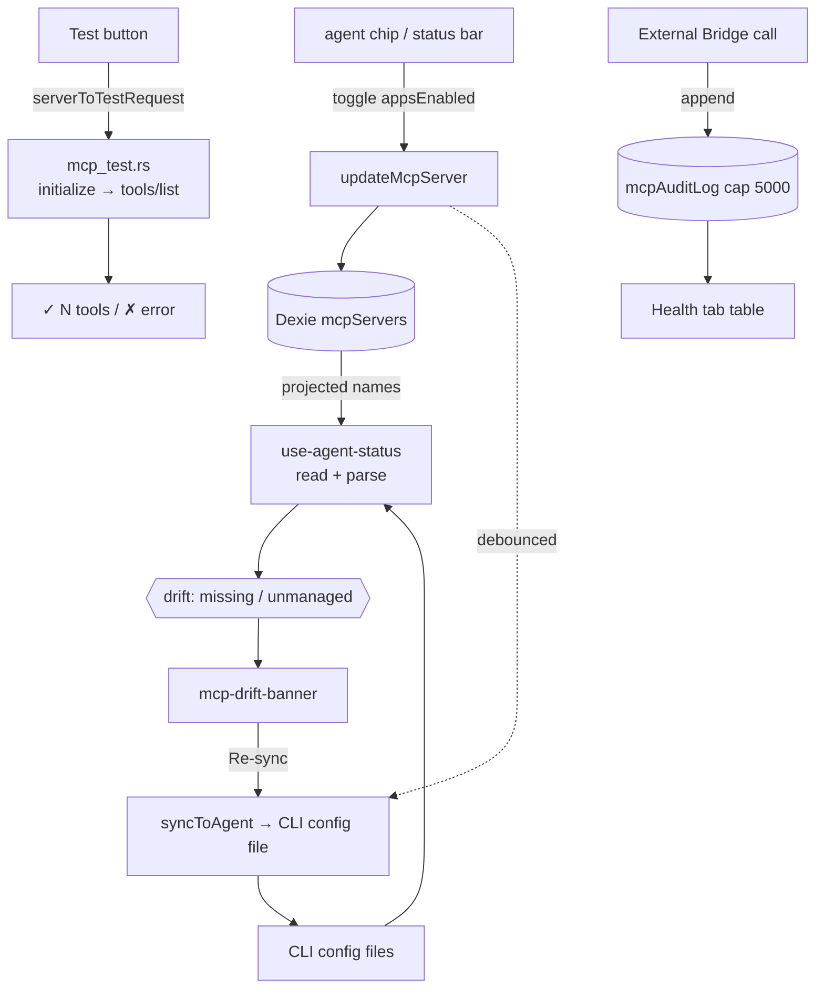

# Agent Sync & Health

<Status variant="stable">Stable · 7 writable + 2 read-only agents · `mcp_test.rs` · `mcpAuditLog` (cap 5000)</Status>

<TLDR>
  Each `McpServer` row carries an `appsEnabled` matrix mapping `AgentId → boolean`. When you flip a chip,
  the CRUD layer debounces a write of that server into the agent's on-disk MCP config (`lib/claude/sync`).
  Because files can drift from Cognia's view (hand-edits, failed syncs), `use-agent-status` computes
  per-agent **drift** — `missing` (projected but absent from file) and `unmanaged` (in file, unknown to
  Cognia) — surfaced by the **drift banner** with a one-click re-sync. Separately, the **test** button
  runs a Rust probe (`mcp_test.rs`) that performs a real `initialize → tools/list` handshake over the
  configured transport and returns the tool count. The **Health tab** shows the inbound External-Bridge
  server status plus the `mcpAuditLog` — every bridge call, allowed or denied, capped at 5000 rows.
</TLDR>

## The projection matrix

Seven agents are **writable** (Cognia mirrors servers into their config) and two are **read-only**
(adapters that don't write — Cognia can read their config but not push):

```typescript title="appsEnabled targets"
// writable
"claude-code" · "claude-desktop" · "cursor" · "vscode" · "codex" · "gemini" · "windsurf"
// read-only
"cline" · "roo-code"
```

A chip toggle patches `appsEnabled[agent]` in Dexie; the CRUD layer schedules the file sync:

```tsx title="components/settings/mcp-agent-chip-group.tsx:60"
const onClick = async () => {
  if (busy || inert) return
  const next = { ...(server.appsEnabled ?? {}), [agent.id]: !projected }
  await updateMcpServer(server.id, { appsEnabled: next })
  toast.success(projected
    ? t("removingToast", { agent: agent.displayName, name: server.name })
    : t("addingToast", { agent: agent.displayName, name: server.name }))
}
```

Chip states (`mcp-agent-chip-group.tsx:4`): **on** (projected here), **off** (file exists, not projected),
**missing** (no file — inert), **readonly** (adapter can't write — inert).

## Drift detection

`use-agent-status` reads each agent's config file through an adapter and diffs the in-file server names
against Cognia's projections:

```typescript title="hooks/.../use-agent-status.ts (drift compute)"
for (const agent of MCP_AGENT_ADAPTERS) {
  if (!agent.writable) continue
  const snap = snapshots[agent.id]
  if (!snap.exists || snap.parseError) continue
  const projected = projectedNames[agent.id] ?? new Set<string>()
  const missing = [...projected].filter((n) => !snap.inFileNames.has(n))   // we say ON, file says no
  const unmanaged = [...snap.inFileNames].filter((n) => !projected.has(n)) // file has it, we don't
  drift[agent.id] = { missing, unmanaged }
}
```

- **`missing`** — the actionable kind; the drift banner shows a **Re-sync** button (`syncToAgent`).
- **`unmanaged`** — informational (hand-rolled entries); the banner offers **Import** instead.

The **drift banner** (`components/settings/mcp-drift-banner.tsx`) only renders for agents with
`missing.length > 0`, is per-session dismissible, and expands to list the offending server names:

```tsx title="components/settings/mcp-drift-banner.tsx:55"
const onResync = async (agentId: AgentId) => {
  setBusy((b) => new Set(b).add(agentId))
  try {
    const r = await syncToAgent(agentId)
    if (r.ok) toast.success(t("resyncSuccess"))
    else if ("skipped" in r) toast.message(/* reason */)
    else toast.error(/* error */)
    refresh() // re-read file snapshots
  } finally {
    setBusy(/* drop agentId */)
  }
}
```

The **agent status bar** (`mcp-agent-status-bar.tsx`) is the Agents-tab header: per-agent file path,
in-file count vs projected count (amber when they disagree), and a per-agent + a sync-all button.

## The connection probe (`mcp_test.rs`)

The **Test** button on each server card calls the Rust command `test_mcp_server`
(`src-tauri/src/claude/mcp_test.rs:38`). It spawns/connects the configured transport, walks the MCP
handshake, captures the tool list, and tears everything down — with a 10-second handshake timeout:

```rust title="src-tauri/src/claude/mcp_test.rs:21"
pub struct McpTestResult {
    pub ok: bool,
    pub tool_count: usize,
    pub tools: Vec<McpToolInfo>,
    pub error: Option<String>,
    pub duration_ms: u64,
}
```

All three transports run the same JSON-RPC sequence — `initialize` (protocol `2024-11-05`) →
`notifications/initialized` → `tools/list`:

```rust title="src-tauri/src/claude/mcp_test.rs:107"
write_jsonrpc(&mut writer, &serde_json::json!({
  "jsonrpc": "2.0", "id": 1, "method": "initialize",
  "params": {
    "protocolVersion": "2024-11-05",
    "capabilities": {},
    "clientInfo": { "name": "cognia", "version": "0.1" }
  }
})).await?;
```

| Transport | Function | Notes |
| --------- | -------- | ----- |
| stdio | `test_stdio` (82) | spawns child with piped stdin/stdout; always kills on exit (181) |
| http | `test_streamable_http` (233) | POST JSON-RPC; handles `application/json` *and* `text/event-stream`; echoes `mcp-session-id` |
| sse | `test_sse` (385) | legacy: reads `endpoint` event, then POSTs to it, reads replies off the SSE stream |

The result populates the card's test badge (tool count or error).

## The audit log

`lib/db/mcp-audit-log.ts` records every **inbound** External-Bridge call into the `mcpAuditLog` Dexie
table (row type `McpAuditLogRow`, `types/wiki/index.ts:264`): timestamp, tool/method, scope, allow/deny,
latency, and optional reason/error. It is capped at 5000 rows, pruned in the same transaction as each
append:

```typescript title="lib/db/mcp-audit-log.ts:27"
export async function appendMcpAuditLog(draft: McpAuditDraft): Promise<McpAuditLogRow> {
  const db = getDb()
  const row: McpAuditLogRow = { id: draft.id ?? newId(), ...draft }
  await db.transaction("rw", db.mcpAuditLog, async () => {
    await db.mcpAuditLog.add(row)
    await pruneOldest(AUDIT_CAP) // AUDIT_CAP = 5000
  })
  return row
}
```

`listMcpAuditLog({ tool?, deniedOnly?, limit? })` returns newest-first; `pruneOldest` cursor-scans the
`ts` index and `bulkDelete`s the overflow, so per-write trimming stays cheap. Indexes:
`&id, ts, tool, allowed, [tool+ts]`.

### Health tab

`components/settings/mcp/mcp-health-tab.tsx` (desktop-only) shows the inbound bridge server status
(running/port/startedAt via `getMcpServerStatus`) and renders the audit log as a table —
timestamp · tool · scope · allowed/denied badge · latency — with a denied-only filter and a clear button.

```tsx title="components/settings/mcp/mcp-health-tab.tsx:44"
const refreshStatus = useCallback(async () => {
  setLoadingStatus(true)
  try { setStatus(await getMcpServerStatus()) }
  catch (err) { loggers.mcp.error("health.statusFailed", err) }
  finally { setLoadingStatus(false) }
}, [])
```

> The audit log and bridge status here belong to the **inbound** server (Cognia AS an MCP server). Their
> producer side lives in the [External Bridge](../external-bridge) subsystem; this tab is the consumer view.

## Flow



## Related pages

<Cards>
  <Card title="Server config & store" href="./server-config" description="updateMcpServer + scheduleSyncFor — the write side of the mirror." />
  <Card title="Presets & import" href="./presets-and-import" description="Import is the inverse of sync — pulling unmanaged entries back in." />
  <Card title="External Bridge" href="../external-bridge" description="The inbound server whose status and audit log the Health tab displays." />
</Cards>
