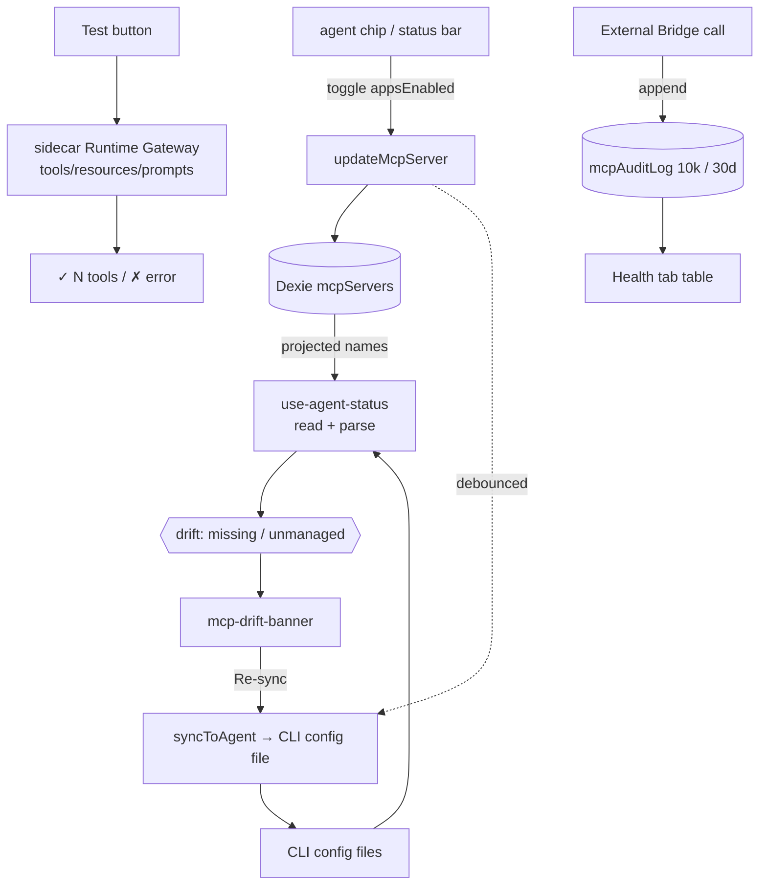

# Agent Sync & Health

<Status variant="stable">Stable · durable `mcpSyncJobs` · sidecar Runtime Gateway · `mcpAuditLog` (10k / 30d)</Status>

<TLDR>
  Each `McpServer` row carries an `appsEnabled` matrix mapping `AgentId → boolean`. When you flip a chip,
  the CRUD layer debounces a write of that server into the agent's on-disk MCP config (`lib/claude/sync`).
  Because files can drift from Cognia's view (hand-edits, failed syncs), `use-agent-status` computes
  per-agent **drift** — `missing` (projected but absent from file) and `unmanaged` (in file, unknown to
  Cognia) — surfaced by the **drift banner** with a one-click re-sync. The **test** button uses the
  sidecar Runtime Gateway for guarded capability discovery. The **Health tab** combines live runtime
  counters with persisted per-server failure rate, connect p95, capability freshness, Agent sync lag,
  inbound External-Bridge status, and the content-free `mcpAuditLog`.
</TLDR>

## The projection matrix

Seven agents are **writable** (Cognia mirrors servers into their config) and two are **read-only**
(adapters that don't write — Cognia can read their config but not push):

```typescript title="appsEnabled targets"
// writable
"claude-code" · "claude-desktop" · "cursor" · "vscode" · "codex" · "gemini" · "windsurf"
// read-only
"cline" · "roo-code"
```

A chip toggle patches `appsEnabled[agent]` in Dexie; the CRUD layer schedules the file sync:

```tsx title="components/settings/mcp-agent-chip-group.tsx:60"
const onClick = async () => {
  if (busy || inert) return
  const next = { ...(server.appsEnabled ?? {}), [agent.id]: !projected }
  await updateMcpServer(server.id, { appsEnabled: next })
  toast.success(projected
    ? t("removingToast", { agent: agent.displayName, name: server.name })
    : t("addingToast", { agent: agent.displayName, name: server.name }))
}
```

Chip states (`mcp-agent-chip-group.tsx:4`): **on** (projected here), **off** (file exists, not projected),
**missing** (no file — inert), **readonly** (adapter can't write — inert).

## Drift detection

`use-agent-status` reads each agent's config file through an adapter and diffs the in-file server names
against Cognia's projections:

```typescript title="hooks/.../use-agent-status.ts (drift compute)"
for (const agent of MCP_AGENT_ADAPTERS) {
  if (!agent.writable) continue
  const snap = snapshots[agent.id]
  if (!snap.exists || snap.parseError) continue
  const projected = projectedNames[agent.id] ?? new Set<string>()
  const missing = [...projected].filter((n) => !snap.inFileNames.has(n))   // we say ON, file says no
  const unmanaged = [...snap.inFileNames].filter((n) => !projected.has(n)) // file has it, we don't
  drift[agent.id] = { missing, unmanaged }
}
```

- **`missing`** — the actionable kind; the drift banner shows a **Re-sync** button (`syncToAgent`).
- **`unmanaged`** — informational (hand-rolled entries); the banner offers **Import** instead.

The **drift banner** (`components/settings/mcp-drift-banner.tsx`) only renders for agents with
`missing.length > 0`, is per-session dismissible, and expands to list the offending server names:

```tsx title="components/settings/mcp-drift-banner.tsx:55"
const onResync = async (agentId: AgentId) => {
  setBusy((b) => new Set(b).add(agentId))
  try {
    const r = await syncToAgent(agentId)
    if (r.ok) toast.success(t("resyncSuccess"))
    else if ("skipped" in r) toast.message(/* reason */)
    else toast.error(/* error */)
    refresh() // re-read file snapshots
  } finally {
    setBusy(/* drop agentId */)
  }
}
```

The **agent status bar** (`mcp-agent-status-bar.tsx`) is the Agents-tab header: per-agent file path,
in-file count vs projected count (amber when they disagree), and a per-agent + a sync-all button.

## Sidecar Runtime Gateway discovery

The **Test** button and workflow tool picker call `discoverMcpServerViaSidecar`. The trusted host
checks policy and resolves `SecretRef` values, then the allowlisted `mcp-discover` feature call reaches
`sidecar/dispatch/mcp-runtime-gateway.mjs`. Discovery uses the official stdio, Streamable HTTP, and
legacy SSE transports, has a 15-second connect/list timeout, never retries tool calls, and always closes
the client and DNS-guard dispatcher. The former hand-written Rust `test_mcp_server` command and its
Companion/Tauri permission surface have been removed.

Remote Anthropic Agent SDK entries are converted to SDK-managed stdio relays. The SDK still owns the
child lifecycle and reconnect behavior, while `mcp-stdio-relay.mjs` owns the upstream HTTP/SSE socket
and applies the same guarded Undici DNS lookup used by AI SDK and OAuth, closing the rebinding gap.

## Health tab

`McpHealthTab` answers MCP health in both directions, and its sections are ordered that way.

**Outbound** (Cognia as MCP *client*) leads with `McpLiveSessionCard` — per-server status for the running
agent session, driven by the SDK's `mcpServerStatus()` control method, with reconnect and per-session
toggle actions. It includes the in-process `cognia` / `a2ui` / plugin servers that have no `McpServer`
row at all. Then the rolling one-hour log summary, the runtime-gateway metrics (warm reuse, capability
cache hits, retries, timeouts, policy denials, mean connect latency), the persisted per-server operation
table, and `<LogPanel sources={["mcp"]} />`.

**Inbound** (Cognia as MCP *server*, via the External Bridge) follows: bridge status, a deep link to the
bridge's own settings, and [the audit log](#the-audit-log).

<Callout type="info">
  The live-session card lives here rather than above the server list because it answers a health question
  — "what does the running agent see right now?" — and because a variable-height card at the top of a
  master-detail rail shoves the list around on every session change.
</Callout>

## The audit log

`lib/db/mcp-audit-log.ts` records content-free **outbound and inbound** MCP operations into the `mcpAuditLog` Dexie
table (row type `McpAuditLogRow`, `types/wiki/index.ts:264`): timestamp, phase, server, surface,
decision, duration, and bounded error code. It is capped at 10,000 rows or 30 days, pruned in the same transaction as each
append:

```typescript title="lib/db/mcp-audit-log.ts:27"
export async function appendMcpAuditLog(draft: McpAuditDraft): Promise<McpAuditLogRow> {
  const db = getDb()
  const row: McpAuditLogRow = { id: draft.id ?? newId(), ...draft }
  await db.transaction("rw", db.mcpAuditLog, async () => {
    await db.mcpAuditLog.add(row)
    await pruneOldest(AUDIT_CAP) // AUDIT_CAP = 10_000
  })
  return row
}
```

`listMcpAuditLog({ tool?, deniedOnly?, limit? })` returns newest-first; `pruneOldest` cursor-scans the
`ts` index and `bulkDelete`s the overflow, so per-write trimming stays cheap. Indexes:
`&id, ts, tool, allowed, [tool+ts]`.

### Health tab

`components/settings/mcp/mcp-health-tab.tsx` reads one `loadMcpOperationsSnapshot` projection over
`mcpServers`, `mcpAuditLog`, `mcpCapabilityCache`, and `mcpSyncJobs`. It renders per-server failure rate,
connect p95, capability freshness, and Agent sync lag beside the live Gateway counters. The inbound
bridge status and recent audit table remain separate sections in the same view.

```tsx title="components/settings/mcp/mcp-health-tab.tsx:44"
const refreshStatus = useCallback(async () => {
  setLoadingStatus(true)
  try { setStatus(await getMcpServerStatus()) }
  catch (err) { loggers.mcp.error("health.statusFailed", err) }
  finally { setLoadingStatus(false) }
}, [])
```

> Outbound and inbound events share the audit vocabulary, not raw payloads or lifecycle ownership. The
> [External Bridge](../external-bridge) remains a separate inbound trust plane.

## Flow



## Related pages

<Cards>
  <Card title="Server config & store" href="./server-config" description="updateMcpServer + scheduleSyncFor — the write side of the mirror." />
  <Card title="Presets & import" href="./presets-and-import" description="Import is the inverse of sync — pulling unmanaged entries back in." />
  <Card title="External Bridge" href="../external-bridge" description="The inbound server whose status and audit log the Health tab displays." />
</Cards>
