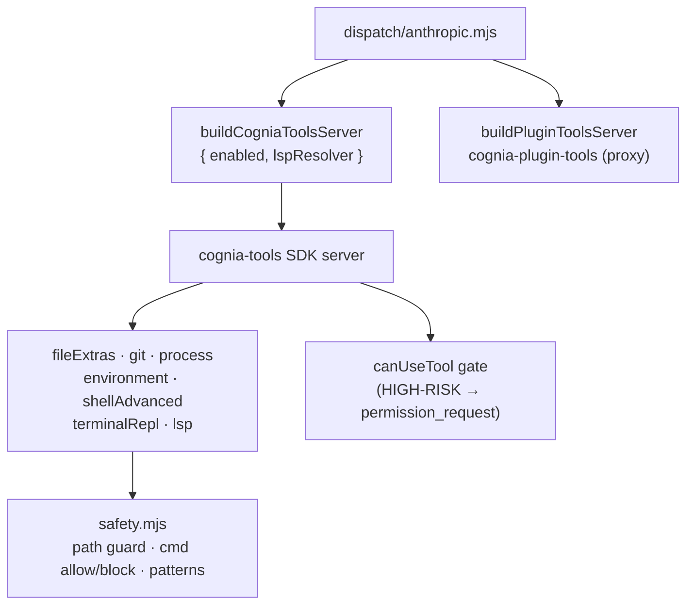

# Built-in Tools (`cognia-tools`)

<Status variant="stable">Stable · 44 tools · 7 categories · safety-gated</Status>

<TLDR>
  `sidecar/builtin-tools/index.mjs:buildCogniaToolsServer` assembles an in-process SDK MCP server named
  **`cognia-tools`** from per-category tool modules — `fileExtras` (13), `git` (9), `process` (9),
  `environment` (3), `shellAdvanced` (1), `terminalRepl` (4), and `lsp` (5, dynamic) — **44 tools** total,
  namespaced `mcp__cognia-tools__<tool>`. Categories are gated by `settings.builtinTools.<category>`
  toggles, and disabled categories are *also* pushed to `disallowedTools` as defence-in-depth. Every tool
  routes through `safety.mjs`: a path-traversal guard, a shell allowlist/blocklist + dangerous-pattern
  scanner, secret redaction, and the `toolText`/`toolError` result wrappers. Write/exec tools
  (`directory_delete`, `start_process`, `terminate_process`, `shell_execute_advanced`) are HIGH-RISK and
  always pass through the SDK `canUseTool` approval gate.
</TLDR>

<StatGrid>
  <Stat label="Total tools" value="44" hint="7 categories" />
  <Stat label="Read-only" value="~32" hint="alwaysLoad-optimized" />
  <Stat label="HIGH-RISK" value="4" hint="approval-gated write/exec" />
  <Stat label="Allowlisted shells" value="~150" hint="safety.mjs ALLOWED_COMMANDS" />
</StatGrid>

## Assembly

```javascript title="sidecar/builtin-tools/index.mjs:25"
const TOOLS_BY_CATEGORY = {
  fileExtras: fileExtrasTools,
  git: gitTools,
  process: processTools,
  environment: environmentTools,
  shellAdvanced: shellAdvancedTools,
  terminalRepl: terminalReplTools,
  // lsp: built dynamically via createLspTools(lspResolver)
}
```

`buildCogniaToolsServer({ enabled, alwaysLoad, lspResolver })` (line 69) includes only enabled
categories, binds the LSP tools to the per-session resolver when present, and returns `null` when nothing
is enabled (so the dispatch layer can skip mounting). Category IDs, tool names, server name, and version
come from a shared JSON (`lib/settings/builtin-tools-data.json`) so the React settings UI and the sidecar
never drift.

Disabled categories are blocked twice — not mounted, *and* their tool names are added to
`disallowedTools`:

```javascript title="sidecar/builtin-tools/index.mjs:100"
export function namesForDisabledCategories(enabled) {
  /* returns mcp__cognia-tools__<tool> for every category turned off */
}
```

## Tool reference

Namespace: `mcp__cognia-tools__<tool>`. Toggles live in **Settings → System → Tools**.

### `fileExtras` — 13 tools (`file-extras.mjs`)

| Tool | Kind | Notes |
| ---- | ---- | ----- |
| `file_hash` | read | md5/sha1/sha256/sha512, max 100 MB |
| `file_diff` | read | unified diff, max 5 MB/side, context 0–20 |
| `file_info` | read | size · mtime · mode · mime |
| `file_exists` | read | path test |
| `file_search` | read | glob/list, maxResults 200 |
| `content_search` | read | substring/regex, maxResults 100 |
| `file_append` | write | approval + path guard |
| `file_binary_write` | write | base64 payload |
| `file_copy` | write | overwrite opt-in |
| `file_rename` | write | in-place |
| `file_move` | write | cross-device fallback |
| `directory_create` | write | recursive opt |
| `directory_delete` | write | **HIGH-RISK** |

### `git` — 9 tools, all read-only (`git.mjs`)

`git_status` · `git_diff` · `git_log` · `git_branch` · `git_remote` · `git_tag` · `git_repo_inspect` ·
`git_changes` · `git_history`. Each validates the repo via `git rev-parse --git-dir`, runs through
`execFile` (no shell injection), and caps output at 256 KB.

```javascript title="sidecar/builtin-tools/git.mjs:124"
const argv = ["log", "-n", String(args.limit), "--pretty=format:%H%x09%an%x09%ae%x09%aI%x09%s"]
```

### `process` — 9 tools (`process.mjs`)

Read: `list_processes` · `get_process` · `search_processes` · `top_memory_processes` ·
`check_program_allowed` · `get_process_manager_status` · `get_tracked_processes`.
Write (HIGH-RISK): `start_process` (allowlisted program, tracks PID), `terminate_process` (refuses
untracked PIDs unless `allowUntracked`). Cross-platform — Windows PowerShell `Get-Process`, POSIX `ps`;
only PIDs spawned this session are visible to `get_tracked_processes`:

```javascript title="sidecar/builtin-tools/process.mjs:24"
/** @type {Set<number>} */
const trackedPids = new Set()
```

### `environment` — 3 tools (`environment.mjs`)

`list_env` · `get_env` · `system_info`. Secret-shaped keys are redacted to `********` unless
`revealSecrets: true`:

```javascript title="sidecar/builtin-tools/environment.mjs (isSecretKey)"
/(key|secret|token|password|credential|passwd|api[_-]?key)/i
```

### `shellAdvanced` — 1 tool (`shell-advanced.mjs`)

`shell_execute_advanced` — HIGH-RISK, always approval-gated. Uses `execFile` (args never re-parsed as
metacharacters), 64 KB output cap, 5-minute hard timeout, and a three-stage `validateShellCommand` gate.

### `terminalRepl` — 4 tools (`terminal-repl-tool.mjs`)

A `node-pty`-backed persistent private shell, orthogonal to the renderer terminal dock.
`terminal_repl_spawn` · `terminal_repl_write` · `terminal_repl_read` · `terminal_repl_kill`. Per-agent
quota of 8 sessions, 256 KB ring buffer per session, idle GC after 10 minutes, ownership checked on every
call.

### `lsp` — 5 tools, dynamic (`lsp.mjs`)

Bound to a per-session LSP resolver; only present when `lspResolver` is supplied.
`lsp_goto_definition` · `lsp_find_references` · `lsp_hover` · `lsp_document_symbols` · `lsp_diagnostics`.
Positions convert 1-based (editor) → 0-based (LSP):

```javascript title="sidecar/builtin-tools/lsp.mjs:87"
tool(
  "lsp_goto_definition",
  "Find where the symbol at a position is defined. Returns file:line:col locations.",
  { file: z.string(), line: z.number().int().min(1), character: z.number().int().min(1) },
  async (args) => {
    const res = await resolver.request(args.file, "definition", { position: pos(args.line, args.character) })
    return { content: [{ type: "text", text: formatLocations(res) }] }
  }
)
```

> The resolver and the user-facing LSP configuration are documented in the
> [Unified LSP Configuration](../../adr/0044-unified-lsp-configuration) ADR.

## The safety layer (`safety.mjs`)

All tools share one guard module.

**Path traversal** — `assertPathInside(rootCwd, target)` (line 27) canonicalizes both paths
(`fs.realpathSync.native` where possible) and refuses escapes via `..` or symlink — consistent with the
Rust `src-tauri/src/files.rs` guard.

**Command validation** — `validateShellCommand(command, args)` (line 336) runs three checks:

```javascript title="sidecar/builtin-tools/safety.mjs:336"
export function validateShellCommand(command, args) {
  if (typeof command !== "string" || command.trim().length === 0)
    return { safe: false, reason: "command must be a non-empty string" }
  const cmdLower = command.toLowerCase().replace(/\.exe$/i, "")
  if (BLOCKED_COMMANDS.has(cmdLower))
    return { safe: false, reason: `Command '${command}' is blocked.` }
  // …must be in ALLOWED_COMMANDS, then scan argv for DANGEROUS_PATTERNS…
}
```

- **`BLOCKED_COMMANDS`** (line 84) — `rm`, `del`, `format`, `shutdown`, `reboot`, `chmod`, `dd`, `mount`,
  `iptables`, `systemctl`, `crontab`, `reg`, `regedit`, …
- **`ALLOWED_COMMANDS`** (line 139) — ~150 entries: VCS (`git`, `gh`), package managers
  (`npm`/`pnpm`/`cargo`/`pip`/`go`…), dev tools (`node`, `tsc`, `eslint`, `vitest`…), system info, network,
  archive, containers, DevOps, media, db clients.
- **`DANGEROUS_PATTERNS`** (line 318) — regexes catching shell chaining, piping, redirection, and
  backtick/`$()` substitution into destructive commands (e.g. `; rm`, `&& format`, `| shutdown`).

**Result wrappers** — every handler returns through `toolText({ ok, … })` or `toolError(err, label)`
(line 384), producing the standard MCP `CallToolResult` (with `isError: true` on failure).

## Plugin-tools bridge

`plugin-tools.mjs:buildPluginToolsServer` is **not** a built-in category — it is a synthetic in-process
server (`cognia-plugin-tools`) built only when the renderer passes `sendOptions.pluginTools`. Each plugin
tool is synthesized as an MCP tool that emits `plugin_tool_exec` to the parent and awaits
`plugin_tool_response` via a pending-promise map, so the actual tool logic runs back in the renderer:

```text
sidecar → parent:  { type: "plugin_tool_exec",     sessionId, toolUseId, name, args }
parent  → sidecar: { type: "plugin_tool_response", sessionId, toolUseId, result? , error? }
```

It is mounted as [layer 4](./session-resolution#stage-3--merge-layers-sidecar) of dispatch.

## Approval gate

The dispatch layer's `canUseTool` short-circuits pre-approved tools and ruleset allow/deny, otherwise
emits a `permission_request` and awaits the user's decision before the HIGH-RISK tool runs
(`dispatch/anthropic.mjs:263`). See the [Agent auto-mode](../../adr/0041-agent-auto-mode) ADR for the
two-layer permission model.



## Extending the surface

<Steps>
<Step>Add `{ "name": "<tool>", "description": "…" }` under a category in `lib/settings/builtin-tools-data.json`.</Step>
<Step>Register the handler in `sidecar/builtin-tools/<category>.mjs` with `tool(name, description, zodShape, handler)` and export it into the `<category>Tools` array.</Step>
<Step>`index.mjs` picks it up automatically via `TOOLS_BY_CATEGORY`, gated by `settings.builtinTools.<category>`.</Step>
<Step>The settings UI (`components/settings/system/builtin-tools-section.tsx`) renders the new toggle from the same JSON — no extra frontend code.</Step>
</Steps>

## Related pages

<Cards>
  <Card title="Session resolution" href="./session-resolution" description="How cognia-tools and cognia-plugin-tools are mounted as layers 2 and 4." />
  <Card title="A2UI bridge" href="./a2ui-bridge" description="The other in-process server the sidecar mounts — 5 surface tools." />
  <Card title="External Bridge" href="../external-bridge" description="The inbound server that reuses the same safety patterns and audit log." />
</Cards>
