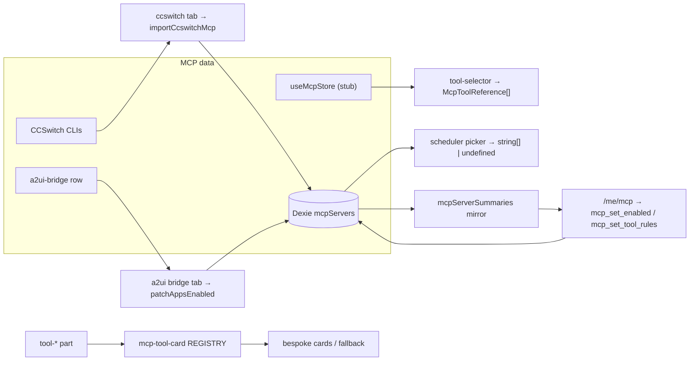

# Consumption Surfaces

<Status variant="stable">Stable · 5 surfaces across agent / scheduler / chat / settings</Status>

<TLDR>
  Beyond the settings panel, five surfaces read the MCP config in different shapes. The **tool selector**
  (agent custom modes) picks individual tools under a budget, with AI-ranked recommendations. The
  **scheduler picker** picks whole servers, distinguishing "use defaults" (`undefined`) from "explicitly
  none" (`[]`). The **CCSwitch tab** is a second importer, pulling MCP configs from CCSwitch-managed CLIs
  into the `mcpServers` store. The **chat tool-card registry** maps tool names to bespoke result cards
  (wiki/rag/read/plan/grep…) with a generic fallback. The **A2UI bridge tab** controls the always-on
  a2ui-bridge row's per-agent projection and shows live bridge health.
</TLDR>

## Tool selector

`components/agent/mode/custom-mode-editor/mcp-tool-selector.tsx` lets a custom mode enable a specific
subset of MCP tools under a budget. It reads connected servers + their tools from the `useMcpStore` stub
and the budget from `toolSelectionConfig`, asks `getRecommendedMcpToolsForMode` for AI-ranked picks from
the mode's metadata, and emits `McpToolReference[]` (`{ serverId, toolName, displayName }`):

```typescript title="components/agent/mode/custom-mode-editor/mcp-tool-selector.tsx:75"
const recommendedTools = useMemo(() => {
  if (!recommendationsEnabled || !recommendationContext) return []
  const recommendations = getRecommendedMcpToolsForMode(
    availableTools,
    recommendationContext,
    toolSelectionConfig.maxTools
  )
  return Array.isArray(recommendations) ? recommendations : []
}, [availableTools, recommendationContext, recommendationsEnabled, toolSelectionConfig.maxTools])
```

An over-budget badge warns when the selection exceeds `toolSelectionConfig.maxTools`; an "Apply
Recommended" button fills the selection from the recommendations panel.

## Scheduler picker

`components/scheduler/payload-editors/mcp-picker.tsx` picks **servers** (not tools) for a scheduled task.
Its key subtlety is the two-state value — an empty array means "explicitly disable MCP", `undefined` means
"let `resolveSendOptions` pick the character/team default":

```typescript title="components/scheduler/payload-editors/mcp-picker.tsx:5"
/**
 * Multi-select for MCP servers with a "use character/team default" mode.
 * Distinguishing default from "no servers" matters — empty array means
 * "explicitly disable MCP" while default lets `resolveSendOptions` pick the subset.
 */
```

A radio toggles `default` vs `custom`; in `custom` mode a checklist of `listMcpServers()` (disabled rows
filtered out) drives the id array.

## CCSwitch MCP tab

`components/settings/ccswitch/tabs/mcp-tab.tsx` is a **second importer** (alongside the
[import dialog](./presets-and-import#importing-from-a-cli-config)). It reads MCP servers that CCSwitch
manages for external CLIs and imports the picks with a collision strategy:

```typescript title="components/settings/ccswitch/tabs/mcp-tab.tsx:59"
const onImport = async () => {
  const picks = servers.filter((s) => selected.has(s.id))
  const r = await importCcswitchMcp(picks, strategy) // "skip" | "overwrite" | "duplicate"
  setResultText(t("mcp.resultSummary", {
    imported: r.imported, updated: r.updated, skipped: r.skipped, errored: r.errored.length,
  }))
}
```

Desktop-only (a web-mode alert otherwise); each row shows transport + notes; strategy is a radio. See the
CCSwitch subsystem for the propagation side of this sync.

## Chat tool-card renderers

`components/chat/message-parts/mcp-tool-card.tsx` is a registry that renders MCP tool **results** as
structured cards in the transcript, falling back to a generic `ToolBody` for unknown tools or parse
failures:

```tsx title="components/chat/message-parts/mcp-tool-card.tsx:35"
const REGISTRY: Record<string, CardComponent> = {
  // cognia external bridge
  wiki_search: WikiSearchCard, wiki_read: WikiReadCard, rag_search: RagSearchCard, runtime_query: RuntimeQueryCard,
  // Claude built-ins
  Plan: PlanCard, Read: ReadCard, Glob: GlobCard, Grep: GrepCard,
  WebFetch: WebFetchCard, WebSearch: WebSearchCard, NotebookEdit: NotebookEditCard,
  // workflow / computer use …
}
```

Renderers live in `mcp-renderers/`. Each pulls `input` from the part, validates `output` with the shared
`useParsedOutput<T>()` (returning `null` to trigger fallback), and renders via `McpCardShell`:

```tsx title="components/chat/message-parts/mcp-renderers/common.tsx:18"
export function parseOutputJson(output: unknown): unknown | null {
  if (output === null || output === undefined) return null
  if (typeof output === "string") {
    const trimmed = output.trim()
    if (!trimmed) return null
    try { return JSON.parse(trimmed) } catch { return null }
  }
  if (typeof output === "object") return output
  return null
}
```

## A2UI bridge settings tab

`components/settings/a2ui/mcp-bridge-tab.tsx` controls the always-on `a2ui-bridge` row: it fetches the
immutable bridge row, shows live health (tool count = `A2UI_BRIDGE_TOOLS.length`, `liveSurfaceCount`,
sidecar dir + socket path on Tauri), offers a self-test, and exposes the per-agent projection matrix:

```tsx title="components/settings/a2ui/mcp-bridge-tab.tsx:27"
const MANAGED_AGENTS: AgentId[] = ["claude-code", "claude-desktop", "cursor", "vscode", "codex", "gemini", "windsurf"]
const READ_ONLY_AGENTS: AgentId[] = ["cline", "roo-code"]
```

Managed agents get switches that `patchAppsEnabled`; read-only agents render disabled with an X icon.

## Paired client (`/me/mcp`)

A phone or web companion mirrors the desktop's servers through `mcpServerSummaries` and writes two axes
back — whether a server is on, and which of its tools are denied:

| Command | Payload | Handler |
| ------- | ------- | ------- |
| `mcp_set_enabled` | `{ id, enabled }` | `desktop-write-source.ts` → `updateMcpServer` |
| `mcp_set_tool_rules` | `{ id, disallowedTools?, disallowedToolPatterns? }` | same |

Both route through `updateMcpServer` rather than a bare Dexie write, so the governance side effects a
desktop toggle has — the trust gate, the summary mirror the caller reads back, the coalesced sync into
every agent config file — behave identically for a remote caller. Writes go through the durable
`mobileOutboundQueue`, so a change made offline still lands.

Tool rules are sent **whole**, not as deltas: the client renders the list it read from the summary
mirror, and a delta applied against a stale mirror would silently re-allow a tool the user had denied on
another device.

<Callout type="info">
  The write surface stops there. Creating, editing and deleting a definition carries credentials and a
  trust decision, and the OAuth flow needs the desktop keyring — those stay desktop-only rather than
  becoming a lesser copy, and the page says which is which. Tools held off by a *rule* are also
  desktop-only to free, since rules are authored where the discovered tool list lives.
</Callout>

Tool names reach the phone only because `writeCapabilityCache` projects them onto the summary after each
discovery — the capability cache itself is host-local. A server the desktop has never probed therefore
shows no tool list rather than an empty one, because "no tools" and "not yet asked" are different
answers.

## Surface → data map



## Related pages

<Cards>
  <Card title="Server config & store" href="./server-config" description="The mcpServers rows these pickers read and the CCSwitch tab writes." />
  <Card title="Presets & import" href="./presets-and-import" description="The other importer — the import dialog for raw CLI config files." />
  <Card title="Settings panel" href="./settings-panel" description="The primary management surface and the mcp-store stub the tool selector reuses." />
</Cards>
