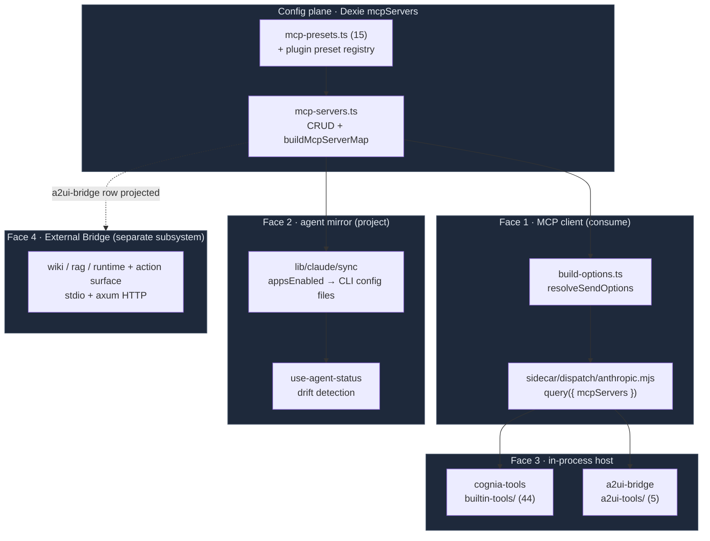

# MCP System

<Status variant="stable">Stable · Dexie `mcpServers` (v2+) · 3 transports · 7 agent targets</Status>

<TLDR>
  Cognia wears **four MCP faces**. As a **client**, it stores user/plugin/built-in server definitions in
  one Dexie table (`mcpServers`) and resolves a per-turn subset into the Claude Agent SDK's `mcpServers`
  option (`build-options.ts:resolveSendOptions` → `buildMcpServerMap`). As a **mirror**, it projects each
  server's `appsEnabled` matrix into the on-disk config of seven external CLIs (Claude Code, Cursor,
  VS Code, Codex, Gemini, Windsurf, plus read-only Cline/Roo-Code) and watches for drift. As a **host**,
  the sidecar mounts two in-process SDK MCP servers per session — `cognia-tools` (44 built-in tools across
  7 categories, gated by `safety.mjs`) and `a2ui-bridge` (5 surface tools). As a **server for outsiders**,
  Cognia exposes its own knowledge + action surface over stdio/HTTP — that plane lives in the
  [External Bridge](../external-bridge) subsystem. This section documents the first three faces.
</TLDR>

<StatGrid>
  <Stat label="Config store" value="Dexie mcpServers" hint="id · name · enabled (since v2)" />
  <Stat label="Transports" value="3" hint="stdio · http · sse" />
  <Stat label="Built-in presets" value="15" hint="lib/claude/mcp-presets.ts + plugin overlay" />
  <Stat label="cognia-tools" value="44 tools" hint="7 categories · safety-gated" />
  <Stat label="a2ui-bridge" value="5 tools" hint="single source: tool-defs.mjs" />
  <Stat label="Agent mirror targets" value="7 + 2 ro" hint="appsEnabled per server" />
</StatGrid>

## The four faces



## Where everything lives

<Files>
  <Folder name="lib/" defaultOpen>
    <Folder name="db/">
      <File name="mcp-servers.ts" />
      <File name="mcp-audit-log.ts" />
    </Folder>
    <Folder name="claude/">
      <File name="mcp-presets.ts" />
      <Folder name="builtin-mcp/">
        <File name="resolve.ts" />
        <File name="runtime-context.ts" />
      </Folder>
    </Folder>
    <Folder name="a2ui/">
      <File name="mcp-tool-schemas.ts" />
    </Folder>
    <Folder name="plugin/">
      <File name="registries/mcp-server-preset-registry.ts" />
      <File name="sdk/define-mcp-server-preset.ts" />
    </Folder>
  </Folder>
  <Folder name="sidecar/">
    <Folder name="builtin-tools/">
      <File name="index.mjs" />
      <File name="safety.mjs" />
      <File name="file-extras.mjs · git.mjs · process.mjs" />
      <File name="environment.mjs · shell-advanced.mjs" />
      <File name="lsp.mjs · terminal-repl-tool.mjs · plugin-tools.mjs" />
    </Folder>
    <Folder name="a2ui-tools/">
      <File name="tool-defs.mjs (single source)" />
      <File name="index.mjs" />
    </Folder>
    <File name="a2ui-mcp.mjs (standalone stdio)" />
  </Folder>
  <Folder name="components/settings/mcp/">
    <File name="mcp-panel.tsx (4 tabs)" />
    <File name="mcp-my-servers-tab · mcp-preset-grid · mcp-health-tab" />
    <File name="mcp-server-editor · mcp-server-card · kv-editor" />
  </Folder>
  <Folder name="src-tauri/src/claude/">
    <File name="mcp_test.rs (connection probe)" />
  </Folder>
</Files>

| Module | Lives in | Documented in |
| ------ | -------- | ------------- |
| Config types + Dexie store | `lib/db/mcp-servers.ts`, `lib/claude/types.ts` | [Server config](./server-config) |
| Presets + import | `lib/claude/mcp-presets.ts`, `components/settings/mcp-import-dialog.tsx` | [Presets & import](./presets-and-import) |
| Per-turn resolution | `lib/claude/build-options.ts`, `lib/claude/builtin-mcp/` | [Session resolution](./session-resolution) |
| Settings UI + stores | `components/settings/mcp/`, `stores/mcp/` | [Settings panel](./settings-panel) |
| Agent mirror + health | `components/settings/mcp-*`, `mcp_test.rs`, `mcp-audit-log.ts` | [Agent sync & health](./agent-sync-and-health) |
| In-process built-ins | `sidecar/builtin-tools/` | [Built-in tools](./builtin-tools) |
| A2UI MCP bridge | `sidecar/a2ui-tools/`, `sidecar/a2ui-mcp.mjs` | [A2UI bridge](./a2ui-bridge) |
| Pickers + renderers | `components/agent/`, `components/scheduler/`, `components/chat/message-parts/` | [Consumption surfaces](./consumption-surfaces) |

## The one config model

Every MCP server — whether typed by hand, installed from a preset, imported from a CLI config, or
seeded by a plugin — lands in the **same** `McpServer` row shape (`lib/claude/types.ts:1969`):

```typescript title="lib/claude/types.ts"
export interface McpServer {
  id: string
  name: string
  transport: McpTransport // "stdio" | "sse" | "http"
  config: Record<string, unknown> // stdio: { command, args?, env? } · http/sse: { url, headers? }
  enabled: boolean
  appsEnabled?: Partial<Record<AgentId, boolean>> // per-CLI projection matrix
  pluginId?: string // set only by the plugin manager
  createdAt: number
  updatedAt: number
}
```

`enabled` controls whether the server reaches Cognia's own chat; `appsEnabled[agent]` controls whether
it is mirrored into that external agent's config file. The two are independent — a server can be ON for
Claude Code's CLI but OFF in Cognia, or vice versa.

## When to use this section

- **Add / configure an external MCP server** Cognia (and/or your other CLIs) should call → [Server config](./server-config), [Presets & import](./presets-and-import).
- **Understand why a server did/didn't load** in a given chat or team → [Session resolution](./session-resolution).
- **Diagnose "I enabled it but Claude Code can't see it"** → [Agent sync & health](./agent-sync-and-health) (drift + re-sync).
- **Extend the built-in tool surface** (`cognia-tools`) or audit its safety gates → [Built-in tools](./builtin-tools).
- **Wire interactive UI from an agent** (in-process or an external CLI) → [A2UI bridge](./a2ui-bridge).

## When NOT to use this section

- Exposing Cognia's **own** knowledge/actions to outside agents (the inbound MCP server) → [External Bridge](../external-bridge).
- Rendering an A2UI surface's components / data model / IM projection → [A2UI subsystem](../a2ui).

## Related subsystems

<Cards>
  <Card title="External Bridge" href="../external-bridge" description="The fourth face — Cognia AS an MCP server (wiki / rag / runtime + gated actions) over stdio + axum HTTP." />
  <Card title="A2UI System" href="../a2ui" description="What the a2ui-bridge tools drive: surface rendering, the renderer store, the Rust bridge, and IM projection." />
  <Card title="Plugin System" href="../plugin-system" description="Plugins contribute MCP server presets and plugin-tools that ride the same sidecar dispatch path." />
  <Card title="Unified Subscription / CCSwitch" href="../../adr/0025-a2ui-im-bridge" description="CCSwitch imports external-CLI MCP configs back into the mcpServers store." />
</Cards>

## Related ADR

- [ADR 0008 — External Bridge](../../adr/0008-external-bridge) — why the inbound MCP server is a separate binary from `a2ui-mcp.mjs`.
- [ADR 0025 — A2UI ⇄ IM bridge](../../adr/0025-a2ui-im-bridge) — the `a2ui_handle_connector_action` tool that lets IM users drive surfaces.
