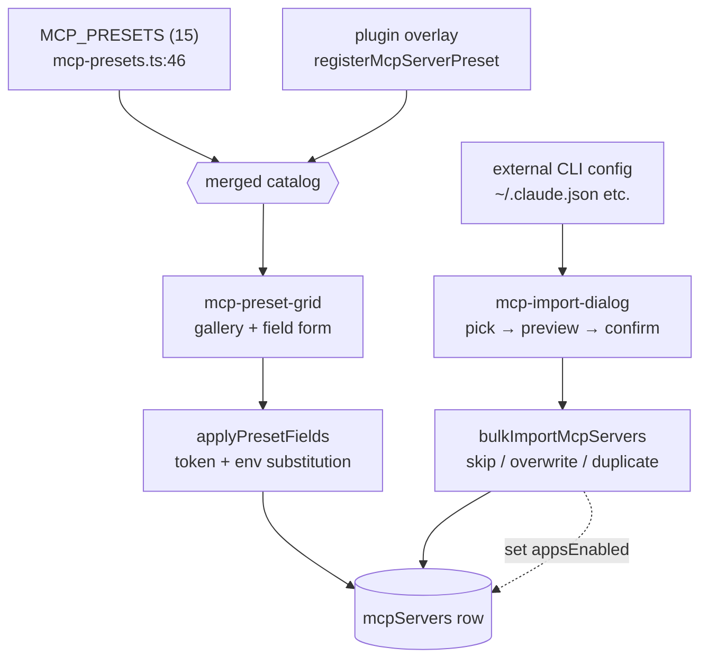

# Presets & Import

<Status variant="stable">Stable · 15 built-in presets · plugin overlay · CLI import</Status>

<TLDR>
  Most users never type a stdio command by hand. The **Preset Market** ships 15 curated presets
  (`MCP_PRESETS`, `lib/claude/mcp-presets.ts:46`) — filesystem, github, postgres, slack, deepwiki, and
  generic http/sse — each declaring typed `fields` (env vars, arg tokens, URLs, headers) that
  `applyPresetFields` substitutes into a config blob. Plugins add their own presets through an
  **overlay registry** (`registerMcpServerPreset`) that layers atop the static catalog. Importing
  pulls the other direction: the **import dialog** reads an external CLI's config file (Claude Desktop,
  etc.), previews the servers it finds, and `bulkImportMcpServers` writes the selected ones with a
  skip/overwrite/duplicate collision strategy. Every path lands in the same `mcpServers` row.
</TLDR>

## Built-in preset catalog

```typescript title="lib/claude/mcp-presets.ts:46"
export const MCP_PRESETS: McpPreset[] = [/* 15 presets */]
```

Each preset is shaped for a gallery card plus a field form:

| Field | Purpose |
| ----- | ------- |
| `id` / `name` / `description` / `icon` | gallery card identity |
| `transport` | `stdio` / `http` / `sse` |
| `config` | template config with placeholder tokens |
| `fields` | `McpPresetField[]` the user must fill |
| `docsUrl?` / `tags?` | external docs link · gallery filter chips |

The 15 presets (line ranges in `mcp-presets.ts`):

| # | id | transport | fields |
| - | -- | --------- | ------ |
| 1 | `filesystem` (47) | stdio | PATH arg |
| 2 | `github` (71) | stdio | `GITHUB_PERSONAL_ACCESS_TOKEN` |
| 3 | `gitlab` (94) | stdio | token + API URL |
| 4 | `brave-search` (122) | stdio | `BRAVE_API_KEY` |
| 5 | `puppeteer` (145) | stdio | — |
| 6 | `fetch` (159) | stdio | — |
| 7 | `memory` (173) | stdio | — |
| 8 | `sqlite` (187) | stdio | DB_PATH arg |
| 9 | `postgres` (209) | stdio | `DATABASE_URL` (secret) |
| 10 | `slack` (232) | stdio | bot token + team id |
| 11 | `time` (261) | stdio | — |
| 12 | `deepwiki` (275) | **http** | — (auth-free) |
| 13 | `http-generic` (289) | **http** | URL + Authorization header |
| 14 | `sse-generic` (318) | **sse** | URL + Authorization header |
| 15 | `custom` (346) | stdio | — (manual) |

### The field-substitution engine

A `McpPresetField` declares **where** its value goes via `placement`:

```typescript title="lib/claude/mcp-presets.ts:9"
export interface McpPresetField {
  key: string
  label: string
  placement: "env" | "arg-replace" | "url" | "header"
  token?: string // for arg-replace, e.g. "<PATH>"
  description?: string
  placeholder?: string
  secret?: boolean // render as password input
}
```

`applyPresetFields` deep-clones the template config and writes each field into its placement —
env vars into `config.env`, token replacement across `config.args`, URLs/headers for http/sse — and
returns a fresh object (never mutating the catalog):

```typescript title="lib/claude/mcp-presets.ts:365"
export function applyPresetFields(
  preset: McpPreset,
  values: Record<string, string>
): Record<string, unknown> {
  const config = JSON.parse(JSON.stringify(preset.config)) as Record<string, unknown>
  for (const field of preset.fields) {
    const value = values[field.key] ?? ""
    if (field.placement === "env") {
      const env = (config.env as Record<string, string>) ?? {}
      env[field.key] = value
      config.env = env
    } else if (field.placement === "arg-replace" && field.token) {
      const args = (config.args as unknown[]) ?? []
      config.args = args.map((a) => (typeof a === "string" ? a.replaceAll(field.token!, value) : a))
    }
  }
  return config
}
```

## Plugin preset overlay

Plugins extend the catalog through an **overlay registry** (`createOverlayRegistry`,
`lib/plugin/registries/mcp-server-preset-registry.ts:24`) — dynamic entries layered over the static
`MCP_PRESETS`, with a clean per-plugin teardown:

```typescript title="lib/plugin/registries/mcp-server-preset-registry.ts:28"
export const registerMcpServerPreset = registry.register
export const unregisterMcpServerPresetById = registry.unregisterById
export const unregisterMcpServerPresetsByPlugin = registry.unregisterByPlugin // bulk cleanup on disable
export const getMcpServerPreset = registry.get
export const listMcpServerPresetEntries = registry.listEntries // id + preset + pluginId, registration order
```

Plugin authors wrap their manifest entry with the type-only helper `defineMcpServerPreset` for IDE
autocomplete and compile-time validation (it does no runtime work):

```typescript title="lib/plugin/sdk/define-mcp-server-preset.ts:11"
const playwright = defineMcpServerPreset({
  id: "playwright",
  name: "Playwright",
  transport: "stdio",
  config: { command: "npx", args: ["-y", "@playwright/mcp@latest"] },
})
```

The plugin preset type (`types/plugin/plugin-mcp-preset.ts:15`) mirrors the built-in `McpPreset` and
adds a `runtime` discriminator so a preset can target a specific agent runtime:

```typescript title="types/plugin/plugin-mcp-preset.ts:15"
export interface PluginMcpServerPresetDef {
  id: string
  name: string
  description?: string
  icon?: string
  transport: McpTransport
  config: Record<string, unknown>
  fields?: McpPresetField[]
  runtime?: "sdk" | "ai-sdk" | "both" // sdk = Claude Code sidecar; ai-sdk = Vercel runner
  docsUrl?: string
  tags?: string[]
}
```

## The Preset Market UI

`components/settings/mcp/mcp-preset-grid.tsx` renders the catalog in two modes:

- **Gallery mode** (line 131) — search box + tag chips + responsive grid; each card shows icon/name/
  description and an "added" badge when a server of that name already exists. The `custom` preset is
  always re-selectable.
- **Configuration mode** (line 77) — once a preset is picked, a field-by-field form (password inputs for
  `secret` fields), a duplicate-name warning, and an optional docs link. "Add Server" is disabled until
  required fields are filled and the name is free.

```typescript title="components/settings/mcp/mcp-preset-grid.tsx:39"
const presets = useMemo(() => {
  const q = query.trim().toLowerCase()
  return MCP_PRESETS.filter((p) => {
    if (activeTag && !(p.tags ?? []).includes(activeTag)) return false
    if (!q) return true
    const haystack = [p.name, p.description, p.id, ...(p.tags ?? [])].join(" ").toLowerCase()
    return haystack.includes(q)
  })
}, [query, activeTag])
```

On submit it emits `onPresetSelected(preset, values)`; the panel runs `applyPresetFields` and calls
`createMcpServer`.

### Blank-server seed

When you add a server from scratch (not from a preset), `blankServerSeed` pre-projects it to **every
writable agent** so a hand-made server lands in your CLI configs by default — you toggle chips off
afterward rather than on:

```typescript title="components/settings/mcp/server-seed.ts:15"
export async function blankServerSeed(): Promise<McpEditorSeed> {
  const appsEnabled: Record<string, boolean> = {}
  for (const id of await getDetectedWritableAgents()) appsEnabled[id] = true
  return { name: "", transport: "stdio", config: { command: "", args: [] }, enabled: true, appsEnabled }
}
```

## Importing from a CLI config

The import dialog (`components/settings/mcp-import-dialog.tsx`, desktop-only behind `isTauri()`) goes
the other direction — reading servers *out* of an external agent's config file. It is a three-step flow:

<Steps>
<Step>**Pick agent** — on open, every agent slot is probed in parallel (`readAgentConfig` → `{ parsed, path, exists, parseError }`), each re-parsed through its adapter to compute a draft count. Slots with no servers / parse errors are disabled.</Step>
<Step>**Preview** — the detected servers render as a checklist (default all-selected) with transport badge + config summary; pick a conflict strategy (skip / overwrite / duplicate).</Step>
<Step>**Confirm** — `bulkImportMcpServers(filtered, strategy)` writes the selection, then each imported server's `appsEnabled[agentId]` is set true so it round-trips back to the source agent.</Step>
</Steps>

```typescript title="components/settings/mcp-import-dialog.tsx:450"
async function importFromAgentWithSelection(agentId, drafts, strategy) {
  const { bulkImportMcpServers, listMcpServers, updateMcpServer } = await import("@/lib/db/mcp-servers")
  const result = await bulkImportMcpServers(drafts, strategy)
  const importedNames = new Set(drafts.map((d) => d.name))
  for (const server of await listMcpServers()) {
    if (!importedNames.has(server.name)) continue
    await updateMcpServer(server.id, { appsEnabled: { ...(server.appsEnabled ?? {}), [agentId]: true } })
  }
  return result
}
```

The result toast summarizes `{ created, updated, skipped, errored }`, then
`refreshAgentAvailability()` updates the chip state across the panel.

> CCSwitch offers a *parallel* importer that pulls MCP configs from CCSwitch-managed CLIs — see the
> [consumption surfaces](./consumption-surfaces#ccswitch-mcp-tab) page.

## Sources → catalog → install



## Related pages

<Cards>
  <Card title="Server config & store" href="./server-config" description="The row shape and CRUD that every preset/import ultimately writes." />
  <Card title="Agent sync & health" href="./agent-sync-and-health" description="How appsEnabled set by import/seed is mirrored to CLI files, and how drift is reconciled." />
  <Card title="Consumption surfaces" href="./consumption-surfaces" description="The CCSwitch tab — the other importer — and the pickers that consume these rows." />
</Cards>
