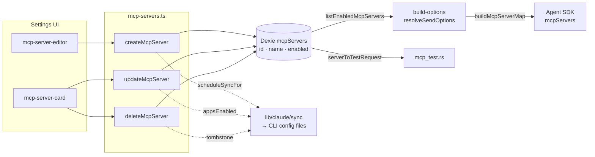

# Server Config & Store

<Status variant="stable">Stable · `lib/db/mcp-servers.ts` · 211 lines</Status>

<TLDR>
  One Dexie table, `mcpServers`, holds every MCP server definition. Its row type (`McpServer`,
  `lib/claude/types.ts:1969`) carries a `transport` discriminator and a transport-shaped `config`
  blob (stdio → `{ command, args?, env? }`; http/sse → `{ url, headers? }`). `mcp-servers.ts` is the
  CRUD layer: every create/update/delete bumps `updatedAt` and fires a **fire-and-forget**
  `scheduleSyncFor(appsEnabled)` so the change is mirrored to the relevant external-CLI config files.
  Two pure projections turn rows into other shapes — `buildMcpServerMap` (for the Agent SDK's
  `mcpServers` option) and `serverToTestRequest` (for the Rust connection probe).
</TLDR>

## The config model

```typescript title="lib/claude/types.ts:1948"
export type McpTransport = "stdio" | "sse" | "http"
```

```typescript title="lib/claude/types.ts:1969"
export interface McpServer {
  id: string // mcp_${timestamp}_${random} (newId(), mcp-servers.ts:5)
  name: string // trimmed; "" coerces to "unnamed"
  transport: McpTransport
  config: Record<string, unknown>
  enabled: boolean // reaches Cognia's own chat
  appsEnabled?: Partial<Record<AgentId, boolean>> // per-CLI mirror toggles
  pluginId?: string // set only by the plugin manager → soft-delete on uninstall
  createdAt: number
  updatedAt: number
}
```

The `config` payload is **transport-shaped**, never normalized into typed columns:

| Transport | `config` shape | Probe / SDK key |
| --------- | -------------- | --------------- |
| `stdio` | `{ command: string, args?: string[], env?: Record<string,string> }` | spawns a child process |
| `http` | `{ url: string, headers?: Record<string,string> }` | streamable-HTTP POST |
| `sse` | `{ url: string, headers?: Record<string,string> }` | legacy SSE endpoint |

`types/mcp/index.ts` carries only small re-export stubs used by migrated agent code —
`McpServerStatus` (`"stopped" | "starting" | "running" | "error" | "unknown"`), `McpServerInfo`, and
`McpToolSelectionConfig` (the budget/allowlist shape consumed by the [tool selector](./consumption-surfaces)).

## The Dexie table

`mcpServers` was introduced in **Dexie v2** and its index signature has been stable ever since
(`lib/db/schema.ts:332`, repeated unchanged through later versions):

```typescript title="lib/db/schema.ts"
this.version(2).stores({
  // …
  mcpServers: "id, name, enabled",
})
```

- **Primary key** `id` (string) — O(1) `get`.
- **Index `name`** — ordered listing for the panel.
- **Index `enabled`** — fast filter for `listEnabledMcpServers`.

The **v7** upgrade added the `appsEnabled` per-agent projection field and backfilled `{}` onto legacy
rows so downstream code never has to null-check.

## CRUD layer

`lib/db/mcp-servers.ts` is the only writer. Every mutation bumps `updatedAt` and schedules an agent sync.

| Function | Line | Behavior |
| -------- | ---- | -------- |
| `listMcpServers()` | 9 | All rows, ordered by `name`. |
| `listEnabledMcpServers()` | 13 | In-memory `filter(s => s.enabled)`. |
| `getMcpServer(id)` | 21 | Primary-key lookup. |
| `createMcpServer(partial)` | 25 | Insert; generates `id`; stamps both timestamps; `scheduleSyncFor(appsEnabled)`. |
| `listMcpServersByPlugin(pluginId)` | 56 | Enumerate plugin-owned rows (used at uninstall). |
| `updateMcpServer(id, patch)` | 64 | Merge + bump `updatedAt`; syncs agents the toggle was *removed* from too. |
| `deleteMcpServer(id)` | 76 | Delete; captures `name` + `appsEnabled` so sync removes it from agent files. |
| `buildMcpServerMap(servers)` | 109 | Pure projection → SDK shape. |
| `bulkImportMcpServers(drafts, strategy)` | 142 | Batch create/update with skip/duplicate/overwrite collision handling. |
| `parseClaudeMcpConfig(raw)` | 209 | Parse a `~/.claude.json` `mcpServers` block into drafts. |

### Create + sync side effect

```typescript title="lib/db/mcp-servers.ts:25"
export async function createMcpServer(
  partial: Pick<McpServer, "name" | "transport" | "config"> & {
    enabled?: boolean
    appsEnabled?: McpServer["appsEnabled"]
    pluginId?: string
  }
): Promise<McpServer> {
  const now = Date.now()
  const server: McpServer = {
    id: newId(),
    name: partial.name.trim() || "unnamed",
    transport: partial.transport,
    config: partial.config,
    enabled: partial.enabled ?? true,
    appsEnabled: partial.appsEnabled ?? {},
    ...(partial.pluginId !== undefined ? { pluginId: partial.pluginId } : {}),
    createdAt: now,
    updatedAt: now,
  }
  await getDb().mcpServers.put(server)
  scheduleSyncFor(server.appsEnabled)
  return server
}
```

`scheduleSyncFor` (line 92) lazily imports `@/lib/claude/sync`, collects the enabled agent ids from the
`appsEnabled` map, and calls `scheduleSync(id, tombstone)` per agent. It **never throws** — a sync
failure is best-effort and does not roll back the Dexie write. (Full mirror mechanics →
[Agent sync & health](./agent-sync-and-health).)

## Two pure projections

### → Agent SDK (`buildMcpServerMap`)

The map keys by server **name** (not id) because that is the namespace the SDK exposes to the model
(`mcp__<name>__<tool>`). Disabled rows are dropped.

```typescript title="lib/db/mcp-servers.ts:109"
export function buildMcpServerMap(servers: McpServer[]): Record<string, Record<string, unknown>> {
  const out: Record<string, Record<string, unknown>> = {}
  for (const s of servers) {
    if (!s.enabled) continue
    out[s.name] = { type: s.transport, ...s.config }
  }
  return out
}
```

A representative output:

```json
{
  "filesystem": { "type": "stdio", "command": "npx", "args": ["-y", "@modelcontextprotocol/server-filesystem", "/repo"] },
  "deepwiki": { "type": "http", "url": "https://mcp.deepwiki.com/mcp" }
}
```

### → Rust probe (`serverToTestRequest`)

`components/settings/mcp/mcp-server-utils.ts:50` coerces a loosely-typed `config` blob into the strict
`McpTestRequest` IPC shape, doing explicit `typeof` checks so a malformed row can't reach Rust:

```typescript title="components/settings/mcp/mcp-server-utils.ts:50"
export function serverToTestRequest(s: McpServer): McpTestRequest {
  const c = s.config as Record<string, unknown>
  if (s.transport === "stdio") {
    return {
      transport: "stdio",
      command: typeof c.command === "string" ? c.command : "",
      args: Array.isArray(c.args) ? c.args.filter((x): x is string => typeof x === "string") : [],
      env: /* string-coerced env map, or undefined */ undefined,
    }
  }
  return { transport: s.transport, url: typeof c.url === "string" ? c.url : "", headers: undefined }
}
```

## UI helpers

`mcp-server-utils.ts` also carries the panel-side glue:

| Helper | Line | Purpose |
| ------ | ---- | ------- |
| `objectToKvRows` / `kvRowsToObject` | 23 / 31 | Round-trip `env`/`headers` between an object and the `[{key,value}]` rows the [KV editor](./settings-panel) uses. |
| `summarizeServer` | 41 | One-line preview: stdio → `"<command> <args>"`, http/sse → `url`. |
| `cloneServerDraft` | 85 | Deep-copy config, append `" copy"`, carry over `appsEnabled`. |
| `groupServers` | 115 | Partition by `none`/`transport`/`status` and float favorites to the top of each group. |

```typescript title="components/settings/mcp/mcp-server-utils.ts:41"
export function summarizeServer(s: McpServer): string {
  const c = s.config as { command?: string; url?: string; args?: string[] }
  if (s.transport === "stdio") {
    return [c.command, ...(c.args ?? [])].filter(Boolean).join(" ")
  }
  return c.url ?? "(no url)"
}
```

## Data model & flow



## Invariants

- **`updatedAt` always bumps** on every CRUD call — drives the panel's live re-sort.
- **`name` is the SDK namespace** — duplicate names collide in `buildMcpServerMap`; the import path
  dedupes case-insensitively.
- **`pluginId` is owner-only** — user-typed rows leave it undefined; plugin uninstall enumerates by it.
- **Sync is best-effort** — Dexie is the source of truth; CLI files are a mirror, reconciled by the
  [drift detector](./agent-sync-and-health).

## Related pages

<Cards>
  <Card title="Presets & import" href="./presets-and-import" description="Where rows come from: the 15 built-in presets, the plugin overlay registry, and importing from CLI config files." />
  <Card title="Session resolution" href="./session-resolution" description="How listEnabledMcpServers + buildMcpServerMap feed a single chat turn." />
  <Card title="Settings panel" href="./settings-panel" description="The editor, card, KV editor, and stores that call this CRUD layer." />
</Cards>
