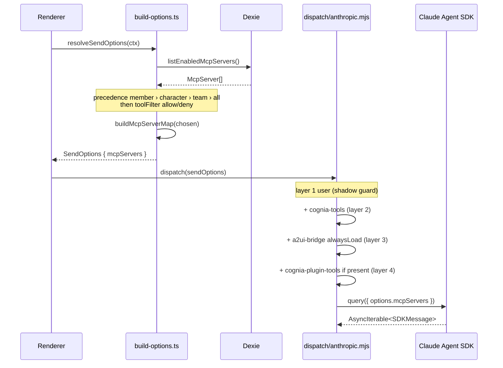

# Session Resolution

<Status variant="stable">Stable · `build-options.ts` + `builtin-mcp/` + `dispatch/anthropic.mjs`</Status>

<TLDR>
  Resolution happens in two stages. **Renderer side** (`build-options.ts:resolveSendOptions`) decides
  *which* enabled servers this turn gets, walking a precedence chain — a team-member override beats the
  character's `mcpServerIds`, which beats the team's, which falls back to all enabled — then applies any
  tool filter, and projects the survivors through `buildMcpServerMap` into `opts.mcpServers`. **Sidecar
  side** (`dispatch/anthropic.mjs`) takes that map and layers the in-process servers on top:
  `cognia-tools` (built-ins), `a2ui-bridge` (always-loaded), and `cognia-plugin-tools` (when present),
  each with a name-shadow guard. For *external* agents, a third helper (`builtin-mcp/resolve.ts`) rewrites
  `${COGNIA_SIDECAR_DIR}` placeholders and injects the `COGNIA_BRIDGE_SOCKET` env so the a2ui-bridge child
  can phone home.
</TLDR>

## Stage 1 — which servers (renderer)

`resolveSendOptions` (`lib/claude/build-options.ts:931`) resolves the per-turn subset. The precedence is
strict — the first matching tier wins:

| Tier | Source | When |
| ---- | ------ | ---- |
| 1 | `memberOverride.mcpServerIdsOverride` | team chat, per-member |
| 2 | `character.mcpServerIds` | a character pins a subset |
| 3 | `team.mcpServerIds` | team session default |
| 4 | *all enabled servers* | nothing above is set |

```typescript title="lib/claude/build-options.ts:938"
const enabled = await listEnabledMcpServers()
let chosen = enabled
const memberMcp = memberOverride?.mcpServerIdsOverride
if (memberMcp) {
  const wanted = new Set(memberMcp)
  chosen = enabled.filter((srv) => wanted.has(srv.id))
} else if (character?.mcpServerIds) {
  const wanted = new Set(character.mcpServerIds)
  chosen = enabled.filter((srv) => wanted.has(srv.id))
} else if (session?.kind === "team" && session.teamId) {
  const team = await getTeam(session.teamId)
  if (team?.mcpServerIds) {
    const wanted = new Set(team.mcpServerIds)
    chosen = enabled.filter((srv) => wanted.has(srv.id))
  }
}
```

A configurable **tool filter** then narrows further — `allow` intersects, `deny` subtracts:

```typescript title="lib/claude/build-options.ts:958"
if (toolFilter && toolFilter.mode !== "all" && toolFilter.mcpServerIds?.length) {
  const fset = new Set(toolFilter.mcpServerIds)
  chosen =
    toolFilter.mode === "allow"
      ? chosen.filter((srv) => fset.has(srv.id))
      : chosen.filter((srv) => !fset.has(srv.id))
}
if (chosen.length > 0) opts.mcpServers = buildMcpServerMap(chosen)
```

The output is `opts.mcpServers: Record<name, { type, ...config }>` — see
[`buildMcpServerMap`](./server-config#-agent-sdk-buildmcpservermap). This rides `SendOptions` into the sidecar.

## Stage 2 — placeholder resolution (external agents)

Built-in MCP rows (notably the projected `a2ui-bridge` row) ship **placeholder tokens** instead of
absolute paths, because the bundle location is only known at runtime. `builtin-mcp/resolve.ts` rewrites
them. Two operations: substitute `${COGNIA_SIDECAR_DIR}` across `command`/`args`/`env`, and — for the
a2ui-bridge row only — inject `COGNIA_BRIDGE_SOCKET` so the spawned child can dispatch back to the renderer:

```typescript title="lib/claude/builtin-mcp/resolve.ts:93"
export function resolveBuiltinMcpConfig(server: McpServer, ctx: BuiltinMcpResolveContext): McpServer {
  const config = server.config ?? {}
  let changed = false
  const nextConfig: Record<string, unknown> = { ...config }
  if (typeof config.command === "string") {
    const replaced = substitute(config.command, ctx.sidecarDir)
    if (replaced !== config.command) { nextConfig.command = replaced; changed = true }
  }
  // …args rewrite…
  const injectSocket = isA2UIBridgeRow(server) ? ctx.socketPath : null
  const nextEnv = rewriteEnv(config.env, ctx.sidecarDir, injectSocket)
  if (nextEnv.changed) { nextConfig.env = nextEnv.value; changed = true }
  if (!changed) return server // referential identity preserved
  return { ...server, config: nextConfig }
}
```

The substitution avoids regex so Windows backslashes never need escaping:

```typescript title="lib/claude/builtin-mcp/resolve.ts:33"
function substitute(value: string, sidecarDir: string): string {
  if (!value.includes(COGNIA_SIDECAR_DIR_TOKEN)) return value
  return value.split(COGNIA_SIDECAR_DIR_TOKEN).join(sidecarDir)
}
```

The runtime paths come from Rust over IPC and are cached for the process lifetime (they only change on
app restart):

```typescript title="lib/claude/builtin-mcp/runtime-context.ts:23"
async function fetchRuntimePaths(): Promise<BuiltinMcpResolveContext | null> {
  if (!isTauri()) return null // web preview / jsdom → caller short-circuits
  const raw = await invoke<RuntimePathsRaw>("a2ui_bridge_runtime_paths")
  return { sidecarDir: raw.sidecar_dir, socketPath: raw.socket_path }
}
```

## Stage 3 — merge layers (sidecar)

`sidecar/dispatch/anthropic.mjs` receives `sendOptions.mcpServers` and assembles the final map in four
layers. Each layer checks `hasOwnProperty` first, so a user-defined server with a reserved name
**shadows** (wins over) the built-in and logs a warning:

| Layer | Source | Name | alwaysLoad |
| ----- | ------ | ---- | ---------- |
| 1 | user-configured | (their names) | per tool-search policy |
| 2 | built-ins | `cognia-tools` | per policy |
| 3 | A2UI bridge | `a2ui-bridge` | **true** (never deferred) |
| 4 | plugin tools | `cognia-plugin-tools` | per policy, only if present |

```javascript title="sidecar/dispatch/anthropic.mjs:116"
const baseUserServers = stampUserServersAlwaysLoad(sendOptions.mcpServers, serverAlwaysLoad)
const withBuiltins = builtinServer
  ? Object.prototype.hasOwnProperty.call(baseUserServers, BUILTIN_SERVER_NAME)
    ? (log("warn", `user mcp '${BUILTIN_SERVER_NAME}' shadows built-in tools — keeping user's`), baseUserServers)
    : { ...baseUserServers, [BUILTIN_SERVER_NAME]: builtinServer }
  : { ...baseUserServers }
```

A2UI is always added (interactive surfaces must stay resident, never tool-searched):

```javascript title="sidecar/dispatch/anthropic.mjs:132"
const a2uiServer = buildA2UIBridgeServer({ sessionId, emit, alwaysLoad: true })
```

Plugin tools are conditional on `sendOptions.pluginTools` and build an in-process proxy that round-trips
each call back to the renderer (see [Built-in tools › plugin-tools bridge](./builtin-tools#plugin-tools-bridge)):

```javascript title="sidecar/dispatch/anthropic.mjs:149"
if (Array.isArray(sendOptions.pluginTools) && sendOptions.pluginTools.length > 0) {
  const pluginToolsServer = buildPluginToolsServer({ tools: sendOptions.pluginTools, emit, sessionId, /* … */ })
  if (pluginToolsServer) mergedMcpServers = { ...withA2UI, [PLUGIN_TOOLS_SERVER_NAME]: pluginToolsServer }
}
```

The merged map is then handed straight to the SDK (undefined/null keys stripped first):

```javascript title="sidecar/dispatch/anthropic.mjs"
const options = { cwd, model, mcpServers: mergedMcpServers, /* … */ }
const q = query({ prompt: inputStream.iterable, options })
```

## End-to-end



## Edge cases

- **Empty result** — if `chosen` is empty, `opts.mcpServers` is *not* set; the turn still gets the
  in-process servers (cognia-tools / a2ui-bridge) added sidecar-side.
- **Name collision** — two enabled rows with the same `name` collapse in `buildMcpServerMap`; the panel's
  duplicate-name warnings exist to prevent this.
- **Non-Anthropic providers** — the AI-SDK dispatch path (`dispatch/ai-sdk.mjs`) consumes the same
  `mcpServers` map but bridges tools differently; see [ADR-0043](../../adr/0043-llm-provider-execution) if present.
- **Web / jsdom** — `runtime-context.ts` returns `null` outside Tauri, so placeholder resolution is
  skipped and only the local in-process path is exercised.

## Related pages

<Cards>
  <Card title="Server config & store" href="./server-config" description="listEnabledMcpServers + buildMcpServerMap — the inputs to stage 1." />
  <Card title="Built-in tools" href="./builtin-tools" description="What cognia-tools and cognia-plugin-tools add in layers 2 and 4." />
  <Card title="A2UI bridge" href="./a2ui-bridge" description="The always-loaded layer-3 server and the socket injected by resolve.ts." />
</Cards>
