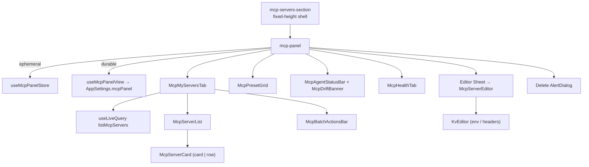

# Settings Panel

<Status variant="stable">Stable · `components/settings/mcp/` · `stores/mcp/`</Status>

<TLDR>
  The MCP panel (`mcp-panel.tsx`) is a four-tab surface — **My Servers · Presets · Agents · Health** —
  built from native `role="tab"` buttons (not Radix) with `AnimatePresence` page transitions that respect
  reduced motion. State is split across **two** stores: `mcp-panel-store` holds *ephemeral* UI state
  (active tab, search, transport/status filters, a `Set` of selected ids, editor/delete targets), while
  `use-mcp-panel-view` persists *durable* preferences (grid vs list, grouping, favorites) onto
  `AppSettings.mcpPanel` for cross-device sync. The server list reads Dexie through `useLiveQuery`, so any
  CRUD elsewhere reflects live. Batch actions loop the single-row CRUD functions so the agent-mirror side
  effects stay identical.
</TLDR>

## Four tabs

```typescript title="stores/mcp/mcp-panel-store.ts:14"
export type McpPanelTab = "my-servers" | "presets" | "agents" | "health"
export type McpTransportFilter = "all" | McpTransport
export type McpStatusFilter = "all" | "enabled" | "disabled"
```

| Tab | Content | Page |
| --- | ------- | ---- |
| **My Servers** | `McpMyServersTab` — view/group controls, filtered list, batch bar | this page |
| **Presets** | `McpPresetGrid` — the preset market | [Presets & import](./presets-and-import) |
| **Agents** | `McpAgentStatusBar` + `McpDriftBanner` + related-sections strip | [Agent sync & health](./agent-sync-and-health) |
| **Health** | `McpHealthTab` — inbound-bridge status + audit log | [Agent sync & health](./agent-sync-and-health#health-tab) |

The tab strip is hand-built (no Radix Tabs) and the content cross-fades:

```tsx title="components/settings/mcp/mcp-panel.tsx:161"
<AnimatePresence initial={false}>
  <motion.div
    key={activeTab}
    initial={reduce ? false : { opacity: 0, y: 4 }}
    animate={{ opacity: 1, y: 0 }}
    exit={reduce ? undefined : { opacity: 0, y: -4 }}
    transition={fade}
  >
    {activeTab === "my-servers" && <McpMyServersTab />}
    {activeTab === "presets" && <McpPresetGrid existingNames={[]} onPresetSelected={onPresetSelected} />}
    {activeTab === "agents" && <div className="space-y-4"><McpAgentStatusBar /><McpDriftBanner /></div>}
    {activeTab === "health" && <McpHealthTab />}
  </motion.div>
</AnimatePresence>
```

The editor `Sheet` and delete `AlertDialog` are hosted *outside* the tab content so they survive tab
switches (`mcp-panel.tsx:186`).

## Two stores, two lifetimes

### Ephemeral UI state — `mcp-panel-store`

```typescript title="stores/mcp/mcp-panel-store.ts:34"
interface McpPanelStoreState {
  activeTab: McpPanelTab
  search: string
  transportFilter: McpTransportFilter
  statusFilter: McpStatusFilter
  selection: Set<string> // batch-selected server ids
  editorTarget: McpEditorTarget // create / edit / closed
  deleteTarget: { serverId: string; name: string } | null
  filterSheetOpen: boolean
  // actions: setActiveTab, setSearch, set*Filter, resetFilters,
  //          toggleSelection, selectAll, clearSelection,
  //          openCreate(seed?), openEdit(id), closeEditor, setDeleteTarget, …
}
```

Selection is an immutable `Set` — every toggle returns a fresh copy so subscribers re-render correctly:

```typescript title="stores/mcp/mcp-panel-store.ts:78"
toggleSelection: (id) =>
  set((s) => {
    const next = new Set(s.selection)
    if (next.has(id)) next.delete(id)
    else next.add(id)
    return { selection: next }
  }),
```

> `stores/mcp/mcp-store.ts` is a **different**, minimal store — a contract-compatible stub
> (`servers`, `toolSelectionConfig`, `lastToolSelection`) consumed by the agent-mode
> [tool selector](./consumption-surfaces#tool-selector), *not* by this panel.

### Durable preferences — `use-mcp-panel-view`

View prefs persist on `AppSettings.mcpPanel` via `useSettingsStore.save()` (cross-device, not localStorage):

```typescript title="hooks/mcp/use-mcp-panel-view.ts:18"
export type McpPanelView = "grid" | "list"
export type McpPanelGroupBy = "none" | "transport" | "status"
export interface McpPanelPrefs { view: McpPanelView; groupBy: McpPanelGroupBy; favorites: string[] }
```

```typescript title="hooks/mcp/use-mcp-panel-view.ts:78"
const toggleFavorite = useCallback(
  async (id: string) => {
    const next = favoriteSet.has(id)
      ? prefs.favorites.filter((f) => f !== id)
      : [...prefs.favorites, id]
    await persist({ favorites: next })
  },
  [favoriteSet, prefs.favorites, persist]
)
```

## Component tree



## Key components

### `McpMyServersTab`

Reads the live server list and applies the active filters + search across name, transport, command, url,
and args:

```tsx title="components/settings/mcp/mcp-my-servers-tab.tsx:55"
const visibleServers = useMemo(() => {
  const q = search.trim().toLowerCase()
  return servers.filter((s) => {
    if (transportFilter !== "all" && s.transport !== transportFilter) return false
    if (statusFilter === "enabled" && !s.enabled) return false
    if (statusFilter === "disabled" && s.enabled) return false
    if (!q) return true
    const cfg = s.config as { command?: string; url?: string; args?: string[] }
    return [s.name, s.transport, cfg.command ?? "", cfg.url ?? "", (cfg.args ?? []).join(" ")]
      .join(" ").toLowerCase().includes(q)
  })
}, [servers, search, transportFilter, statusFilter])
```

### `McpServerCard`

A single server tile with two variants — `card` (stacked, with agent chips in the footer) and `row`
(inline). It owns the per-server **test** action, calling the Rust probe and rendering a green ✓ (with
tool count) or red ✗ badge. Favorite / test / edit / clone / delete actions hide until hover on desktop
and stay visible on touch.

### `McpServerEditor`

Transport-aware create/edit form with a form ↔ JSON toggle. `buildConfig` reconstructs the `config` blob
from the active section:

```tsx title="components/settings/mcp/mcp-server-editor.tsx:76"
const buildConfig = (): Record<string, unknown> => {
  if (transport === "stdio") {
    const args = argsText.split("\n").map((a) => a.trim()).filter(Boolean)
    const env = kvRowsToObject(envRows)
    const config: Record<string, unknown> = { command }
    if (args.length > 0) config.args = args
    if (Object.keys(env).length > 0) config.env = env
    return config
  }
  const headers = kvRowsToObject(headerRows)
  const config: Record<string, unknown> = { url }
  if (Object.keys(headers).length > 0) config.headers = headers
  return config
}
```

### `KvEditor`

A reusable key/value row editor (`add` / `update` / `remove` immutable handlers) used for both stdio
`env` and http/sse `headers`. Rows round-trip via `objectToKvRows` / `kvRowsToObject`.

### `McpBatchActionsBar`

A floating bar shown when `selection.size > 0`. Enable/disable/re-sync/delete all loop the **single-row**
CRUD functions so the per-row agent-mirror side effects fire exactly as they would individually:

```tsx title="components/settings/mcp/mcp-batch-actions-bar.tsx:49"
const handleDelete = async () => {
  let failed = 0
  for (const s of selected) {
    try { await deleteMcpServer(s.id) }
    catch (err) { failed += 1; loggers.mcp.warn("batch delete skipped", { id: s.id, error: String(err) }) }
  }
  if (failed > 0) toast.warning(t("deletedPartial", { ok: count - failed, total: count }))
  else toast.success(t("deletedCount", { count }))
  clear()
}
```

### `McpServersSection`

The settings-page entry point. It stretches the panel to a fixed viewport height so the panel scrolls
internally rather than the outer settings `ScrollArea`:

```tsx title="components/settings/mcp-servers-section.tsx:25"
className="h-[calc(100dvh-var(--settings-header-h,8rem))] …"
```

## Notes

- **No Radix Tabs** — tabs are native buttons with `role="tab"` / `aria-selected`.
- **Live data** — `useLiveQuery(listMcpServers)` means imports, plugin installs, and CCSwitch syncs all
  appear without a manual refresh.
- **Favorites float** — `groupServers` (from [server-config utils](./server-config#ui-helpers)) lifts
  favorited servers to the top of every group.
- **Editor remount** — the editor `Sheet` re-mounts on `editorTarget` change so form state never leaks
  between rows.

## Related pages

<Cards>
  <Card title="Server config & store" href="./server-config" description="The CRUD functions and grouping/summary helpers the panel calls." />
  <Card title="Agent sync & health" href="./agent-sync-and-health" description="The Agents and Health tabs in depth — chips, drift, the probe, and the audit log." />
  <Card title="Consumption surfaces" href="./consumption-surfaces" description="The mcp-store stub and the other pickers that reuse this config." />
</Cards>
