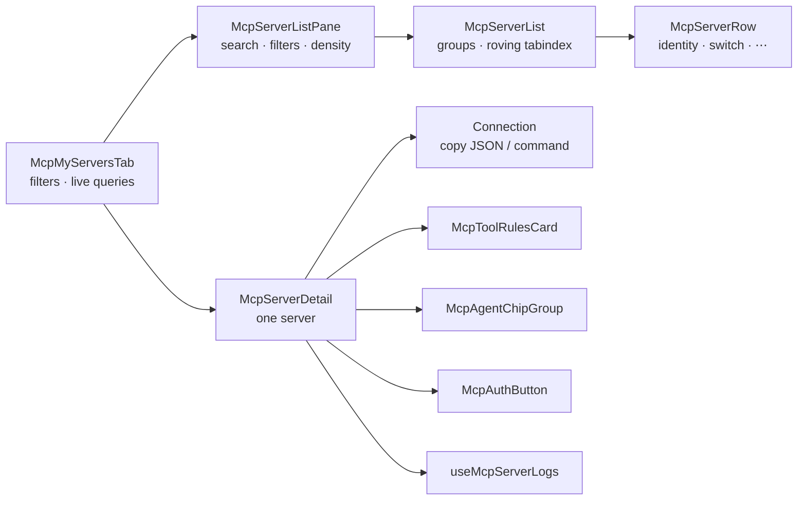
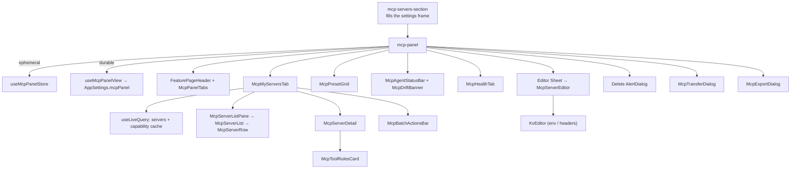

# Settings Panel

<Status variant="stable">Stable · `components/settings/mcp/` · `stores/mcp/`</Status>

<TLDR>
  The MCP panel (`mcp-panel.tsx`) is a four-tab surface — **My Servers · Presets · Agents · Health** —
  that fills the settings pane and owns its own scroll. **My Servers** is a master-detail pane: a dense
  rail on the left, and on the right one server's tools, agent projection, OAuth state, connection shape
  and recent logs. State is split across **two** stores: `mcp-panel-store` holds *ephemeral* UI state
  (active tab, search, filters, batch selection, detail selection, editor/delete/transfer/export targets),
  while `use-mcp-panel-view` persists *durable* preferences (row density, grouping, favorites) onto
  `AppSettings.mcpPanel`. The rail reads Dexie through `useLiveQuery`, so any CRUD elsewhere reflects live.
</TLDR>

## Four tabs, one fixed frame

```typescript title="stores/mcp/mcp-panel-store.ts:14"
export type McpPanelTab = "my-servers" | "presets" | "agents" | "health"
export type McpTransportFilter = "all" | McpTransport
export type McpStatusFilter = "all" | "enabled" | "disabled"
export type McpTrustFilter = "all" | McpServerTrustState
```

| Tab | Content | Page |
| --- | ------- | ---- |
| **My Servers** | `McpMyServersTab` — rail + detail pane, batch bar | this page |
| **Presets** | `McpPresetGrid` — the preset market | [Presets & import](./presets-and-import) |
| **Agents** | `McpAgentStatusBar` + `McpDriftBanner` + related-sections strip | [Agent sync & health](./agent-sync-and-health) |
| **Health** | `McpHealthTab` — live session card, inbound-bridge status, audit log | [Agent sync & health](./agent-sync-and-health#health-tab) |

Two layout rules keep the frame still, and breaking either is what made the previous version jump on
every tab switch:

```tsx title="components/settings/mcp/mcp-panel.tsx:169"
<AnimatePresence mode="wait" initial={false}>
  <motion.div
    key={activeTab}
    initial={reduce ? false : { opacity: 0 }}
    animate={{ opacity: 1 }}
    exit={reduce ? undefined : { opacity: 0 }}
    transition={fade}
    className="flex min-h-0 w-full flex-1 overflow-hidden"
  >
```

1. **`mode="wait"`, opacity only.** In the default `"sync"` mode both the outgoing and incoming panel sit
   in normal flow at once, so the container's height briefly doubles; a `y` offset on top of that made it
   visibly lurch.
2. **Every tab body owns its own scroll container** inside a `min-h-0 flex-1` frame. Nothing wraps the
   tabs in a shared `ScrollArea`, so a tall tab cannot resize the frame the tab bar sits in.

The tab strip itself is Radix `Tabs` (`mcp-panel-tabs.tsx:31`) with no `overflow-x-auto` — an unbounded
width makes the `w-fit` list render at max-content and overflow a narrow pane, which is what produced
scroll-into-view jitter when a half-hidden tab was clicked. Triggers shrink and truncate instead.

<Callout type="info">
  Radix `TabsTrigger` selects on **mousedown/focus**, not click. In tests, `fireEvent.click` does not
  change the tab — drive it with `userEvent`.
</Callout>

The header is the shared `FeaturePageHeader`, carrying the enabled/total count and the four panel-level
actions (Paste · Import · Export all · Add server). The editor `Sheet`, delete `AlertDialog`, and the
transfer/export dialogs are hosted *outside* the tab content so they survive tab switches.

## Filling the settings pane

`mcp` is a member of the settings shell's `FILL_HEIGHT_SECTIONS`, so the section renders in the
fixed-frame branch and the wrapper simply fills it:

```tsx title="components/settings/mcp-servers-section.tsx:28"
<div className={cn("flex h-full min-h-0 w-full flex-1 flex-col overflow-hidden", className)}>
  <McpPanel />
</div>
```

<Callout type="warn">
  The previous version asked for `h-[calc(100dvh-var(--settings-header-h,8rem))]` — a variable nothing
  defines — and cancelled the shell's padding with negative margins, all inside the capped `max-w-5xl`
  `ScrollArea` branch. That produced three visible symptoms: wasted width on a wide window, a second
  scrollbar, and a frame sized to something other than the pane it sat in. Adding the section id to
  `FILL_HEIGHT_SECTIONS` is the fix; `sections/skills-section.tsx` documents the same conversion.
</Callout>

## Master-detail: My Servers



The rail carries identity, review state, the enable switch and a batch checkbox; everything that needs
room lives in the detail half. On mobile (`useIsMobile`) the detail half becomes a `Sheet`, because a
300px rail beside a detail pane does not fit a phone.

### Two live queries, not two hundred

The tab subscribes **once** to the agent-file snapshot and **once** to the capability cache, then hands
derived maps down. The alternative — a hook per row — is what made the old grid slow to open:

```tsx title="components/settings/mcp/mcp-my-servers-tab.tsx:75"
const capabilityRows = useLiveQuery(() => getDb().mcpCapabilityCache.toArray(), [])
const { toolNames, toolCounts, deniedToolCounts } = useMemo(() => {
  const freshest = new Map<string, string[]>()
  const seenAt = new Map<string, number>()
  for (const row of capabilityRows ?? []) {
    if ((seenAt.get(row.serverId) ?? -1) >= row.updatedAt) continue
    seenAt.set(row.serverId, row.updatedAt)
    freshest.set(row.serverId, row.tools.map((tool) => tool.name))
  }
  // …counts + denied counts per server
}, [capabilityRows, servers])
```

Those tool names also feed search, so "which server gives me `create_issue`?" is answerable from the
rail's filter box.

### Keyboard

The rail is a real listbox. Exactly one row holds the tabstop, so Tab enters the list once; Up/Down/
Home/End move within it, and **selection follows focus** so the detail half tracks the keyboard the same
way it tracks a click.

```tsx title="components/settings/mcp/mcp-server-list.tsx:76"
// Tab must land somewhere even before anything is selected (mobile opens no
// detail pane), so the first row holds the tabstop when nothing is active.
const rovingId = activeId && order.includes(activeId) ? activeId : (order[0] ?? null)
```

`order` is the flat rendered order across groups, so a group header is never a dead end.

<Callout type="warn">
  The rows are deliberately **unanimated**. They used to fade in on a `staggerChildren` container; when
  variant propagation does not fire, every row keeps its `initial` variant and sits at `opacity: 0` —
  present in the DOM, invisible on screen. At `STAGGER_INTERVAL` 0.04s a hundred-server rail also
  finishes four seconds after it renders. The tab crossfade already covers the transition.
</Callout>

### `McpServerDetail`

One server, top to bottom: identity + trust badge + enable switch + actions; a trust-review banner while
the server is `pending`/`legacy`; **Connection** (config summary, origin/revision/secrets/updated, copy
as JSON or as a `claude mcp add` line, `McpAuthButton` for remote transports); **Tools**; **Agent
targets**; and the last log lines for this server.

The config *form* stays in the editor `Sheet`. This pane is for reading state and operating on it —
mixing a validating form into a live-updating pane is how the old surface ended up re-seeding fields
under the user's cursor.

A successful **Test** here is not thrown away: it writes through `recordMcpCapabilities`, so the same
run that proves the server connects also populates the tool switches.

### `McpToolRulesCard`

Two deny axes coexist and the card keeps them distinguishable, because they behave differently: a switch
pins **one** tool by name; a rule keeps covering tools the server grows later. A tool denied by a rule
therefore shows a **disabled** switch and names the rule — offering a switch that silently loses to a
rule would be a lie.

Bulk **Allow all** / **Deny all** act on the *filtered* subset, and with a filter active a third button
saves that filter as a rule. Rules pinned against tools the server no longer reports stay visible under
"Rules without a tool" so they remain removable. See
[Server config → deny rules](./server-config#per-tool-deny-rules) for the persistence and the send path.

### `McpTransferDialog` / `McpExportDialog`

Paste an install command or a JSON block and the parse is live and pure — the preview below the box *is*
what will be written, with a per-entry checkbox and a collision strategy. The export dialog is the
reverse, rendering the selected servers (or all of them) as JSON or an install command for a chosen
agent. Both sit on one parser/serializer pair, so anything the export emits the paste box can read back.
See [Presets & import](./presets-and-import#paste-to-add-and-export).

## Two stores, two lifetimes

### Ephemeral UI state — `mcp-panel-store`

```typescript title="stores/mcp/mcp-panel-store.ts:34"
interface McpPanelStoreState {
  activeTab: McpPanelTab
  search: string
  transportFilter: McpTransportFilter
  statusFilter: McpStatusFilter
  trustFilter: McpTrustFilter
  selection: Set<string>              // batch-selected server ids
  editorTarget: McpEditorTarget       // create / edit / closed
  deleteTarget: { serverId: string; name: string } | null
  filterSheetOpen: boolean
  detailServerId: string | null       // master-detail selection
  transferOpen: boolean               // paste-to-add dialog
  exportTarget: { serverIds: string[] } | null // [] means "every server"
  // actions: setActiveTab, setSearch, set*Filter, resetFilters,
  //          toggleSelection, selectAll, clearSelection,
  //          openCreate(seed?), openEdit(id), closeEditor, setDeleteTarget,
  //          openDetail(id), closeDetail, setTransferOpen, openExport(ids), closeExport
}
```

`detailServerId` is independent of both `selection` (batch actions) and `editorTarget` (the config form):
opening the editor must not move the detail pane off the row the user is reading.

Selection is an immutable `Set` — every toggle returns a fresh copy so subscribers re-render correctly:

```typescript title="stores/mcp/mcp-panel-store.ts:96"
toggleSelection: (id) =>
  set((s) => {
    const next = new Set(s.selection)
    if (next.has(id)) next.delete(id)
    else next.add(id)
    return { selection: next }
  }),
```

> `stores/mcp/mcp-store.ts` is a **different**, minimal store — a contract-compatible stub
> (`servers`, `toolSelectionConfig`, `lastToolSelection`) consumed by the agent-mode
> [tool selector](./consumption-surfaces#tool-selector), *not* by this panel.

### Durable preferences — `use-mcp-panel-view`

View prefs persist on `AppSettings.mcpPanel` via `useSettingsStore.save()` (cross-device, not localStorage):

```typescript title="hooks/mcp/use-mcp-panel-view.ts:26"
export type McpPanelView = "grid" | "list"
export type McpPanelGroupBy = "none" | "transport" | "status"
export interface McpPanelPrefs { view: McpPanelView; groupBy: McpPanelGroupBy; favorites: string[] }
```

<Callout type="info">
  `view` is still stored as `"grid"` / `"list"` for backwards compatibility with rows written before the
  panel became a master-detail pane. The values now mean **comfortable** and **compact** rows in a
  single-column rail; renaming the stored literals would silently reset every existing user's preference
  for no behavioural gain.
</Callout>

## Component tree



## Key components

### `McpServerEditor`

Transport-aware create/edit form with a form ↔ JSON toggle. `buildConfig` reconstructs the `config` blob
from the active section:

```tsx title="components/settings/mcp/mcp-server-editor.tsx:76"
const buildConfig = (): Record<string, unknown> => {
  if (transport === "stdio") {
    const args = argsText.split("\n").map((a) => a.trim()).filter(Boolean)
    const env = kvRowsToObject(envRows)
    const config: Record<string, unknown> = { command }
    if (args.length > 0) config.args = args
    if (Object.keys(env).length > 0) config.env = env
    return config
  }
  const headers = kvRowsToObject(headerRows)
  const config: Record<string, unknown> = { url }
  if (Object.keys(headers).length > 0) config.headers = headers
  return config
}
```

Two things it deliberately does **not** own. `appsEnabled` is never in the save payload — the per-agent
chip group is the only writer, so emitting it here would race chip clicks. And the deny rules are passed
through untouched, so saving a config edit can never quietly widen what the model may call:

```tsx title="components/settings/mcp/mcp-server-editor.tsx:155"
await onSave({
  name: name.trim(),
  transport,
  config,
  enabled,
  disallowedTools: initial.disallowedTools,
})
```

The sheet body scrolls while its header and the editor's action row stay put, so a long `env` list cannot
push **Save** off-screen.

### `KvEditor`

A reusable key/value row editor (`add` / `update` / `remove` immutable handlers) used for both stdio
`env` and http/sse `headers`. Rows round-trip via `objectToKvRows` / `kvRowsToObject`.

### `McpBatchActionsBar`

A floating bar shown when `selection.size > 0`. Enable/disable/re-sync/delete all loop the **single-row**
CRUD functions so the per-row agent-mirror side effects fire exactly as they would individually; Export
hands the selection to the export dialog:

```tsx title="components/settings/mcp/mcp-batch-actions-bar.tsx:52"
const handleDelete = async () => {
  let failed = 0
  for (const s of selected) {
    try { await deleteMcpServer(s.id) }
    catch (err) { failed += 1; loggers.mcp.warn("batch delete skipped", { id: s.id, error: String(err) }) }
  }
  if (failed > 0) toast.warning(t("deletedPartial", { ok: count - failed, total: count }))
  else toast.success(t("deletedCount", { count }))
  clear()
}
```

## Notes

- **Radix Tabs** — the strip moved off hand-built `role="tab"` buttons; see the mousedown caveat above.
- **Live data** — `useLiveQuery(listMcpServers)` means imports, plugin installs, and CCSwitch syncs all
  appear without a manual refresh.
- **Favorites float** — `groupServers` (from [server-config utils](./server-config#ui-helpers)) lifts
  favorited servers to the top of every group.
- **Editor remount** — the editor `Sheet` re-mounts on `editorTarget` change so form state never leaks
  between rows, and holds off mounting until the edited row has loaded so its one-shot seed never
  captures a blank or stale `initial`.
- **Landing after create** — a successful create opens the detail pane on the new server, so its tool
  switches and agent projection are one glance away.

## Related pages

<Cards>
  <Card title="Server config & store" href="./server-config" description="The CRUD functions, deny rules, and grouping/summary helpers the panel calls." />
  <Card title="Presets & import" href="./presets-and-import" description="The preset market, CLI-config import, and the paste/export transfer pair." />
  <Card title="Agent sync & health" href="./agent-sync-and-health" description="The Agents and Health tabs in depth — chips, drift, the probe, and the audit log." />
  <Card title="Consumption surfaces" href="./consumption-surfaces" description="The mcp-store stub and the other pickers that reuse this config." />
</Cards>
