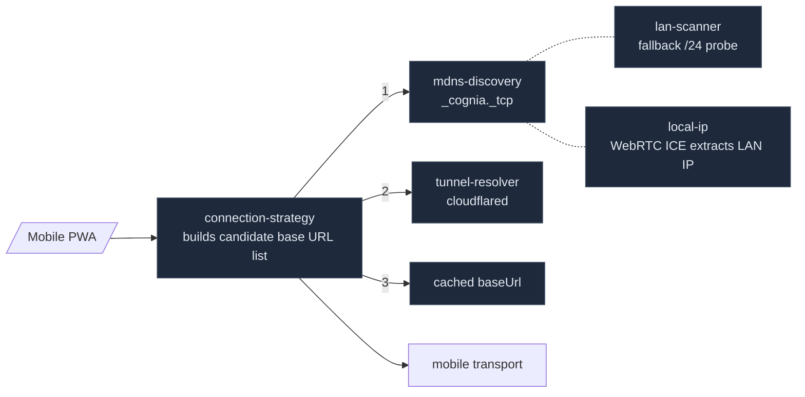

# Misc Subsystems

This page collects several relatively small subsystems that would each be a noticeable gap if missing. Each section covers what it does, lists key files, and links to related docs. The structure is flatter than other subsystem pages — these modules are largely independent, so a single overarching model is unnecessary.

<TLDR>
  TTS (9 providers + Edge-TTS WSS bridge), Push (mobile push registration), QR (pairing QR + barcode
  scanning), Network (proxy config), Connectivity (mDNS / LAN scan / tunnel), Queue (retryable send
  queue with backoff), Wallpaper (user wallpaper persistence), Proxy Config (Rust-side reverse proxy
  state), LaTeX (KaTeX cache), Monaco (editor options + workbench context), Media (plugin media
  landing), Time (minimal relative time).
</TLDR>

## At a Glance

| Subsystem           | Role                                                | Locations                                       |
| ------------------- | --------------------------------------------------- | ----------------------------------------------- |
| TTS                 | Text-to-speech, 9 providers + Edge WSS bridge       | `lib/tts/` · `src-tauri/src/tts/`               |
| Push                | Mobile push notifications (APNs/FCM)                | `lib/push/`                                     |
| QR & Barcode        | Pairing QR + mobile scan                            | `lib/qr/`                                       |
| Network             | Browser-side proxy config + proxy-aware fetch       | `lib/network/`                                  |
| Proxy Config (Rust) | Process-level proxy state + reqwest/WSS integration | `src-tauri/src/proxy_config/`                   |
| Connectivity        | mDNS / LAN /24 probe / cloudflared tunnel           | `lib/connectivity/`                             |
| Queue               | Mobile outbound queue + backoff + deadletter        | `lib/queue/`                                    |
| Wallpaper           | User wallpaper file persistence                     | `src-tauri/src/wallpaper/`                      |
| LaTeX               | KaTeX render LRU cache + macros                     | `lib/latex/`                                    |
| Monaco / Workbench  | Canvas Monaco options + active editor registry      | `lib/monaco/` · `lib/editor-workbench/`         |
| Media               | Plugin-generated media landing interface            | `lib/media/`                                    |
| Time                | Minimal relative time formatter                     | `lib/time/`                                     |
| Perf dashboard      | Streamed CPU/RAM/event samples (ADR-0035)           | `src-tauri/src/perf/` · `app/performance/`     |
| Public share links  | Zero-knowledge share via Cloudflare Worker          | `lib/share/` · `share-server/` · ADR-0037       |

## TTS

Text-to-speech, 9 providers plus an Edge-TTS WebSocket bridge. Frontend lives in `lib/tts/`, Tauri side in `src-tauri/src/tts/`.

Provider overview (`types/media/tts.ts:TTS_PROVIDERS`):

| Provider   | Entry File                | Notes                                        |
| ---------- | ------------------------- | -------------------------------------------- |
| OpenAI     | `providers/openai.ts`     | REST, requires API key                       |
| Gemini     | `providers/gemini.ts`     | Google AI family                             |
| ElevenLabs | `providers/elevenlabs.ts` | High-quality voice                           |
| LMNT       | `providers/lmnt.ts`       | Low latency                                  |
| Hume       | `providers/hume.ts`       | Includes emotion params                      |
| Cartesia   | `providers/cartesia.ts`   | Sonic series                                 |
| Deepgram   | `providers/deepgram.ts`   | TTS + STT same stack                         |
| Xiaomi     | `providers/xiaomi.ts`     | Available in mainland China                  |
| Edge       | `providers/edge.ts`       | Microsoft free tier; goes through WSS bridge |
| System     | `providers/system.ts`     | Web Speech API fallback                      |

`tts-orchestrator.ts` is a singleton orchestrator: receives `SpeechSettings` → selects provider → `preprocessTextForProvider` + applies pronunciation dictionary + `splitTextForTTS` chunking → checks cache (`tts-cache.ts`) for hit → calls the corresponding provider → concatenates playback queue. The `auto-play-gates.ts` function `canAutoPlayTTS({ ttsEnabled, ttsAutoPlay, isLoading, isStreaming })` is the single "should we auto-play?" gate after a chat send completes.

The orchestrator is wired into chat through three surfaces: a per-message **read-aloud button** (`components/chat/read-aloud-button.tsx`, gated on `ttsEnabled`, using the focused `useReadAloudStatus` selector so a virtualized list of buttons never re-renders on progress ticks), **auto-play** (`hooks/media/use-chat-auto-play-tts.ts` fires `canAutoPlayTTS` on the turn-completes edge), and a single global **now-playing bar** (`components/tts/tts-now-playing-bar.tsx`, mounted at the app root). All three resolve a per-character voice via `resolveCharacterVoice` (team `senderId` or the direct session character) and share one imperative entry point, `lib/tts/speak-chat-message.ts`. The orchestrator's `activeSourceId` tags which message owns the active playback.

Edge-TTS is blocked by CORS in the browser, so it goes through the Tauri bridge (`src-tauri/src/tts/edge.rs`): the Rust side opens a WSS to `speech.platform.bing.com`, sends SSML, and streams binary MP3 frames back to the frontend. `src-tauri/src/tts/keyring.rs` uses the OS keyring (macOS Keychain / Windows Credential Manager / Linux Secret Service) to store API keys for the other 8 providers; service name is `com.cognia.tts`, account is the provider id. `src-tauri/src/tts/proxy.rs` is a generic HTTP proxy for REST providers that are blocked by CORS.

`speech.ts` also provides a BCP-47 language table (`SPEECH_LANGUAGES`) for voice input, with 13 built-in languages (Chinese, English, Japanese, Korean, Spanish, French, German, Italian, Portuguese, Russian, Arabic), used by the composer's microphone button dropdown.

### Cache

`tts-cache.ts` is an IndexedDB-backed audio cache:

```ts title="lib/tts/tts-cache.ts"
const DB_NAME = "cognia-next-tts-cache"
const STORE_NAME = "audio-cache"
const CACHE_TTL = 24 * 60 * 60 * 1000 // 24h
const MAX_CACHE_SIZE = 100 * 1024 * 1024 // 100 MB

export interface TTSCacheEntry {
  key: string // hash of text + provider + relevant settings
  audioBlob: Blob
  mimeType: string
  createdAt: number
  expiresAt: number
  provider: TTSProvider
  text: string
  size: number
}
```

On write, expired entries are cleared first, then entries are evicted by `createdAt` ascending until under capacity. Repeating the same segment (e.g. system welcome message, AI self-introduction) has a very high hit rate — this directly reduces cost for character-billed providers like ElevenLabs / Cartesia.

### Provider Metadata

`types.ts:TTS_PROVIDERS` is a large table where each provider has:

```ts
interface TTSProviderInfo {
  id: TTSProvider
  name: string
  description: string
  requiresApiKey: boolean
  apiKeyProvider?: string // shared key case (gemini → google)
  supportsStreaming: boolean
  maxTextLength: number // upper layer slices based on this
}
```

`maxTextLength` is a hard upper bound for slicing — `tts-text-utils.ts:splitTextForTTS` splits by sentence / paragraph when exceeded; the upper layer concatenates audio fragments for playback, triggering the next chunk on `chunkended`, so the listening experience is uninterrupted.

Key files: `lib/tts/{tts-orchestrator,tts-cache,tts-text-utils,speech-settings,auto-play-gates,keyring,speech,types}.ts` · `lib/tts/providers/*.ts` · `src-tauri/src/tts/{edge,keyring,proxy}.rs`.

## Push

Mobile push registration shell (M4.6). `lib/push/push-notifications.ts` wraps `@capacitor/push-notifications`:

- `requestPermission()` → OS permission prompt (`granted / denied / prompt / prompt-with-rationale`).
- `register()` → triggers APNs / FCM registration, returns `RegistrationOutcome` (`registered + token + platform` / `permission_denied` / `unsupported` / `registration_failed`).
- `subscribePush(handler)` → subscribes to inbound push events, forwarded to UI for routing to banner or inbox.

In web mode the plugin does not exist; the entire API returns `unsupported`, and callers degrade accordingly. The token is reported back to the desktop via `_rpc/register_push_token` (companion server); server-side delivery logic lives in the Rust HITL workload, while this module only handles "get token + route inbound messages".

`PushDelivery` is the unified inbound event:

```ts
export interface PushDelivery {
  title?: string // OS banner title
  body?: string // banner body
  data: Record<string, unknown> // server-attached payload (deep-link, session id)
  foreground: boolean // whether the app is in foreground
}
```

The `route` / `sessionId` inside `data` lets the frontend reactively open the corresponding chat; the backend buckets by message type (new message / approval / reminder) on delivery, and the phone unifies them into the Inbox list.

Key file: `lib/push/push-notifications.ts`.

## QR & Barcode

`lib/qr/` handles two paths: "pairing QR" and "scanning".

`pair-payload.ts` defines `PairQrPayload`: `{ baseUrl, pairJwt, v? }` — desktop Settings → Companion renders this QR, and the phone scans it to prefill the pairing form. `pair-qr.ts` provides encode / decode utilities (`parsePairQrPayload(raw)` returns `null` on bad input, callers fall back to "let the user paste").

`barcode-scanner.ts` is a thin wrapper around `@capacitor-mlkit/barcode-scanning`: dynamic `import()` avoids web bundle parsing of the native plugin; returns a unified `ScanOutcome` (`scanned + raw` / `permission_denied` / `cancelled` / `unsupported` / `error`). The mobile side calls it once per scan, then passes the raw result through `parsePairQrPayload` to check if it's a pairing QR.

Key files: `lib/qr/{pair-payload,pair-qr,barcode-scanner}.ts`.

## Network & Proxy

`lib/network/` is the frontend representation of project-level HTTP proxy.

`proxy-config.ts` provides pure functions:

- `isProxyActive(cfg)` — mode ≠ off + has host + port > 0.
- `buildProxyUrl(cfg)` — constructs `http(s)://user:pass@host:port` or `socks5://...`, with URL-encoded credentials.
- `shouldBypass(targetUrl, bypass[])` — checks literal host / domain suffix (`.internal`) / loopback.

`proxy-fetch.ts` builds on this to provide `createProxyFetch(cfg)`, returning a `fetch` replacement that routes through the proxy when needed. This layer is only used on the browser side — desktop HTTP / WS goes through `src-tauri/src/proxy_config/` handled by Rust.

### Rust Side

`src-tauri/src/proxy_config/` holds process-wide proxy state:

```rust title="src-tauri/src/proxy_config/mod.rs"
pub struct ProxyConfig {
    pub mode: ProxyMode,            // Off | Manual | Auto
    pub protocol: ProxyProtocol,    // Http | Https | Socks5
    pub host: String, pub port: u16,
    pub username: Option<String>, pub password: Option<String>,
    pub bypass: Vec<String>,
    pub proxy_websockets: bool,
}
```

`current() / set_current()` expose `OnceLock<RwLock<...>>`; every setting change triggers a `proxy_set` command from the frontend. Core Rust services:

- `build_reqwest_proxy()` — for reqwest builder, includes bypass closure.
- `env_vars()` — feeds child processes (sidecar, etc.) `HTTP_PROXY / HTTPS_PROXY / NO_PROXY` in both cases.
- `basic_auth_header()` — Base64-encoded `Proxy-Authorization`, used for WSS CONNECT tunnels.
- `wsproxy::connect_via_proxy()` — WSS over HTTP CONNECT dialer.
- `detect.rs` — scans for locally running proxy software in Auto mode.

`detect.rs` uses a straightforward strategy: TCP probe a set of common loopback ports (Clash 7890/7891, SOCKS 1080, Mihomo, etc.) in parallel with a 500 ms timeout. When a Clash/Mihomo port hits, it sends a `GET http://127.0.0.1:9090/version` to fetch the controller version, so the settings UI can show "Detected Clash Verge v1.x" and adopt that port in one click.

`ProxyCandidate` carries `kind: "http" | "socks5" | "clash"` to distinguish protocols; the UI list displays them in probe order, keeping it stable.

The bypass algorithm is intentionally identical on both sides, with TS and Rust sharing the same unit-test assertions:

```ts
shouldBypass("http://127.0.0.1:3000", ["127.0.0.1"]) // → true
shouldBypass("https://api.internal/foo", [".internal"]) // → true (suffix)
shouldBypass("https://api.example.com", ["localhost"]) // → false
```

The "which one takes effect" order for proxy paths is deliberate: browser fetch goes through `lib/network/proxy-fetch.ts` on the TS side; all Tauri command HTTP / WS goes through `proxy_config::current()` on the Rust side; child processes (Node sidecar, shell tools) handle it themselves via `env_vars()` injection. All three paths read from the same `AppSettings.network.proxy` config; changing it once in the settings UI syncs all three.

Key files: `lib/network/{proxy-config,proxy-fetch}.ts` · `src-tauri/src/proxy_config/{mod,commands,detect,wsproxy}.rs`.

## Connectivity

`lib/connectivity/` is the discovery layer for the phone to find the desktop machine (Wave 1.5/1.6).



`connection-strategy.ts:buildCandidates(ctx)` generates `ConnectionCandidate[]` in mDNS → tunnel → cached order, each candidate carrying `label / baseUrl / origin`, so the UI can show "trying LAN → trying tunnel → using last successful address".

`mdns-discovery.ts` uses `@jonz94/capacitor-mdns` to listen for `_cognia._tcp` broadcasts; TXT records carry the desktop machine's SPKI fingerprint, which the mobile side uses to pin the trusted desktop. `lan-scanner.ts` is the fallback when mDNS fails: it gets the local machine's LAN IP via the WebRTC ICE candidate trick (`local-ip.ts:getPrivateLocalIps`), then probes the `/24` segment in parallel for cognia's 401 signature.

`tunnel-resolver.ts` wraps Tauri commands `companion_tunnel_*`, controlling the desktop-side cloudflared tunnel (start / stop / get public URL), returning `TunnelInfo { publicUrl, localUrl }`. In web mode it short-circuits — `tauriInvoker()` returns `null` when `__TAURI_INTERNALS__` is absent, and callers degrade accordingly.

### LocalIP WebRTC Trick

`local-ip.ts:getPrivateLocalIps()` gets the local LAN IP without any native plugin:

1. `new RTCPeerConnection({ iceServers: [] })` — no STUN, candidates are only collected from local interfaces (no network round-trip).
2. Create a dummy data channel to force host candidate collection.
3. `setLocalDescription(createOffer())` triggers ICE gathering.
4. Listen for `icecandidate`, filter IPv4 addresses matching the three private ranges `10.x / 172.16-31.x / 192.168.x`, and drop `<uuid>.local` mDNS anonymized hostnames (enabled by default in modern browsers, not directly usable).

The privacy cost is that users on iOS 14+ will see a "Local Network" permission prompt; if denied, an empty list is returned, `lan-scanner` automatically skips IP-segment probing, leaving only the mDNS path.

Key files: `lib/connectivity/{connection-strategy,mdns-discovery,lan-scanner,local-ip,tunnel-resolver}.ts`.

## Queue

`lib/queue/` is a small "queue then send" implementation for mobile (Wave 2.1).

`outbound-queue.ts` is the runner — pulls the next row from the Dexie table `mobileOutboundQueue` (`claimNext`), calls `transport.call(command, payload, { idempotencyKey })`, and `markSent` / `recordFailure` based on the result. Trigger conditions: network online, app resume, or manual `kick()`. In web mode it short-circuits to a no-op.

`retry-policy.ts` is pure functions:

- `MAX_ATTEMPTS = 5` — exceeding this goes to deadletter.
- `backoffDelayMs(attempt, random?)` — exponential backoff `1 / 2 / 4 / 8 / 16` seconds, capped at 60 s, with 25% jitter.
- `NON_RETRYABLE_PATTERNS` — 4xx-class error regex whitelist (retries are pointless).

Independent from `lib/connectors/outbound-runner.ts` (platform connector send queue) — each serves different inbound/outbound semantics, and they do not share an implementation.

Key files: `lib/queue/{outbound-queue,retry-policy}.ts`.

## Wallpaper

Persistence for user-custom wallpapers. The frontend `lib/themes/` (plugin Theme API) reads `AppSettings.wallpapers[]`; actual file storage is on the Tauri side.

`src-tauri/src/wallpaper/commands.rs` exposes:

- `save_wallpaper(name, bytes)` — saves to `<app_data>/cognia/wallpapers/<uuid>.<ext>`, returns `SavedWallpaper { rel_path, abs_path, bytes }`. `MAX_BYTES = 32 MB` is a hard limit on the Rust side (frontend rejects earlier).
- `list_wallpapers()` / `delete_wallpaper(rel_path)` — simple CRUD.
- Frontend uses `convertFileSrc(abs_path)` to turn the absolute path into a webview-loadable URL.

In web mode this path does not exist; the UI falls back to storing the Blob directly in IndexedDB.

`SavedWallpaper` return structure:

```rust title="src-tauri/src/wallpaper/commands.rs"
pub struct SavedWallpaper {
    pub rel_path: String,    // wallpapers/<uuid>.<ext>, frontend stuffs into settings
    pub abs_path: String,    // absolute path, convertFileSrc for webview
    pub bytes: u64,
}
```

`wallpapers_dir()` resolves `dirs::data_dir() + cognia/wallpapers`, auto-creating the directory if missing. For testing convenience, a separate `wallpapers_dir_at(base)` accepts an external base directory — unit tests pass a temp directory instead of polluting the real `<app_data>`.

`lib/themes/index.ts` reads `AppSettings.wallpapers[]` in the plugin Theme API, exposing the currently active one as the `ResolvedTheme.background` field to plugins. Color theme and wallpaper are fully independent — users can combine "oceanic color scheme + custom landscape photo".

Key files: `src-tauri/src/wallpaper/{mod,commands}.rs` · `lib/themes/index.ts`. `lib/themes/wallpaper/` has no standalone TS module in cognia-next — wallpaper logic is integrated into `lib/themes/index.ts` and `stores/settings/`.

## LaTeX

`lib/latex/` is an LRU cache layer over KaTeX.

`config.ts` centralizes KaTeX options:

- `KATEX_MACROS` — common math macros (`\R / \N / \E / \rank / \argmax / ...`), saving users keystrokes.
- `getKatexOptions()` — returns full `KatexOptions`, with conservative defaults like `throwOnError: false`, `strict: "ignore"`.
- `MATH_CACHE_MAX_SIZE / MATH_CACHE_MAX_AGE` — cache limits (entry count + duration).

`cache.ts` is the `MathCache` class: `render(latex, displayMode) → html`, returning cached result on hit; on miss, calls `katex.renderToString` then inserts into the table, with LRU eviction and hit/miss stats exposed to the dev panel.

Called by `streamdown` / `message-renderer` when rendering AI math formulas. Repeated formulas (e.g. $x$, $y$, $\theta$) have extremely high hit rates, saving significant KaTeX call overhead.

Common macro categories:

- **Number sets** — `\R / \N / \Z / \Q / \C` → `\mathbb{R}` etc.
- **Probability & stats** — `\E / \P / \Var / \Cov / \Corr` via `\mathbb` or `\operatorname`.
- **Linear algebra** — `\rank / \trace / \tr / \diag / \det`.
- **Calculus** — `\d / \DD / \pd` (distinguishing differential operators from partial derivatives).
- **Optimization** — `\argmax / \argmin`.

These macros align with common LaTeX habits users would type in KaTeX, so AI output does not need to repeatedly prompt `use \mathbb{R}`.

Key files: `lib/latex/{cache,config}.ts`.

## Monaco & Editor Workbench

`lib/monaco/` and `lib/editor-workbench/` are both editor integrations for the canvas / AI inspector. They are compatibility shims for original Cognia project features — the interfaces are preserved in cognia-next, but behavior is trimmed to current needs.

`lib/monaco/index.ts:createEditorOptions(kind, overrides?)` reads user preferences from `useCanvasSettingsStore` (font / minimap / wrap / ...), applies `kind`-based overrides (`"code"` does not wrap, `"document"` wraps), then merges `overrides`. Returns to the Monaco constructor.

`lib/monaco/snippets.ts` exposes `registerAllSnippets / registerEmmetSupport` — no-ops in cognia-next, letting canvas hooks compile; real user snippets are managed by the canvas's `snippet-registry`.

`lib/editor-workbench/editor-context-registry.ts` is a single-slot global registry tracking "which Monaco editor is currently focused":

```ts title="lib/editor-workbench/editor-context-registry.ts"
export interface ActiveEditorContext {
  editorId: string
  contextId?: "canvas" | "ai-inspector" | (string & {})
  editor?: any // Monaco handle, weakly typed due to dynamic import
  documentId?: string
  language?: string
  selection?: { startLineNumber; startColumn; endLineNumber; endColumn } | null
  cursor?: { line; column }
  getValue?: () => string
  metadata?: Record<string, unknown>
}
```

The canvas calls `setActiveEditor(ctx)` on mount; the AI inspector reads `getActiveEditor()` to get the current cursor position / selection, then calls `editor.executeEdits` to apply changes when sending commands. The listener set (`Set<(ctx) => void>`) lets the plugin API reactively respond.

`monaco-context-binding.ts` is the concrete binding function that bridges Monaco events (`onDidChangeCursorSelection`, etc.) to the above registry — call once, returns `dispose()`.

Key files: `lib/monaco/{index,snippets}.ts` · `lib/editor-workbench/{editor-context-registry,monaco-context-binding}.ts`.

## Media

`lib/media/media-ingest.ts` is the "landing" interface for the plugin Media API.

When a plugin runtime generates an image / video / audio, it calls `registerPluginMediaAsset(input)`:

```ts title="lib/media/media-ingest.ts"
export interface PluginMediaAssetInput {
  kind: "image" | "video" | "audio" | "document"
  name: string
  mimeType: string
  dataUrl?: string // or
  payload?: Blob | ArrayBuffer | Uint8Array
  width?: number
  height?: number
  durationMs?: number
  metadata?: Record<string, unknown>
  pluginId?: string // auto-filled by register
  origin?: PluginMediaOrigin // { type, sourceId, pluginId? }
}
```

The `MediaCatalogWriter` interface (sync or async) is implemented by the desktop side — writes to the Dexie `mediaAssets` table + Rust filesystem. The returned asset id is immediately usable; plugin code can `` to display it directly.

`PluginMediaOrigin.type = "plugin" | "user" | "ai"` — lets the media library UI filter by source, and runtime audit can trace back to the specific plugin.

Key file: `lib/media/media-ingest.ts`.

## Time

`lib/time/relative.ts` is a ~15-line relative time formatter: `just now / Xm ago / Xh ago / Xd ago`. Five-bucket, no `date-fns` dependency.

```ts title="lib/time/relative.ts"
export function formatRelative(epochMs: number, now = Date.now()): string {
  const delta = now - epochMs
  if (delta < 0) return "just now"
  if (delta < 60_000) return "just now"
  if (delta < 60 * 60_000) return `${Math.floor(delta / 60_000)}m ago`
  if (delta < 24 * 60 * 60_000) return `${Math.floor(delta / (60 * 60_000))}h ago`
  return `${Math.floor(delta / (24 * 60 * 60_000))}d ago`
}
```

Used for "X minutes ago" labels that do not need localization. Positions requiring i18n use `Intl.RelativeTimeFormat`, not this layer.

Key file: `lib/time/relative.ts`.

## Related Docs

Adjacent subsystems each section cares about:

<Cards>
  <Card
    title="Platform Connectors"
    href="./platform-connectors"
    description="Queue / Push / Connectivity are for mobile"
  />
  <Card title="Theming & i18n" href="../ui/theming-and-i18n" description="Wallpaper / LaTeX / Monaco affect rendering surfaces" />
  <Card title="Storage" href="../data/storage" description="Dexie tables for wallpaper / queue / media landing" />
  <Card title="Runtime & Tauri" href="../core/runtime-and-tauri" description="Tauri commands for Proxy / Wallpaper / TTS" />
  <Card title="Search System" href="../data/search-system" description="Network proxy affects all external fetch" />
  <Card title="Chat & Skills" href="../chat/chat-and-skills" description="Where TTS / Media / LaTeX sit in the send pipeline" />
  <Card
    title="Plugin System"
    href="./plugin-system"
    description="Media / Theme / Monaco are all exposed to the plugin API"
  />
</Cards>

## Future Splits

The following subsystems may warrant their own pages as the repo grows:

- **TTS** — already has 9 providers + Edge bridge + auto-play gating + cache. Once STT (voice input) is also wired, plus multi-language pronunciation dictionaries, it could carry a standalone `voice-stack` page.
- **Connectivity & Push** — when the mobile PWA / remote control (`./remote-control`) matures, the entire discovery + pairing + push chain could move together to `mobile-architecture` or a new `discovery-and-pairing` page.
- **Monaco & Editor Workbench** — currently a shim; if cognia-next gains a full built-in code editing surface (more language servers, format-on-save, debug views), it could become a `code-editor` page.
- **Wallpaper + Theme** — currently under `theming-and-i18n`; if animated/video wallpapers or a dynamic theme engine are introduced, it could become `appearance-engine`.

None of these need to split in the short term — keeping them on this page lets readers see the full picture at once; it's more economical than opening a separate stub page for each.

## Where to Start

| Goal                        | Files                                                                                                            |
| --------------------------- | ---------------------------------------------------------------------------------------------------------------- |
| Add a new TTS provider      | `lib/tts/providers/<name>.ts` + `types.ts:TTS_PROVIDERS` registration + `tts-orchestrator.ts` switch             |
| Change proxy bypass rules   | `lib/network/proxy-config.ts:shouldBypass` + `src-tauri/src/proxy_config/mod.rs:should_bypass` (sync both sides) |
| Tune queue backoff          | `lib/queue/retry-policy.ts:backoffDelayMs`                                                                       |
| Add a KaTeX macro           | `lib/latex/config.ts:KATEX_MACROS`                                                                               |
| Extend media origin         | `lib/media/media-ingest.ts:PluginMediaOrigin`                                                                    |
| Add a new mDNS field        | `lib/connectivity/mdns-discovery.ts:DiscoveredService` + Rust broadcast side                                     |
| Change wallpaper size limit | `src-tauri/src/wallpaper/commands.rs:MAX_BYTES` + frontend early validation                                      |
