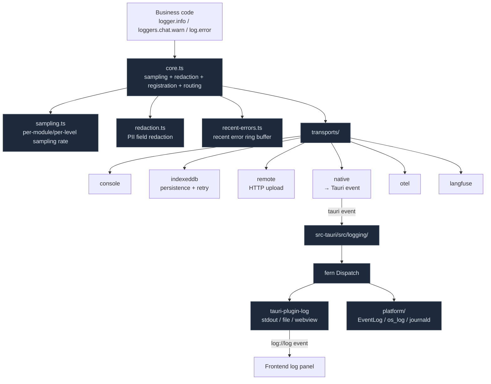

# Observability

Cognia abstracts "where logs go and which entry you can find" into a single unified pipeline: on the browser side, `lib/logging/` is the single entry point, with several transports (console / IndexedDB / remote / native / OTel / Langfuse) mounted on demand at runtime; on the Rust side, `src-tauri/src/logging/` takes over fern dispatch + tauri-plugin-log, mirroring records into the OS platform logger. This page explains who owns which layer and how a single `logger.info(...)` call travels all the way to the Windows Event Viewer.

<TLDR>
  Browser side: `createLogger("module")` returns a `Logger`; calling `logger.info / warn / error / fatal` enters the unified pipeline in `core.ts`, which performs module registration, sampling, PII redaction, source location capture, then fans out to registered transports. Transports include console, IndexedDB (persistent in browser), remote (with retry queue), native (Tauri event bridge), OTel (OpenTelemetry), and Langfuse. The Rust side uses `fern` + `tauri-plugin-log` to dispatch the same record to stdout / file / webview (back to frontend) / platform logger. The settings UI toggles transports and sampling rates in real time; the log panel `components/logging/log-panel.tsx` aggregates multi-source records and supports filtering, grouping, and export.
</TLDR>

## Overview



## Browser-Side Entry Point

`lib/logging/index.ts` exposes three consumption patterns:

```ts title="lib/logging/index.ts"
// 1) Default app logger
import { logger } from "@/lib/logging"
logger.info("ready")

// 2) Modular loggers (25 common modules pre-created)
import { loggers } from "@/lib/logging"
loggers.chat.warn("retry", { attempt: 2 })
loggers.tts.error("synthesis failed", err)

// 3) Custom module
import { createLogger } from "@/lib/logging"
const log = createLogger("my-feature")
```

The `loggers` pre-created modules: `app · ai · chat · agent · mcp · plugin · native · ui · store · network · auth · error · media · scheduler · search · document · export · skills · sync · screenshot · tts · shell · canvas · a2ui`. All modules share the same transport configuration — `createLogger` only tags entries with a `module` label and does not affect routing.

`log` is a shorthand for script-style calls (`log.info / log.debug / ...`), internally delegating to the default logger.

## Log Entry Structure

`StructuredLogEntry` is the unified object, traced and then passed through the transport chain:

```ts title="lib/logging/types.ts"
export interface StructuredLogEntry {
  id: string // unique id
  timestamp: string // ISO
  level: LogLevel // trace | debug | info | warn | error | fatal
  message: string
  module: string // tag bound at createLogger time
  traceId?: string // cross-request correlation
  requestId?: string // single-operation correlation
  origin: LogOrigin // frontend | tauri | mcp | plugin | ...
  runtime: LogRuntime // browser | tauri | server | mcp | plugin
  source?: { file; line; function } // dev only
  data?: Record<string, unknown>
  error?: { name; message; stack }
  // additional fields omitted
}
```

`LEVEL_PRIORITY` maps levels to numbers 0..5; `minLevel` filtering relies on it.

## Context / Trace ID

`lib/logging/context.ts` maintains an implicit context:

```ts title="lib/logging/context.ts"
logContext.newTraceId()
logContext.set({ userId: "u_123" })
logger.info("processing") // automatically carries traceId + userId

await traced(async () => {
  // resets trace within the closure
  // ...
})
```

`generateTraceId()` uses base36 short ids, sufficient for development to see "which log entries belong to the same send".

`lib/logging/runtime.ts` infers the current runtime (`browser / server / tauri / mcp / plugin / internal / unknown`) and automatically injects it into every entry, enabling origin-based coloring in the panel.

## Sampling

`sampling.ts` prevents "high-frequency, low-value" logs from drowning out signal:

- Global `samplingRate(level)` assigns a 0..1 probability to each level.
- `configureSampling({ trace: 0.01, debug: 0.1, info: 1, warn: 1, error: 1, fatal: 1 })` — default is trace 1%, debug 10%, everything else 100%.
- Only hits proceed to transports; misses are dropped immediately.

`logSampler` is a singleton and mutable at runtime — the "log sampling rate" slider in the settings UI directly adjusts it.

## Redaction

`redaction.ts` scans `data` / `error.message` before writing:

- Field name matches (`password / token / apiKey / authorization / cookie / sessionId / secret / ...`) → value replaced with `[REDACTED]`.
- Regex matches (email, phone, JWT) → replaced with placeholder.
- `LoggerRedactionConfig` allows per-item opt-out, convenient for debugging in isolated environments.

Redaction happens before transport, meaning even if IndexedDB / remote backups leak accidentally, sensitive fields are not present.

## Recent Error Buffer

`recent-errors.ts` holds the most recent N `error / fatal` entries in memory (default 50) and dispatches them to listeners via `subscribeRecentErrorLogs(cb)`. The status-bar red dot + toast alert rely on it.

`clearRecentErrorLogs()` clears the buffer when the user clicks "Acknowledged".

## Transports

Each transport is an implementation of the `Transport` interface:

```ts
interface Transport {
  name: string
  enabled: boolean
  minLevel?: LogLevel
  write(entry: StructuredLogEntry): Promise<void> | void
  flush?(): Promise<void>
  health?(): TransportHealthSnapshot
}
```

### ConsoleTransport

`transports/console-transport.ts` — directly calls `console.debug / log / warn / error`. Colorful prefix; dev builds include source location links.

### IndexedDBTransport

`transports/indexeddb-transport.ts` — writes each entry to IndexedDB (a `logs` table separate from the main Dexie database). Enforces capacity limit + LRU eviction. This is the default query source for the log panel — even after the app is closed and reopened, recent logs remain visible.

### RemoteTransport

`transports/remote-transport.ts` — HTTP POST upload to an external logging endpoint. Features:

- **Retry queue** (`remote-retry-queue-store.ts`) — persists to IndexedDB during network hiccups, then bulk-resends after recovery.
- **Transform functions** — `sentryTransform` / `logglyTransform` convert the unified entry into each service's field names.
- **Health status** — consecutive failures → `degraded` → `unhealthy`; UI shows a red dot.

### NativeTransport

`transports/native-transport.ts` — does not write locally; instead sends a Tauri event `log://log` to Rust. The Rust side takes over via fern and redispatches. This is a one-way browser → desktop channel.

### OTelTransport

`transports/otel-transport.ts` — converts `error`-level entries into OpenTelemetry log records and sends them to the configured OTLP collector. `lib/observability/` also provides metrics / traces; see [OpenTelemetry Thin Wrapper](#opentelemetry-thin-wrapper) below.

### LangfuseTransport

`transports/langfuse-transport.ts` — an observability layer purpose-built for LLM calls; maps traceId-correlated `ai / chat / agent` module logs into Langfuse trace + observation. `lib/logging/loggers.ai` is typically paired with Langfuse.

## Rust-Side Dispatch

`src-tauri/src/logging/` is responsible for routing all "native" logs (from Rust itself + from webview `NativeTransport` events) to their proper destinations:

```rust title="src-tauri/src/logging/mod.rs"
pub fn bootstrap(app: &App) -> Result<(), Box<dyn std::error::Error>> {
    let plan = native_bootstrap::plan_native_logging_bootstrap(true);
    let mut builder = LogBuilder::default().level(log::LevelFilter::Info);
    for target in plan.targets() {
        builder = builder.target(target);
    }
    builder = builder.target(platform::dispatch_target());
    app.handle().plugin(builder.build())?;
    native_bootstrap::apply_native_logging_bootstrap(&plan);
    Ok(())
}
```

### Bootstrap Modes

`native_bootstrap.rs` decides among three modes at startup:

| Mode       | When active                         | Active targets                            |
| ---------- | ----------------------------------- | ----------------------------------------- |
| `Full`     | Default                             | `stdout + folder + webview` (all three)   |
| `Fallback` | `folder` unavailable (permissions / disk) | `stdout + webview`                        |
| `Disabled` | `should_register == false`          | None                                      |

`NativeLoggingReadiness` is exposed to the frontend (via `logging::commands` Tauri commands), so the log panel can show diagnostics like "persistence failed, downgraded to in-memory".

### Platform Bridge

`platform/{windows,macos,linux,noop}.rs` implements the `PlatformLogger` trait:

- **Windows** — `Windows Event Log` (Application channel; source `Cognia`).
- **macOS** — `os_log` (subsystem `com.cognia.app`).
- **Linux** — prefers `systemd-journald`, falls back to `syslog`.
- **noop** — placeholder for Android / iOS (cognia-next is desktop-only).

`dispatch_target()` returns a fern `Output` that turns each record into a platform call. `min_level` defaults to `warn` — keeping OS logs uncluttered.

### Webview Round-Trip

The `webview` target of `tauri-plugin-log` sends Rust-side records (including subprocess sidecar / shell captured output) back to the frontend via the `log://log` event. The frontend's `useLogStream` hook (`hooks/logging/`) subscribes to this event, letting the log panel display Rust-side content.

## OpenTelemetry Thin Wrapper

`lib/observability/` is a minimal wrapper over `@opentelemetry/api` in cognia-next:

- `chart-config.ts` — color / margin constants for Recharts charts (not OTel itself, but in the same monitoring UI domain).
- `format-utils.ts` — formatting utilities for the panel: `formatTimestamp / formatBytesCompact / formatRate / formatTokens`.

Full metrics / traces are submitted via `lib/logging/transports/otel-transport.ts`. AI provider calls, Twin pipeline stages, and scheduler executions all emit spans, visible in the dev console. This layer is currently placeholder-shaped, ready to expand once a full OTLP backend is connected.

## Log Panel UI

`components/logging/log-panel.tsx` is the unified viewer, aggregating multi-source data from `useLogStream / useLogModules / useAgentTraceAsLogs / useTransportHealth`:

| Subcomponent         | Responsibility                                              |
| -------------------- | ----------------------------------------------------------- |
| `LogPanelToolbar`    | View mode / search / filters / export actions               |
| `LogPanelStatsBar`   | Per-level counts, transport health, native log diagnostics  |
| `VirtualizedLogList` | Large-list virtualization (react-window)                    |
| `LogDetailPanel`     | Single entry detail (stack, source, data foldable)          |
| `LogStatsDashboard`  | Aggregation charts by module / level (uses `chart-config.ts`) |
| `LogTimeline`        | Density timeline, minute-level buckets                      |
| `LogFilterPresets`   | Preset filters: "Recent errors" / "Scheduler" / "Agent trace" |
| `LogSettings`        | Real-time toggles for transport / sampling / retention policy |

`AGENT_TRACE_MODULE` is the virtual module name exposed by `lib/agent-trace/log-adapter` — agent team step events are mapped into log entries for side-by-side comparison with system logs.

Time range presets: `15m / 1h / 6h / 24h / 7d`, defined by the `TIME_RANGES` constant.

## Bootstrap and Configuration

`bootstrap.ts` is called during `LoggerProvider` startup (inside `app/layout.tsx`):

```ts title="lib/logging/bootstrap.ts"
export function bootstrapLogger(settings: AppSettings) {
  // 1. applyLoggingSettings → sync minLevel / sampling / enabled transports
  // 2. Register transports: console always on, indexeddb on by default, others per settings
  // 3. On settings change, incrementally update via listRegisteredTransports + addTransport/removeTransport
}
```

Storage keys:

- `LOGGING_TRANSPORTS_STORAGE_KEY` — enable / minLevel / config JSON per transport.
- `LOGGING_RETENTION_STORAGE_KEY` — IndexedDB capacity limit, auto-cleanup interval.
- `LOGGING_SAMPLING_STORAGE_KEY` — per-level sampling rates.

`getLoggingBootstrapState()` exposes the current snapshot to the settings UI.

## Health Monitoring

Each transport can expose a `TransportHealthSnapshot`:

```ts
{
  status: "healthy" | "degraded" | "unhealthy" | "disabled",
  lastSuccessAt?: string,
  lastFailureAt?: string,
  consecutiveFailures: number,
  message?: string,
}
```

`getTransportHealthSnapshot()` pulls the status of all transports at once. `emitLoggerDiagnostic()` writes back to the `logger.internal` module when a transport encounters an internal error (with cooldown to avoid avalanches) — this is the only permitted recursive path.

## Related Documentation

<Cards>
  <Card title="Development" href="./development" description="Local debugging + reading logs in browser/Tauri console" />
  <Card title="Plugin System" href="./plugin-system" description="Which origin plugin logs go through" />
  <Card title="Storage" href="./storage" description="Where the log table lives in IndexedDB" />
  <Card title="Runtime & Tauri" href="./runtime-and-tauri" description="log://log event + command interface" />
</Cards>

## Where to Start

| Goal                        | File                                                                                                                            |
| --------------------------- | ------------------------------------------------------------------------------------------------------------------------------- |
| Add a new transport         | Implement `Transport` in `lib/logging/transports/<name>-transport.ts` → export in `transports/index.ts` → add registration path in `bootstrap.ts` |
| Adjust default sampling rate| `lib/logging/sampling.ts:DEFAULT_SAMPLING_CONFIG`                                                                                |
| Add new redaction fields    | Field name list + regex list in `lib/logging/redaction.ts`                                                                       |
| Modify Rust → platform log bridge | `src-tauri/src/logging/platform/<os>.rs`                                                                                  |
| New log panel filter dimension | `lib/logging/filter-presets.ts` + `hooks/logging/use-log-panel-filters.ts`                                       |
| OTLP collector configuration| `lib/logging/transports/otel-transport.ts` + startup env                                                                         |
