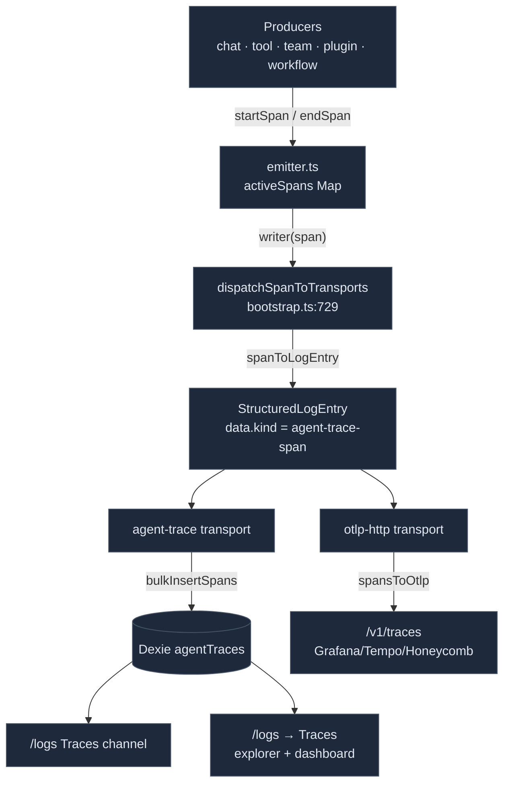

# Agent-Trace Spans

<Status variant="stable" />

<TLDR>
  Agent-trace is a pure-TS span pipeline. `lib/agent-trace/emitter.ts` buffers in-progress spans in a
  `Map<spanId, AgentTraceSpan>`; `startSpan` → `recordEvent` → `endSpan` hands the finished span to a
  registered writer. `lib/logging/bootstrap.ts` wires that writer to `dispatchSpanToTransports`, which
  converts the span to a `StructuredLogEntry` (`spanToLogEntry`) and fans it to the transports — the
  **agent-trace** transport persists it to the Dexie `agentTraces` table, and the **otlp-http**
  transport exports it to `/v1/traces`. Spans are OTel-GenAI shaped (`gen_ai.*` semconv). Producers:
  every chat turn (`invoke_agent`), each tool call (`execute_tool` child), team hand-offs, plugin
  hooks, and workflow LLM nodes. Consumers: the [log panel](./log-panel)'s Traces channel and the
  [tracing dashboard](./tracing-dashboard).
</TLDR>

<StatGrid>
  <Stat label="Operations" value="5" hint="invoke_agent · execute_tool · chat · invoke_workflow · retrieval" />
  <Stat label="Providers" value="6" hint="anthropic · openai · cognia.plugin/team/connector/workflow" />
  <Stat label="Surfaces" value="5" hint="chat · agent-team · plugin-hook · connector · workflow" />
  <Stat label="Producers" value="6" hint="chat turn · tool calls · team · external agent · plugin hook · workflow node" />
  <Stat label="Dexie table" value="agentTraces" hint="v55; indexed by trace/session/parent/surface" />
  <Stat label="Export format" value="OTLP/HTTP JSON" hint="dependency-free, gen_ai semconv" />
</StatGrid>

## The Span Model

`AgentTraceSpan` (`types/agent-trace/span.ts:65`) is the persisted row — short JS-friendly field names,
with the OTel mapping deferred to the OTLP converter:

```ts title="types/agent-trace/span.ts:65"
export interface AgentTraceSpan {
  id: string                 // primary key — same as spanId
  traceId: string            // 32-hex (16 bytes)
  spanId: string             // 16-hex (8 bytes)
  parentSpanId?: string
  startTime: number; endTime?: number; durationMs?: number
  operationName: SpanOperationName   // invoke_agent | execute_tool | chat | invoke_workflow | retrieval
  providerName: SpanProviderName     // anthropic | openai | cognia.plugin/team/connector/workflow
  requestModel?: string; responseModel?: string
  agentId?: string; agentName?: string; toolName?: string
  usage?: SpanUsage          // { inputTokens, outputTokens, cacheCreationTokens, cacheReadTokens }
  costUsdEstimate?: number; finishReasons?: string[]
  errorType?: string; errorMessage?: string
  sessionId: string; surface: SpanSurface; pluginId?: string
  handoff?: SpanHandoff      // { fromAgent, toAgent, reason? }
  events?: SpanEvent[]       // { name, at, attributes? }
  inputPreview?: string; outputPreview?: string   // opt-in, PII-gated
  metadata?: Record<string, unknown>
}
```

`AGENT_TRACE_SPAN_KIND = "agent-trace-span"` (`span.ts:120`) is the discriminator embedded in
`StructuredLogEntry.data` so transports can recognise span-shaped entries. The Dexie `agentTraces`
table (v55) is indexed by `id`(pk), `sessionId`, `[sessionId+startTime]`, `traceId`,
`[traceId+startTime]`, `parentSpanId`, and `surface`.

## The Emitter

```ts title="lib/agent-trace/emitter.ts (the lifecycle)"
const h = startSpan({ operationName: "invoke_agent", providerName: "anthropic",
  surface: "chat", traceId, sessionId })          // → SpanHandle { spanId, traceId }
recordEvent(h.spanId, { name: "tool_call", at: Date.now() })
endSpan(h.spanId, { usage, costUsdEstimate, outputPreview })
```

`endSpan` (`emitter.ts:165`) is idempotent and never throws into the caller — a writer error is
swallowed:

```ts title="lib/agent-trace/emitter.ts:165"
export function endSpan(spanId: string, input: EndSpanInput = {}): AgentTraceSpan | null {
  const span = activeSpans.get(spanId)
  if (!span) return null
  activeSpans.delete(spanId)
  span.endTime = input.endTime ?? Date.now()
  span.durationMs = Math.max(0, span.endTime - span.startTime)
  // …apply usage / cost / previews / error…
  if (writer) { try { writer(span) } catch { /* never throw into emitter */ } }
  return span
```

`emitFinishedSpan(partial)` (`emitter.ts:206`) is the one-shot form for self-measured work (plugin
hooks use it). `generateTraceId()` (16 bytes) / `generateSpanId()` (8 bytes) produce the hex ids.
`setAgentTraceWriter(fn)` registers the sink — wired in `lib/logging/bootstrap.ts:660` to
`dispatchSpanToTransports`.

## The Pipeline



## Producers

Spans are seeded at curated boundaries (the same philosophy as the perf hotspot registry):

| Producer | Span | Call site |
| --- | --- | --- |
| **Chat turn** | `invoke_agent` / `anthropic` / `chat`; traceId+spanId echoed into `SendOptions` | `hooks/chat/use-claude-chat.ts:855` (start), `:1534` (success), `:1257` (`turn_error`) |
| **Chat tool calls** | `execute_tool` children parented under the turn | `chat-tool-spans.ts:138` via `handleSdkEventForToolSpans` (`use-claude-chat.ts:1400`) |
| **Agent Team dispatch** | `invoke_agent` / `cognia.team` / `agent-team` | `lib/ai/agent/team/dispatch-teammate.ts:246` (start), `:290` (success w/ usage) |
| **External agent bridge** | `invoke_agent`, provider via protocol, with `handoff` | `lib/ai/agent/external/agent-trace-bridge.ts:74` |
| **Plugin hooks** | `execute_tool` / `cognia.plugin` / `plugin-hook`, self-measured | `lib/plugin/messaging/hooks-system.ts:125` (`emitFinishedSpan`) |
| **Workflow LLM node** | `chat` / `cognia.workflow` / `workflow` | `lib/workflow/nodes/built-ins.ts:308` (`ai.classify`/`ai.extract` delegate through this) |

`chat-tool-spans.ts` bridges Claude SDK `tool_use`/`tool_result` blocks into child spans, keyed
`sessionId → tool_use_id → spanId`; `mcp__`-prefixed tool names map to provider `cognia.plugin`,
others to `anthropic`.

## Converters

**span → log entry** (`span-to-log-entry.ts:51`) — the log panel never sees a raw span; the full span
is tucked into `data.span`:

```ts title="lib/agent-trace/span-to-log-entry.ts:51"
export function spanToLogEntry(span: AgentTraceSpan): StructuredLogEntry {
  const isError = Boolean(span.errorType || span.errorMessage)
  return {
    id: span.id,
    timestamp: new Date(span.startTime).toISOString(),
    level: isError ? "error" : "info",
    message: formatSpanMessage(span),
    module: AGENT_TRACE_MODULE,       // "agent.trace"
    traceId: span.traceId, sessionId: span.sessionId,
    data: { kind: AGENT_TRACE_SPAN_KIND, span },
    tags: buildSpanTags(span),        // surface:… op:… provider:… tool:… error:…
  }
```

`AGENT_TRACE_MODULE = "agent.trace"` is the log panel's "agent trace only" filter module.
`extractSpanFromLogEntry` reverses it.

**span → OTLP** (`span-to-otlp.ts:95`) — serializes to dependency-free OTLP/HTTP JSON `ResourceSpans`
following the OTel GenAI semantic conventions plus `cognia.*` vendor attributes:
`gen_ai.operation.name`, `gen_ai.provider.name`, `gen_ai.conversation.id` (= sessionId),
`gen_ai.request.model`, `gen_ai.usage.input_tokens` / `output_tokens` / `cache_read.input_tokens`,
`cognia.cost.usd_estimate`, `error.type`, `cognia.surface`, `cognia.handoff.*`. Trace/span ids are
`hexToBase64`-encoded (16/8 bytes); times are `msToNanoString`. Scope is
`{ name: "cognia.agent-trace", version: "1.0.0" }`.

## Cost — A Stub, Not a Pricing Table

`cost-estimator.ts` is deliberately a **stub** — there is no token→price table in cognia-next. Cost
comes from whatever the producer reports as `costUsdEstimate` (the SDK reports a combined cost;
team/workflow spans pass it through). The file only **formats** a USD figure:

```ts title="lib/agent-trace/cost-estimator.ts:9"
export function formatCost(usd: number | null | undefined): string {
  if (typeof usd !== "number" || !Number.isFinite(usd)) return "—"
  if (usd === 0) return "$0"
  if (usd < 0.01) return `$${usd.toFixed(4)}`
  return `$${usd.toFixed(2)}`
}
```

## Consumers & Persistence

`lib/db/agent-traces.ts` is the only DB module touching the `agentTraces` table:

- **Writers** (called by the transport): `insertSpan`, `bulkInsertSpans`.
- **Readers**: `queryRecent` (log-panel merge), `queryByWindow` (dashboard), `queryByTrace` (trace
  timeline / waterfall), `queryBySession`.
- **Aggregators**: `aggregateStatsAll` → `AgentTraceStatsSummary` (token/cache/cost breakdowns,
  `cacheHitRate = cacheRead/(input+cacheRead)`, `byModel`, `bySurface`); `aggregateBySession` →
  per-session analytics.
- **Lifecycle**: `pruneOlderThan`, `deleteSpansForSession`.

The eval subsystem also reads spans (`lib/ai/eval/targets/{chat,team,workflow}.ts` assemble samples
via `queryByTrace`).

## Where to Start

| Goal | File |
| --- | --- |
| Instrument a new boundary | call `startSpan`/`endSpan` (or `emitFinishedSpan`) from `lib/agent-trace/emitter` |
| Add a span field | `types/agent-trace/span.ts` + map it in `span-to-otlp.ts` + surface in the dashboard |
| Add an OTLP attribute | `buildSpanAttributes` in `lib/agent-trace/span-to-otlp.ts:182` |
| Persist/aggregate differently | `lib/db/agent-traces.ts` |
