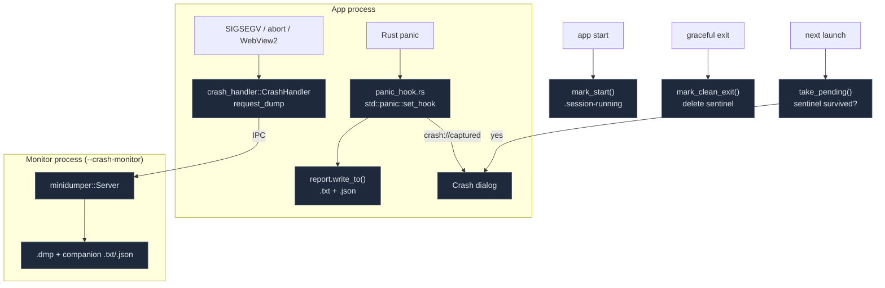

# Crash Reporting

<Status variant="stable" />

<TLDR>
  `src-tauri/src/crash/` captures two failure classes. **Rust panics** are caught in-process by a
  `std::panic::set_hook` (`panic_hook.rs`) that writes a Minecraft-style `.txt` plus a structured
  `.json`. **Native hard-crashes** (SIGSEGV, stack overflow, abort, WebView2) are caught
  out-of-process: a sibling monitor process owns a `minidumper::Server`, and the app installs a
  `crash_handler::CrashHandler` that requests a `.dmp` on fault. Whether the *next launch* shows a
  crash dialog is decided **not** by the presence of a report but by a clean-exit **sentinel**
  (`.session-running`) — written on start, deleted on graceful shutdown — so recoverable worker panics
  never raise a false alarm. Reports live in `<data_local_dir>/Cognia/crash-reports/`. Seven
  `crash_*` commands cover context ingestion, listing/reading/deleting, and consuming the
  pending-crash signal.
</TLDR>

<StatGrid>
  <Stat label="Capture paths" value="2" hint="in-process panic · out-of-process minidump" />
  <Stat label="Report files" value=".txt + .json (+ .dmp)" hint="panic: txt+json; native: dmp+companion" />
  <Stat label="Sentinel" value=".session-running" hint="clean-exit marker — the SoT for 'did we crash?'" />
  <Stat label="Breadcrumb ring" value="50" hint="MAX_BREADCRUMBS (context.rs:15)" />
  <Stat label="Tauri commands" value="7" hint="crash_set_context/push_breadcrumb/list/read/open/delete/take_pending" />
  <Stat label="Storage" value="Cognia/crash-reports/" hint="sibling to Cognia/logs/" />
</StatGrid>

## The Two Capture Paths



## The Panic Hook

`panic_hook.rs` installs a global hook (idempotent, chains the previous hook) that captures payload,
location, thread name, and a forced backtrace, then writes a report and emits `crash://captured`:

```rust title="src-tauri/src/crash/panic_hook.rs:20"
pub fn install() {
    if INSTALLED.swap(true, Ordering::SeqCst) { return; }
    let previous = std::panic::take_hook();
    std::panic::set_hook(Box::new(move |info| {
        let _ = std::panic::catch_unwind(std::panic::AssertUnwindSafe(|| write_report(info)));
        previous(info);
    }));
}
```

`write_report` gathers `message`/`location`/`thread`/`backtrace` plus `system_info::gather()`,
`context::snapshot()`, and `app_extra()`, builds a `CrashReport { kind: Panic, … }`, and writes both
files. Recoverable panics (e.g. the automation worker's `catch_unwind`) still write a report here but
do **not** raise the dialog — that's the sentinel's job.

## The Minidump Monitor

`monitor.rs` runs a sibling process. `maybe_run_monitor()` (called first in `main.rs`) scans argv for
`--crash-monitor <socket>`; if present it runs the `minidumper::Server` loop and returns so `main`
exits without booting the app. Otherwise `install_client()` spawns the monitor child, connects, and
attaches the native handler:

```rust title="src-tauri/src/crash/monitor.rs:128"
let attach = crash_handler::CrashHandler::attach(unsafe {
    crash_handler::make_crash_event(move |cc: &crash_handler::CrashContext| {
        let _ = client_for_crash.ping();
        crash_handler::CrashEventResult::Handled(client_for_crash.request_dump(cc).is_ok())
    })
});
```

On a fault the monitor writes `<stem>.dmp` (`create_minidump_file`) and a companion `.txt`/`.json`
(`write_companion`) built from the last `KIND_META` context forwarded from the app, then exits.

## The Sentinel — Source of Truth

`sentinel.rs` is what actually decides "did we crash?". A marker file is written on start and deleted
on graceful shutdown; surviving into the next launch means an abnormal exit:

```rust title="src-tauri/src/crash/sentinel.rs:64"
pub fn take_pending() -> Option<PendingCrash> {
    let path = sentinel_path()?;
    let raw = fs::read_to_string(&path).ok()?;
    let _ = fs::remove_file(&path);            // consume the stale marker
    let marker: SessionMarker = serde_json::from_str(&raw).ok()?;
    let (latest_report_stem, report_count) = scan_reports();
    Some(PendingCrash { started_at: marker.started_at, version: marker.version,
        latest_report_stem, report_count })
}
```

`take_pending()` must run **before** `mark_start()`. `scan_reports()` finds the newest report stem and
total count over `txt|json|dmp` files.

## Lifecycle

<Steps>
<Step>**Monitor early-exit** — `main.rs:7` `maybe_run_monitor()`: if relaunched as `--crash-monitor`, run the server loop and return.</Step>
<Step>**Install native handler** — `main.rs:14` `install_client()`: spawn monitor child, attach `CrashHandler`.</Step>
<Step>**Install panic hook** — `main.rs:15` `install_panic_hook()`.</Step>
<Step>**Detect stale sentinel** — `lib.rs:850` `take_pending()` (reads + consumes `.session-running`). Runs before the next step.</Step>
<Step>**Write this session's sentinel** — `lib.rs:851` `mark_start()`; stash the pending result for the dialog (`PendingCrashState`).</Step>
<Step>**Runtime context push** — the renderer calls `crash_set_context` / `crash_push_breadcrumb` (redacted) which also forwards meta to the monitor.</Step>
<Step>**On crash** — panic → `write_report` (+ `crash://captured`); native → monitor writes `.dmp` + companion.</Step>
<Step>**Graceful shutdown** — `lib.rs:1091` `mark_clean_exit()` deletes the sentinel.</Step>
<Step>**Next launch** — `CrashReportDialog` mounts, calls `takePendingCrash()` (fires once); settings can browse all reports.</Step>
</Steps>

## The CrashReport Model

```rust title="src-tauri/src/crash/report.rs:64"
#[serde(rename_all = "camelCase")]
pub struct CrashReport {
    pub kind: CrashKind,        // Panic | Native
    pub captured_at: String,
    pub thread: Option<String>,
    pub message: String,
    pub location: Option<String>,
    pub backtrace: Option<String>,   // skip if None
    pub dump_path: Option<String>,   // native only
    pub system: SystemDetails,
    pub context: ContextSnapshot,
    pub extra: serde_json::Value,    // { nativeLogging, crashReportsDir, logDir }
}
```

`render_txt` lays out a banner, the failure details, the backtrace, **System Details**, **Application
State**, a **redacted Configuration** block, and **Breadcrumbs**. The stem format is
`crash-%Y-%m-%d_%H-%M-%S-{panic|native}`. `write_to` writes `<stem>.txt` + `<stem>.json` under
`crash_reports_dir()` (`<data_local_dir>/Cognia/crash-reports/`).

### Host Snapshot (Shared with Perf)

`system_info.rs::gather()` builds `SystemDetails` (OS/version/kernel/arch/CPU/memory/app+Tauri
version/build profile/enabled OCR features) self-gathered by Rust so it survives a dead webview. It is
**reused by the perf dashboard** (`perf_system_details` → `crash::system_info::gather()`).

### Breadcrumb Context

`context.rs` keeps a 50-entry breadcrumb ring plus a redacted config snapshot, pushed from the renderer
and forwarded to the monitor so a native crash report still carries app context:

```rust title="src-tauri/src/crash/context.rs:77"
pub fn publish_to_monitor() {
    let meta = crate::crash::report::MonitorMeta { context: snapshot(), extra: app_extra() };
    if let Ok(bytes) = serde_json::to_vec(&meta) {
        crate::crash::monitor::send_meta(&bytes);
    }
}
```

The renderer side (`lib/native/crash-context.ts`) **redacts before crossing the boundary** —
`pushCrashContext` deep-redacts every string via `redactText` from `lib/twin/ingest/redact.ts`, the
same PII gate the rest of the app uses.

## Commands & UI

Seven `crash_*` commands (`crash/commands.rs`, registered at `lib.rs:469`): `crash_set_context`,
`crash_push_breadcrumb`, `crash_list_reports`, `crash_read_report`, `crash_open_report_dir`,
`crash_delete_report`, `crash_take_pending` (`validate_stem` guards against path traversal). The UI:

- `components/desktop/crash-report-dialog.tsx` — the **next-launch dialog**, mounted in
  `app/layout.tsx`; calls `takePendingCrash()` once, offers open-folder / view-report.
- `components/settings/sections/native-crash-reports-card.tsx` — a read-only **report browser** in
  Settings → Diagnostics (kind badge, captured-at, ext flags, view/delete/open-folder).

> Note: `lib/logging/crash-log.ts` + `hooks/logging/use-crash-logs.ts` are a **separate**,
> renderer-side crash-*log* bundle (recent errors + persisted IndexedDB logs + native-logging
> diagnostics → exportable, re-sanitized export). They don't call the `crash_*` native commands; the
> native crash-report bridge is `lib/native/crash-reports.ts` + `crash-context.ts`.

## Where to Start

| Goal | File |
| --- | --- |
| Add a breadcrumb from the renderer | `pushCrashBreadcrumb(message)` (`lib/native/crash-context.ts`) |
| Change the report layout | `render_txt` in `src-tauri/src/crash/report.rs` |
| Add to the host snapshot | `system_info::gather()` (also feeds perf) |
| Adjust the crash dialog | `components/desktop/crash-report-dialog.tsx` |
