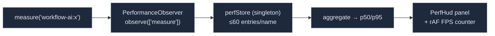

# Frontend Perf Timing

<Status variant="internal" />

<TLDR>
  `lib/perf` is a small **dev/opt-in** instrumentation layer for the browser — completely separate from
  the Rust [performance dashboard](./perf-dashboard). `perf-marker.ts` wraps the standard W3C
  `performance.mark`/`measure` API (namespaced `workflow-ai:`) so timings show up in Chrome DevTools
  and can be aggregated. `perf-hud.tsx` is a floating HUD that subscribes to those measures via a
  `PerformanceObserver`, aggregates p50/p95 per name, and adds a rAF FPS counter — gated behind
  `localStorage.cogniaPerfHud="1"` (auto-mounts in dev). `profiler-boundary.tsx` wraps children in a
  `React.Profiler` (non-prod only) and emits one `performance.measure` per commit, surfacing as
  `react:<id>` rows in the HUD.
</TLDR>

<StatGrid>
  <Stat label="Namespace" value="workflow-ai:" hint="PERF_NAMESPACE (perf-marker.ts:14)" />
  <Stat label="HUD enable flag" value="cogniaPerfHud=1" hint="localStorage; auto in dev" />
  <Stat label="HUD ring/name" value="60" hint="MAX_ENTRIES_PER_NAME (perf-hud.tsx:27)" />
  <Stat label="Prod behaviour" value="inert" hint="profiler returns children; HUD needs the flag" />
</StatGrid>

## W3C Marker API

`perf-marker.ts` emits standard User-Timing entries, feature-detected and SSR-safe (every call is
wrapped in try/catch):

```ts title="lib/perf/perf-marker.ts"
import { mark, measure, measureRange } from "@/lib/perf"

mark("ai:send:start")
// …work…
mark("ai:send:end")
const ms = measure("ai:send", "ai:send:start", "ai:send:end")   // → number | undefined
```

All names are prefixed `workflow-ai:` (`PERF_NAMESPACE`). `measureRange(name, startTime, endTime)` is
the options-object form used by the profiler boundary. `clearMeasuresByName(name)` drains the
User-Timing buffer so it can't grow unbounded. These are real `performance.*` entries — visible in the
Chrome DevTools Performance panel — distinct from the plugin profiler's `performance.now()` map.

## The On-Screen HUD

`perf-hud.tsx` is a floating panel that aggregates the `workflow-ai:*` measures live:



A module-singleton `perfStore` keeps up to `MAX_ENTRIES_PER_NAME = 60` samples per measure name and
drains the User-Timing buffer on each observer callback. `isHudEnabledForRuntime()` excludes Capacitor
mobile, auto-mounts in dev, and requires `localStorage.cogniaPerfHud="1"` in production. `PerfHud()`
uses `useSyncExternalStore` to subscribe to the enable flag and returns `null` when disabled;
`PerfHudInner` renders the p50/p95 table plus a rAF-driven FPS counter and clear/close buttons.

## The Profiler Boundary

`profiler-boundary.tsx` wraps a subtree in `React.Profiler` (only outside production) and writes one
measure per commit:

```tsx title="lib/perf/profiler-boundary.tsx:24"
// onRender → measureRange(`react:${id}`, startTime, startTime + actualDuration)
<PerfBoundary id="chat-list">
  <ExpensiveTree />
</PerfBoundary>
```

In production it returns children directly (zero overhead). Each commit surfaces as a `react:<id>` row
in the HUD, so you can watch a component's commit cost next to your own `workflow-ai:` measures.

`lib/perf/index.ts` re-exports the public surface: `PERF_NAMESPACE`, `mark`, `measure`, `measureRange`,
`clearPerfEntries`, `PerfBoundary`, `PerfHud`. The HUD uses hard-coded English strings — it's a
developer affordance, not i18n-wired.

## Where to Start

| Goal | File |
| --- | --- |
| Time a code path | `mark`/`measure` from `@/lib/perf` (shows in DevTools + HUD) |
| Watch a component's commit cost | wrap it in `<PerfBoundary id="…">` |
| Turn on the HUD in prod | `localStorage.cogniaPerfHud = "1"` |
