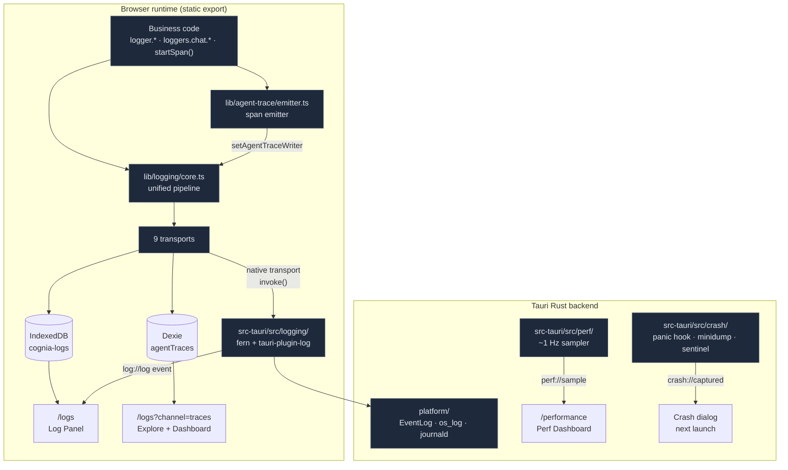

# Observability

<Status variant="stable" />

<TLDR>
  Cognia's observability is **five cooperating planes**, not one log box. (1) **Logging** —
  `createLogger("module")` enters a single browser pipeline (`lib/logging/core.ts:404`: level-gate →
  sample → context-merge → redact → fan-out) that writes to up to 9 transports; the Rust side
  (`src-tauri/src/logging/`) takes the same records through `fern` + `tauri-plugin-log` into the OS
  logger (Windows Event Log / macOS `os_log` / Linux journald). (2) **Agent-trace** —
  `lib/agent-trace/emitter.ts` emits OTel-GenAI-shaped spans for every chat turn, tool call, team
  hand-off, plugin hook, and workflow LLM node; they persist to the Dexie `agentTraces` table and can
  export over OTLP/HTTP. (3) **Tracing dashboard** — the Dashboard sub-view of `/logs` → Traces is a
  Grafana/Langfuse-style draggable panel grid (`lib/observability/` is a real
  percentile/bucketing/rollup engine) reading those spans, over the same window and the same filters
  as the trace list beside it. (4) **Performance** — `app/performance` (ADR-0035) is a Task-Manager-style live view of
  the Rust process tree, Tokio runtime, and span hotspots, sampled at ~1 Hz over `perf://sample`. (5)
  **Crash reporting** — `src-tauri/src/crash/` captures Rust panics in-process and native hard-crashes
  out-of-process (minidump), gated by a clean-exit **sentinel**. Token/cost usage
  (`lib/claude/usage.ts`, Anthropic quota probes, inbox telemetry) rounds out the picture.
</TLDR>

<StatGrid>
  <Stat label="Routes" value="2" hint="/logs (logs · traces · incidents) · /performance (+ crash dialog)" />
  <Stat label="Log transports" value="9" hint="console · indexeddb · remote · native · otel · otlp-http · langfuse · agent-trace · retry-queue" />
  <Stat label="Health states" value="3" hint="healthy · degraded · offline (NOT 'unhealthy')" />
  <Stat label="Native log backends" value="4" hint="Windows EventLog · macOS os_log · Linux journald/syslog · noop" />
  <Stat label="Dashboard panels" value="13" hint="5 kinds: stat · timeseries · donut · bar · traces" />
  <Stat label="Perf event rate" value="~1 Hz" hint="perf://sample, ref-counted while panel open" />
  <Stat label="Crash capture paths" value="2" hint="in-process panic hook · out-of-process minidump" />
  <Stat label="i18n namespaces" value="3" hint="logging · observability · performance" />
</StatGrid>

## What It Is

"Observability" in cognia-next is everything that answers *"what is the app doing, and what went
wrong"* — across the browser runtime, the Tauri Rust backend, the bundled Node sidecar, plugins, and
external agents. Because the app ships as a **static export** wrapped by Tauri and Capacitor, the
design splits cleanly: anything that needs an OS-level capability (a real log file, the Windows Event
Log, a minidump handler, the process tree) lives in Rust; the browser owns the unified entry point,
the IndexedDB persistence, and the dashboards. The two halves meet over a small set of Tauri commands
and events.

The five planes are independent enough to read in any order, but they share a spine: **structured
records with a `traceId`**. A `logger.info()` and an agent-trace span both carry a trace id, so the
log panel, the tracing dashboard, and a crash report can all be correlated back to a single user
action.

## The Two Routes (and one dialog)

| Route | Plane | Data source | Works on web? |
| --- | --- | --- | --- |
| `/logs` | Log panel | IndexedDB (`cognia-logs`) + agent-trace spans + Rust `log://log` | Yes |
| `/logs?channel=traces` | Trace explorer + tracing dashboard | Dexie `agentTraces` table | Yes (mobile too) |
| `/performance` | Perf dashboard | Rust `perf://sample` (Tokio + process tree) | **Desktop only** (inert explainer on web) |
| Crash dialog | Crash reporting | Rust `crash_take_pending` + report files | Desktop only |

## The Five Planes

<Cards>
  <Card title="Logging pipeline" href="./observability/logging-pipeline" description="lib/logging core: createLogger, the core.ts hot path, sampling, redaction, context/traceId, recent-errors, bootstrap." />
  <Card title="Transports" href="./observability/transports" description="The 9 sinks: console, IndexedDB (LRU), remote (+durable retry queue), native, OTel span-events, OTLP/HTTP, Langfuse, agent-trace (Dexie). Health model." />
  <Card title="Rust dispatch & OS bridges" href="./observability/rust-logging" description="src-tauri/src/logging: fern Dispatch, Full/Fallback/Disabled bootstrap modes, the PlatformLogger trait and its four backends, the log://log round-trip." />
  <Card title="Log panel UI" href="./observability/log-panel" description="components/logging + hooks/logging: the multi-source viewer, @tanstack/react-virtual list, density timeline brush, trace view, Recharts dashboard, URL sync, 4-tab settings." />
  <Card title="Agent-trace spans" href="./observability/agent-trace" description="lib/agent-trace: the OTel-GenAI span model, the emitter, who produces spans (chat/tool/team/plugin/workflow), and the converters to log entries and OTLP." />
  <Card title="Tracing dashboard" href="./observability/tracing-dashboard" description="The /logs Traces channel: the Grafana/Langfuse-style panel grid. lib/observability is a real engine — exact percentiles, fixed-boundary bucketing, trace rollup + waterfall, group-by breakdowns, thresholds." />
  <Card title="Performance dashboard" href="./observability/perf-dashboard" description="ADR-0035: the Rust /performance panel — process-tree + Tokio RuntimeMetrics + opt-in span-hotspot registry (log-bucket histogram p50/p95), ~1 Hz ref-counted sampler." />
  <Card title="Frontend perf timing" href="./observability/frontend-perf" description="lib/perf: W3C performance.mark/measure helpers, the on-screen PerfHud (PerformanceObserver), and the React.Profiler boundary. Dev affordance, distinct from the Rust dashboard." />
  <Card title="Crash reporting" href="./observability/crash-reporting" description="src-tauri/src/crash: the panic hook (.txt + .json), the out-of-process minidump monitor, the clean-exit sentinel that decides the next-launch dialog, the redacted breadcrumb context." />
  <Card title="Usage & telemetry" href="./observability/usage-and-telemetry" description="lib/claude/usage.ts context-window math (1M for 4.6+), per-turn session usage, Anthropic quota probes, and the inbox connector telemetry ring-buffer." />
</Cards>

## Design Invariants

- **One status enum.** Transport health is exactly `healthy | degraded | offline`
  (`types/logging/transport.ts:8`). There is no `unhealthy` state anywhere — earlier docs that named
  one were wrong.
- **Redaction before transport.** `redactStructuredLogEntry` (`lib/logging/redaction.ts:92`) runs in
  the pipeline *before* any sink sees the record, so even a leaked IndexedDB or remote backup never
  contains a secret. The crash bundle re-sanitizes again, adding path/URL patterns.
- **No idle cost.** The perf sampler is ref-counted — it runs only while `/performance` is mounted
  (`perf_start_sampling` / `perf_stop_sampling`), the same model Windows Task Manager uses. Logging
  sampling drops high-frequency low-value entries (`mouse` at 1 %, `keyboard` at 10 %) but never
  `error`/`fatal`.
- **The browser is offline-first.** The log panel's live updates come from a cross-tab
  `BroadcastChannel` (`cognia-logs-updates`), not a server. The remote transport keeps a *durable*
  IndexedDB retry queue so nothing is lost across a network blip.
- **Trace id is the join key.** Logs, agent-trace spans, and the dashboard waterfall all key on
  `traceId`; the log panel can pivot to "this trace only" and the dashboard drills into a span
  waterfall from the same id.

## Related Documentation

<Cards>
  <Card title="ADR 0035 — Rust Performance Dashboard" href="../adr/0035-rust-performance-dashboard" description="The decision record behind /performance." />
  <Card title="Runtime & Tauri" href="../core/runtime-and-tauri" description="The command/event bridge the native logger and perf sampler ride on." />
  <Card title="Plugin System" href="./plugin-system" description="Which origin plugin logs carry, and the perf.panel extension slot." />
  <Card title="Storage" href="../data/storage" description="Where the cognia-logs and agentTraces tables live." />
</Cards>
