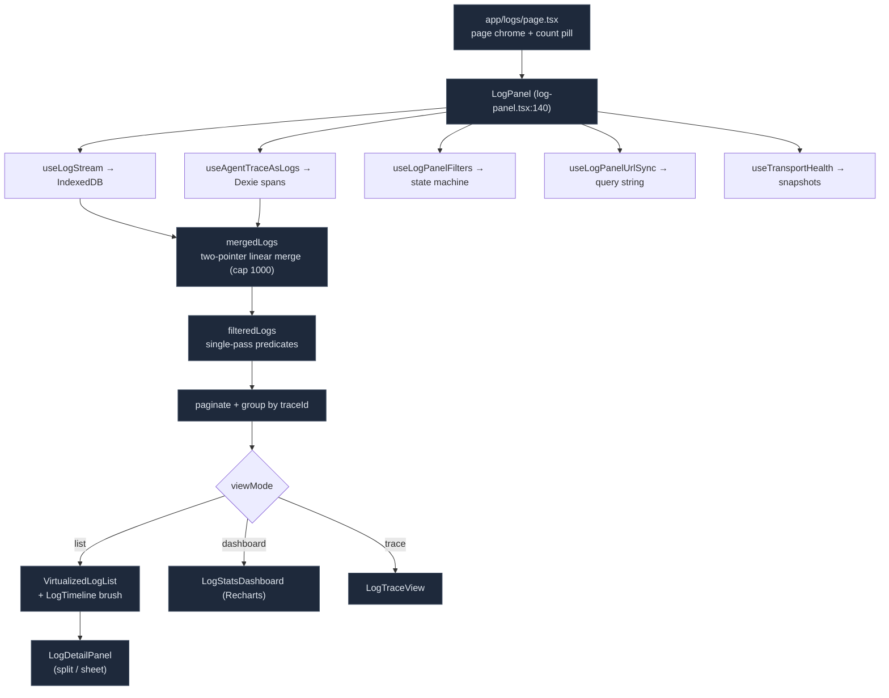

# Log Panel

<Status variant="stable" />

<TLDR>
  `/logs` (`app/logs/page.tsx`) renders `<LogPanel>` (`components/logging/log-panel.tsx:140`), the
  composition root that aggregates five record sources (frontend / tauri / mcp / plugin / internal)
  plus agent-trace spans. It wires `useLogStream` (IndexedDB), `useLogPanelFilters` (the big state
  machine), `useLogPanelUrlSync`, `useTransportHealth`, and `useAgentTraceAsLogs`, linearly merges the
  two timestamp-sorted streams (`log-panel.tsx:214`), filters in one pass, paginates, and switches
  between three views: a virtualized **list** (`@tanstack/react-virtual`), a Recharts **dashboard**,
  and a **trace** view. A density **timeline** with click-drag brush sits above the list. Everything is
  keyboard-driven and URL-mirrored via `history.replaceState`. The i18n namespace is `logging`
  throughout.
</TLDR>

<StatGrid>
  <Stat label="View modes" value="3" hint="list · dashboard · trace" />
  <Stat label="Record sources" value="5" hint="frontend · tauri · mcp · plugin · internal" />
  <Stat label="Virtualization" value="@tanstack/react-virtual" hint="NOT react-window (log-virtualized-list.tsx:10)" />
  <Stat label="Filter dimensions" value="13" hint="level · module · source · session · time · trace · severity · bookmarks · density · …" />
  <Stat label="Settings tabs" value="4" hint="levels · transports · advanced · retention" />
  <Stat label="Live update" value="BroadcastChannel" hint="cognia-logs-updates, not a server" />
</StatGrid>

## Composition



The `LogsPage` (`app/logs/page.tsx:39`) renders `<LogPanel showStats showTimeline
includeAgentTrace={false} … headerSlot={<LogsPageHeader/>}>`. The header reads the panel API via
`useLogPanelHeader()` (a React context the panel publishes) so the breadcrumb count pill and preset
dropdown live in the page chrome while the state lives in the panel.

## The Multi-Source Merge

The panel holds two already-sorted (timestamp-desc) arrays — IndexedDB logs and agent-trace spans —
and merges them in O(n+m) without re-sorting, capped at 1000:

```ts title="components/logging/log-panel.tsx:214"
for (let i = 0; i < limit; i++) {
  if (ai >= a.length) out[i] = b[bi++]
  else if (bi >= b.length) out[i] = a[ai++]
  else if (a[ai].timestamp >= b[bi].timestamp) out[i] = a[ai++]
  else out[i] = b[bi++]
}
```

`filteredLogs` (`:246`) is a single linear pass applying every predicate: allowed sources,
source filter, agent-trace inclusion, time range (preset or custom), `highSeverityOnly`, trace focus,
session, the diagnostic-transport filter (module must be `logger.internal` with `data.sourceTransport`),
and the bookmark filter. `getLogSource` (`:127`) classifies each record into one of the five sources
from its `origin`/`runtime`/`module`.

## The IndexedDB Stream

`useLogStream` (`hooks/logging/use-log-stream.ts`) is the data engine — incremental fetch from a
module-level shared `IndexedDBTransport`, filtering, grouping, and derived `stats` + `logRate`. Under
`autoRefresh` it both polls and subscribes to the cross-tab broadcast:

```ts title="hooks/logging/use-log-stream.ts:195"
const unsubscribe = IndexedDBTransport.onLogsUpdated(() => {
  void fetchLogs()
  if (pollingTimerRef.current) clearInterval(pollingTimerRef.current)
  pollingTimerRef.current = setInterval(() => { void fetchLogs() }, interval)
})
```

`onLogsUpdated` is the `cognia-logs-updates` `BroadcastChannel` (`indexeddb-transport.ts:448`) — the
**only** push mechanism. The string `log://log` is *not* in the panel's data path (it appears only in
a runtime test). `useLogModules()` merges the registered module names with the IndexedDB stats' module
keys so the module filter lists everything that has ever logged.

## Virtualized List

`log-virtualized-list.tsx` uses `@tanstack/react-virtual`'s `useVirtualizer` (not react-window):

```ts title="components/logging/log-virtualized-list.tsx:87"
const virtualizer = useVirtualizer({
  count: filteredLogs.length,
  getScrollElement: () => scrollRef.current,
  estimateSize: () => rowHeight,
  overscan: 10,
})
```

Rows are absolutely positioned with `transform: translateY()` and measured via
`virtualizer.measureElement`. Density drives row height (`compact:28 / comfortable:44 / spacious:60`).
When `groupByTraceId` is on it renders `<TraceGroup>` per trace (not virtualized). Each row
(`log-entry.tsx`) shows icon/time/module/trace badge/message with hover actions (bookmark, focus
trace/session, copy), expandable `data`/`stack`/`source`, and a query-highlight `<mark>`.

## The Density Timeline

`log-timeline.tsx` draws a horizontal density bar (default 60 buckets) colored by severity, with a
click-drag brush to filter a time range. The brush keeps memoized tiles stable via refs so dragging
doesn't re-render every bucket:

```ts title="components/logging/log-timeline.tsx:280"
// mouseUp → onTimeRangeClick(buckets[startIdx].start, buckets[endIdx].end)
```

Per-level mini-sparklines sit below the main bar. Bucketing spans `max(maxTs - minTs, 1000)` ms across
`bucketCount` buckets, classifying each log into error/warn/info/other for opacity scaling.

## Stats Dashboard

`log-stats-dashboard.tsx` is the Recharts analytics view: 8 summary `StatCard`s plus a level pie, a
stacked-area volume chart, an error-trend line, a module-activity bar, and a top-errors list.
`computeVolumeBuckets` (`:62`) buckets at 5-minute granularity (capped at 96 buckets);
`computeErrorTrendData` splits the window into current/previous halves for the trend arrow; `topErrors`
groups error logs by 80-char message prefix. Colors resolve through `useThemeColors()` (raw oklch
strings, because Recharts can't read CSS vars in SVG `fill`).

## Trace View & Agent-Trace Tree

`log-trace-view.tsx` groups logs by `traceId` into rows (prefix, duration, level counts, an SVG event
mini-timeline; logs without a `traceId` are excluded, `MAX_TRACES = 50`). When the detail panel opens
on an agent-trace entry, `agent-trace-tree.tsx` live-queries `queryByTrace(traceId)` from Dexie and
renders the parent→child span tree (`buildTree` promotes orphans to roots), with per-span duration
bars, model, tokens, and cost. `agent-trace-stats-bar.tsx` aggregates cost/tokens/cache-hit/tool-calls
over a `today/week/month/all` window via `aggregateStatsAll`. These are the bridge to the
[agent-trace](./agent-trace) and [tracing dashboard](./tracing-dashboard) planes.

## Filters, URL Sync & Health

`useLogPanelFilters` (`hooks/logging/use-log-panel-filters.ts`) owns the entire filter/view/pagination/
bookmark/preset/search-history/density state, localStorage-backed (bookmarks at
`cognia-log-bookmarks`, density at `cognia-log-density`, presets via `lib/logging/filter-presets.ts`).
`useLogPanelUrlSync` mirrors that state to the query string — read once on mount (ref-guarded),
written via `window.history.replaceState` (chosen over `router.replace` for the static-export build) —
so a filtered view is a shareable URL. `useTransportHealth` polls `getTransportHealthSnapshot()` +
`getNativeLoggingReadiness()` every 3 s, keeping a 30-sample queue-depth history for the stats-bar
sparklines.

## Settings

`log-settings.tsx` is the full configuration UI — four `forceMount` tabs (**levels** & sampling,
**transports**, **advanced** redaction/queue/sampling, **retention**) — reading
`getLoggingBootstrapState()` and writing via `applyLoggingSettings({ …, persist: true })` +
`configureSampling`. All 8 user-facing transports render as collapsibles with per-transport detail
forms (native min-level/batch, remote endpoint/retries, langfuse keys/host, OTel endpoint/service,
agentTrace capture/retention, agentTraceOtlp preset/Grafana-Cloud headers).

## Keyboard & Entry Points

The panel binds a window-level `keydown` handler: `r` refresh, `Esc` close/clear, `d` list↔dashboard,
`/` focus search, `b` bookmark, `g` presets, `j/k` or arrows to move focus, `Enter`/`o` open detail,
`?` shortcuts. Entry points into `/logs`: the settings link card, the tray `tray://open-logs` action,
the View menu, and the global <Kbd>Ctrl</Kbd>+<Kbd>Shift</Kbd>+<Kbd>L</Kbd>.

## Where to Start

| Goal | File |
| --- | --- |
| Add a filter dimension | `hooks/logging/use-log-panel-filters.ts` + surface in `log-panel-toolbar.tsx` + mirror in `use-log-panel-url-sync.ts` |
| Add a dashboard chart | `components/logging/log-stats-dashboard.tsx` |
| Change row density / height | `DENSITY_ROW_HEIGHTS` in `log-virtualized-list.tsx` |
| Add a settings field | `components/logging/log-settings.tsx` (+ `bootstrap.ts` for the new transport option) |
