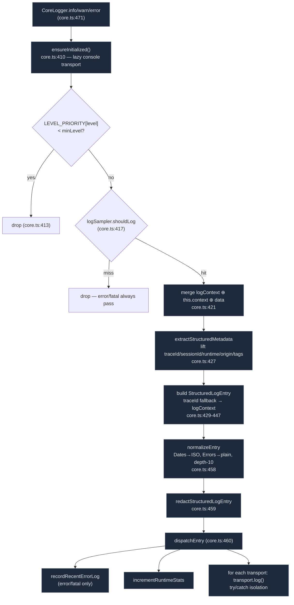

# Logging Pipeline

<Status variant="stable" />

<TLDR>
  Every browser-side log goes through one funnel. `createLogger("module")`
  (`lib/logging/core.ts:713`) returns a `CoreLogger`; calling `.info/.warn/.error/...` reaches the
  private hot path `CoreLogger.log` (`core.ts:404`), which: (1) gates on `minLevel` via
  `LEVEL_PRIORITY`, (2) asks `logSampler.shouldLog` (errors/fatals always pass), (3) merges the
  ambient `logContext` + per-logger context + call data and lifts correlation fields out, (4) builds a
  `StructuredLogEntry`, (5) `normalizeEntry` (Dates→ISO, Errors→plain), (6)
  `redactStructuredLogEntry`, (7) `dispatchEntry` fans out to every registered transport with
  per-transport try/catch isolation. The default `logger` and 25 pre-made `loggers.*` modules all
  share this funnel — `createLogger` only tags the `module` label.
</TLDR>

<StatGrid>
  <Stat label="Pre-made modules" value="25" hint="loggers.app/ai/chat/agent/mcp/… (core.ts:133)" />
  <Stat label="Log levels" value="6" hint="trace0 debug1 info2 warn3 error4 fatal5 (LEVEL_PRIORITY)" />
  <Stat label="Hot-path stages" value="9" hint="init→gate→sample→context→build→normalize→redact→dispatch→stats" />
  <Stat label="Recent-error ring" value="100" hint="MAX_RECENT_ERROR_LOGS (recent-errors.ts:3)" />
  <Stat label="Default redact keys" value="~15" hint="password/token/apiKey/authorization/cookie/secret/… (logger.ts:90)" />
</StatGrid>

## Entry Points

`lib/logging/index.ts` exposes three consumption patterns, all of which feed the same core:

```ts title="lib/logging/index.ts"
// 1) Default app logger — createLogger("app") (index.ts:128)
import { logger } from "@/lib/logging"
logger.info("ready")

// 2) 25 pre-made modular loggers (index.ts:133)
import { loggers } from "@/lib/logging"
loggers.chat.warn("retry", { attempt: 2 })
loggers.tts.error("synthesis failed", err)

// 3) Custom module
import { createLogger } from "@/lib/logging"
const log = createLogger("my-feature")
```

The 25 pre-made modules (`index.ts:133-159`): `app · ai · chat · agent · mcp · plugin · native · ui ·
store · network · auth · error · media · scheduler · search · document · export · skills · sync ·
screenshot · tts · shell · canvas · a2ui · tray`. `app` reuses the singleton `logger`; the other 24
are fresh `createLogger(...)` calls. `log` (`index.ts:164`) is a shorthand delegating to the default
logger. **The `module` tag is the only thing `createLogger` changes** — routing, sampling, and
transports are global.

## The Log Entry Contract

`StructuredLogEntry` (`types/logging/log-entry.ts:10`) is the single object that flows through the
whole pipeline:

```ts title="types/logging/log-entry.ts"
export interface StructuredLogEntry {
  id: string            // log-<base36>-<rand> (core.ts:62)
  timestamp: string     // ISO
  level: LogLevel       // trace | debug | info | warn | error | fatal
  message: string
  module: string        // bound at createLogger time
  traceId?: string      // cross-operation correlation
  requestId?: string; executionId?: string; workflowId?: string; stepId?: string
  runtime?: LogRuntime  // browser | server | tauri | mcp | plugin | internal | unknown
  origin?: LogOrigin    // frontend | web-runtime | tauri | mcp | plugin | diagnostic | unknown
  sessionId?: string
  data?: Record<string, unknown>
  stack?: string
  source?: { file?; line?; function? }   // dev only
  tags?: string[]
}
```

`LEVEL_PRIORITY` (`types/logging/log-level.ts:29`) maps `{ trace:0, debug:1, info:2, warn:3, error:4,
fatal:5 }`; every `minLevel` comparison and the recent-error filter rely on it.

## The Hot Path

`CoreLogger.log` (`core.ts:404`) is the funnel every entry passes through:



The two load-bearing tails — normalize/redact/dispatch and the isolated fan-out:

```ts title="lib/logging/core.ts:457"
// normalize -> redact -> dispatch
const normalized = normalizeEntry(entry)
const redacted = redactStructuredLogEntry(normalized, config.redaction)
dispatchEntry(redacted)
```

```ts title="lib/logging/core.ts:299"
const transports = [...runtimeState.transports.values()]
for (const transport of transports) {
  if (options?.skipTransports?.has(transport.name)) { continue }
  try { void transport.log(entry) }
  catch (error) {
    emitLoggerDiagnostic({
      code: "logger.transport.failed",
      // ...re-emits a guarded diagnostic that SKIPS the failed transport
      skipTransports: [transport.name],
```

A transport throwing never breaks the loop and never breaks the caller; instead the logger
self-reports through `emitLoggerDiagnostic` (see [Diagnostics](#self-diagnostics)).

## Trace-Id Context

`lib/logging/context.ts` keeps an ambient, per-tab correlation context that the hot path merges into
every entry (`core.ts:421`). The session id persists across reloads:

```ts title="lib/logging/context.ts:37"
private initSessionId(): string {
  if (typeof window === "undefined") { return generateId() }
  const stored = sessionStorage.getItem("cognia-log-session-id")
  if (stored) { return stored }
  const newId = generateId()
  sessionStorage.setItem("cognia-log-session-id", newId)
```

- `logContext.newTraceId()` / `setTraceId(id)` / `clearTraceId()` set the ambient trace id.
- `logContext.set({ userId })` adds context fields carried by every subsequent entry.
- `traced(fn)` (`context.ts:151`) runs a closure under a fresh trace id and restores the previous one
  in `finally` — the agent-trace emitter and the chat send loop use this so one user action produces
  one trace.

`generateTraceId()` (`context.ts:144`) and `generateId()` (32-hex via `crypto.getRandomValues`) keep
ids short and dependency-free. `lib/logging/runtime.ts` validates and auto-tags the `runtime`/`origin`
pair (`createLogRuntimeContext` adds `runtime:*` / `source:*` tags) so the panel can colour by origin.

## Sampling

`lib/logging/sampling.ts` prevents high-frequency, low-value logs from drowning the signal. The
decision is per-`module:level`:

```ts title="lib/logging/sampling.ts:99"
shouldLog(module, level, _message?): boolean {
  if (level === "error" || level === "fatal") { return true }   // always pass
  const config = this.getConfig(module)
  // minInterval throttle, then burstLimit, then probability:
  return Math.random() < config.rate
}
```

Defaults (`DEFAULT_SAMPLING`, `sampling.ts:23`) — note the deliberate suppression of UI noise and the
1.0 rate for anything safety-relevant:

| Module class | Rate | minInterval |
| --- | --- | --- |
| `mouse` | 0.01 | 100 ms |
| `keyboard` | 0.1 | 50 ms |
| `scroll` | 0.05 | 100 ms |
| `animation` | 0.01 | 16 ms |
| `network` / `state` | 0.5 | — |
| `render` | 0.2 | — |
| `error` / `auth` / `security` | **1.0** | — |
| `default` | 1.0 | — |

`getConfig` does exact-match, then **prefix** match (`module.startsWith(key)`), then `default`. A
5 s dedupe window (`DEDUPE_WINDOW`) collapses identical repeats. `logSampler` is a mutable singleton —
the log settings "sampling" tab adjusts it live via `configureSampling`.

## Redaction

`redactStructuredLogEntry` (`redaction.ts:92`) scrubs `message`, `stack`, and `data` before any
transport sees them. It combines key-name matching with regex text replacement, and is cycle-safe via
a `WeakSet`:

```ts title="lib/logging/redaction.ts:10"
function shouldRedactKey(key, config): boolean {
  const normalized = normalizeKey(key)   // lowercase, [\s-]+ → _
  return config.redactKeys.some((candidate) => {
    const target = normalizeKey(candidate)
    return normalized === target || normalized.includes(target)
```

The default key list and patterns live in `DEFAULT_UNIFIED_CONFIG.redaction` (`types/logging/logger.ts:87`):
`password / passwd / pwd / token / access_token / refresh_token / secret / api_key / apikey /
authorization / cookie / session / client_secret / private_key / bearer`, plus regexes for `Bearer …`
tokens and `(api_key|token|secret) = …` assignments, with `maxDepth: 8`. `LoggerRedactionConfig`
allows per-call opt-out for isolated debugging.

## Recent-Error Ring Buffer

`recent-errors.ts` holds the last 100 `error`/`fatal` entries in memory and notifies subscribers — the
status-bar red dot and toast alert read from it. `dispatchEntry` writes to it (`core.ts:297`):

```ts title="lib/logging/recent-errors.ts:18"
export function recordRecentErrorLog(entry): void {
  if (!isRecentErrorLevel(entry)) { return }
  recentErrorLogs = [entry, ...recentErrorLogs.filter((c) => c.id !== entry.id)].slice(
    0, MAX_RECENT_ERROR_LOGS )
  notifySubscribers()
```

Newest-first, deduped by `id`, capped at `MAX_RECENT_ERROR_LOGS = 100`.
`subscribeRecentErrorLogs(cb)` returns an unsubscribe; `clearRecentErrorLogs()` empties it when the
user acknowledges.

## Bootstrap

`bootstrap.ts` runs once during `LoggerProvider` startup (inside `app/layout.tsx`). It reads four
localStorage keys, initializes the core, and registers/updates every transport from settings:

```ts title="lib/logging/bootstrap.ts (storage keys)"
LOGGING_TRANSPORTS_STORAGE_KEY = "cognia-logging-transports"   // per-transport enable/minLevel/config
LOGGING_RETENTION_STORAGE_KEY  = "cognia-logging-retention"    // IndexedDB capacity + age
LOGGING_CONFIG_STORAGE_KEY     = "cognia-logging-config"       // minLevel etc.
LOGGING_SAMPLING_STORAGE_KEY   = "cognia-logging-sampling"     // per-level/module rates
```

`applyTransportSettings` (`bootstrap.ts:541`) is the add/remove fan-out — e.g. console is
unconditional, but remote attaches **only when both** `transports.remote` **and** a non-empty
`config.remoteEndpoint` are set (`bootstrap.ts:589`). Defaults (`DEFAULT_TRANSPORT_SETTINGS`,
`bootstrap.ts:70`) enable console / indexedDB / native / remote / langfuse / opentelemetry /
agentTrace by default and leave `agentTraceOtlp` off. `bootstrap.ts` also wires the agent-trace
emitter into the transports via `setAgentTraceWriter` → `dispatchSpanToTransports` (`bootstrap.ts:660`);
see [Agent-trace spans](./agent-trace).

## Self-Diagnostics

`emitLoggerDiagnostic` (`core.ts:645`) is the logger's only permitted recursive path — it self-logs
into a virtual `logger.internal` module. It is rate-limited (`diagnosticRateLimitMs`, default 2000 ms,
floor 250 ms) per `code` and re-entrancy-guarded by `isEmittingDiagnostic`, so a failing transport
can't cause a log avalanche. The log panel surfaces these under the `internal` source with a
distinct colour.

## Where to Start

| Goal | File |
| --- | --- |
| Add a new module logger | just call `createLogger("name")` — no registration needed |
| Change a module's sampling | `lib/logging/sampling.ts:DEFAULT_SAMPLING` (or the settings UI) |
| Add a redaction field | `redactKeys` / `redactPatterns` in `types/logging/logger.ts:87` |
| Add a new transport | implement `Transport`, export in `transports/index.ts`, register in `bootstrap.ts` — see [Transports](./transports) |
| Inspect the trace correlation | `lib/logging/context.ts` (`logContext`, `traced`) |
