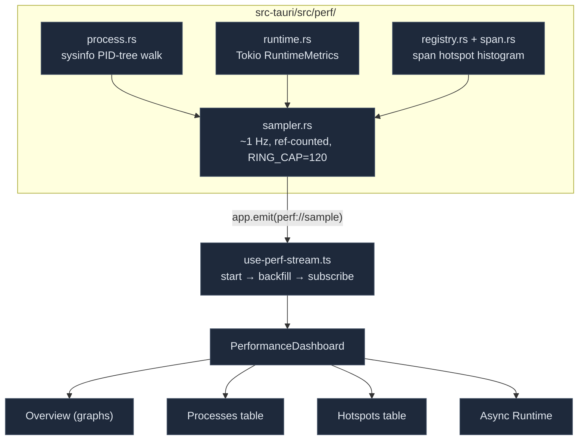

# Performance Dashboard

<Status variant="stable" />

<TLDR>
  `/performance` (ADR-0035) is a live, Task-Manager-style view of the **Rust** runtime — desktop-only.
  The Rust subsystem `src-tauri/src/perf/` composes three layers into a `PerfSample` ~1 Hz over the
  `perf://sample` event: (1) the **process tree** (`process.rs`) via `sysinfo`, walking the PID tree
  from the app down to every descendant, classified `main`/`sidecar`/`child`, CPU normalized to
  0–100; (2) the **Tokio runtime** (`runtime.rs`) via `RuntimeMetrics`, headline worker-busy % by
  diffing monotonic busy durations; (3) **span hotspots** (`registry.rs` + `span.rs`) — a
  process-global registry where each instrumented `&'static str` accumulates count/error/total/min/max
  plus a fixed **log-bucket histogram** for approximate p50/p95. The sampler is **ref-counted** — zero
  cost while the panel is closed. The frontend (`hooks/perf/use-perf-stream.ts` +
  `components/performance/`) starts → backfills from a 120-sample ring → subscribes, and renders four
  tabs: Overview, Processes, Hotspots, Async Runtime.
</TLDR>

<StatGrid>
  <Stat label="Data layers" value="3" hint="process tree · Tokio runtime · span hotspots" />
  <Stat label="Sample rate" value="~1 Hz" hint="DEFAULT_INTERVAL_MS=1000, clamp 250–10000" />
  <Stat label="Event" value="perf://sample" hint="sampler.rs:24 ↔ commands.ts:14" />
  <Stat label="Backfill ring" value="120" hint="RING_CAP (~2 min @1 Hz)" />
  <Stat label="Histogram buckets" value="25" hint="2^i µs buckets ≈ 33.6 s span (registry.rs:22)" />
  <Stat label="Tauri commands" value="9" hint="perf_snapshot/start/stop/set_interval/hotspots/…" />
  <Stat label="Dashboard tabs" value="4" hint="Overview · Processes · Hotspots · Async Runtime" />
</StatGrid>

## Why It Exists

The app already had logging, crash reporting, frontend perf timing, and a `dial9` Tokio flight
recorder. What was missing was a *live Rust-runtime* view: how much CPU/memory the Rust process tree
uses right now, how loaded the Tokio runtime is, and which backend operations are slow. ADR-0035 adds
exactly that, without an in-process sampling profiler (signal-based samplers like `pprof-rs` are
unavailable/unsafe on Windows) — instead it surfaces the existing dial9 trace files for offline
analysis and a live span-hotspot table for attribution.

## Architecture



## Layer 1 — Process Tree

`process.rs` samples the current PID plus every descendant. It builds a parent index, computes the
descendant set (iterative, cycle-safe), then normalizes CPU and derives disk bytes/sec from the
interval. Sidecar detection keys on the bundled Node host:

```rust title="src-tauri/src/perf/process.rs:64"
pub fn classify_role(pid: u32, current_pid: u32, name: &str, cmd: &[String]) -> ProcessRole {
    if pid == current_pid { return ProcessRole::Main; }
    let is_node = name.to_ascii_lowercase().starts_with("node");
    let runs_sidecar = cmd.iter().any(|a| a.contains("claude-host.mjs"));
    if runs_sidecar || (is_node && cmd.iter().any(|a| a.contains("sidecar"))) {
        ProcessRole::Sidecar
    } else { ProcessRole::Child }
}
```

```rust title="src-tauri/src/perf/process.rs:182"
cpu_pct: (cpu_raw / cores).min(100.0),   // normalized 0–100
cpu_pct_raw: cpu_raw,                      // raw sum, may exceed 100
mem_bytes: p.memory(),
disk_read_bps: (disk.read_bytes as f64 / secs) as u64,
disk_write_bps: (disk.written_bytes as f64 / secs) as u64,
run_secs: p.run_time(),
```

CPU needs two refreshes, so the sampler `prime()`s a baseline before the first frame. Each
`ProcessSample` carries `pid/parentPid/name/role/cpuPct/cpuPctRaw/memBytes/diskReadBps/diskWriteBps/
runSecs`. The Processes tab renders a sortable table, a CPU heat-map, per-PID CPU sparklines, and a
mem-share bar.

## Layer 2 — Tokio Runtime

`runtime.rs` snapshots `RuntimeMetrics` (the full surface is available because `.cargo/config.toml`
sets `--cfg tokio_unstable` for dial9). The headline is **worker busy %**, computed by diffing the
monotonic per-worker busy durations against the previous sample:

```rust title="src-tauri/src/perf/runtime.rs:44"
pub fn compute_busy_pct(prev: &[Duration], cur: &[Duration], elapsed: Duration) -> (f64, Vec<f64>) {
    let elapsed_secs = elapsed.as_secs_f64();
    if elapsed_secs <= 0.0 || prev.len() != cur.len() || cur.is_empty() {
        return (0.0, vec![0.0; cur.len()]);
    }
    let per: Vec<f64> = cur.iter().zip(prev.iter()).map(|(c, p)| {
        ((c.saturating_sub(*p).as_secs_f64() / elapsed_secs) * 100.0).clamp(0.0, 100.0)
    }).collect();
    let mean = per.iter().sum::<f64>() / per.len() as f64;
    (mean, per)
}
```

The `RuntimeSample` also carries `aliveTasks`, `globalQueueDepth`, `blockingThreads`,
`blockingQueueDepth`, `spawnedTasksCount`, and the summed `workerStealCount`/`workerParkCount`/
`workerOverflowCount`. The Async Runtime tab groups these into Workers/Tasks/Queues/Throughput cards
plus per-worker busy sparklines, and lists the dial9 trace files (open-folder affordance).

## Layer 3 — Span Hotspots

`registry.rs` is a process-global registry keyed by `&'static str`. Each name accumulates
count/error/total/min/max plus a fixed **log-bucket histogram** (25 buckets, bucket *i* covers
`[2^i, 2^(i+1))` µs) giving dependency-free, memory-bounded approximate percentiles:

```rust title="src-tauri/src/perf/registry.rs:73"
pub fn percentile_micros(&self, q: f64) -> u64 {
    if self.count == 0 { return 0; }
    let target = (q.clamp(0.0, 1.0) * self.count as f64).ceil().max(1.0) as u64;
    let mut cum = 0u64;
    for (i, &c) in self.buckets.iter().enumerate() {
        cum += c;
        if cum >= target { return bucket_upper_micros(i); }
    }
    bucket_upper_micros(HIST_BUCKETS - 1)
}
```

Instrumentation (`span.rs`) is opt-in and ergonomic — an RAII guard records on drop, so it's safe
across `.await`:

```rust title="src-tauri/src/perf/span.rs:57"
impl Drop for Guard {
    fn drop(&mut self) {
        REGISTRY.record(self.name, self.start.elapsed(), self.ok);
    }
}
```

Three shapes: `crate::perf::guard("name")` (RAII), `timed(name, fut)` (fallible async, ok from
`is_ok()`), and `record(name, elapsed, ok)` (manual). Curated boundaries are intended (`connector.send`,
`ocr.extract`, `vector.query`, …) — there's no generic command middleware in Tauri, so coverage grows
as boundaries are instrumented. Each `SpanSnapshot` carries
`name/count/errorCount/totalMs/avgMs/minMs/maxMs/p50Ms/p95Ms/buckets`. The Hotspots tab is a sortable
table with a total-time relative bar and a log-bucket distribution sparkbar.

## The Sampler

`sampler.rs` composes all three layers into a `PerfSample` and emits it; the loop is **ref-counted** so
there's no cost while the panel is closed:

```rust title="src-tauri/src/perf/sampler.rs:126"
let processes = proc_sampler.sample(interval_secs);
let runtime = rt_sampler.sample(&tokio::runtime::Handle::current().metrics());
let top_spans = REGISTRY.snapshot();
let system_memory = Some(proc_sampler.sample_system_memory());
// …assemble PerfSample…
handle.push(sample.clone());                       // bounded ring (RING_CAP=120)
if let Err(err) = app.emit(SAMPLE_EVENT, &sample) { /* warn */ }
```

A 120-entry ring backfills a freshly-opened panel's rolling graphs. The `PerfSample`
(`sampler.rs:34`) is `{ tsMs, intervalMs, processes[], runtime, topSpans[], systemMemory }`, mirrored
1:1 in `lib/perf/backend/types.ts`.

### Commands

Nine `perf_*` commands (`perf/commands.rs`, registered at `lib.rs:759`):

| Command | Purpose |
| --- | --- |
| `perf_snapshot` | the ring + running flag + interval |
| `perf_start_sampling` / `perf_stop_sampling` | ref-counted loop control (panel mount/unmount) |
| `perf_set_interval` | change the interval (clamped 250–10000 ms) |
| `perf_hotspots` / `perf_reset_hotspots` | the span snapshot (works with the sampler off) / reset |
| `perf_system_details` | host snapshot — reuses `crash::system_info::gather()` |
| `perf_list_traces` / `perf_open_trace_dir` | the dial9 flight-recorder trace files |

## The Frontend Stream

`use-perf-stream.ts` drives the dashboard — start the backend loop, backfill from the snapshot ring,
then subscribe to live samples, keeping a rolling 120-sample window:

```ts title="hooks/perf/use-perf-stream.ts:73"
await perfStartSampling(DEFAULT_PERF_INTERVAL)
const snapshot = await perfSnapshot()
if (snapshot.samples.length > 0) setHistory(snapshot.samples.slice(-PERF_HISTORY_LIMIT))
unsubscribe = subscribePerfSample(append)
// cleanup: unsubscribe() + perfStopSampling()
```

Pause freezes the UI without stopping the backend; `setIntervalMs` also calls `perfSetInterval`. The
`PerformanceDashboard` renders four tabs (Overview / Processes / Hotspots / Async Runtime) plus a
`perf.panel` plugin extension slot, and a desktop-only gate renders an inert explainer on web/mobile.
`lib/perf/backend/{commands,export,format}.ts` provide the `isTauri()`-gated wrappers, JSON/CSV export,
and pure formatters. The i18n namespace is `performance`.

## Where to Start

| Goal | File |
| --- | --- |
| Instrument a backend boundary | `crate::perf::guard("name")` / `timed(name, fut)` (`src-tauri/src/perf/span.rs`) |
| Change the sample interval bounds | `MIN/MAX_INTERVAL_MS` in `src-tauri/src/perf/sampler.rs` |
| Add a perf command | `src-tauri/src/perf/commands.rs` + register in `lib.rs` + wrap in `lib/perf/backend/commands.ts` |
| Add a dashboard tile/chart | `components/performance/` (Recharts + `useThemeColors`) |
