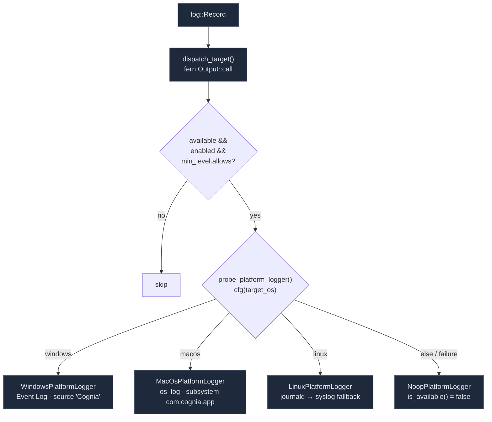

# Rust Dispatch & OS Bridges

<Status variant="stable" />

<TLDR>
  `logging::bootstrap(app)` (`src-tauri/src/logging/mod.rs:31`, called from `lib.rs:838`) installs
  `tauri-plugin-log` with a planned set of targets (`stdout` + `folder` + `webview`) plus a custom
  `fern` **dispatch target** that mirrors every record into the OS logger. A planner
  (`native_bootstrap.rs`) picks **Full** (log dir writable), **Fallback** (dir unavailable → no file
  target), or **Disabled**, exposing a `NativeLoggingReadiness` snapshot to the frontend. The OS bridge
  is a `PlatformLogger` trait with four impls — Windows **Event Log** (source `Cognia`), macOS
  **`os_log`** (subsystem `com.cognia.app`), Linux **journald** (syslog fallback), and a **noop**. The
  `webview` target round-trips Rust + sidecar + shell output back to the frontend via the `log://log`
  event. Six `#[tauri::command]`s cover readiness, log-dir access, and the browser→Rust forward.
</TLDR>

<StatGrid>
  <Stat label="Bootstrap modes" value="3" hint="Full · Fallback · Disabled (native_bootstrap.rs)" />
  <Stat label="OS backends" value="4" hint="event_log · os_log · journald/syslog · noop" />
  <Stat label="Tauri commands" value="6" hint="native_logging_* + platform_logging_* (lib.rs:463)" />
  <Stat label="Default platform level" value="warn" hint="PlatformLoggingState::Default min_level" />
  <Stat label="Webview event" value="log://log" hint="TargetKind::Webview → frontend panel" />
</StatGrid>

## Bootstrap

`bootstrap()` runs unconditionally in the Tauri `setup` closure (`lib.rs:838`). It plans the targets,
chains the platform dispatch target, and installs the plugin:

```rust title="src-tauri/src/logging/mod.rs:31"
pub fn bootstrap(app: &App) -> Result<(), Box<dyn std::error::Error>> {
    let plan = native_bootstrap::plan_native_logging_bootstrap(true);
    let targets = plan
        .targets()
        .into_iter()
        .chain(std::iter::once(platform::dispatch_target()));
    let builder = LogBuilder::default()
        .level(log::LevelFilter::Info)
        .targets(targets);
    if let Err(error) = app.handle().plugin(builder.build()) { /* warn */ }
    native_bootstrap::apply_native_logging_bootstrap(&plan);
```

The global plugin-log level filter is `LevelFilter::Info`. `.targets(...)` (plural) replaces the
seeded defaults so the `Stdout`/`LogDir` pair isn't duplicated.

## The Three Bootstrap Modes

`plan_native_logging_bootstrap_with` (`native_bootstrap.rs:155`) decides the mode by probing whether
the persistent log directory (`<data_local_dir>/Cognia/logs`) can be created and written
(`prepare_persistent_log_target` writes and removes a `.native-logging-probe` file):

| Mode | Condition | Active targets | Health |
| --- | --- | --- | --- |
| **Full** | log dir created + probe write OK | `stdout` + `folder` + `webview` | `Healthy` |
| **Fallback** | probe failed (permissions / disk) | `stdout` + `webview` | `Degraded` (reason `persistent_target_unavailable`) |
| **Disabled** | `!should_register` (never hit in prod) | none | `Inactive` |

```rust title="src-tauri/src/logging/native_bootstrap.rs:177"
match prepare_persistent_target() {
    Ok(_) => /* mode: Full, health: Healthy, targets: [stdout, folder, webview] */
    Err(message) => /* mode: Fallback, health: Degraded, targets: [stdout, webview],
        fallback_reason: { code: "persistent_target_unavailable", message } */
}
```

`targets()` maps each target string to a `tauri-plugin-log` `TargetKind` — `"stdout"`→`Stdout`,
`"folder"`→`LogDir { file_name: Some("cognia") }`, `"webview"`→`Webview`. The resulting
`NativeLoggingReadiness` (mode, health, active targets, fallback reason, platform status, timestamp)
is stored in a global `Mutex` and read by the frontend so the log panel can show "persistence failed,
downgraded to in-memory".

## The Platform Bridge

`platform/mod.rs` defines the cross-platform contract and the fern dispatch that feeds it:

```rust title="src-tauri/src/logging/platform/mod.rs:15"
pub trait PlatformLogger: Send + Sync {
    fn log(&self, level, target, message, data: Option<&str>) -> Result<(), String>;
    fn is_available(&self) -> bool;
    fn name(&self) -> &'static str;
}
```

`dispatch_target()` returns a fern `Output::call` that forwards every plugin-log record into the
active `PlatformLogger`:

```rust title="src-tauri/src/logging/platform/mod.rs:202"
pub fn dispatch_target() -> Target {
    Target::new(TargetKind::Dispatch(Dispatch::new().chain(
        fern::Output::call(|record| {
            let _ = forward_record(record);
        }),
    )))
}
```

Each record is gated before it reaches the OS — emit only if the logger is available, the config is
enabled, and the record meets the platform `min_level` (default **`warn`**, keeping OS logs
uncluttered):

```rust title="src-tauri/src/logging/platform/mod.rs:227"
if !state.logger.is_available()
    || !state.config.enabled
    || !state.config.min_level.allows(level)
{
    return Ok(());
}
state.logger.log(level, target, message, data)
```

Platform health (`derive_status`, `:245`) is `Inactive` when disabled, `Healthy` when available with no
error, else `Degraded`.

### The Four Backends



**Windows** (`platform/windows.rs`) — registers an Event Log source `Cognia` and writes through the
`eventlog` crate. Registration failure is non-fatal (stored as a soft error); only `EventLog::new`
failing downgrades to noop. Level map collapses Fatal/Error → `Level::Error`, Debug/Trace →
`Level::Debug`.

```rust title="src-tauri/src/logging/platform/windows.rs:12"
pub(crate) fn probe_logger() -> PlatformLoggerProbe {
    let registration_error = eventlog::register(EVENT_SOURCE)   // "Cognia"
        .err()
        .map(|error| format!("event_log_source_registration_failed:{error}"));
    match EventLog::new(EVENT_SOURCE, Level::Trace) {
        Ok(inner) => PlatformLoggerProbe::success(Arc::new(WindowsPlatformLogger { inner }), …),
        Err(error) => PlatformLoggerProbe::failure("event_log",
            format!("event_log_initialization_failed:{error}")),
```

**macOS** (`platform/macos.rs`) — one `OsLog` per category (the log target/module), subsystem
`com.cognia.app`; level map sends Fatal → `Fault`, Warn → `Default`. Always probes `success`.

**Linux** (`platform/linux.rs`) — prefers journald when `SD_JOURNAL_SOCK_PATH` exists, else a unix
`syslog` connection (`Formatter3164`, facility `LOG_USER`, identifier `cognia`); both unavailable →
`failure("syslog", …)`. journald fields: `SYSLOG_IDENTIFIER=cognia`, `MODULE`/`TARGET`, `PAYLOAD`.

**noop** (`platform/noop.rs`) — always-unavailable sink for unsupported platforms or probe failures;
`is_available() → false`, but `name()` preserves the intended backend so diagnostics still read e.g.
`"event_log"`.

## The Webview Round-Trip

The `webview` target of `tauri-plugin-log` is the channel that brings **Rust-side records** — including
the bundled Node sidecar (`claude-host.mjs`) and shell-captured output — back to the frontend, via the
Tauri event `log://log`. The frontend log panel does *not* listen to `log://log` for its main list
(that comes from IndexedDB); the event feeds the "tauri / mcp / plugin" sources so native content
appears alongside browser logs.

## Tauri Commands

Six `#[tauri::command]`s (`logging/commands.rs`, registered at `lib.rs:463-468`):

| Command | Purpose |
| --- | --- |
| `native_logging_get_readiness` | the `NativeLoggingReadiness` snapshot (mode/health/targets/fallback) |
| `native_logging_get_log_directory` | the resolved `app_log_dir` path |
| `native_logging_open_log_directory` | reveal the log folder in the OS file manager |
| `platform_logging_get_status` | `PlatformLoggingStatus` (backend, health, enabled, min_level) |
| `platform_logging_set_config` | toggle platform logging / change min_level at runtime |
| `platform_logging_forward` | receive browser entries from the native transport |

```rust title="src-tauri/src/logging/commands.rs:56"
#[tauri::command]
pub async fn platform_logging_forward(
    entries: Vec<platform::PlatformLogEntry>,
) -> Result<(), String> {
    platform::forward_entries(&entries)
}
```

The browser side (`lib/native/native-logging.ts`) wraps these; the [native transport](./transports#native)
calls `platform_logging_forward`, and the [log panel](./log-panel) reads readiness via
`native_logging_get_readiness` to render the native-logging diagnostics card.

## Where to Start

| Goal | File |
| --- | --- |
| Add/modify an OS backend | `src-tauri/src/logging/platform/<os>.rs` (implement `PlatformLogger`) |
| Change the default platform min level | `PlatformLoggingState::Default` in `platform/mod.rs` |
| Change the log file name / dir | `LOG_FILE_NAME` / `APP_LOG_DIR_NAME` in `native_bootstrap.rs` |
| Add a logging command | `logging/commands.rs` + register in `lib.rs` invoke_handler |
