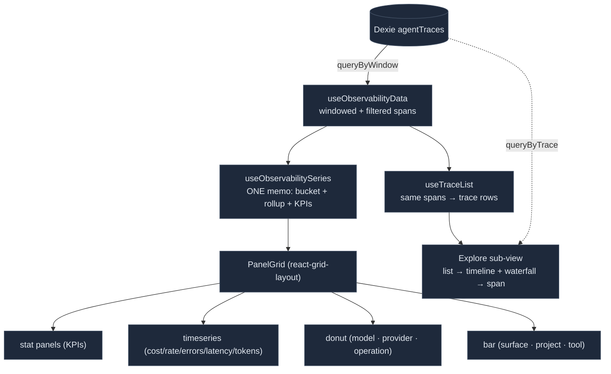

# Tracing Dashboard

<Status variant="beta" />

<TLDR>
  The **Dashboard sub-view of `/logs` → Traces** (`components/observability/observability-dashboard.tsx`)
  is a Grafana/Langfuse-style telemetry dashboard: a draggable, resizable `react-grid-layout` panel
  grid reading the **Dexie `agentTraces` table** (the same spans the [agent-trace](./agent-trace)
  pipeline persists) — so it works in the browser and on mobile, unlike `/performance`. It used to be
  its own `/observability` route with its own range control, its own filters and its own window read;
  it is now a pane the channel feeds, sharing one read with the Explore sub-view beside it, so the
  KPI numbers and the trace list cannot disagree. `lib/observability/` is a genuine analytics engine:
  exact percentiles (`percentiles.ts`), fixed-boundary time bucketing with null-gapping
  (`aggregate-series.ts`), spans→trace rollup + parent/child waterfall (`trace-rollup.ts`), group-by
  breakdowns (`breakdown.ts`), and threshold classification (`thresholds.ts`). A single
  `useObservabilitySeries` memo computes everything once; 16 panels (4 kinds) render from it.
</TLDR>

<StatGrid>
  <Stat label="Data source" value="Dexie agentTraces" hint="NOT fixtures — queryByWindow (use-observability-data.ts)" />
  <Stat label="Panels" value="16" hint="panel-registry.ts" />
  <Stat label="Panel kinds" value="4" hint="stat · timeseries · donut · bar" />
  <Stat label="Time presets" value="7" hint="5m · 15m · 1h · 6h · 24h · 7d · 30d" />
  <Stat label="Breakdown dims" value="7" hint="model · surface · operation · tool · provider · project · session" />
  <Stat label="Grid engine" value="react-grid-layout v2" hint="hooks-based, React-19 safe" />
</StatGrid>

## Data Source

The dashboard reads the Dexie `agentTraces` table — **not** fixtures (those exist only for tests). The
proof chain:

```ts title="hooks/observability/use-observability-data.ts"
const windowSpans = useClientLiveQuery(
  () => queryByWindow({ since: range.since, until: range.until, limit: SPAN_READ_CAP }),
  [range.since, range.until, tick, limit],
  EMPTY,
)
// queryByWindow → the v150 global startTime index, newest-N capped; countByWindow supplies the
// denominator so a capped read can say so instead of showing a partial answer silently.
```

So the flow is: spans emitted by the [logging pipeline](./logging-pipeline) → persisted by the
**agent-trace transport** → read windowed via `useLiveQuery` → bucketed/rolled-up by the pure
`lib/observability` functions → rendered into the panel grid. `tick` is in the dependency array so
relative windows re-fetch as the wall clock advances.



## The Analytics Engine

`lib/observability/` is pure, side-effect-free, and unit-tested per module.

### Percentiles

Exact percentiles via sort + nearest-rank with linear interpolation ("type 7" / NumPy / Excel
`PERCENTILE`):

```ts title="lib/observability/percentiles.ts:14"
export function percentile(sortedAsc: number[], p: number): number {
  const n = sortedAsc.length
  if (n === 0) return 0
  if (n === 1) return sortedAsc[0]
  const rank = Math.min(1, Math.max(0, p)) * (n - 1)
  const lo = Math.floor(rank); const hi = Math.ceil(rank)
  if (lo === hi) return sortedAsc[lo]
  return sortedAsc[lo] + (sortedAsc[hi] - sortedAsc[lo]) * (rank - lo)
}
```

`percentilesOf(values, ps)` sorts once and returns one value per requested quantile — used for the
p50/p95/p99 latency series.

### Time Bucketing

`aggregate-series.ts` buckets spans into **fixed boundaries** from `bucketBoundaries(range)` so empty
leading/trailing buckets still render (Grafana behaviour). Each span lands in
`floor((startTime - since) / bucketMs)`. The series builders — `costSeries`, `tokenSeries`,
`requestRateSeries`, `errorRateSeries`, `latencyPercentileSeries` — emit `null` for empty buckets so
recharts draws gaps rather than misleading zeros:

```ts title="lib/observability/aggregate-series.ts:131"
if (durations.length === 0) return { p50: null, p95: null, p99: null }
const [p50, p95, p99] = percentilesOf(durations, [0.5, 0.95, 0.99])
```

`windowKpis(spans, range)` rolls the whole window into `{ totalCost, totalSpans, errorRate,
cacheHitRate, p95LatencyMs, reqPerMin, toolCalls, toolFailures }`.

### Trace Rollup & Waterfall

`trace-rollup.ts` has two outputs. `rollupTraces` produces one `TraceRollupRow` per `traceId` for the
Explore list (root = earliest-start span, duration = `maxEnd - minStart`). `buildWaterfall`
builds the parent/child tree with offset/width geometry for the waterfall pane, guarding against
missing/self/cyclic parents (orphans become roots, a `visited` set breaks cycles):

```ts title="lib/observability/trace-rollup.ts:142"
offsetMs: Math.max(0, span.startTime - traceStart),
widthMs: Math.max(0, span.durationMs ?? (span.endTime ?? span.startTime) - span.startTime),
```

`flattenWaterfall` does a pre-order DFS for the row list.

### Breakdowns & Thresholds

`breakdown.ts` groups spans by one of seven dimensions (`model | surface | operation | tool |
provider | project | session`) into `BreakdownRow`s (span count, cost, tokens, errors, avg latency).
`distinctValues` powers the filter-bar options.

`thresholds.ts` classifies a metric value into `ok | warn | crit` and maps it to a theme colour. The
defaults:

```ts title="lib/observability/thresholds.ts:24"
DEFAULT_THRESHOLDS = {
  errorRate:    { warn: 0.02, crit: 0.1,   direction: "above" },
  latencyP95:   { warn: 5000, crit: 15000, direction: "above" },
  cost:         { warn: 5,    crit: 20,    direction: "above" },
  cacheHitRate: { warn: 0.5,  crit: 0.2,   direction: "below" },
}
```

`time-range.ts` resolves presets (`5m…30d`), snaps `bucketMs` to nice steps (`pickBucketMs`, target 60
buckets, capped at 1000), and computes the boundaries. `filters.ts` applies `TraceFilters` with
**AND across dimensions, OR within a dimension** (Grafana template-variable semantics), client-side
over the already-windowed spans.

## Data Hooks

- `useObservabilityData(range, filters, tick)` — the windowed (and capped) `useLiveQuery` +
  client-side filter; returns `{ spans (filtered), windowSpans (pre-filter, for option lists),
  loading, spanCount, windowSpanCount, truncated }`. It is the channel's only read.
- `useObservabilitySeries(spans, range)` — **one** `useMemo` computing `bucketMs`, all 5 series, 6
  breakdowns and `windowKpis`, so no panel re-buckets. The trace rollup is deliberately not here:
  `useTraceList` already folds the same spans for the Explore list.
- `useObservabilityControls()` / `useResolvedRange(tick)` — selector layer over the persisted
  `useObservabilityStore` (zustand `persist`, key `cognia-observability`; `editMode` is transient so
  the grid always reopens locked).
- `useTraceDetail(traceId)` — lazily `queryByTrace` only when a trace is selected, then `buildWaterfall`.
- `useRefreshTick(intervalMs)` — the auto-refresh counter (`0` disables, relying on `useLiveQuery`).

## The Panel Registry

`panel-registry.ts` is pure config (no JSX). A `PanelDef` carries `id`, `kind`, `titleKey`, and
optional `statMetric` / `seriesKind` / `dimension` / `threshold`. There are **16 registered panels**
across **4 kinds**:

| Kind | Panels |
| --- | --- |
| `stat` | `kpi-cost` · `kpi-spans` · `kpi-errors` · `kpi-cache` · `kpi-latency` · `kpi-rate` · `kpi-tools` · `kpi-tool-failures` |
| `timeseries` | `ts-cost` · `ts-rate` · `ts-errors` · `ts-latency` · `ts-tokens` |
| `donut` | `bd-model` · `bd-provider` · `bd-operation` |
| `bar` | `bd-surface` · `bd-project` · `bd-tool` |

There is deliberately no `traces` kind: the Explore sub-view beside the grid IS the trace list, over
the same window and the same filters, and its waterfall is the drill-down the deleted
`RecentTracesPanel` + `TraceWaterfallDrawer` pair used to provide.

`defaultLayouts()` provides curated 12-column (`lg`), 8-column (`md`), and derived 2-column (`sm`)
layouts. Every breakdown `useObservabilitySeries` computes now has a panel plotting it, and every
`StatMetric` `resolveStat` can format has a KPI tile — `panel-registry.test.ts` pins both, because
the pairs drifted twice (`bd-provider`/`bd-project` silently plotted the model rollup, and
`reqPerMin` was computed for nobody).

## Components

`TraceWorkspace` (`components/logging/trace-workspace.tsx`) is the composition root: it wires the
hooks (`controls → tick → range → data → series`), renders the sub-view switch + `ObservabilityToolbar`
+ `ObservabilitySettingsSheet`, and hands the derived series to `ObservabilityDashboard`, which is now
just the grid + the empty state. `ObservabilityPanel` switches on `panel.kind` to dispatch to
`StatPanel` / `TimeSeriesPanel` / `DonutPanel` / `BreakdownBarPanel`. `PanelGrid` uses **react-grid-layout v2**
(hooks-based + `ResizeObserver`, React-19 safe — no `findDOMNode`) with `COLS {lg:12, md:8, sm:2}`,
drag gated on `editMode` via a `.panel-drag-handle`. `PanelFrame` adds the card chrome and a
threshold status dot.

The chart panels (`TimeSeriesPanel`) build a recharts config per `seriesKind` — cost as a chart-1
area, error rate as a destructive line, latency as three p50/p95/p99 lines, tokens as four stacked
areas — with threshold `ReferenceLine`s and colours from `useThemeColors`. The waterfall itself lives
in the Explore sub-view (see [log panel UI](./log-panel)), rendering `flattenWaterfall` rows via the
shared `WaterfallRow` — each a proportional timing bar (`offsetPct`/`widthPct`) coloured by operation,
expandable to show events/model/tokens/cost.

## i18n

The dashboard uses the `observability` namespace (`observability.panels.*`, `observability.series.*`,
`observability.toolbar.*`, `observability.range.*`, `observability.filters.*`,
`observability.waterfall.*`), plus `logging.workspace.traces.subViews.*` for the switch. There is no
guild-rail entry any more — `/logs` is the single destination.

## Interactions & Settings

Beyond the read-only panels, the dashboard is interactive:

- **Click-to-filter** — clicking a donut slice/legend row or a bar toggles that value in the
  variable filters (`toggleFilterValue` in `lib/observability/filters.ts`), so breakdowns cross-filter
  the whole dashboard. Selected values are highlighted; a per-panel measure toggle
  (`BreakdownMetricToggle`) switches spans/cost/errors (`breakdownValue` + `topByMetric`).
- **Legend toggle** — multi-series time-series panels (latency percentiles, token throughput) get a
  clickable legend that hides/shows individual series.
- **Settings drawer** (`ObservabilitySettingsSheet`, gear button) — per-metric warn/crit threshold
  overrides (`mergeThresholds`, persisted in the store), default range + refresh, panel show/hide
  (`hiddenPanels`), and data management (span count + `pruneOlderThan` retention + `clearAllSpans`).
- **Export / import** (`ExportMenu`) — recent traces → CSV (`tracesToCsv`), the whole dashboard config
  → JSON (`serializeDashboardConfig`/`parseDashboardConfig`), via the cross-platform `saveExport`.
- **Manual refresh + last-updated** (`RefreshStatus` over `useRefreshTick`'s `{ tick, lastUpdated, refresh }`).
- **Deep links** — the active range + filters mirror to the URL (`useObservabilityUrlSync` over
  `lib/observability/url-state.ts`), so a `/logs?channel=traces&view=dashboard&range=6h&f=…` link
  reproduces the view. The sync only rewrites the four params it owns, so the channel's own
  `channel`/`view`/`traceId` survive it.
- **Keyboard shortcuts** (`useObservabilityHotkeys`) — `e` edit · `r` refresh · `f` focus filters · `s` settings.
- **Empty state** (`ObservabilityEmptyState`) when the window holds no spans.

## Responsive Layout

The channel measures **itself** (`useElementWidth` on the workspace root and on the toolbar's
`flex-1` slot) rather than reading a viewport media query, because the shell rail and the channel
list routinely make the viewport 300px wider than the pane the panels actually get — a `lg:`
breakpoint reported "wide" while rendering three 150px columns. Three tiers, all container-relative:
under 768px Explore is the list with the waterfall + span detail in a bottom sheet; under 1180px it
is two columns (list │ waterfall over span detail); above that, three. The toolbar collapses under
1120px of its own slot: the seven dimension dropdowns fold into one "Filters" trigger with a
two-level drill-down, and the export / edit labels and the "updated Ns ago" readout give way to
their icons — measured, that is 68px of wrapped toolbar down to a single 32px row, which holds down
to ~600px of channel. Below 420px of slot one further step (`dense`) folds the auto-refresh cadence
select away: it is the only control here with an identical second home (Settings → Defaults →
refresh, the gear two buttons along), and it is what takes a 390px phone from three toolbar rows to
two. Nothing else is ever hidden at any width. The panel grid keeps its own `react-grid-layout`
breakpoints (`lg` 1200 / `md` 768 / `sm` 0), also container-measured; the `sm` layout pairs the KPI
tiles two-up and gives anything with an axis the full width.

## Where to Start

| Goal | File |
| --- | --- |
| Add a panel | add a `PanelDef` to `PANELS` in `components/observability/panel-registry.ts` + a `defaultLayouts` slot |
| Add a metric/series | `lib/observability/aggregate-series.ts` + `TimeSeriesPanel` config |
| Add a breakdown dimension | `Dimension` union + `dimValue` in `lib/observability/breakdown.ts` + `useObservabilitySeries` + `breakdownFor` + the filter bar + `url-state.ts` |
| Tune default thresholds | `DEFAULT_THRESHOLDS` in `lib/observability/thresholds.ts` (users override them in the settings drawer) |
| Change the settings drawer | `components/observability/observability-settings-sheet.tsx` + the store slices in `stores/observability/observability-store.ts` |
| Change what deep-links carry | `lib/observability/url-state.ts` |
| Change the export format | `lib/observability/export-csv.ts` / `lib/observability/dashboard-config.ts` |
