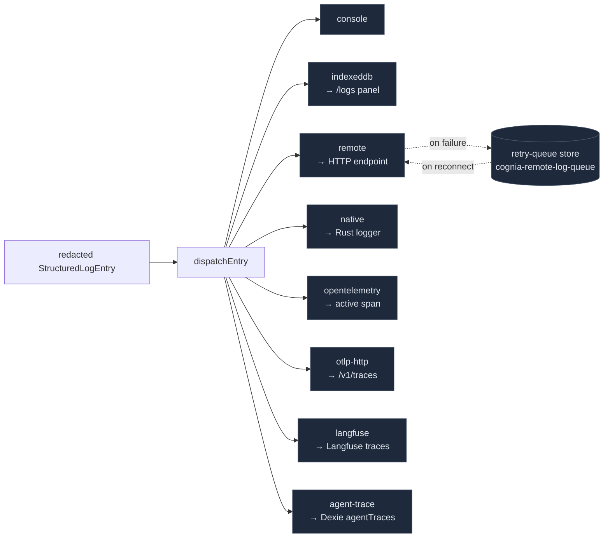

# Transports

<Status variant="stable" />

<TLDR>
  A transport is anything implementing `Transport` (`types/logging/transport.ts:33`): a `name` and a
  `log(entry)` method, optionally `flush/close/getHealth/getPendingCount`. The pipeline fans every
  redacted entry to all registered transports. Nine exist: **console** (sync, colored), **indexeddb**
  (batched, retention + LRU eviction, cross-tab `BroadcastChannel`), **remote** (`fetch` POST + a
  *durable* IndexedDB retry queue + Sentry/Loggly wire shims), **native** (Tauri `invoke` to the Rust
  logger), **opentelemetry** (attaches span events to the active OTel span), **otlp-http** (exports
  agent-trace spans to `/v1/traces`), **langfuse** (groups entries into traces), and **agent-trace**
  (persists embedded spans to Dexie). Health is exactly `healthy | degraded | offline` — there is no
  `unhealthy` state.
</TLDR>

<StatGrid>
  <Stat label="Transports" value="9" hint="console · indexeddb · remote · native · otel · otlp-http · langfuse · agent-trace · (retry-queue store)" />
  <Stat label="Health states" value="3" hint="healthy · degraded · offline (transport.ts:8)" />
  <Stat label="Durable queues" value="2" hint="remote retry-batches + indexeddb buffer" />
  <Stat label="minLevel-gated" value="2" hint="native + langfuse default to warn" />
  <Stat label="Span sinks" value="3" hint="otlp-http · agent-trace · (otel span events)" />
</StatGrid>

## The Transport Interface

```ts title="types/logging/transport.ts:33"
export interface Transport {
  name: string
  log(entry: StructuredLogEntry): void | Promise<void>   // the only required method
  flush?(): void | Promise<void>
  close?(): void | Promise<void>
  getHealth?(): TransportHealthSnapshot
  getPendingCount?(): number
}
```

`log()` is the only mandatory member. There is **no** `enabled` or `minLevel` field on the interface —
enabling is decided in `bootstrap.ts`, and only `native` and `langfuse` expose a per-transport
`minLevel` option (both default `"warn"`). The health snapshot is a fixed shape
(`transport.ts:10`):

```ts
interface TransportHealthSnapshot {
  transport: string
  status: "healthy" | "degraded" | "offline"   // transport.ts:8 — the ONLY three states
  queueDepth: number; retryCount: number; droppedEntries: number
  lastSuccessAt?; lastFailureAt?; lastError?; updatedAt
}
```



## console

`console-transport.ts` — one-way synchronous write to `globalThis.console`, picking the method by
level (`getConsoleMethod`, `:122`; error+fatal → `console.error`). Colored `%c` prefix only in the
browser, stack printed separately, traceId truncated to 8 chars. No buffering, no health. `name =
"console"` (`:65`).

## indexeddb

`indexeddb-transport.ts` — the durable browser store and the **default query source for the log
panel**. Writes to a dedicated `cognia-logs` IndexedDB database (separate from the main Dexie DB),
object store `logs` keyed by `id` with indexes on `timestamp/level/module/traceId`. Buffered
(`bufferSize` 50, `flushInterval` 1000 ms). Two cleanup rules run in `cleanup()` (`:175`):

```ts title="lib/logging/transports/indexeddb-transport.ts:178"
const cutoff = Date.now() - (this.options.retentionDays || 7) * 24*60*60*1000
const range = IDBKeyRange.upperBound(cutoffDate)   // 1) time-based purge
// 2) max-entries LRU: if count > maxEntries (10000), delete oldest-by-timestamp first
```

On flush it posts `{ type: "logs-flushed" }` to a cross-tab `BroadcastChannel`
(`cognia-logs-updates`); `IndexedDBTransport.onLogsUpdated(cb)` (`:448`) is the **only** push
mechanism the panel subscribes to — there is no Rust event in the panel's data path. A failed flush
re-queues entries via `buffer.unshift`.

## remote

`remote-transport.ts` — ships batches to an HTTP endpoint via `fetch` POST with online/offline
awareness, exponential backoff, and a **durable IndexedDB retry queue**. Its health is queue-driven,
not threshold-based:

```ts title="lib/logging/transports/remote-transport.ts:195"
private resolveStatus(): TransportHealthStatus {
  if (!this.isOnline) return "offline"
  if (queueDepth > 0 || retryCount > 0) return "degraded"
  return "healthy"
}
```

Send uses an `AbortController` timeout; after `maxRetries` (3) with delay `retryDelay * 2^attempt`, the
batch is persisted to the retry queue and replayed on reconnect (`flushRetryQueue` emits
`logger.remote.recovered`). An optional `transform` reshapes the body — two shims ship:

```ts title="lib/logging/transports/remote-transport.ts:516"
export function sentryTransform(entries) { /* → {level, message, timestamp, extra, tags} */ }
export function logglyTransform(entries) { /* → {level, message, timestamp, tag, traceId, …} */ }
```

These are **wire-format shims only** — no Sentry/Loggly SDK is bundled.

### remote-retry-queue-store

`remote-retry-queue-store.ts` is the durable backing for `remote`: an IndexedDB store
(`cognia-remote-log-queue` / `retry-batches`) with an in-memory fallback when IDB is unavailable.
Capacity is enforced by dropping the oldest batches (FIFO) until under both limits
(`DEFAULT_LIMITS = { maxEntries: 5000, maxBytes: 10 MiB }`):

```ts title="lib/logging/transports/remote-retry-queue-store.ts:259"
while (mutable.length > 0 &&
  (stats.entryCount > this.limits.maxEntries || stats.totalBytes > this.limits.maxBytes)) {
  const oldest = mutable.shift()                  // FIFO oldest by sorted id
  droppedEntries += oldest.entries.length
  await this.deleteBatch(oldest.id)
}
```

## native

`native-transport.ts` — forwards entries to the Rust native logger, **only on desktop**. It is
`minLevel`-gated (default `"warn"`) and Tauri-gated (`isTauri()`), batched (`batchSize` 10). The
forward is a Tauri **command**, not an event:

```ts title="lib/logging/transports/native-transport.ts:81"
const forwarded = await forwardPlatformLoggingEntries(
  entries.map((entry) => ({ level, module, message, timestamp, traceId, sessionId,
    data: normalizeEntryData(entry) }))
)
// → invoke("platform_logging_forward", { entries })   (lib/native/native-logging.ts:125)
```

Initial health is `isTauri() ? "healthy" : "offline"`. A failed forward re-buffers and reports
`"degraded"`. The Rust side of this is [Rust dispatch & OS bridges](./rust-logging).

## opentelemetry

`otel-transport.ts` — attaches each log as a **span event** on the currently-active OpenTelemetry
span. It lazy-loads `@opentelemetry/api` as an optional dependency and silently no-ops when it's
absent. `name = "opentelemetry"`, `minLevelForSpanEvents` default `"info"`. For `error`/`fatal` it
calls `span.recordException` + `span.setStatus({ code: ERROR })`. Helpers `getOtelContext()` and
`withOtelSpan(name, fn)` (tracer `"cognia-logger"`) let other code participate in the active trace.

## otlp-http

`otlp-http-transport.ts` — an OTLP/HTTP **JSON** exporter for **agent-trace spans** (not generic
logs). `name = "agent-trace-otlp"`, off by default. It extracts spans whose entry carries
`data.kind === AGENT_TRACE_SPAN_KIND`, batches (`bufferSize` 32), and POSTs to a configured
`/v1/traces` endpoint via `spansToOtlp` (see [agent-trace](./agent-trace)). Retry classification is
HTTP-aware — 4xx (except 408/429) is non-retryable; 5xx/timeout retried with
`delay = min(30s, retryBaseMs * 2^attempt)`. Health is `degraded` when there's no endpoint or a
`lastError`, else `healthy` (never `offline`). Content capture is PII-gated via `hasNoLeakingPii`.
`grafanaCloudHeaders` builds `Authorization: Basic …` for Grafana Cloud / Tempo / Honeycomb / Datadog
OTLP.

## langfuse

`langfuse-transport.ts` — an LLM-observability sink that groups entries into Langfuse traces. It
lazy-imports `@/lib/ai/observability/langfuse-client`, buffers, and on flush groups by
`traceId || sessionId || "default"`, creating one trace per group and one span per entry:

```ts title="lib/logging/transports/langfuse-transport.ts:127"
const traceKey = entry.traceId || entry.sessionId || "default"
// → createChatTrace({ sessionId: traceKey, ... }); per entry:
const spanName = `${eventPrefix||"log"}.${entry.level}.${entry.module}`
const span = createSpan(trace, { name: spanName, input: entry.message,
  level: mapLogLevelToLangfuse(entry.level) })
```

`minLevel` default `"warn"`. `mapLogLevelToLangfuse`: trace/debug→`DEBUG`, info→`DEFAULT`,
warn→`WARNING`, error/fatal→`ERROR`.

## agent-trace

`agent-trace-transport.ts` — the span persistence sink. It detects span-shaped entries
(`data.kind === AGENT_TRACE_SPAN_KIND`), sanitizes previews, buffers (32), and writes the embedded
`AgentTraceSpan` rows to the Dexie `agentTraces` table via `bulkInsertSpans`, with retention pruning
(`pruneOlderThan`, default 7 days). Health is binary: `degraded` if `lastError`, else `healthy`.
This is the write side of the [tracing dashboard](./tracing-dashboard) and the agent-trace tab of the
log panel. Privacy: `captureContent: false` by default strips `inputPreview`/`outputPreview`; when on,
previews are truncated to `maxPreviewBytes` and gated through `hasNoLeakingPii`.

## Health Model — At a Glance

| Transport | Destination | Buffered | Health logic |
| --- | --- | --- | --- |
| console | `console` | no | none |
| indexeddb | IDB `cognia-logs` + BroadcastChannel | yes (50) | none |
| remote | `fetch` POST + durable retry queue | yes (50) | `offline` / `degraded`(queue>0 \|\| retry>0) / `healthy` |
| native | Tauri `invoke(platform_logging_forward)` | yes (10) | `offline`(non-Tauri) / `degraded`(fail) / `healthy`; minLevel warn |
| opentelemetry | active OTel span events | no | none |
| otlp-http | OTLP `/v1/traces` | yes (32) | `degraded`(no endpoint \|\| lastError) / `healthy` |
| langfuse | Langfuse SDK | yes (10) | none; minLevel warn |
| agent-trace | Dexie `agentTraces` | yes (32) | `degraded`(lastError) / `healthy` |

`getTransportHealthSnapshot()` (`core.ts:587`) pulls all transport snapshots at once; the log panel's
stats bar and the settings transports tab render them, and the `useTransportHealth` hook polls them
every 3 s with a 30-sample queue-depth sparkline history.

## Where to Start

| Goal | File |
| --- | --- |
| Add a transport | implement `Transport` in `transports/<name>-transport.ts` → export in `transports/index.ts` → register in `bootstrap.ts:applyTransportSettings` |
| Point remote at a service | set endpoint + (optionally) `sentryTransform`/`logglyTransform` in the settings remote form |
| Enable OTLP span export | flip `agentTraceOtlp` + endpoint preset (`off`/`grafana-cloud`/`self-hosted`/`custom`) |
| Tune the durable queue | `DEFAULT_LIMITS` in `remote-retry-queue-store.ts` |
