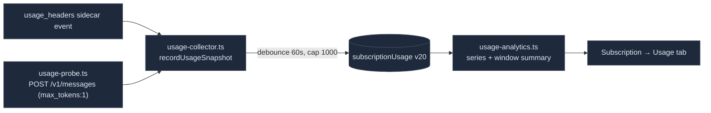

# Usage & Telemetry

<Status variant="stable" />

<TLDR>
  Three standalone surfaces sit beside the dashboards. **Context-window math** —
  `lib/claude/usage.ts` is the canonical util sizing the window (1M for Claude 4.6+, 200k otherwise)
  and computing occupancy; the composer `ContextUsageIndicator` and `/context` read it. **Per-turn
  usage** — `lib/db/session-usage.ts` persists one token/cost row per SDK result (Dexie v24);
  `lib/usage/session-analytics.ts` back-fills cost for non-SDK turns and aggregates by model/day/
  session for the Subscription Usage tab. **Anthropic quota** —
  `lib/subscription/anthropic/usage-collector.ts` drains `usage_headers` events and an opt-in
  `usage-probe.ts` actively pings `/v1/messages` to read rate-limit headers, persisted to
  `subscriptionUsage` (Dexie v20) and analyzed by `usage-analytics.ts`. **Inbox telemetry** —
  `lib/telemetry/` writes connector-pipeline breadcrumbs to a ring-buffer. None of these feed the
  observability dashboard or log panel; they're their own panes.
</TLDR>

<StatGrid>
  <Stat label="Default window" value="200k" hint="DEFAULT_CONTEXT_WINDOW (usage.ts:25)" />
  <Stat label="Large window" value="1M" hint="Claude 4.6/4.7/4.8 + [1m] builds (usage.ts:44)" />
  <Stat label="Auto-compact" value="83.5%" hint="AUTO_COMPACT_FRACTION (usage.ts:32)" />
  <Stat label="Usage tables" value="3" hint="sessionUsage v24 · subscriptionUsage v20 · pluginSkillUsage v37" />
  <Stat label="Quota sources" value="2" hint="passive headers + opt-in probe" />
  <Stat label="Probe cost" value="~11 tokens" hint="10 in + 1 out per probe (usage-probe.ts)" />
</StatGrid>

## Context-Window Math (Canonical)

`lib/claude/usage.ts` is the single source of truth for context-window sizing — it owns its own
model→window table so the composer bundle doesn't pull in the provider catalog. First-match-wins, with
explicit `[1m]` build markers checked before family defaults:

```ts title="lib/claude/usage.ts:44"
const MODEL_CONTEXT_WINDOWS: Array<{ pattern: RegExp; window: number }> = [
  { pattern: /\[1m\]/i, window: 1_000_000 },
  { pattern: /[-._]1m(\b|$)/i, window: 1_000_000 },
  { pattern: /claude-opus-4-(6|7|8)/i, window: 1_000_000 },
  { pattern: /claude-sonnet-4-(6|7|8)/i, window: 1_000_000 },
  { pattern: /claude-(opus|sonnet|haiku)/i, window: 200_000 },
  { pattern: /gpt-4o/i, window: 128_000 },
  { pattern: /gpt-4\.1/i, window: 1_000_000 },
  { pattern: /gemini-(1\.5|2\.5|3)/i, window: 1_000_000 },
]
```

`tokensInWindow(usage)` (`:103`) sums input + output + cacheRead + cacheCreation; `contextLevel`
classifies the fraction (`crit ≥ 0.835`, `warn ≥ 0.6`, else `ok`); `computeContextWindowUsage` ties it
together for the indicator. `getLatestUsage(messages)` walks tail-forward so a streaming turn doesn't
reset the read-out.

`components/chat/context-usage-indicator.tsx` is the single composer/workflow ring (consolidating two
former `<Context>` blocks + a deleted header `ContextGauge`). It draws the fill bar with an
auto-compact threshold marker at `AUTO_COMPACT_FRACTION`. `components/agent/workspace/token-usage-line.tsx`
is the compact in/out/total read-out for Agent Team chat.

## Per-Turn Session Usage

`lib/db/session-usage.ts` persists one row per SDK `result` event, keyed by the Anthropic `messageId`
(naturally idempotent). Written by `recordResultUsage` from the chat and team hooks:

```ts title="lib/db/session-usage.ts:19"
export interface SessionUsageRow {
  messageId: string        // PK
  sessionId: string; characterId?: string; at: number; model?: string
  inputTokens: number; outputTokens: number
  cacheCreationTokens: number; cacheReadTokens: number
  costUsd: number          // SDK total_cost_usd; 0 when missing
  durationMs: number
}
```

Dexie v24: `sessionUsage: "&messageId, sessionId, [sessionId+at], at, model, characterId"`. Aggregators
(`totalsBySession`, `topByCost`) feed the session-cost badge and the agent-runtime sessions tab.

`lib/usage/session-analytics.ts` is the billing analytics layer — it **back-fills** cost for non-SDK
turns (which land `costUsd: 0`) from static pricing, applying cache multipliers:

```ts title="lib/usage/session-analytics.ts:43"
if (row.costUsd > 0) return row.costUsd
const pricing = row.model ? priceFor(row.model) : null
if (!pricing) return 0
return (
  row.inputTokens * inRate + row.outputTokens * outRate +
  row.cacheReadTokens * inRate * CACHE_READ_MULT +       // 0.1
  row.cacheCreationTokens * inRate * CACHE_WRITE_MULT     // 1.25
)
```

It then aggregates by model / day / session and exports CSV/JSON for the Usage tab.

## Anthropic Quota Acquisition

Two sources persist into the `subscriptionUsage` Dexie table (v20), parsed from
`anthropic-ratelimit-unified-*` headers:



`usage-collector.ts` subscribes to `usage_headers` events and persists with a per-source 60 s debounce
and a 1000-row cap (oldest trimmed). `usage-probe.ts` is the **active, opt-in** path (Settings →
Subscription → Claude → `probeEnabled`): it POSTs a near-empty request to the cheapest header-emitting
model and parses the rate-limit headers — costing ~10 input + 1 output token per probe (even a 429
still yields a valid snapshot):

```ts title="lib/subscription/anthropic/usage-probe.ts:43"
const body = JSON.stringify({ model: PROBE_MODEL, max_tokens: 1,
  messages: [{ role: "user", content: "." }] })
// POST https://api.anthropic.com/v1/messages with OAuth bearer → parse unified headers
```

`usage-analytics.ts` is pure and clock-injectable — `buildUtilizationSeries` (5h/7d percent series),
`summarizeCurrentWindow` (gauges + reset countdown), `levelForUtilizationPct` (`crit ≥ 100`, `warn ≥
threshold`). The Usage tab (`usage-tab.tsx`, Tauri-only) renders the trend chart, current-window
gauges, model breakdown, cost-over-time, and top sessions — reusing `chart-palette`/`chart-config`
from `lib/observability/` for **styling only** (not a shared data plane).

## Inbox Connector Telemetry

`lib/telemetry/inbox-events.ts` is a fire-and-forget breadcrumb writer for the connector pipeline —
one row per `inbound.received` / `outbound.sent` / `breaker.open` event, appended to the
`inboxTelemetryEvents` Dexie ring-buffer, swallowing errors so telemetry never blocks the runtime:

```ts title="lib/telemetry/inbox-events.ts:43"
try {
  return await append({ kind, at: input.at ?? Date.now(),
    adapterId: input.adapterId, conversationKey: input.conversationKey, fields: input.fields })
} catch { return null }   // best-effort — never block the caller
```

`inbox-telemetry-export.ts` serializes the ring-buffer to CSV/JSON for Settings → Diagnostics →
Export. `lib/db/plugin-skill-usage.ts` (v37) tracks usage counters for plugin-contributed skills, and
`lib/storage/usage.ts` powers the mobile storage page (`navigator.storage.estimate()` + backup sizes)
— both standalone.

## How These Relate to the Dashboards

None of these modules write to the observability dashboard or log-panel data plane. They are three
independent panes:

| Plane | Table | Surfaces |
| --- | --- | --- |
| Token/cost usage | `sessionUsage` v24 | Subscription Usage tab, session-cost badge, composer indicator |
| Anthropic quota | `subscriptionUsage` v20 | Subscription Usage / Overview tabs |
| Inbox telemetry | `inboxTelemetryEvents` | Settings → Diagnostics export |

The only coupling is cosmetic — the Usage tab borrows `lib/observability`'s Recharts styling constants
for visual consistency.

## Where to Start

| Goal | File |
| --- | --- |
| Add a model's context window | `MODEL_CONTEXT_WINDOWS` in `lib/claude/usage.ts:44` |
| Change cache cost multipliers | `CACHE_READ_MULT` / `CACHE_WRITE_MULT` in `lib/usage/session-analytics.ts` |
| Add a quota metric | `lib/subscription/anthropic/parser.ts` + `usage-analytics.ts` |
| Add an inbox telemetry kind | `InboxTelemetryKind` + `trackInboxEvent` call sites |
