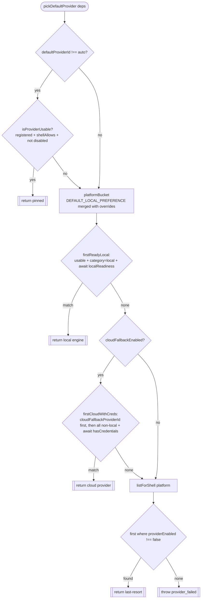
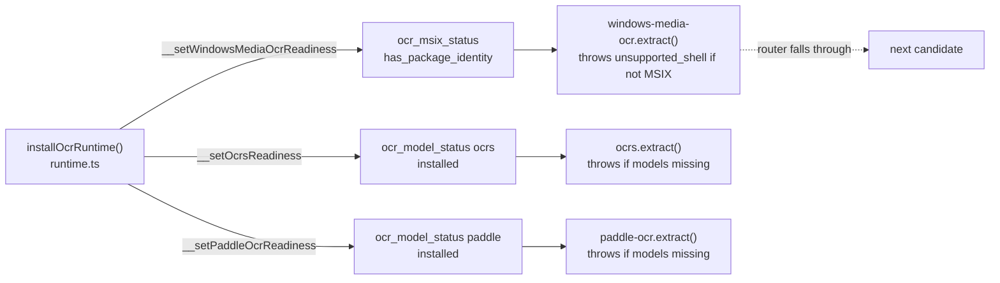

# Auto-router

<Status variant="beta">Pure selection — lib/ocr/auto-router.ts</Status>

<TLDR>
  When a caller doesn't pin a `providerId`, `pickDefaultProvider(deps)` (`auto-router.ts:149`) chooses one. It is
  a **pure async function** — registry, settings, platform, an optional readiness probe, and an optional
  credentials probe all arrive via `AutoRouterDeps`, so the whole decision table is unit-testable without a
  backend. The decision runs four steps: pinned setting → platform-local engine → cloud fallback → last-resort
  any-enabled. The per-OS preference table is `DEFAULT_LOCAL_PREFERENCE` (`auto-router.ts:67`); MSIX and
  model-download gating actually happen **inside the provider** (wired by `runtime.ts`), not via the router's
  readiness param in production.
</TLDR>

## The decision

```ts
// auto-router.ts:149 — the full body
export async function pickDefaultProvider(deps: AutoRouterDeps): Promise<OcrProvider> {
  // 1. Explicit setting wins.
  if (deps.settings.defaultProviderId !== "auto") {
    const pinned = deps.registry.get(deps.settings.defaultProviderId)
    if (isProviderUsable(pinned, deps.platform, deps.settings)) return pinned
  }
  // 2. Platform-local engine.
  const localPick = await firstReadyLocal(deps, platformBucket(deps))
  if (localPick) return localPick
  // 3. Cloud fallback.
  if (deps.settings.cloudFallbackEnabled) {
    const cloudPick = await firstCloudWithCreds(deps, allCloudCandidates(deps))
    if (cloudPick) return cloudPick
  }
  // 4. Last resort — any enabled, shell-compatible provider.
  for (const p of deps.registry.listForShell(deps.platform)) {
    if (deps.settings.providerEnabled[p.id] === false) continue
    return p
  }
  throw new OcrError("provider_failed", "auto-router", "No OCR provider is available …")
}
```



<Callout type="info" title="4 steps in code, 3 in the ADR">
  ADR-0024 documents three signals (pinned → platform-local → cloud fallback). The code adds a fourth
  **last-resort** branch (`auto-router.ts:168`): it returns any enabled, shell-compatible provider even when
  cloud fallback is off or uncredentialed, so the router only throws when the registry has nothing
  shell-compatible at all. Also, the `mistral-ocr` default is not hardcoded in the router — it comes from
  `settings.cloudFallbackProviderId` (whose default lives in `DEFAULT_OCR_SETTINGS`).
</Callout>

The shared gate `isProviderUsable` (`auto-router.ts:79`) is `registered && shellAllows && providerEnabled !== false`.
`resolveProviderById` (`auto-router.ts:182`) is the synchronous path used when the caller *does* pin an id — it
throws `provider_failed` for an unknown id and `unsupported_shell` when the provider doesn't run in this shell.

## The per-OS preference table

```ts
// auto-router.ts:67 — head = strongest preference; settings.platformOverrides merges over this
export const DEFAULT_LOCAL_PREFERENCE = {
  tauri:   [],
  mobile:  [],
  web:     ["tesseract-wasm"],
  windows: ["windows-media-ocr", "ocrs", "paddle-ocr", "tesseract-native", "tesseract-wasm"],
  macos:   ["apple-vision", "ocrs", "paddle-ocr", "tesseract-native", "tesseract-wasm"],
  linux:   ["ocrs", "paddle-ocr", "tesseract-native", "tesseract-wasm"],
  ios:     ["apple-vision", "tesseract-wasm"],
  android: ["mlkit-android", "tesseract-wasm"],
  browser: ["tesseract-wasm"],
}
```

`platformBucket` (`auto-router.ts:119`) merges `{ ...DEFAULT_LOCAL_PREFERENCE, ...deps.localPreference }`, then
keys by `osTag` when present, else maps `web → browser`. Note that the bare `tauri` / `mobile` buckets are
**empty** — so the `osTag` drill-in (`windows`/`macos`/`linux`/`ios`/`android`) is required to reach a real
local engine on desktop/mobile. `local-http` is deliberately absent from every bucket (it is user-pinned only).

The settings **Platform Overrides** tab writes `settings.platformOverrides`; reverting a bucket to its default
ordering deletes the key rather than storing a redundant copy. See [Settings UI](./settings-ui).

## How readiness & credentials actually gate

`AutoRouterDeps` (`auto-router.ts:41`) exposes two injectable probes — `localReadiness(id)` and
`hasCredentials(id)` — both defaulting to `() => true`. They are exercised exhaustively in unit tests, **but in
production `extract()` does not pass them** (`index.ts:220` calls `pickDefaultProvider` with only
registry/settings/platform/osTag/localPreference). Instead:



So **MSIX gating** (`windows-media-ocr`) and **model-download gating** (`ocrs` / `paddle-ocr`) live at the
provider's `extract()` boundary — the provider throws `unsupported_shell` and the dispatch falls through to the
next candidate. The router's own `localReadiness` / `hasCredentials` injection points remain available for
future wiring and for tests.

## The connection probe — `probe.ts`

`probeOcrProvider(providerId, deps, opts)` (`probe.ts:41`) is the settings "Probe connection" button. It runs a
real `extract()` against a 67-byte 1×1 transparent PNG with `useCache: false` and normalizes any throw into a
`ProbeOutcome`:

```ts
// probe.ts:16
export interface ProbeOutcome {
  ok: boolean
  durationMs: number
  error?: { code: OcrErrorCode; message: string }
}
```

`toProbeError` (`probe.ts:71`) duck-types `OcrError` so a cross-module `OcrError` still yields a typed `code`.
This is a **connection** health check — distinct from the router's **readiness** (`isReady`) and **credentials**
(`hasCredentials`) gates. Three separate concepts.

## Use-case recommendations — `provider-recommendations.ts`

This is **not** part of the router — it seeds the [setup wizard](./settings-ui). `RECOMMENDATION_MAP`
(`provider-recommendations.ts:30`) is a static curated lookup from a use-case to a starter preset (ordered
provider list with the head as the default, plus default languages / format / a `prefersLlmVision` flag):

| Use case | Providers (head = default) | Langs | Format |
| --- | --- | --- | --- |
| `chineseReceipts` | `paddle-ocr` · `lark-basic` · `mistral-ocr` | zh, en | markdown |
| `handwriting` | `google-vision` · `azure-document-intelligence` · `anthropic-vision` | en | markdown |
| `formulas` | `mathpix` · `anthropic-vision` · `gemini-vision` | en | markdown |
| `scannedContracts` | `azure-document-intelligence` · `aws-textract` · `abbyy-cloud` | en | blocks |
| `webScreenshots` | `mistral-ocr` · `gemini-vision` · `apple-vision` | en | markdown |
| `mixed` | `mistral-ocr` · `tesseract-wasm` · `anthropic-vision` | en | markdown |

`validateRecommendationMap` (`provider-recommendations.ts:74`) asserts every preset has ≥1 provider and that
every id exists in `OCR_PROVIDER_CAPABILITIES` — a drift guard against renaming a provider out from under the
wizard.
