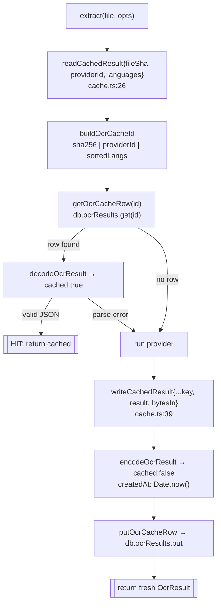

# Cache

<Status variant="beta">ocrResults — Dexie v36 (DB v70)</Status>

<TLDR>
  The same image + provider + language combo never spends twice. `extract()` reads through a Dexie table keyed by
  `sha256(file) | providerId | sortedLangs` (`lib/db/ocr-results.ts:33`); a hit returns instantly with
  `cached: true`, a miss runs the provider and writes back. The on-disk row stores the `OcrResult` as JSON
  (`cached: false`) plus `createdAt` for TTL math and `bytesIn` for the settings stats. The `ocrResults` table was
  introduced at **schema v36** and has not changed since (the database is now at v70). A `purgeOcrCacheOlderThan`
  TTL sweep exists but is **not** wired to a cron — clearing is manual.
</TLDR>

## The table

`ocrResults` is declared at `lib/db/schema.ts:263` and introduced in the v36 migration:

```ts
// lib/db/schema.ts:1191 — never re-declared after v36
this.version(36).stores({
  ocrResults: "&id, providerId, createdAt, fileSha",
})
```

| Index | Role |
| --- | --- |
| `&id` | primary key — the cache id (`fileSha` + `providerId` + `langs`), unique |
| `providerId` | per-provider purge (`clearOcrCacheForProvider`) |
| `createdAt` | TTL purge (`purgeOcrCacheOlderThan`) |
| `fileSha` | "all results for this file" (index present; no helper uses it yet) |

The row shape (`OcrResultRow`, `ocr-results.ts:14`):

<TypeTable
  type={{
    id: { description: "Primary key — the cache id: fileSha, providerId and langs joined by pipes.", type: "string" },
    fileSha: { description: "SHA-256 of the input bytes.", type: "string" },
    providerId: { description: "Provider that produced the result.", type: "string" },
    langs: { description: "Comma-joined, lowercased + sorted language list (empty string when none).", type: "string" },
    result: { description: "JSON-encoded OcrResult, stored with cached:false.", type: "string" },
    createdAt: { description: "Epoch ms — indexed for TTL cleanup.", type: "number" },
    bytesIn: { description: "Input byte count — feeds the cache stats row.", type: "number" },
  }}
/>

## The key formula

```ts
// ocr-results.ts:33 — buildOcrCacheId
const normalized = (langs ?? []).map((l) => l.toLowerCase()).sort()
return `${fileSha}|${providerId}|${normalized.join(",")}`
```

Separator is `|`; languages are **lowercased then sorted** before joining with `,`. That normalization means
`["EN","zh"]` and `["zh","en"]` collide on the same entry — intentional, so case and order never fragment the
cache.

## Read-through / write-back

`cache.ts` (55 lines) is the thin wrapper `extract()` calls; `ocr-results.ts` (116 lines) is the Dexie CRUD
beneath it.



`readCachedResult` is a pure hit/miss — both a missing row **and** corrupt JSON yield `null` (the run proceeds).
Note that reads do **no** TTL check: staleness is handled only by the manual purge below. `encodeOcrResult`
(`ocr-results.ts:102`) forces `cached: false` on the stored copy; `decodeOcrResult` (`ocr-results.ts:108`) flips
it back to `cached: true` on read.

## TTL purge & clearing

```ts
// ocr-results.ts:73 — manual TTL sweep; ttlMs <= 0 means "never expire"
export async function purgeOcrCacheOlderThan(ttlMs, now = Date.now()): Promise<number> {
  if (!Number.isFinite(ttlMs) || ttlMs <= 0) return 0
  const stale = await db.ocrResults.where("createdAt").below(now - ttlMs).primaryKeys()
  if (stale.length === 0) return 0
  await db.ocrResults.bulkDelete(stale)
  return stale.length
}
```

<Callout type="warn" title="purgeOcrCacheOlderThan is not wired to a cron">
  A repo-wide search finds `purgeOcrCacheOlderThan` referenced only by its own test and the ADR text — there is
  no production caller. The `cacheTtlDays` setting (default 30) is surfaced in the UI, but expiry is **manual**:
  the user clears the cache from the settings Cache tab. ADR-0024's "not wired to a cron yet" still holds.
</Callout>

The clear helpers:

| Helper | file:line | Effect |
| --- | --- | --- |
| `clearOcrCache()` | `ocr-results.ts:54` | global — counts then `.clear()`, returns count |
| `clearOcrCacheForProvider(id)` | `ocr-results.ts:61` | per-provider — `where("providerId").equals(id)` → `bulkDelete` |
| `ocrCacheStats()` | `ocr-results.ts:87` | `{ count, bytes }` — sums `bytesIn`, feeds the Cache tab header |

The settings [Cache tab](./settings-ui) is the only surface that drives these today; the Auto-Router panel's
"clear all cache" button also calls `clearOcrCache()`.
