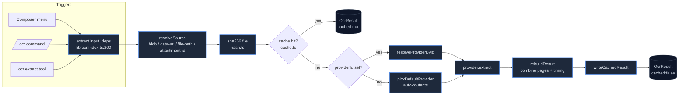

# OCR Subsystem

<Status variant="beta">Beta · ocrResults schema v36 (DB v70)</Status>

<TLDR>
  The OCR subsystem turns an image or PDF into Markdown / plain text / structured blocks through a single
  entry point — `extract(input, deps)` (`lib/ocr/index.ts:200`). Every caller (composer menu, `/ocr` command,
  `ocr.extract` plugin tool) funnels through it, so the **SHA-256 read-through cache**, the **pure auto-router**,
  and the **keyring credential lookup** all live in one place. Twenty providers register into a shared registry
  (`lib/ocr/runtime.ts:51`) spanning four families — cloud document OCR, LLM-vision, on-device engines, and a
  self-hosted HTTP adapter. PDFs take a **text-layer fast-path** (`lib/ocr/pdf-router.ts:79`) that skips OCR on
  digital pages entirely; five native backends ride opt-in Cargo features in `src-tauri/src/ocr/`.
</TLDR>

<StatGrid>
  <Stat label="Source files" value="60+" hint="lib/ocr (27) + lib/db/ocr-results + components/settings/ocr (17) + plugins/ocr + hooks/use-ocr + src-tauri/src/ocr (6 Rust)" />
  <Stat label="Providers" value="20" hint="ALL_PROVIDERS — lib/ocr/runtime.ts:51" />
  <Stat label="Provider categories" value="5" hint="document-cloud · llm-vision · specialist · lark · local" />
  <Stat label="Dexie tables" value="1" hint="ocrResults — introduced at schema v36, unchanged since" />
  <Stat label="Native Tauri commands" value="5" hint="extract · list_backends · model_status · download_model · msix_status" />
  <Stat label="Detail-panel tabs" value="5 + 3" hint="per-provider: Config · Capabilities · Try It · Models · Advanced — plus Auto-Router: Defaults · Platform · Cache" />
</StatGrid>

The OCR subsystem gives every shell — browser (static export), Tauri 2.9 desktop, Capacitor 7 mobile — a
first-class way to pull text out of images and PDFs **without** forwarding them to a multimodal model. The
design rationale is in [ADR-0024](../../adr/0024-ocr-subsystem). This section documents the **current
implementation**, module by module — including the handful of places where the code has drifted from the ADR.

## Where it lives

```
lib/ocr/
  index.ts            # the public extract() entry point + dispatch
  types.ts            # the whole type model (OcrInput, OcrResult, OcrProvider, UserOcrSettings)
  registry.ts         # OcrRegistry — id → provider, shell gating
  runtime.ts          # installOcrRuntime() — registers the 20 providers + wires native invokers
  auto-router.ts      # pickDefaultProvider — pure 4-step selection
  provider-recommendations.ts  # use-case → starter preset (setup wizard)
  probe.ts            # connection health check (1×1 PNG)
  pdf-router.ts       # two-pass: text-layer fast-path → OCR fallback
  image-prep.ts       # normalize / page-range / language / page-divider / downscale
  blob-utils.ts       # cross-runtime Blob → ArrayBuffer
  hash.ts             # SHA-256 (WebCrypto) — the cache-key identity
  cache.ts            # read-through / write-back over the Dexie row
  capabilities.ts     # static per-provider capability matrix (UI metadata)
  ocr-parameter-schemas.ts     # per-provider config form schemas
  providers/          # 20 providers + 3 shared helpers (_http / _llm-vision / _sigv4)

lib/db/ocr-results.ts          # the ocrResults Dexie table + CRUD + purge
lib/slash-commands/actions/ocr.ts   # the /ocr command parser + dispatcher
plugins/ocr/src/index.ts            # the ocr.extract agent tool + /ocr registration
hooks/use-ocr.ts                    # React hook wrapping extract() with abort
components/settings/ocr/            # sidebar + detail panel + 8 tabs + setup wizard
app/me/ocr/page.tsx                 # mobile settings route
src-tauri/src/ocr/                  # native command surface + NativeBackend trait + ocrs/paddle/msix
```

## The lifecycle at a glance



Each box is a chapter in this section. Read [Types & dispatch](./types-and-dispatch) first — every other module is
phrased in terms of `OcrInput` / `OcrResult` / `OcrProvider`.

## The provider matrix

Twenty providers register in `ALL_PROVIDERS` (`lib/ocr/runtime.ts:51`). The five `OcrProviderCategory` tags
(`types.ts:12`) drive the settings sidebar grouping:

| Category | `category` tag | Providers |
| --- | --- | --- |
| Document OCR (cloud) | `document-cloud` | `mistral-ocr` · `google-vision` · `aws-textract` · `azure-document-intelligence` |
| LLM vision (cloud) | `llm-vision` | `anthropic-vision` · `openai-vision` · `gemini-vision` |
| Specialist (cloud) | `specialist` | `mathpix` · `ocr-space` · `abbyy-cloud` · `nanonets` |
| Feishu / Lark (cloud) | `lark` | `lark-basic` |
| On-device + self-hosted | `local` | `tesseract-wasm` · `tesseract-native` · `windows-media-ocr` · `apple-vision` · `mlkit-android` · `ocrs` · `paddle-ocr` · `local-http` |

<Callout type="info" title="local-http is a local-category member, not a sixth category">
  ADR-0024 lists "Self-hosted HTTP" as a separate bucket, but in code there are exactly **five**
  `OcrProviderCategory` values. `local-http` carries `category: "local"` (`providers/local-http.ts:76`); its
  "never auto-selected" status is enforced by the **auto-router** excluding it from
  `DEFAULT_LOCAL_PREFERENCE` (`auto-router.ts:64`), not by a distinct category tag.
</Callout>

## Privacy & cost posture

| Concern | How it is handled |
| --- | --- |
| Credentials | Cloud providers declare `credentialKeys` (`types.ts:175`); resolved per-call via `deps.credentialsResolver` (`index.ts:130`). LLM-vision providers set `reusesMainProviderKey` and pull the main Claude/GPT/Gemini key instead of a second secret. |
| LAN endpoint secret | `local-http`'s optional bearer token lives in the settings blob, **not** the keyring, by design (`ocr-parameter-schemas.ts:140`). |
| Cost guard | LLM-vision images are downscaled to `maxImageDimension` (default 2000px long-edge) before upload (`providers/_llm-vision.ts:32`). The settings UI shows a `$`/`$$`/`$$$` cost tier per provider (`capabilities.ts`). |
| Repeat work | The Dexie cache (`cache.ts`) keys on `sha256(file)` + `providerId` + `sortedLangs` — the same image + provider + language combo never spends twice. |
| Offline floor | `tesseract-wasm` (~2 MB WASM in `public/ocr/`) gives every shell an offline engine when no cloud creds and no native binding are present. |

## Implementation status (real vs. ADR)

The extraction core, providers, router, PDF pipeline, cache, and settings UI are all **fully built and unit
tested**. A few integration seams are present but not yet connected — documented honestly here so the docs
match reality:

<Callout type="warn" title="Built & tested, not yet wired into production">
  - **Runtime bootstrap** — `installOcrRuntime()` (`runtime.ts:94`) registers all 20 providers, but has **no
    production call site** (its referenced `app/(setup)/ocr-bootstrap.tsx` does not exist). See
    [Triggers](./triggers).
  - **Credentials resolver** — every `credentialsResolver` in the tree is the empty-secrets stub
    `async () => ({ secrets: {} })`; the keyring-backed resolver is declared on `ExtractDeps` but not assembled.
  - **Composer menu** — `ocr-menu.tsx` / `ocr-result-bubble.tsx` / `useOcr` are built and tested, but
    `components/chat/composer.tsx` renders `<AttachmentPreview />` without the `onOcrSelect` prop, so the menu
    is dormant.
  - **Native bindings** — the `ocr-ocrs` and `ocr-paddle` Cargo features link real crates, and `apple-vision`
    is compiled in-process on macOS targets; `ocr-tesseract` / `ocr-windows` are empty feature flags resolving
    to a `PlaceholderBackend`. See [Native backends](./native-backends).
</Callout>

## Module map

<Cards>
  <Card title="Types & dispatch" href="./types-and-dispatch" description="The type model, extract() flow, the registry, and the runtime bootstrap that registers all 20 providers." />
  <Card title="Providers" href="./providers" description="The 20 providers by family, the 3 shared helpers (_http / _llm-vision / _sigv4), the credential model, and the capability matrix." />
  <Card title="Auto-router" href="./auto-router" description="pickDefaultProvider's pure 4-step decision, the per-OS preference table, readiness/credential gating, probe, and recommendations." />
  <Card title="PDF & image" href="./pdf-and-image" description="The two-pass PDF router, image normalization, page-range parsing, the page divider, SHA-256 hashing, and the config parameter schemas." />
  <Card title="Cache" href="./cache" description="The ocrResults Dexie table, the cache-key formula, read-through / write-back, TTL purge, and clear-cache." />
  <Card title="Native backends" href="./native-backends" description="The Rust NativeBackend trait, ocrs & paddle pipelines, MSIX probe, model download + progress events, and the Cargo features." />
  <Card title="Triggers" href="./triggers" description="The /ocr command, the ocr.extract plugin tool, the useOcr hook, the composer surface, and the runtime wiring." />
  <Card title="Settings UI" href="./settings-ui" description="The sidebar + detail-panel shell, the 5 per-provider tabs, the Auto-Router panel, the setup wizard, and model download UI." />
</Cards>

## Related

<Cards>
  <Card title="ADR-0024" href="../../adr/0024-ocr-subsystem" description="The original design rationale and the provider/feature decision record." />
  <Card title="Storage" href="../../data/storage" description="The full Dexie schema the ocrResults table lives in." />
</Cards>
