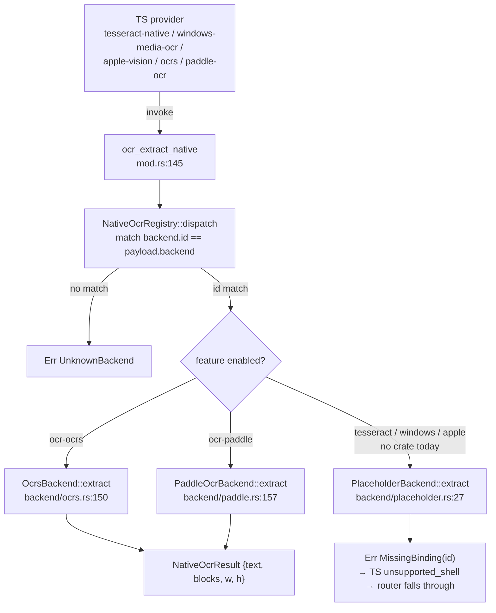

# Native backends

<Status variant="beta">Rust — src-tauri/src/ocr/</Status>

<TLDR>
  Five native engines (`tesseract` / `windows-media-ocr` / `apple-vision` / `ocrs` / `paddle-ocr`) sit behind one
  Tauri command, `ocr_extract_native` (`mod.rs:145`), which dispatches by `payload.backend` through the
  `NativeBackend` trait. Backends whose Cargo feature is off resolve to a `PlaceholderBackend` returning
  `MissingBinding`, which the TS layer reads as `unsupported_shell`. Today **only `ocr-ocrs` and `ocr-paddle` link
  real crates** — the other three features are empty flags. Two of the five Tauri commands manage downloadable
  models: `ocr_model_status` reports per-file install state, and `ocr_download_model` streams weights into
  `<app_data>/cognia/ocr/<backend>/`, emitting `ocr://download-progress` events and writing a SHA-256
  `manifest.json`.
</TLDR>

## The command surface

Registered in `src-tauri/src/lib.rs:753` (state `.manage(ocr::NativeOcrRegistry::new())` at `lib.rs:224`;
backends populated asynchronously at boot via `install_default_backends`, `lib.rs:860`):

| Command | Signature | file:line |
| --- | --- | --- |
| `ocr_extract_native` | `(state, payload: NativeOcrInvokePayload) -> Result<NativeOcrResult, String>` | `mod.rs:145` |
| `ocr_list_native_backends` | `(state) -> Result<Vec<String>, String>` | `mod.rs:154` |
| `ocr_model_status` | `(backend) -> Result<ModelStatus, String>` | `mod.rs:309` |
| `ocr_download_model` | `(app, backend) -> Result<DownloadResult, String>` | `mod.rs:358` |
| `ocr_msix_status` | `() -> Result<MsixStatus, String>` | `msix.rs:23` |

<Callout type="info" title="Five commands, not four">
  ADR-0024 lists four commands. `ocr_list_native_backends` (`mod.rs:154`) is a fifth, real and registered
  (`lib.rs:754`) — it returns the ids of every registered backend (used to enumerate what this build linked).
</Callout>

## The trait & registry

```ts
// mod.rs:83 — every native engine implements this
pub trait NativeBackend: Send + Sync {
    fn id(&self) -> &'static str;
    fn extract(&self, payload: &NativeOcrInvokePayload) -> Result<NativeOcrResult, NativeOcrError>;
}
```

`NativeOcrError` (`mod.rs:88`) has three variants — `MissingBinding(&'static str)`, `UnknownBackend(String)`,
`BackendFailure(String)` — with a `From<NativeOcrError> for String` so commands return a flat string the TS side
maps back to an `OcrErrorCode`. The registry is an `Arc<Mutex<Vec<Box<dyn NativeBackend>>>>` (`mod.rs:106`);
`dispatch()` (`mod.rs:131`) linearly matches `backend.id() == payload.backend`, else `UnknownBackend`.



`install_platform_backends` (`backend/mod.rs:36`) registers each slot — the real backend under its feature, else
`PlaceholderBackend::new("<id>")`. A test asserts exactly **five** slots are always present, so dispatch never
panics on a missing id regardless of which features are compiled in.

## The Cargo features

```toml
# src-tauri/Cargo.toml:396 — three are empty flags; only ocrs/paddle link crates
ocr-tesseract = []                                                  # :400
ocr-windows   = []                                                  # :403
ocr-apple     = []                                                  # :406
ocr-ocrs      = ["dep:ocrs", "dep:rten", "dep:rten-imageproc", "dep:image"]   # :410
ocr-paddle    = ["dep:oar-ocr", "dep:ort", "dep:image"]                       # :414
```

<Callout type="warn" title="tesseract-rs / winocr / Apple Vision are doc-only in the current tree">
  ADR-0024 describes five real bindings (tesseract-rs, winocr, a Swift sidecar, ocrs, oar-ocr). In the current
  manifest, `tesseract-rs` and `winocr` are **not declared dependencies** — `ocr-tesseract`, `ocr-windows`, and
  `ocr-apple` are empty feature flags, so those three backends compile to a `PlaceholderBackend` and return
  `MissingBinding`. Only **ocrs** and **paddle-ocr** have real backing crates today. The `ort = "=2.0.0-rc.12"`
  pin (`Cargo.toml:310`) is exact, matching the ADR.
</Callout>

`ort` is pinned to a release candidate (`=2.0.0-rc.12`, `default-features = false`, features
`download-binaries` + `copy-dylibs`) to avoid ABI churn between RCs. The shared `image` crate is feature-gated
to png/jpeg/webp/bmp/tiff.

## The two real engines

### `ocrs` — pure-Rust ONNX via RTen (`backend/ocrs.rs`, 307 lines)

Models `text-detection.rten` + `text-recognition.rten`. `ensure_engine` (`ocrs.rs:102`) lazily loads them into a
`OnceCell<OcrEngine>`, checking `missing_models` first and returning a `BackendFailure("ocrs models missing — run
ocr_download_model …")` when absent. `extract` (`ocrs.rs:150`) runs detect → find-lines → recognize, with a
per-line AABB bbox from the rotated-rect corners; **confidence is left `None`** (ocrs 0.12 exposes none).

### `paddle-ocr` — PP-OCRv5 via oar-ocr + ort (`backend/paddle.rs`, 337 lines)

Models `det.onnx` + `rec.onnx` + `dict.txt` (mandatory) plus an optional `cls.onnx`. `build_pipeline`
(`paddle.rs:132`) assembles an `OAROCR` builder, caching it behind a `Mutex<Option<OAROCR>>`. `extract`
(`paddle.rs:157`) predicts and iterates `text_regions`, emitting a polygon-AABB bbox **and** a per-region
`score` confidence (unlike ocrs).

Neither engine downloads or writes models itself — that is `mod.rs`'s job. Both honour a
`COGNIA_<ENGINE>_MODEL_DIR` env override, defaulting to `<data_dir>/cognia/ocr/<engine>/`.

## Model distribution

`model_spec(backend)` (`mod.rs:198`) is a static registry of upstream URLs (HuggingFace) per backend — `ocrs`
(~2.6 MB detection + ~10.2 MB recognition) and `paddle-ocr` (det/rec ONNX + dictionary). `ocr_download_model`
(`mod.rs:358`) streams each file, writes atomically, and emits progress:

```mermaid
sequenceDiagram
  participant TS as Settings UI (Models tab)
  participant CMD as ocr_download_model (mod.rs:358)
  participant NET as reqwest bytes_stream
  participant FS as &lt;app_data&gt;/cognia/ocr/&lt;backend&gt;/
  TS->>CMD: invoke(backend)
  CMD->>CMD: model_spec(backend)
  loop each file
    CMD->>NET: GET url (stream)
    loop each chunk
      NET-->>CMD: chunk
      CMD->>CMD: Sha256.update + append to file.partial
      CMD-->>TS: emit ocr://download-progress<br/>{bytes_done, bytes_total, file_index, file_count}
    end
    CMD->>FS: rename file.partial → file (atomic)
  end
  CMD->>FS: write manifest.json {files:[{sha256}]}
  CMD-->>TS: DownloadResult
```

Each chunk updates a `Sha256` hasher and is appended to `<file>.partial`, renamed on completion (`mod.rs:431`).
The `ocr://download-progress` event (`DownloadProgressEvent`, `mod.rs:339`) carries `backend`, `file_name`,
`bytes_done`, `bytes_total`, 1-based `file_index`, and `file_count` — emission is best-effort so a detached
listener never aborts the download. On completion a `manifest.json` (`mod.rs:445`) records each file's bytes +
SHA-256 for tamper detection on later boots. Re-downloading a file whose digest already matches is a no-op.

## The MSIX probe

`windows-media-ocr` needs Windows package identity (`Windows.Media.Ocr`). `ocr_msix_status` (`msix.rs:23`)
reports it. The cfg cascade: Windows + `ocr-windows` → `detect_msix_status_windows()`; Windows without the
feature → `false` + reason "ocr-windows Cargo feature not enabled"; non-Windows → `false` + reason "not a
Windows build".

<Callout type="warn" title="MSIX detection is currently a stub">
  `detect_msix_status_windows()` (`msix.rs:53`) returns `MsixStatus::default()` — the real probe (the comment
  names `GetCurrentPackageFullName` from the `windows` crate behind `ocr-windows`) is **not yet implemented**.
  With `ocr-windows` also being an empty feature flag, `windows-media-ocr` resolves to the placeholder regardless,
  so the MSIX gate is moot in the current tree.
</Callout>
