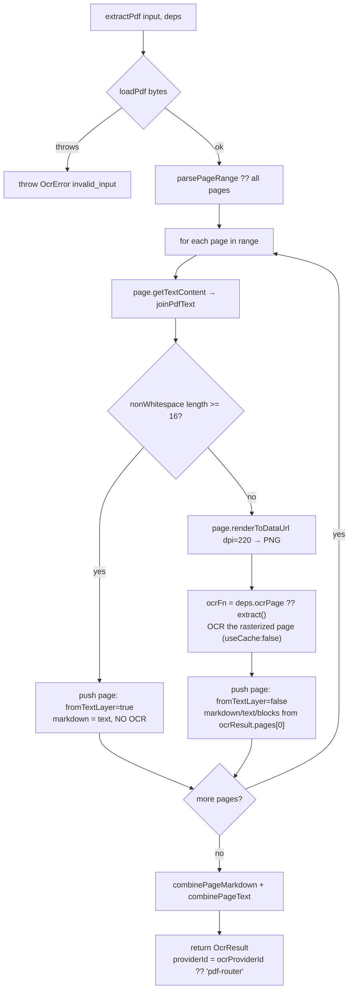

# PDF & image

<Status variant="beta">lib/ocr/ — pdf-router · image-prep · blob-utils · hash · ocr-parameter-schemas</Status>

<TLDR>
  PDFs go through `extractPdf` (`pdf-router.ts:79`), a **two-pass** router: each page's embedded text layer is read
  via pdfjs-dist, and pages with ≥16 non-whitespace characters are accepted as-is (no OCR cost); the rest are
  rasterized at 220 DPI and routed through the OCR provider. Image normalization, page-range parsing, language
  normalization, the page divider, and canvas downscaling are pure helpers in `image-prep.ts`. `hash.ts` provides
  the SHA-256 file identity (WebCrypto, not node crypto) that anchors the cache key. `ocr-parameter-schemas.ts`
  declares per-provider config forms reusing the main LLM-provider parameter renderer.
</TLDR>

## The two-pass PDF router

`extractPdf(input, deps)` (`pdf-router.ts:79`) keeps digital PDFs free and scanned PDFs accurate. The pdfjs
loader is a DI seam (`loadPdf`), so tests inject canned pages and the production loader is lazily imported
(tree-shaken out of the static export until first use).

```ts
// pdf-router.ts:28 + :81 — the two tunables (both ADR-confirmed)
export const MIN_TEXT_LAYER_CHARS = 16        // accept the text layer at ≥16 non-whitespace chars
const dpi = deps.dpi ?? 220                    // rasterize fallback pages at 220 DPI
```



The per-page decision is the heart of it:

```ts
// pdf-router.ts:101 — fast-path vs OCR fallback
const text = joinPdfText(textContent)
if (text.replace(/\s+/g, "").length >= threshold) {
  pages.push({ pageNumber, markdown: synthesizeMarkdown(text), text, fromTextLayer: true })
  continue
}
const rasterized = await page.renderToDataUrl({ dpi })
const ocrResult = await ocrFn(
  { source: { kind: "data-url", dataUrl: rasterized.dataUrl, mimeType: "image/png" },
    providerId: ocrProviderId, languages, useCache: false },
  deps.extractDeps,
)
```

`defaultPdfLoader` (`pdf-router.ts:172`) dynamically imports `pdfjs-dist`, and prefers `OffscreenCanvas` →
`convertToBlob` for rasterization, falling back to a DOM `<canvas>` and finally a jsdom-safe base64 path.

## Image-prep helpers — `image-prep.ts`

`image-prep.ts` (304 lines) is the shared value layer used by providers, the router, and `index.ts`. The
highlights:

<TypeTable
  type={{
    normalizeLanguages: { description: "First non-empty of input → settings → [\"en\"]; trims, lowercases, dedupes preserving order.", type: "(input?, settings?) => string[]" },
    parsePageRange: { description: "\"1,3-5,9\" → sorted, deduped, 1-based number[]; undefined → null (all pages); drops pages > total.", type: "(spec?, total?) => number[] | null" },
    combinePageMarkdown: { description: "Join pages with the per-page comment + divider.", type: "(pages) => string" },
    combinePageText: { description: "Join page text with blank lines (no comment markers).", type: "(pages) => string" },
    downscaleImage: { description: "Clamp the long edge to maxLongEdge via canvas; no-op without a canvas runtime.", type: "(bytes, mime, max) => Promise<…>" },
    normalizeImage: { description: "blob / data-url → bytes inline; file-path / attachment-id throw (resolve upstream).", type: "(source) => Promise<…>" },
  }}
/>

The page divider is exact (and matches ADR-0024):

```ts
// image-prep.ts:206 — combinePageMarkdown
return pages.map((p) => `<!-- page ${p.pageNumber} -->\n${p.markdown}`).join("\n\n---\n\n")
```

So each page renders as `<!-- page N -->` then its Markdown, joined by `\n\n---\n\n` — multi-page PDFs get
clear horizontal-rule boundaries. `combinePageText` (`image-prep.ts:209`) joins with blank lines and no markers.
`downscaleImage` (`image-prep.ts:224`) clamps the **long edge**, returning the input unchanged when there is no
canvas runtime (jsdom/node), when decode fails, or when the image is already small enough.

## Cross-runtime primitives

### `blob-utils.ts` — Blob → ArrayBuffer (42 lines)

A single reader: use `Blob.arrayBuffer()` when present, else `FileReader.readAsArrayBuffer`, else a last-resort
`text()` + `TextEncoder` path (text payloads only). It is the shared primitive under `image-prep` and `hash`; it
does **no** MIME sniffing (those predicates live in `image-prep`).

### `hash.ts` — SHA-256 file identity (64 lines)

The file-identity half of the cache key. The backend is **WebCrypto `crypto.subtle`** (not node `crypto`), so it
runs in every webview and under Jest (where webcrypto is polyfilled onto `globalThis.crypto`).

```ts
// hash.ts — four entry points, all subtle.digest("SHA-256", …) + hex
sha256String(value)   // :32
sha256Blob(blob)      // :38 — via readBlobAsArrayBuffer
sha256Bytes(bytes)    // :44 — slices Uint8Array to a tight ArrayBuffer
sha256DataUrl(url)    // :56 — extracts base64 payload, null for non-data-URLs
```

`extract()` calls `sha256Bytes` when bytes are already on hand (data-url sources) and `sha256Blob` otherwise —
the resulting digest is the `fileSha` component of the cache key (see [Cache](./cache)).

## Config parameter schemas — `ocr-parameter-schemas.ts`

`ocr-parameter-schemas.ts` (245 lines) declares the **per-provider config forms** shown in the settings
**Advanced** tab. They reuse the same `ProviderParameterSchema` / `ParameterDefinition` shape as the main LLM
provider settings, so the existing dynamic-form renderer (`components/settings/provider/`) works against OCR
config unchanged. Values persist under `UserOcrSettings.providerConfig[providerId]`; all labels are i18n keys
under `ocr.params.*`.

```ts
// ocr-parameter-schemas.ts:21 — COMMON_PARAMETERS, appended to every provider
languages (text, default "en") · format (select markdown/text/blocks)
pageRange (text) · maxImageDimension (number, default 2000, min 256 / max 8192 / step 64)
```

Reusable extras compose on top per provider: `PROMPT_TEMPLATE_PARAM` (vision), `MODEL_PARAM` / `REGION_PARAM` /
`ENDPOINT_PARAM`, `ENABLE_TABLES_PARAM` / `ENABLE_FORMS_PARAM` (Textract, Google), `DIALECT_PARAM`
(`umi-ocr` / `paddleocr-server` for `local-http`), `OPTIONAL_API_KEY_PARAM` (the LAN token kept in settings,
not the keyring), and `TIMEOUT_PARAM`. `OCR_PARAMETER_SCHEMAS` (`ocr-parameter-schemas.ts:175`) covers 23
schema entries; two consumer helpers expose them:

- `getOcrParameterSchema(providerId)` (`:226`) — the settings-UI lookup (null for unknown ids).
- `applyOcrParameterDefaults(providerId, config)` (`:231`) — overlays schema defaults onto a saved config,
  filling only `undefined` keys, used to hydrate provider config before a run.
