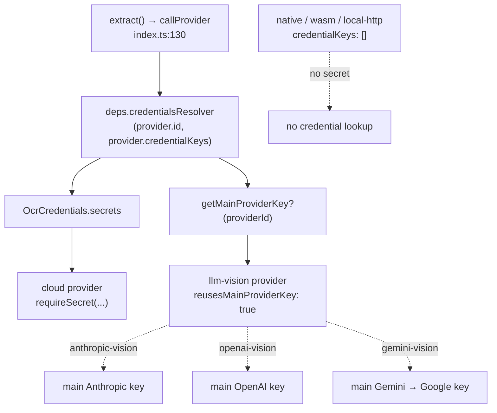

# Providers

<Status variant="beta">20 providers · lib/ocr/providers/*</Status>

<TLDR>
  Twenty providers implement one interface — `OcrProvider.extract(input, ctx)`. They share three helpers:
  `_http.cloudFetch` (every cloud provider's fetch + error-mapping), `_llm-vision` (prompt + downscale + single-page
  result for the three `*-vision` providers), and `_sigv4` (AWS Signature V4, used only by `aws-textract`). Cloud
  providers declare `credentialKeys`; LLM-vision providers instead set `reusesMainProviderKey` and pull the main
  Claude/GPT/Gemini key. The five native engines route through one Tauri invoker; `tesseract-wasm` runs in a WASM
  worker; `local-http` talks to a user-supplied LAN endpoint. Static UI metadata lives in `capabilities.ts`.
</TLDR>

## The full matrix

`shells` columns are browser / tauri / capacitor. "blocks" = the provider fills `pages[].blocks` with bbox +
confidence. Line numbers point at the provider's `id` definition.

| Provider | Category | Shells | Credentials | Transport | Cost | blocks | file:line |
| --- | --- | --- | --- | --- | --- | --- | --- |
| `mistral-ocr` | document-cloud | ✓/✓/✓ | `apiKey` | `POST api.mistral.ai/v1/ocr` | per-page | — | `mistral-ocr.ts:38` |
| `google-vision` | document-cloud | ✓/✓/✓ | `apiKey` | `images:annotate` (DOCUMENT_TEXT_DETECTION) | tier | paragraph | `google-vision.ts:75` |
| `aws-textract` | document-cloud | ✓/✓/✓ | `accessKeyId`,`secretAccessKey`,`sessionToken` | SigV4 `DetectDocumentText`/`AnalyzeDocument` | tier | line | `aws-textract.ts:57` |
| `azure-document-intelligence` | document-cloud | ✓/✓/✓ | `apiKey`,`endpoint` | 2-step analyze → poll `Operation-Location` | tier | paragraph | `azure-document-intelligence.ts:85` |
| `anthropic-vision` | llm-vision | ✓/✓/✓ | reuses main key | `POST api.anthropic.com/v1/messages` | per-token | — | `anthropic-vision.ts:50` |
| `openai-vision` | llm-vision | ✓/✓/✓ | reuses main key | `POST api.openai.com/v1/chat/completions` | per-token | — | `openai-vision.ts:51` |
| `gemini-vision` | llm-vision | ✓/✓/✓ | reuses main key | `generativelanguage…:generateContent` | per-token | — | `gemini-vision.ts:53` |
| `mathpix` | specialist | ✓/✓/✓ | `appId`,`appKey` | `POST api.mathpix.com/v3/text` | per-image | — | `mathpix.ts:39` |
| `ocr-space` | specialist | ✓/✓/✓ | `apiKey` | `POST api.ocr.space/parse/image` | tier | — | `ocr-space.ts:45` |
| `abbyy-cloud` | specialist | ✓/✓/✓ | `applicationId`,`password` | 3-step submit → poll → fetch result | tier | — | `abbyy-cloud.ts:43` |
| `nanonets` | specialist | ✓/✓/✓ | `apiKey` | `POST app.nanonets.com/api/v2/OCR/…` | tier | paragraph | `nanonets.ts:53` |
| `lark-basic` | lark | ✓/✓/✓ | `appId`,`appSecret` | tenant-token → `image/basic_recognize` | tier | — | `lark-basic.ts:61` |
| `tesseract-wasm` | local | ✓/✓/✓ | none | WASM worker (`tesseract.js`, assets in `public/ocr/`) | free | paragraph | `tesseract-wasm.ts:109` |
| `tesseract-native` | local | —/✓/— | none | Tauri `ocr_extract_native` backend=`tesseract` | free | paragraph | `tesseract-native.ts:57` |
| `windows-media-ocr` | local | —/✓/— | none | Tauri invoke backend=`windows-media-ocr` | free | paragraph | `windows-media-ocr.ts:51` |
| `apple-vision` | local | —/✓/✓ | none | Tauri (Swift sidecar) **or** Capacitor ML-Kit plugin | free | paragraph | `apple-vision.ts:75` |
| `mlkit-android` | local | —/—/✓ | none | Capacitor ML-Kit plugin | free | paragraph | `mlkit-android.ts:79` |
| `ocrs` | local | —/✓/— | none | Tauri invoke backend=`ocrs` | free | line | `ocrs.ts:58` |
| `paddle-ocr` | local | —/✓/— | none | Tauri invoke backend=`paddle-ocr` | free | line | `paddle-ocr.ts:49` |
| `local-http` | local | ✓/✓/✓ | none (optional LAN token in config) | direct fetch to user LAN endpoint | free | line | `local-http.ts:73` |

Five providers are single-shell: `tesseract-native` / `windows-media-ocr` / `ocrs` / `paddle-ocr` are Tauri-only;
`mlkit-android` is Capacitor-only. `apple-vision` branches on `ctx.platform` to use the Swift sidecar on desktop
or the ML-Kit plugin on iOS.

## The three shared helpers

### `_http.ts` — the cloud fetch path (132 lines)

Every cloud provider (everything except the native engines, the WASM engine, and `local-http`) routes its HTTP
through `cloudFetch`, which centralizes body encoding, abort handling, and HTTP-status → `OcrError` mapping.

```ts
// _http.ts:36 — the default status → error-code map
export function defaultErrorCodeFor(status: number): OcrErrorCode {
  if (status === 401 || status === 403) return "missing_credentials"
  if (status === 429) return "rate_limited"
  if (status >= 400 && status < 500) return "invalid_input"
  return "provider_failed"
}
```

`cloudFetch` (`_http.ts:55`) accepts a per-provider `errorCodeFor` override (Textract and ocr-space map their
own status quirks). `requireSecret` (`_http.ts:118`) throws `missing_credentials` when a declared key is absent;
`parseJson` (`_http.ts:104`) wraps `JSON.parse` failures as `provider_failed`.

### `_llm-vision.ts` — vision prompt + downscale (75 lines)

The three `*-vision` providers share the prompt-build, image-downscale, and single-page-result logic. This is
why **LLM-vision providers never populate `blocks`** — `buildVisionResult` wraps the model's Markdown into one
page with an empty blocks array.

```ts
// _llm-vision.ts:32 — normalize → downscale to maxImageDimension → resolve prompt
export async function preparePromptAndImage(input, ctx, config) {
  const normalized = await normalizeImage(input.source)
  const maxDim = config.maxImageDimension ?? DEFAULT_MAX_IMAGE_DIMENSION   // 2000
  const downscaled = await downscaleImage(normalized.bytes, normalized.mimeType, maxDim)
  return {
    prompt: (config.promptTemplate || DEFAULT_VISION_PROMPT).trim(),
    mimeType: downscaled.mimeType,
    bytes: downscaled.bytes,
  }
}
```

### `_sigv4.ts` — AWS Signature V4 (196 lines)

Used only by `aws-textract`. The single public export `signRequest` (`_sigv4.ts:39`) runs entirely on
`crypto.subtle`, so it signs identically in every shell and under Jest. Everything else (canonicalization,
HMAC chain, RFC-3986 encoding) is module-private.

## The credential model



`OcrCredentials` (`types.ts:142`) is `{ secrets, getMainProviderKey? }`. The `getMainProviderKey` escape hatch
is what lets the vision providers reuse the main provider system instead of asking for a second API key —
`gemini-vision` even falls back `gemini → google` when resolving its key.

<Callout type="warn" title="No production credentials resolver is assembled yet">
  Every `credentialsResolver` in the current tree is the empty-secrets stub `async () => ({ secrets: {} })`
  (the plugin's `defaultDepsBuilder`, all tests). The settings UI keeps entered credentials in session memory
  and explicitly defers the keyring-backed `ocr_keyring_*` resolver to "parent work". So cloud providers will
  throw `missing_credentials` until that resolver is wired. Local engines (no `credentialKeys`) are unaffected.
</Callout>

## The capability matrix — `capabilities.ts`

`capabilities.ts` (380 lines) is **static UI metadata**, kept separate from provider modules so the settings
sidebar, capability tab, and compare view never import 20 provider files. `OCR_PROVIDER_CAPABILITIES`
(`capabilities.ts:64`) has exactly one row per registered provider id (a unit test enforces parity with the
registry).

<TypeTable
  type={{
    handwriting: { description: "Handles handwritten text.", type: "yes | no | partial" },
    tables: { description: "Recovers table structure.", type: "yes | no | partial" },
    math: { description: "Recognizes formulas / LaTeX.", type: "yes | no | partial" },
    cjk: { description: "Chinese / Japanese / Korean script support.", type: "yes | no | partial" },
    layout: { description: "Preserves reading-order / layout.", type: "yes | no | partial" },
    offline: { description: "Runs with no network.", type: "yes | no | partial" },
    structuredOutput: { description: "Emits bbox/confidence blocks.", type: "yes | no" },
    pdfNative: { description: "Accepts multi-page PDF natively (vs. per-page rasterize).", type: "yes | no" },
    costTier: { description: "Pricing band shown in the UI.", type: "free | $ | $$ | $$$" },
    maxPagesPerCall: { description: "Provider per-request page ceiling (∞ when unbounded).", type: "number" },
  }}
/>

Two helpers consume the table: `estimateOcrCost(providerId, pages)` (`capabilities.ts:357`) multiplies pages by
the tier's per-page USD (free=0, $=0.005, $$=0.015, $$$=0.05) — the Try-It and Compare tabs show this before a
run — and `topSidebarCapabilities(providerId)` (`capabilities.ts:367`) picks up to three distinguishing badges
for the sidebar row.

## Notable per-provider quirks

- **`mistral-ocr`** — the only document-cloud provider that does *not* fill `blocks`; it returns native Markdown
  and the `text` field is synthesized by stripping Markdown decorations.
- **`aws-textract`** — rejects PDF mime (the sync API is image-only); tables/forms come from `FeatureTypes` via
  `AnalyzeDocument`.
- **`azure-document-intelligence`** / **`abbyy-cloud`** — asynchronous: submit, then poll an operation/task URL
  (Azure 60×1s, ABBYY 40×1.5s) before fetching the result.
- **`lark-basic`** — caches the tenant-access-token in memory with a 2-minute safety margin before its 2-hour
  expiry.
- **`tesseract-wasm`** — lazily `import("tesseract.js")` (webpack-ignored) and shares one cached worker; because
  jsdom can't run WASM, the recognizer factory is injectable for tests.
- **`local-http`** — dialect-aware (`umi-ocr` / `paddleocr-server`), runs its own `AbortController` timeout
  rather than `cloudFetch`, and is never auto-selected (excluded from the router preference table).

Native-engine specifics (model loading, confidence, the Tauri invoker) are covered in
[Native backends](./native-backends); the per-OS ranking of the local engines is in
[Auto-router](./auto-router).
