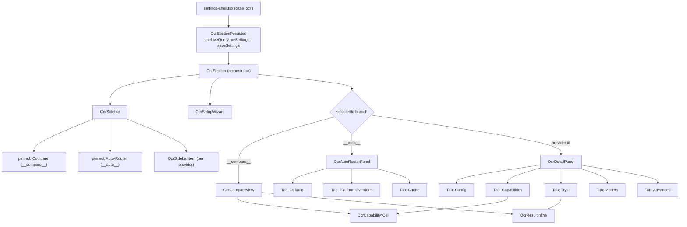

# Settings UI

<Status variant="beta">17 files · components/settings/ocr/</Status>

<TLDR>
  The OCR settings section mirrors the model-provider settings: a **sidebar** (searchable provider list + two
  pinned pseudo-entries — Compare and Auto-Router) and a **detail panel** that branches on the selection. A real
  provider shows five tabs (**Config · Capabilities · Try It · Models · Advanced**); the Auto-Router pseudo-entry
  shows three (**Defaults · Platform Overrides · Cache**). A first-visit **setup wizard** seeds a starter config
  from a use-case preset. Settings persist under the `ocrSettings` key via `useLiveQuery` / `saveSettings`
  (`ocr-section-persisted.tsx`). The section is registered in the settings shell under the `ai` nav group.
</TLDR>

## The shell

`ocr-section.tsx` (565 lines) is the orchestrator: it holds all in-session state, builds the sidebar rows and the
detail-panel tab slots, and wires the wizard. The layout is a CSS grid `md:grid-cols-[360px_1fr]`
(`ocr-section.tsx:439`) — sidebar left, detail right — collapsing into a `Sheet` drawer on mobile. The detail
panel branches on `selectedId` (`ocr-section.tsx:332`):



<Callout type="info" title="The UI is richer than the ADR">
  ADR-0024 (schema v36) predates the Compare pinned entry, the five-tab per-provider panel, and the three-tab
  Auto-Router panel. The current structure is the source of truth documented here.
</Callout>

## Persistence

`ocr-section-persisted.tsx` (70 lines) is the Dexie seam the shell actually renders:

```ts
// ocr-section-persisted.tsx — load + persist under the ocrSettings key
const settings = useLiveQuery(async () => (await getSettings()).ocrSettings, [])   // :29
const handleChange = (next: UserOcrSettings) =>
  void saveSettings({ ocrSettings: next }).catch((err) => toast.error(...))         // :36
```

So the store key is `ocrSettings` on the `appSettings` singleton, falling back to `DEFAULT_OCR_SETTINGS`. Cache
helpers route to `clearOcrCache` / `clearOcrCacheForProvider`. Entered **credentials stay in session memory** —
the file header notes the keyring-backed `ocr_keyring_*` surface is still pending.

## The per-provider tabs

`OcrDetailPanel` (`ocr-detail-panel.tsx:77`) renders the header (icon, name, category, status pill, enable
switch) and a `Tabs` group, `defaultValue="config"`:

| Tab | Component | What it does |
| --- | --- | --- |
| **Config** | `tabs/ocr-config-tab.tsx` (195) | Credential form generated from `provider.credentialKeys`; a "reuse main key" alert for vision providers; shell-support pills; the **Probe** button (`probeOcrProvider`). |
| **Capabilities** | `tabs/ocr-capabilities-tab.tsx` (138) | Single-provider matrix of 11 capability fields from `OCR_PROVIDER_CAPABILITIES`, plus a "Compare" CTA. |
| **Try It** | `tabs/ocr-try-it-tab.tsx` (252) | Drop an image/PDF → cost-confirm dialog → `useOcr().run()` → inline result. |
| **Models** | `tabs/ocr-models-tab.tsx` (276) | Local-model download for `ocrs` / `paddle-ocr` (Tauri bridge). |
| **Advanced** | `tabs/ocr-advanced-tab.tsx` (223) | Per-provider config overrides written to `providerConfig[id]` (format, langs, model variant, region, prompt). |

### Models tab — the download bridge

`buildTauriModelBridge` (`ocr-models-tab.tsx:231`) calls the Rust commands and subscribes to the progress event:

```ts
// ocr-models-tab.tsx:252
async download(backend) {
  const invoke = await getInvoke()
  await invoke("ocr_download_model", { backend })
  return invoke<ModelStatus>("ocr_model_status", { backend })
},
onProgress(handler) {                                    // :257
  return listen<DownloadProgressEvent>("ocr://download-progress", (e) => handler(e.payload))
}
```

Events are filtered by backend to drive a per-file percent bar; in the browser shell (`bridge === null`) the tab
shows a "shell unavailable" message. `BACKENDS_WITH_MANAGED_MODELS` is `{ ocrs, paddle-ocr }`.

## The Auto-Router panel

`OcrAutoRouterPanel` (`tabs/ocr-auto-router-panel.tsx`, 302 lines) is where the routing config lives — note that
**Platform Overrides** and **Cache** mount here, not in the per-provider panel.

- **Defaults** (`:124`) — default provider (`auto` + all), default format, default languages, `maxImageDimension`,
  cloud-fallback toggle + provider (cloud/vision only), PDF text-layer fast-path, `cacheTtlDays`, and clear-all-cache.
  The sidebar Auto-Router subtitle reflects the live routing ("auto with fallback X" vs "fixed: provider").
- **Platform Overrides** (`tabs/ocr-platform-overrides-tab.tsx`, 243) — per-OS reorderable local-engine ranking
  via dnd-kit. The effective order is `settings.platformOverrides[os]` if set, else `DEFAULT_LOCAL_PREFERENCE[os]`.
  The write path collapses to default-equality — reverting a bucket to its default ordering deletes the key:

  ```ts
  // ocr-platform-overrides-tab.tsx:113
  const isDefault = next.length === defaults.length && next.every((id, i) => id === defaults[i])
  if (isDefault) delete overrides[os]          // revert → no override stored
  else overrides[os] = [...next]
  onChange({ ...settings, platformOverrides: overrides })
  ```

- **Cache** (`tabs/ocr-cache-tab.tsx`, 254) — a browser over the Dexie `ocrResults` table with per-row,
  per-provider, and global delete.

## The setup wizard

`ocr-setup-wizard.tsx` (261 lines) is a three-step first-visit flow: pick a use-case → preview its preset → apply.
Presets come from `RECOMMENDATION_MAP` (see [Auto-router](./auto-router)). Apply writes provider[0] as the
default, provider[1] as the cloud fallback, the languages/format, and sets `ocrWizardDismissed: true`.

The wizard auto-opens on first visit only when `!ocrWizardDismissed` **and** `hasNoCloudCredentials(...)`
(`ocr-section.tsx:230`); apply, an explicit Dismiss, or closing the dialog all set `ocrWizardDismissed: true`. It
can be re-opened from the "Run setup wizard" button in the Auto-Router panel header.

## Capability compare

`ocr-compare-view.tsx` (457 lines) is the full-width Compare pinned entry: select up to three providers, pick one
file, and run `Promise.allSettled(extract(...))` in parallel into per-column results, gated by a summed-cost
confirm dialog. The shared cell renderers (`ocr-capability-cell.tsx`) — value (yes/no/partial), cost
(`$`/`$$`/`$$$`/free), and count (number/∞) — are reused by both the Compare matrix and the single-provider
Capabilities tab. `OcrResultInline` (`ocr-result-inline.tsx`, 117) is the non-Sheet per-page renderer shared by
Try-It and each Compare column.

## Registration & i18n

- **Render:** `settings-shell.tsx:36` dynamically imports `OcrSectionPersisted` (bound as `OcrSection`);
  `case "ocr"` (`:359`) renders it.
- **Nav:** `settings-nav-config.ts:140` — `id: "ocr"`, `group: "ai"`, `icon: ScrollTextIcon`,
  `labelKey`/`descriptionKey` → `settings.tabs.ocr` / `settings.descriptions.ocr`.
- **i18n:** every file uses `useTranslations()` (root scope) against the top-level `ocr.*` namespace —
  `ocr.providers.<id>.label`, `ocr.categories.*`, `ocr.status.*`, `ocr.autoRouter.*`, `ocr.wizard.*`,
  `ocr.modelStatus.*`, `ocr.platformOverrides.*`, `ocr.cache.*`, `ocr.capabilities.*`, `ocr.compare.*`,
  `ocr.tryIt.*`, `ocr.probe.*`, `ocr.credentials.*`, `ocr.advanced.*` — with the section title from
  `settings.tabs.ocr`.
