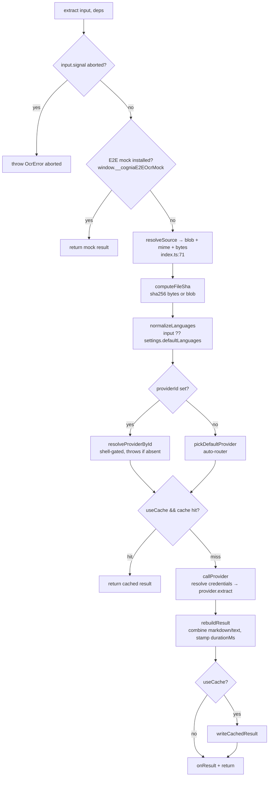

# Types & dispatch

<Status variant="beta">Core surface — lib/ocr/ types · index · registry · runtime</Status>

<TLDR>
  Everything in the subsystem is phrased in terms of four types in `lib/ocr/types.ts` — `OcrInput`,
  `OcrResult`, `OcrProvider`, and `UserOcrSettings`. The single public function `extract(input, deps)`
  (`lib/ocr/index.ts:200`) is **fully dependency-injected**: the registry, settings, platform, credential
  resolver, and source resolvers all arrive via `ExtractDeps`, so tests stub each independently and production
  assembles them once. Providers live in a `Map`-backed `OcrRegistry` (`registry.ts`); `installOcrRuntime()`
  (`runtime.ts:94`) is the idempotent bootstrap that fills it.
</TLDR>

## The type model

All public types are in `lib/ocr/types.ts` (235 lines). The discriminated `OcrSource` is what makes one
provider implementation reachable from four different caller contexts.

```ts
// types.ts:60 — four source kinds collapse to one provider call
export type OcrSource =
  | { kind: "data-url"; dataUrl: string; mimeType: string }
  | { kind: "file-path"; path: string }
  | { kind: "blob"; blob: Blob; mimeType: string }
  | { kind: "attachment-id"; attachmentId: string }
```

<TypeTable
  type={{
    source: { description: "The image/PDF to read — one of the four OcrSource kinds.", type: "OcrSource" },
    languages: { description: "BCP-47 codes or Tesseract triplets. Normalized internally (lowercased, deduped).", type: "string[]", default: "settings.defaultLanguages" },
    format: { description: "Output shape requested by the caller.", type: "markdown | text | blocks", default: "markdown" },
    pageRange: { description: "\"1,3-5,7\" syntax, 1-based. PDF only.", type: "string" },
    providerId: { description: "Explicit provider id. Omit to let the auto-router pick.", type: "string" },
    signal: { description: "Caller AbortSignal — providers must honour it.", type: "AbortSignal" },
    useCache: { description: "Read a hit / write a fresh entry. Health probes pass false.", type: "boolean", default: "true" },
  }}
/>

`OcrResult` (`types.ts:90`) is what every provider returns. `pages[]` carries per-page `markdown` + `text`
(always populated) plus optional `blocks[]` (bbox + confidence) for providers that expose structured output.
`combinedMarkdown` / `combinedText` are the joined views; `durationMs`, `costEstimate`, and `cached` round it
out.

```ts
// types.ts:38 — a page; blocks present only for structured providers
export interface OcrPage {
  pageNumber: number          // 1-based
  markdown: string            // always populated
  text: string                // always populated
  blocks?: OcrBlock[]         // bbox + confidence, structured providers only
  width?: number; height?: number
  fromTextLayer?: boolean     // true when the PDF text-layer fast-path produced it
}
```

Errors are thrown as `OcrError` (`types.ts:121`) carrying a `code` discriminant — tests and the dispatch loop
branch on `code`, never on message strings:

```ts
// types.ts:112
export type OcrErrorCode =
  | "unsupported_shell" | "missing_credentials" | "rate_limited"
  | "provider_failed"   | "unsupported_language" | "invalid_input" | "aborted"
```

### What a provider is

```ts
// types.ts:166 — the registry holds these
export interface OcrProvider {
  id: string
  label: string
  category: OcrProviderCategory           // document-cloud | llm-vision | specialist | lark | local
  shells: { browser: boolean; tauri: boolean; capacitor: boolean }
  credentialKeys: readonly string[]       // empty for local + key-reusing vision providers
  reusesMainProviderKey?: boolean         // pull Claude/GPT/Gemini key instead of a second secret
  extract(input: OcrInput, ctx: OcrProviderContext): Promise<OcrResult>
}
```

### Settings

`UserOcrSettings` (`types.ts:185`) is the persisted store, saved under the `ocrSettings` key on the
`appSettings` singleton. `DEFAULT_OCR_SETTINGS` (`types.ts:221`) seeds it:

<TypeTable
  type={{
    defaultProviderId: { description: "Provider used when OcrInput.providerId is undefined. \"auto\" enables the router.", type: "string | \"auto\"", default: "\"auto\"" },
    cloudFallbackEnabled: { description: "Router may fall back to a cloud provider when local engines are unavailable.", type: "boolean", default: "true" },
    cloudFallbackProviderId: { description: "Which cloud provider the router prefers as fallback.", type: "string | null", default: "\"mistral-ocr\"" },
    defaultFormat: { description: "Output format when the caller omits one.", type: "OcrOutputFormat", default: "\"markdown\"" },
    pdfTextLayerFastPath: { description: "Run the digital-PDF fast-path before OCR.", type: "boolean", default: "true" },
    providerConfig: { description: "Per-provider config blob (model, region, prompt, language pack).", type: "Record<string, OcrProviderConfig>", default: "{}" },
    providerEnabled: { description: "Per-provider enabled flag — disabled providers aren't auto-picked.", type: "Record<string, boolean>", default: "{}" },
    maxImageDimension: { description: "Long-edge px before downscale (LLM-vision cost guard).", type: "number", default: "2000" },
    platformOverrides: { description: "Per-OS ordered local-engine preference, merges over the default table.", type: "Partial<Record<OcrPlatformOverrideKey, string[]>>", default: "{}" },
  }}
/>

## The dispatch flow

`extract()` (`index.ts:200`) is the whole control plane. Its signature takes the input plus a fully-injected
`ExtractDeps` bag (`index.ts:55`):

```ts
// index.ts:55 — every external dependency is injectable
export interface ExtractDeps {
  registry: OcrRegistry
  settings: UserOcrSettings
  platform: NativePlatform                 // "tauri" | "mobile" | "web"
  osTag?: "windows" | "macos" | "linux" | "ios" | "android" | "browser"
  credentialsResolver: CredentialsResolver // keyring (Tauri) / encrypted Dexie (web)
  attachmentResolver?: AttachmentResolver  // only for kind:"attachment-id"
  filePathResolver?: FilePathResolver      // only for kind:"file-path"
  onResult?: (result: OcrResult) => void   // tests / observability
}
```

The body runs six steps:



Two details worth highlighting:

- **Source pre-resolution.** Before calling the provider, `extract()` resolves any `file-path` /
  `attachment-id` source to a `blob` source (`index.ts:240`), so providers never re-fetch — they always receive
  a blob-backed input.
- **Error normalization.** `callProvider` (`index.ts:124`) duck-types thrown errors: a real `OcrError` (by
  `instanceof` **or** by `name === "OcrError"` + `code` + `providerId`) passes through unchanged; anything else
  is wrapped as `provider_failed`. The duck-type survives cross-module `require` chains under Jest.

## The registry

`registry.ts` (90 lines) is a `Map<string, OcrProvider>` with shell gating. `shellAllows` is the selection
helper the auto-router depends on:

```ts
// registry.ts:61 — NativePlatform → the provider's capability flags
export function shellAllows(provider: OcrProvider, platform: NativePlatform): boolean {
  switch (platform) {
    case "tauri":  return provider.shells.tauri
    case "mobile": return provider.shells.capacitor
    case "web":    return provider.shells.browser
  }
}
```

A shared singleton (`getSharedOcrRegistry`, `registry.ts:83`) is the production registry; `register` throws on
duplicate id, and `__resetSharedOcrRegistry` (`registry.ts:88`) gives tests a clean slate.

## The runtime bootstrap

`runtime.ts` (205 lines) is where the 20 providers actually enter the registry and where the single Tauri
invoker is fanned out to all five native backends. `ALL_PROVIDERS` (`runtime.ts:51`) is the canonical ordered
list.

```ts
// runtime.ts:94 — idempotent; one Tauri invoker feeds 5 native providers
export async function installOcrRuntime(opts: OcrRuntimeOptions = {}): Promise<void> {
  if (installed) return
  installed = true
  const registry = getSharedOcrRegistry()
  for (const provider of ALL_PROVIDERS) {
    if (!registry.has(provider.id)) registerOcrProvider(provider)
  }
  const invoker = opts.nativeInvoker ?? (await tryBuildTauriInvoker())
  if (invoker) {
    __setNativeOcrInvoker(invoker); __setWindowsMediaOcrInvoker(invoker)
    __setAppleVisionTauriInvoker(invoker); __setOcrsInvoker(invoker); __setPaddleOcrInvoker(invoker)
  }
  // + MSIX readiness probe (ocr_msix_status) wired into windows-media-ocr
  // + model-status probe (ocr_model_status) wired into ocrs / paddle-ocr
}
```

The bootstrap also injects the **readiness probes** that gate native engines: `tryBuildMsixProbe`
(`runtime.ts:159`) feeds `__setWindowsMediaOcrReadiness`, and `tryBuildModelStatusProbe` (`runtime.ts:186`)
feeds `__setOcrsReadiness` / `__setPaddleOcrReadiness`. Outside Tauri both probes fall back to `null` (treated
as ready), so the provider's own `extract()` is the thing that throws `unsupported_shell` when a binding is
genuinely missing.

<Callout type="warn" title="The bootstrap is not called in production yet">
  `installOcrRuntime()` is fully tested (`runtime.test.ts`) but has **no production call site** — its doc
  comment references `app/(setup)/ocr-bootstrap.tsx`, which does not exist. Until a caller is added, the only
  path that touches the shared registry is the plugin's `defaultDepsBuilder`
  (`plugins/ocr/src/index.ts:51`), which itself returns `null` while the registry is empty. See
  [Triggers](./triggers) for the full wiring picture.
</Callout>
