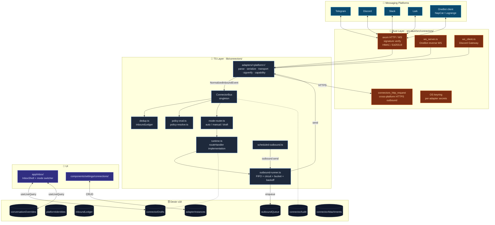
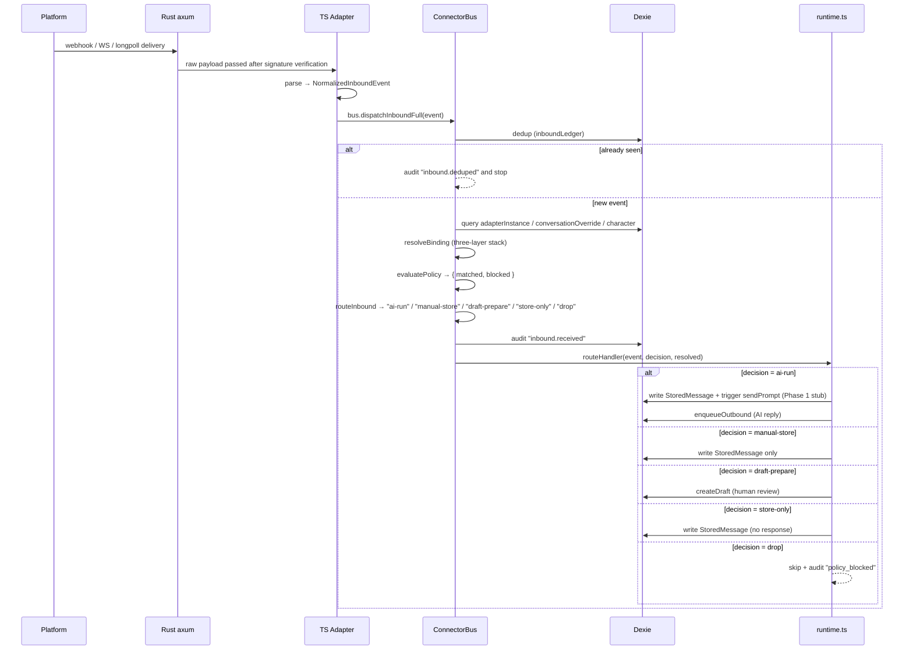
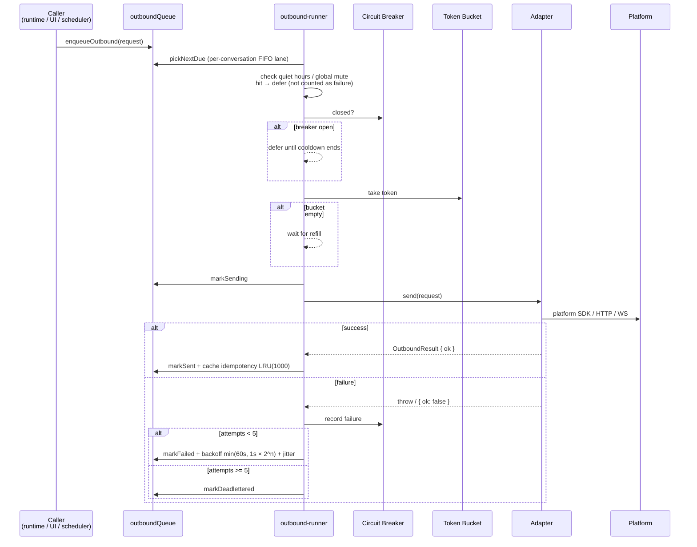

# Platform Connectors

<Status variant="stable" />

<TLDR>
  Five built-in adapters (Telegram / Discord / Slack / Lark / OneBot v11) + a singleton ConnectorBus
  for fan-in / fan-out + Dexie-backed outbound FIFO (circuit breaker, token bucket, exponential
  backoff, dead letter, idempotent LRU). Three modes: auto (AI auto-reply) / manual (human typed) /
  draft (AI drafts, human reviews). Eight Dexie tables added in v18 schema; Inbox UI lives in
  `app/inbox/`; plugins can contribute additional adapters.
</TLDR>

<StatGrid>
  <Stat label="Built-in Adapters" value="5" hint="telegram · discord · slack · lark · onebot" />
  <Stat label="Dexie Tables" value="8" hint="v18 schema" />
  <Stat label="Runtime Modes" value="3" hint="auto · manual · draft" />
  <Stat label="Audit Cap" value="5000" hint="connectorAudit capped ring" />
</StatGrid>

This page is an **architectural overview**. For platform-specific quick-start guides, see the companion docs:

<Cards>
  <Card title="Slack Setup" href="../connectors/slack-setup" />
  <Card title="Discord Setup" href="../connectors/discord-setup" />
  <Card title="Lark / Feishu Setup" href="../connectors/lark-setup" />
  <Card title="OneBot v11 Setup" href="../connectors/onebot-setup" />
  <Card title="QQ via OneBot FAQ" href="../connectors/qq-via-onebot-faq" />
  <Card title="Extending Connectors with Plugins" href="../connectors/extending-with-plugins" />
</Cards>

## Use Cases

| Scenario                          | Recommended Mode + Modules                                                       |
| --------------------------------- | -------------------------------------------------------------------------------- |
| Company support group auto-reply  | `auto` + Slack / Lark adapter + character binding + TriggerPolicy keyword limits |
| Personal assistant draft review   | `draft` + Telegram DM + draft review via Inbox UI                                |
| Manual bot proxy                  | `manual` + any adapter + Composer manual input                                   |
| Scheduled daily digest push       | `connection:outbound:send` scheduler task enqueues outbound directly (no AI)     |
| QQ group bot                      | `onebot` + NapCat / Lagrange / LLOneBot reverse-WS connection                    |
| Plugin contributes a new platform | `PluginManifest.connectors[]` + `connectors-bridge.registerPluginAdapters`       |

## Architecture Diagram



## Key Modules and File Paths

### Types

| File                                | Purpose                                                                              |
| ----------------------------------- | ------------------------------------------------------------------------------------ |
| `types/connectors/index.ts`         | Barrel — re-exports all types                                                        |
| `types/connectors/platform-kind.ts` | `PlatformKind` union: `"telegram" \| "discord" \| ...`                               |
| `types/connectors/adapter.ts`       | `PlatformAdapter` interface (implemented by each adapter)                            |
| `types/connectors/event.ts`         | `NormalizedInboundEvent` — cross-platform unified event                              |
| `types/connectors/segment.ts`       | `MessageSegment[]` — text / markdown / image / file / @ / quote                      |
| `types/connectors/outbound.ts`      | `OutboundRequest` / `OutboundResult`                                                 |
| `types/connectors/policy.ts`        | `TriggerPolicy` + `ConnectorMode`                                                    |
| `types/connectors/binding.ts`       | Three-layer binding stack (adapter default / conversation override / event override) |
| `types/connectors/capability.ts`    | Platform capabilities (max message size, supports quote / edit / recall …)           |
| `types/connectors/audit.ts`         | `ConnectorAuditEntry`                                                                |

### ConnectorBus and Orchestration

| File                                 | Purpose                                                                                                    |
| ------------------------------------ | ---------------------------------------------------------------------------------------------------------- |
| `lib/connectors/bus.ts`              | Singleton; `registerAdapter` / `dispatchInboundFull` (10-step pipeline)                                    |
| `lib/connectors/dedup.ts`            | `recordAndCheckInbound` — `inboundLedger` 10 k cap                                                         |
| `lib/connectors/policy-eval.ts`      | `evaluatePolicy` — TriggerPolicy rules + blocklist → `{ matched, blocked }`                                |
| `lib/connectors/policy-resolve.ts`   | `resolveBinding` — three-layer stack merged into final mode + characterId                                  |
| `lib/connectors/mode-router.ts`      | `routeInbound(mode, evalResult, storeUnmatchedInDraftMode)` → `RouteDecision`                              |
| `lib/connectors/runtime.ts`          | `installRuntime` — wires `routeHandler` into the chat send pipeline + writes StoredMessage / creates draft |
| `lib/connectors/audit.ts`            | `appendAudit` — `connectorAudit` writer (capped)                                                           |
| `lib/connectors/adapter-registry.ts` | `buildAdapterFromRow(row)` — instantiates a `PlatformAdapter` from a Dexie row                             |

### Outbound

| File                                   | Purpose                                                                                                     |
| -------------------------------------- | ----------------------------------------------------------------------------------------------------------- |
| `lib/connectors/outbound-runner.ts`    | Main pump + per-conversation FIFO + quiet hours + global mute; exports `isInQuietHours` / `msUntilQuietEnd` |
| `lib/connectors/circuit-breaker.ts`    | 50% failure rate / 10-event window; trips with 30 s cooldown                                                |
| `lib/connectors/rate-limit.ts`         | Token bucket — capacity 20, 5 token/s refill                                                                |
| `lib/connectors/scheduled-outbound.ts` | Registers `connection:outbound:send` / `connection:scheduled:digest` as `TaskExecutor`s                     |

### Five Built-in Adapters

Every adapter directory follows the same decomposition:

```text
lib/connectors/adapters/&lt;platform&gt;/
  parse.ts        platform raw payload → NormalizedInboundEvent
  serialize.ts    NormalizedOutboundRequest → platform payload
  transport-*.ts  long-connection / long-poll / webhook / reverse-WS / Gateway
  sigverify.ts    signature verification (HMAC / Ed25519 / Bearer)
  capability.ts   capability declaration
  index.ts        createXxxAdapter(opts) factory
```

| Platform   | Transport                              | Signature Verification                                  |
| ---------- | -------------------------------------- | ------------------------------------------------------- |
| Telegram   | longpoll or webhook                    | `X-Telegram-Bot-Api-Secret-Token` (HMAC-SHA256)         |
| Discord    | Gateway WS v10                         | Ed25519 (`X-Signature-Ed25519`, HTTP interactions only) |
| Slack      | Socket Mode or Events API              | HMAC-SHA256 v0 (`X-Slack-Signature`)                    |
| Lark       | long-connection or webhook             | HMAC-SHA256 (`X-Lark-Signature`)                        |
| OneBot v11 | Reverse WebSocket (device connects in) | Bearer token (optional)                                 |

### Rust Layer

| File                                           | Purpose                                                   |
| ---------------------------------------------- | --------------------------------------------------------- |
| `src-tauri/src/connectors/mod.rs`              | Entry point + `ConnectorsState`                           |
| `src-tauri/src/connectors/axum_app.rs`         | axum app receiving webhooks                               |
| `src-tauri/src/connectors/server_lifecycle.rs` | spawn / shutdown                                          |
| `src-tauri/src/connectors/ws_server.rs`        | OneBot reverse-WS server                                  |
| `src-tauri/src/connectors/ws_client.rs`        | Discord Gateway client                                    |
| `src-tauri/src/connectors/sigverify/`          | HMAC / Ed25519 verification                               |
| `src-tauri/src/connectors/keyring.rs`          | Per-adapter secret read/write                             |
| `src-tauri/src/connectors/http_client.rs`      | `connectors_http_request` — cross-platform HTTPS outbound |
| `src-tauri/src/connectors/attachments.rs`      | `connectorAttachments` table download cache               |
| `src-tauri/src/connectors/commands.rs`         | Tauri command exposure                                    |

### UI

| File                                                                     | Purpose                                                                               |
| ------------------------------------------------------------------------ | ------------------------------------------------------------------------------------- |
| `app/inbox/page.tsx`, `app/inbox/[conversationKey]/page.tsx`             | Inbox entry (static-export compatible)                                                |
| `components/inbox/inbox-shell.tsx`                                       | Left + right dual-pane shell                                                          |
| `components/inbox/inbox-sidebar.tsx`                                     | Lists all platform-bound `ChatSession`s                                               |
| `components/inbox/conversation-header.tsx`                               | Mode switcher (auto / manual / draft)                                                 |
| `components/inbox/draft-banner.tsx`, `components/inbox/draft-editor.tsx` | Draft-mode review UI                                                                  |
| `components/inbox/outbound-status-pill.tsx`                              | Outbound status badge                                                                 |
| `components/settings/connections/connections-section.tsx`                | Tabbed shell; 6 tabs (Overview / Adapters / Conversations / Inbox / Outbound / Audit) |
| `components/settings/connections/forms/quiet-hours-and-mute.tsx`         | Quiet hours + global mute form                                                        |

## Data Flow: Inbound



## Data Flow: Outbound



## Database Tables (Dexie v18)

| Table                   | Primary Key | Purpose                                                                                             |
| ----------------------- | ----------- | --------------------------------------------------------------------------------------------------- |
| `adapterInstances`      | `id`        | One row per configured bot (platform, credentials, settings, defaultCharacterId, quietHours, muted) |
| `platformIdentities`    | `id`        | One row per observed platform user (username / display name / custom metadata)                      |
| `inboundLedger`         | `id`        | Inbound dedup (`adapterId + messageId`), 10 k cap                                                   |
| `outboundQueue`         | `id`        | Outbound delivery job; status = queued / sending / sent / failed / deadlettered                     |
| `conversationOverrides` | `id`        | Per-conversation mode / character override                                                          |
| `connectorAudit`        | `id`        | Audit log, 5 000 capped ring                                                                        |
| `connectorDrafts`       | `id`        | Drafts awaiting human review in draft mode                                                          |
| `connectorAttachments`  | `id`        | Platform attachment download cache (schema-only at Phase 1)                                         |

## Configuration and Extension Points

### Three Modes + Three-Layer Stack

```text
adapter default mode (set in Settings → adapter details)
  ↓ overridden by conversation override
conversation override (Inbox UI switcher)
  ↓ overridden by event-level override
event override (set when TriggerPolicy rule matches)
```

The final mode determines the `routeInbound` branch.

### TriggerPolicy

Each `AdapterInstance.policy: TriggerPolicy` configures:

- `keywords[]` — string / regex (keyword trigger)
- `mentions[]` — @ mention trigger
- `replyOnly` — trigger only when replying to the bot's message
- `block[]` — blocklist (user / keyword)
- `cooldownMs` — per-conversation / per-user cooldown
- `storeUnmatchedInDraftMode` — whether to store-only unmatched messages when mode = draft

`policy-eval.ts:evaluatePolicy` outputs `{ matched, blocked, reason }`.

### Quiet Hours + Global Mute

Each `AdapterInstance.quietHours: { from: "HH:MM", to: "HH:MM", tz: IANA }` and `muted: boolean`. `outbound-runner.ts` checks before sending — hit defers to window end, not counted as failure.

### Plugin Extension Point

`PluginManifest.connectors[]` declares factories:

```ts
// types/plugin/plugin.ts
interface PluginConnectorDef {
  id: string
  displayName: string
  platformKind: string // custom
  factory: (row: AdapterInstanceRow) => Promise<PlatformAdapter>
}
```

`lib/plugin/bridge/connectors-bridge.ts:registerPluginAdapters(pluginId, manifest, exports)` registers into ConnectorBus when the plugin is enabled; `unregisterPluginAdapters` cleans up on disable. See [Plugin System](./plugin-system) and `docs/content/docs/connectors/extending-with-plugins.md`.

### Scheduler Integration

`lib/connectors/scheduled-outbound.ts:installScheduledOutboundHandlers()` registers two executors:

- `connection:outbound:send` — enqueue outbound directly (no AI)
- `connection:scheduled:digest` — periodic digest (Phase 1 stub)

See [Scheduler](./scheduler).

## Related Subsystems

<Cards>
  <Card
    title="Visual Workflows"
    href="./visual-workflows"
    description="trigger.connector.inbound + action.connector.send"
  />
  <Card
    title="Mobile Architecture"
    href="./mobile-architecture"
    description="Phones are also connector receivers"
  />
  <Card
    title="Scheduler"
    href="./scheduler"
    description="Scheduled outbound / periodic digest goes through the scheduler"
  />
  <Card
    title="Plugin System"
    href="./plugin-system"
    description="Contribute new platform connectors"
  />
  <Card title="Slack Setup" href="../connectors/slack-setup" />
  <Card title="Discord Setup" href="../connectors/discord-setup" />
  <Card title="Lark Setup" href="../connectors/lark-setup" />
  <Card title="OneBot Setup" href="../connectors/onebot-setup" />
</Cards>

## Related ADRs

- [ADR 0009 — Platform Connectors](../adr/0009-platform-connectors)
- [ADR 0012 — Transport Abstraction](../adr/0012-transport-abstraction)
- [ADR 0011 — Visual Workflows](../adr/0011-workflows-subsystem) (trigger.connector.inbound hook)

## Known Limitations

- **Auto-mode AI loop is a Phase 1 stub** (audit + placeholder outbound job) — full `sendPrompt` → reply → outbound wiring is Task 40+.
- **Attachment downloads**: `connectorAttachments` table is schema-only; fetch pipeline scheduled for Phase 2.
- **OAuth**: Slack / Lark partially wired; production tokens need Tauri keyring + hosted redirect URL.
- **Web-mode degradation**: all adapters require the Tauri desktop runtime. In web mode, the ConnectionsSection banner explains the limitation; the mode switcher gets `pointer-events-none`; Composer Send is disabled for platform-bound sessions.
- **OneBot does not use OAuth**: uses bearer token; adapter selectively accepts `napcat` / `lagrange` / `llonebot` client implementations.
- **Audit cap of 5 000 entries**: FIFO ring buffer; old entries roll out automatically. For long-term retention, use [Backup](../data/backup-and-data).
- **Quiet hours precision**: based on `Intl.DateTimeFormat` parsing current time in the current time zone; brief drift of a few minutes may occur around DST transitions.
