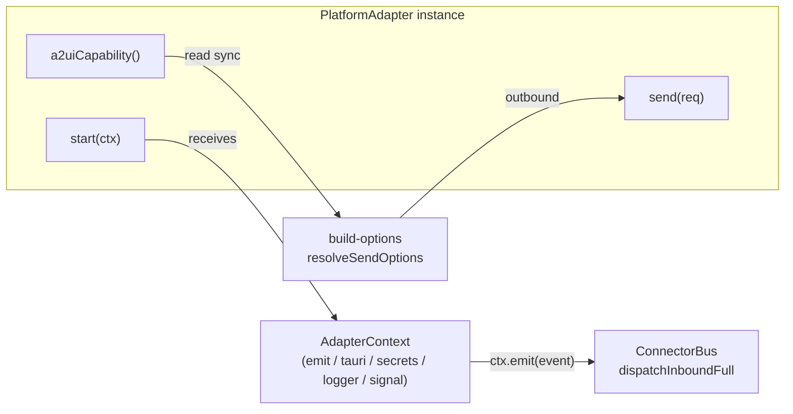
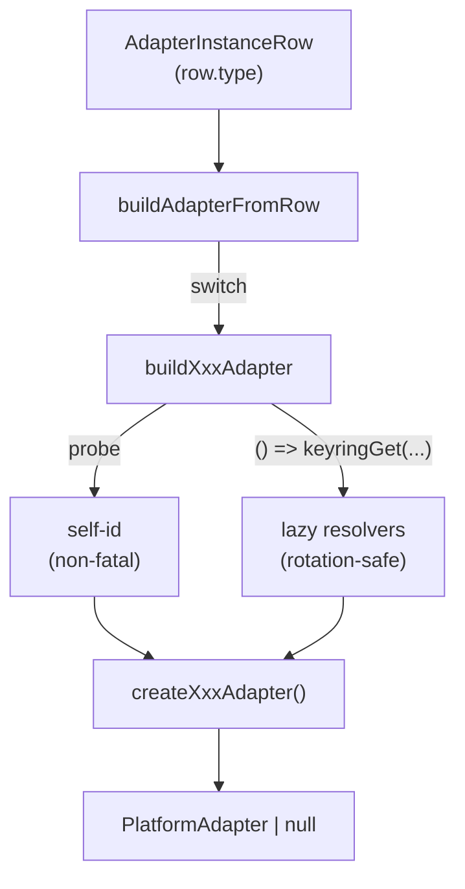

# Adapter Model & Registry

<Status variant="stable" />

<TLDR>
  Every platform connector implements the single **`PlatformAdapter`** interface
  (`types/connectors/adapter.ts:135`): lifecycle (`start`/`stop`/`health`), one non-optional mutation
  (`send`), a fan of optional mutations (`streamReply?`/`edit?`/`delete?`/`setTyping?`/`uploadFile?`/`fetchHistory?`),
  and the **required synchronous** `a2uiCapability()` (`types/connectors/adapter.ts:180`) read on the hot send
  path by `build-options`. The runtime **factory** `buildAdapterFromRow(row)`
  (`lib/connectors/adapter-registry.ts:42`) switches on `row.type` across 11 builders, each probing its
  self-id and wiring **lazy credential resolvers** (rotation-safe). A parallel **pure display registry**
  `CONNECTOR_METADATA` (`lib/connectors/adapter-metadata.ts:42`, 16 rows) feeds the Discover page — its
  `status` now mirrors native adapter availability while retaining planned rows for reserved kinds. OAuth completion lives in a 2-entry Map
  (`lib/connectors/oauth-registry.ts:27`), and dedup + self-detection is shared via `MentionAccumulator`
  (`lib/connectors/adapters/_shared/mention-extractor.ts:24`).
</TLDR>

<StatGrid>
  <Stat label="Runtime builders" value="11" hint="buildAdapterFromRow switch (adapter-registry.ts:45)" />
  <Stat label="A2UI component kinds" value="37" hint="A2UI_COMPONENT_KINDS (capability.ts:54)" />
  <Stat label="Transport modes" value="7" hint="TransportMode union (adapter.ts:6)" />
  <Stat label="Platform kinds" value="16" hint="ALL_PLATFORM_KINDS (platform-kind.ts:7)" />
  <Stat label="Capability flags" value="24" hint="ALL_CAPABILITIES (capability.ts:3)" />
  <Stat label="Metadata rows" value="16" hint="CONNECTOR_METADATA (adapter-metadata.ts:42)" />
  <Stat label="OAuth handlers" value="2" hint="slack + lark (oauth-registry.ts:36,55)" />
</StatGrid>

## The PlatformAdapter Contract

Every connector — built-in or plugin-contributed — implements `interface PlatformAdapter`
(`types/connectors/adapter.ts:135`). The contract is deliberately minimal: a stable `meta`/`id`, a
three-method lifecycle, exactly **one** non-optional mutation (`send`), and a required synchronous
capability probe. Everything else is optional and feature-detected at the call site.

| Member | Line | Required | Notes |
| --- | --- | --- | --- |
| `meta` | `adapter.ts:136` | yes | `AdapterMeta` (`adapter.ts:15`): `type`, `displayName`, `version`, `capabilities[]`, `transportModes[]`, `configSchema` (draft-07, drives the auto-form) |
| `id` | `adapter.ts:137` | yes | the persisted instance id |
| `start(ctx)` | `adapter.ts:139` | yes | receives the `AdapterContext`; long-running loops respect `ctx.signal` |
| `stop()` | `adapter.ts:140` | yes | tear-down |
| `health()` | `adapter.ts:141` | yes | `AdapterHealth` (`adapter.ts:27`), `state` ∈ `starting \| running \| degraded \| down` |
| `send(req)` | `adapter.ts:143` | **yes** | the only non-optional mutation — the authoritative final message always flows here |
| `streamReply?(req)` | `adapter.ts:159` | no | `StreamReplyRequest` (`adapter.ts:82`); only **WeCom** implements it (in-place stream frames) |
| `edit?` | `adapter.ts:160` | no | edit a prior message by id |
| `delete?` | `adapter.ts:161` | no | delete a prior message |
| `setTyping?` | `adapter.ts:162` | no | typing indicator |
| `uploadFile?` | `adapter.ts:163` | no | returns `AdapterAttachmentRef` |
| `fetchHistory?` | `adapter.ts:164` | no | `AsyncIterable<NormalizedInboundEvent>` backfill |
| `refreshCredentials?` | `adapter.ts:168` | no | rotate tokens without restart |
| `a2uiCapability()` | `adapter.ts:180` | **yes** | synchronous; read by `build-options.ts:resolveSendOptions` to inject a capability-aware prompt |
| `platformSkillCapabilities?()` | `adapter.ts:193` | no | only **Lark** implements it (ADR-0026 skill families) |

`send` is the durable spine; `streamReply` is a best-effort live preview that shares the platform-side
stream id, so `send` finalises the stream without duplicating the message — and a throwing `streamReply`
must never break the turn (`adapter.ts:157`).

### AdapterContext

`start(ctx)` receives an `AdapterContext` (`types/connectors/adapter.ts:88`) — the adapter's only window
into the host:

- `emit(event)` (`adapter.ts:90`) — push a `NormalizedInboundEvent` to the bus (the inbound entry point).
- `tauri.*` (`adapter.ts:92-100`) — `httpRequest`, `openWs`, `fetchAttachment`, `bindWebhookRoute`,
  `unbindWebhookRoute`, `publicBaseUrl`; each wraps a Rust `connectors_*` command.
- `secrets` (`adapter.ts:101`) — keyring `get`/`set`/`delete`/`list` scoped to the instance.
- `logger` (`adapter.ts:102`) — prefixed console logger.
- `signal` (`adapter.ts:104`) — aborts when the adapter stops.
- `adapterId` (`adapter.ts:106`) — convenience accessor.

The seven `TransportMode` values (`adapter.ts:6`) — `longpoll | webhook | reverse-ws | forward-ws |
gateway | imap-smtp | stub` — describe how an adapter receives inbound traffic; `stub` is tests only.



## Capabilities & the A2UI Matrix

Two flag systems coexist. `ALL_CAPABILITIES` (`types/connectors/capability.ts:3`) is the coarse
boolean rollup — `send.text`/`markdown`/`html`/`image`/`voice`/`video`/`file`/`card`/`poll`/`location`/`reply`/`emoji`/`mention`/`thread`/`reaction`,
the A2UI rollup `send.a2ui` (`capability.ts:25`), the mutations `edit`/`delete`/`typing`/`history.fetch`
(`capability.ts:27-30`), plus platform-specific escape hatches `rich-markdown.telegram`/`.slack` and
`rich-card.lark`/`.slack` (`capability.ts:32-35`). `hasCapability(flags, cap)` (`capability.ts:40`) is the
membership check.

The fine-grained projection plan is the **A2UI matrix**: `A2UI_COMPONENT_KINDS` (`capability.ts:54`)
enumerates all **37** component kinds, and each maps to an `A2UIComponentSupport` (`capability.ts:124`)
of `native | simulated | fallback | unsupported`. A full `A2UICapabilityMatrix` (`capability.ts:126`)
is `Readonly<Record<A2UIComponentKind, A2UIComponentSupport>>`.

The **key invariant**: an adapter declares only what it can do natively, and every unmentioned kind
defaults to `fallback` — so the assistant can always emit A2UI and unsupported components degrade to a
plain-text mirror rather than vanishing:

```ts
// types/connectors/capability.ts:133-144
export function buildA2UICapabilityMatrix(
  partial: Partial<Record<A2UIComponentKind, A2UIComponentSupport>>
): A2UICapabilityMatrix {
  const out: Record<A2UIComponentKind, A2UIComponentSupport> = {} as Record<...>
  for (const kind of A2UI_COMPONENT_KINDS) {
    out[kind] = partial[kind] ?? "fallback" // unmentioned ⇒ fallback
  }
  return Object.freeze(out)
}
```

When a segment cannot be sent natively, `defaultDegradeChain(from)` (`capability.ts:168`) gives the
conservative fallback order. For A2UI it is `a2ui → card → markdown → text` (`capability.ts:191`) — `card`
sits between because Lark/Slack can wrap a degraded surface in a generic card; plain text is always the
floor. `PlatformKind` (`platform-kind.ts:33`) enumerates the **16** kinds via `ALL_PLATFORM_KINDS`
(`platform-kind.ts:7`, incl. `email`/`kook`/`line`/`mattermost`/`github`), guarded by `isPlatformKind`
(`platform-kind.ts:35`).

## The Runtime Factory: buildAdapterFromRow

`buildAdapterFromRow(row)` (`lib/connectors/adapter-registry.ts:42`) is the runtime dual of the type
union — it switches on `row.type` and dispatches to one `buildXxxAdapter` per platform, returning `null`
(with a warning) for any type without a builder:

```ts
// lib/connectors/adapter-registry.ts:42-68
export async function buildAdapterFromRow(row: AdapterInstanceRow): Promise<PlatformAdapter | null> {
  switch (row.type) {
    case "telegram": return buildTelegramAdapter(row)
    case "discord":  return buildDiscordAdapter(row)
    case "slack":    return buildSlackAdapter(row)
    case "lark":     return buildLarkAdapter(row)
    case "onebot":   return buildOneBotAdapter(row)
    case "wecom":    return buildWeComAdapter(row)
    case "wechat-personal": return buildWechatPersonalAdapter(row)
    case "matrix":   return buildMatrixAdapter(row)
    case "qq-official": return buildQQOfficialAdapter(row)
    case "wechat-oa": return buildWechatOaAdapter(row)
    case "dingtalk": return buildDingTalkAdapter(row)
    default: console.warn(`[adapter-registry] unsupported adapter type: ${row.type}`); return null
  }
}
```

Each builder does two things: a **self-id probe** and **lazy credential resolvers**.

| Builder | Line | Self-id probe |
| --- | --- | --- |
| `buildTelegramAdapter` | `:81` | `getMe` → `selfId` |
| `buildDiscordAdapter` | `:119` | `/users/@me` → `selfId` |
| `buildSlackAdapter` | `:153` | `auth.test` → `user_id`; `socket-mode` vs `events-api-webhook` |
| `buildLarkAdapter` | `:205` | `bot/v3/info` → `selfBotOpenId`, cached back to the row (`:249`) |
| `buildOneBotAdapter` | `:293` | none — `reverse-ws`/`forward-ws`, optional bearer |
| `buildWeComAdapter` | `:321` | none — `aibotid` arrives on first inbound frame |
| `buildWechatPersonalAdapter` | `:338` | none — iLink reply-only long-poll |
| `buildMatrixAdapter` | `:358` | `matrixWhoamiDetailed` → `selfId` + `deviceId` (E2EE fails closed without it) |
| `buildQQOfficialAdapter` | `:389` | none — id arrives on gateway READY |
| `buildWechatOaAdapter` | `:409` | none — id arrives on first inbound message |
| `buildDingTalkAdapter` | `:429` | none — Stream mode; token minted on demand |

Self-id probe failures are **non-fatal**: the adapter still starts, but self-mention detection may miss
implicit addressing. Credentials are never captured eagerly — they are **lazy resolvers** closing over the
keyring, so a rotated secret is picked up on the next call without a restart:

```ts
// lib/connectors/adapter-registry.ts:104-110 (telegram)
return createTelegramAdapter({
  id: row.id,
  displayName: row.displayName,
  transport,
  botToken: () => connectorsKeyringGet(row.id, "botToken").then((t) => t ?? ""), // lazy
  selfId,
})
```

Lark additionally caches a successful `selfBotOpenId` probe back to `row.settings` (`:249-258`) so cold
starts skip the API call; the UI affordance `refreshSelfBotOpenId(adapterId)` (`:470-538`) re-probes and
re-persists when the silent startup probe fails.



## AdapterContext & ctx.emit

The production `AdapterContext` is assembled by `buildAdapterContext(input)`
(`lib/connectors/adapter-context.ts:123`). Its `emit` is the single inbound entry point — it routes every
event straight through the bus's full pipeline:

```ts
// lib/connectors/adapter-context.ts:128-134
emit: async (event: NormalizedInboundEvent) => {
  // Route every inbound event through the bus's full pipeline:
  // dedup → adapter lookup → override → policy → route → handler.
  await bus.dispatchInboundFull(event)
},
```

`secrets` wraps the keyring `get`/`set`/`delete`/`list` commands (`adapter-context.ts:78-91`), `logger`
is a prefixed console (`:60-76`), and the `tauri.*` methods delegate to the `connectors_*` Rust commands.
`bindWebhookRoute`/`unbindWebhookRoute` are wired-but-unused — they `invoke` directly so they surface a
clear error if a future adapter actually needs per-route registration (`:145-153`).

## Display Registry vs Runtime Factory

`adapter-metadata.ts` is the **pure display dual** of the runtime factory: where `adapter-registry`
answers "build the adapter for this row", `CONNECTOR_METADATA` (`lib/connectors/adapter-metadata.ts:42`,
16 rows) answers "tell the user about every platform we support". Each `ConnectorMeta` (`:21`) carries
`type`, `iconName`, `status` (`stable | beta | planned`), `oauth`, and `richMessages`. Lookups go through
`getConnectorMeta` (`:94`) / `listConnectorMetadata` (`:98`), and `findMetadataGaps` (`:108`) keeps the
table aligned with `ALL_PLATFORM_KINDS`.

The `status` here is the operator-facing availability signal: in-tree adapters that can be configured and
started from Settings are `stable` (including Matrix, WeCom, personal WeChat, QQ Official, WeChat OA, and
DingTalk), plugin-owned inbox surfaces such as GitHub remain `beta`, and reserved platform kinds without a
native factory remain `planned`. The Discover page consumes this registry; it never imports the factory.

## OAuth Registry

`oauth-registry.ts` maps a `PlatformKind` to the async handler that completes the OAuth code exchange and
stores credentials in the keyring. `OAuthHandler` (`lib/connectors/oauth-registry.ts:22`) is
`(code, state) => Promise<void>`, and `oauthRegistry` (`:27`) is a `Map`. Only two platforms register —
**Slack** (`:36`) and **Lark** (`:55`), each behind a dynamic import of its handler module. Telegram,
Discord, and OneBot use no OAuth.

### The flow runs in the brain, on both hosts

Each OAuth platform ships the same three-part shape, and the split is what makes a self-hosted install
work at all:

| Part | Slack | Lark |
| --- | --- | --- |
| Authorize (mint + persist state) | `adapters/slack/oauth-begin.ts` | `adapters/lark/oauth-begin.ts` |
| Durable pending record | `adapters/slack/oauth-pending.ts` | `adapters/lark/oauth-pending.ts` |
| Complete (validate + exchange) | `adapters/slack/oauth-handler.ts` | `adapters/lark/oauth-handler.ts` |

The pending record lives in the connectors secret store, **not** in `sessionStorage`. A headless brain's
Web Storage is an in-memory shim and the browser that opened the settings dialog is a different process,
so a state written there was never visible to the process that had to spend it. The renderer's
`CONNECTOR_OAUTH_STATE_KEY` copy is a desktop-only pre-check; the durable record is the authoritative
CSRF check and is spent on use, before the exchange, so a replayed redirect cannot ride it.

`beginXOAuth` returns a URL rather than opening one — only the caller knows whether a browser is reachable
from where it runs. The settings dialog opens it in-process on the desktop; a headless deployment drives
the same function through the `oauth-begin` operator intent
(`lib/connectors/principal/admin-intent.ts`), which dispatches on the adapter row's own `type`.

### The relay

Neither Slack's nor Feishu's console will register a custom scheme, so the redirect target is an https
route on the connectors ingress, which then fans out to both hosts:

| Route | Path | Brain topic | Desktop bounce |
| --- | --- | --- | --- |
| `oauth_lark_callback` | `/oauth/lark/callback` | `connectors://lark-oauth/callback` | `cognia://connector/oauth/lark` |
| `oauth_connector_callback` | `/oauth/connector/{kind}/callback` | `connectors://connector-oauth/callback` (carries `kind`) | `cognia://connector/oauth/{kind}` |

Both live in `crates/cognia-connectors/src/axum_app.rs`. The generic route is the one every new platform
uses — `connectorOAuthRelayPath(kind)` (`lib/connectors/server-transport.ts`) derives the path, and Lark
keeps its own only because that exact URL is already registered byte-for-byte in existing Feishu consoles.
On the brain side one subscription serves every platform: the payload names the `kind` and the handler
comes out of `oauthRegistry`, so registering a handler is all a new platform needs to be authorizable
headless.

## Shared: MentionAccumulator

Every platform parser walks a different native message shape, but the post-walk reduction — dedup plus
self-detection plus the canonical return type — is identical and owned by `MentionAccumulator`
(`lib/connectors/adapters/_shared/mention-extractor.ts:24`). Its `constructor(selfId)` (`:29`) seeds the
self id; `add(id)` (`:36`) records a candidate (no-op on empty/duplicate, but still flips `selfMentioned`
on a duplicate self-id); `markSelfMentioned()` (`:55`) forces a self-mention without an `@`-entity (e.g.
a reply to a bot-authored message); and `finalize()` (`:65`) returns the `MentionDescriptor` the bus
consumes. Discord, Lark, Slack, and Telegram parsers drive `MentionAccumulator` directly; OneBot does the
reduction inline.

## Related

<Cards>
  <Card title="Built-in Adapters" href="./built-in-adapters" description="The 11 concrete builders, their transports, and per-platform quirks." />
  <Card title="ConnectorBus" href="./connector-bus" description="The singleton fan-in/out that ctx.emit feeds via dispatchInboundFull." />
  <Card title="AI & A2UI" href="./ai-and-a2ui" description="How a2uiCapability() shapes the build-options prompt and the rich-content bridge." />
  <Card title="A2UI" href="../a2ui" description="The cross-surface A2UI component model the matrix projects." />
  <Card title="Inbound Gating" href="./inbound-gating" description="The policy pipeline that runs after ctx.emit." />
  <Card title="UI & Plugins" href="./ui-and-plugins" description="The Discover page and plugin-contributed adapters." />
</Cards>
