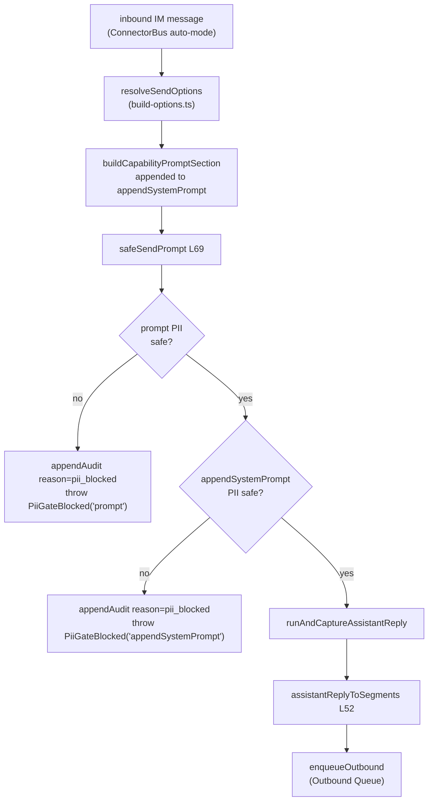
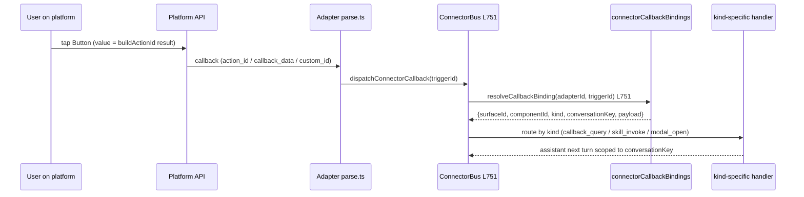
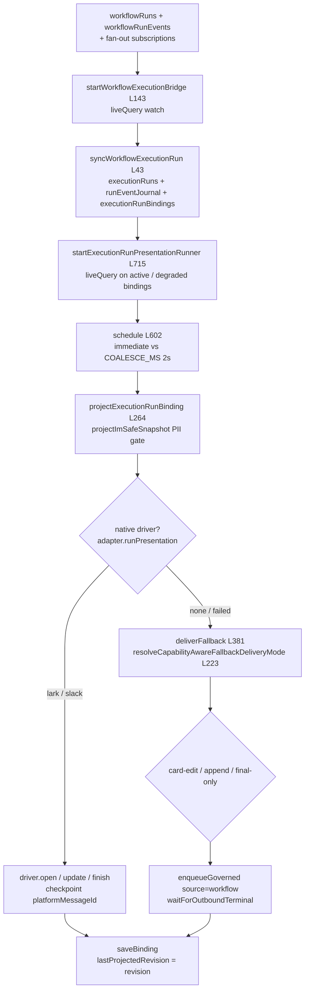

# Auto-mode AI Loop & A2UI Bridge

<Status variant="stable" />

<TLDR>
When an inbound IM message drives a Claude turn with no human in the loop, the connector subsystem cannot reuse the reviewed chat composer path — so `safeSendPrompt` (`lib/connectors/ai-loop/safe-send-prompt.ts:69`) wraps `runAndCaptureAssistantReply` with the same PII red-line `lib/twin/ingest/` enforces: walk the prompt and the build-options `appendSystemPrompt`, call `hasNoLeakingPii` on each, and **abort before the model** (writing a `pii_blocked` audit row) rather than redact — there is no human to decide what to drop. The captured reply is projected to transferable segments by `assistantReplyToSegments` (`a2ui-to-segments.ts:52`), inbound platform-rich content is projected into an `InboundA2UIBlock` by `projectInboundToA2UI` (`inbound-a2ui-dispatch.ts:26`) for the Inbox renderer, plugins author surfaces declaratively via `createA2UIBuilder` (`surface-builder.ts:315`), the build-options resolver appends a capability-aware downgrade section (`buildCapabilityPromptSection`, `capability-evaluator.ts:30`), interactive components round-trip through `buildActionId` / `recordCallbackBinding` / `resolveCallbackBinding` (`_shared/a2ui-mapper.ts`), and workflow / team runs reach IM as durable run cards via `startWorkflowExecutionBridge` (`lib/execution/workflow-bridge.ts:143`) + `startExecutionRunPresentationRunner` (`lib/connectors/run-presentation/runner.ts:715`).
</TLDR>

<StatGrid>
  <Stat label="PII gate" value="abort, not redact" hint="no human → no redaction decision" />
  <Stat label="A2UI component kinds" value="37" hint="A2UI_COMPONENT_KINDS" />
  <Stat label="Callback binding TTL" value="30d" hint="DEFAULT_CALLBACK_BINDING_TTL_MS" />
  <Stat label="Attachment LRU" value="500 MB" hint="LRU_TOTAL_CAP_BYTES, 7d default TTL" />
</StatGrid>

This page is the **middle** of the connector pipeline. The [ConnectorBus](./connector-bus) decides *whether* to reply; this layer decides *what* to say and *how to shape* it for the channel; everything terminates by calling `enqueueOutbound` and handing off to the [Outbound Queue](./outbound-queue). The A2UI vocabulary itself lives in [A2UI](../a2ui); workflow runs that trigger from IM are covered by [Visual Workflows](../visual-workflows). See the [subsystem overview](./index) for where this sits in the larger stack.

## The Auto-mode Loop: safeSendPrompt

The renderer chat composer is reviewed by a human before anything leaves the device, so it never has to enforce the PII red-line itself. The IM-driven auto-mode loop has no such reviewer — so `safeSendPrompt` re-applies the exact gate that `lib/twin/ingest/` and `lib/goal/` enforce: *raw user-supplied text MUST pass `hasNoLeakingPii` before it leaves the device*. It returns the same shape as `runAndCaptureAssistantReply`, so callers substitute it transparently.

The gate runs in three steps. Step 1 walks the inbound prompt; Step 2 walks the `appendSystemPrompt` tail that build-options injects (capability context, twin runtime hints); Step 3 delegates. Crucially, a leak **aborts** rather than redacts — `PiiGateBlocked` (`safe-send-prompt.ts:46`, discriminated by `source: "prompt" | "appendSystemPrompt"`) is thrown after the `pii_blocked` audit row is written, so the operator can see why the auto reply never fired.

```ts
// lib/connectors/ai-loop/safe-send-prompt.ts:75 — Step 1: prompt PII gate
if (!isPiiSafeSendContent(prompt)) {
  await appendAudit({
    adapterId: opts.adapterId,
    kind: "adapter.error",
    at: Date.now(),
    conversationKey: opts.conversationKey,
    reason: "pii_blocked",
    message: "auto-mode prompt rejected by PII gate before sendPrompt",
  })
  throw new PiiGateBlocked("prompt", opts.adapterId, opts.conversationKey)
}
```

`isPiiSafeSendContent` (`safe-send-prompt.ts:123`) walks every `type: "text"` block of the `SendContent` union via `hasNoLeakingPii` (from `@cognia/redact`) — image/file blocks are skipped because the gate is about leakable text; binary attachments are encrypted on disk by `attachments.rs` instead. The convergence is: build-options' `resolveSendOptions` assembles the prompt and capability tail → `safeSendPrompt` gates → `runAndCaptureAssistantReply` runs the turn → `assistantReplyToSegments` projects the captured reply → `enqueueOutbound` hands off to the queue.



## Outbound Projection: assistantReplyToSegments

The chat page consumes A2UI parts as renderer-side React state; the IM outbound path needs them as transferable `MessageSegment`s. `assistantReplyToSegments` (`a2ui-to-segments.ts:52`) bridges the two. A2UI surfaces come **first**, in creation order (`reply.a2uiSurfaceOrder ?? Object.keys(surfaces)`), each wrapped by `buildA2UISegment`. The remaining trimmed markdown is appended as a single `{ type: "markdown" }` segment (`a2ui-to-segments.ts:67`); if the reply has neither text nor surfaces, an empty `{ type: "text" }` segment is emitted (`a2ui-to-segments.ts:72`) so the runner always has something to dispatch — an empty `OutboundRequest` would be rejected as malformed.

`buildA2UISegment` (`a2ui-to-segments.ts:84`) bakes the `plainTextMirror`: a model-supplied `widget.fallbackText` wins over the auto-generated `generatePlainTextMirror`. This same builder is reused directly by `scheduled-outbound.ts` and by the run-presentation runner's fallback path (`run-presentation/runner.ts:411`) for surfaces emitted outside the normal assistant-reply path. The runtime calls `assistantReplyToSegments` at `runtime.ts:437`.

## Inbound Projection: projectInboundToA2UI

`projectInboundToA2UI` (`inbound-a2ui-dispatch.ts:26`) is the bus-side inbound projection. The bus calls it once per inbound `create` event with the platform kind and the raw platform payload (from Slack rich_text / Lark interactive cards / Telegram caption + inline keyboard / Discord embed + components); it dispatches to the matching per-platform mapper (`../<platform>/inbound-to-a2ui.ts`) and returns an `InboundA2UIBlock` (`inbound-a2ui-types.ts:50`) or `null`. That block is persisted onto `StoredMessage.metadata.inboundA2UI` and walked by `components/chat/message-parts/inbound-a2ui-renderer.tsx` so the Inbox shows the platform's native rich structure. Mappers are best-effort: a nullish payload, an unmapped platform, or a mapper that throws all resolve to `null` and the bus falls through to plaintext rendering.

> An earlier revision of this page claimed a `segmentsToA2UI` (`segments-to-a2ui.ts`) module was the canonical inbound projection that every platform parser called. That was inaccurate — the module had zero callers and has since been **removed as dead code**. The real inbound path is `projectInboundToA2UI` → `InboundA2UIBlock`, and it is **not** the inverse of the outbound `assistantReplyToSegments` (`a2ui-to-segments.ts`): outbound flattens an assistant surface into transferable `MessageSegment[]`, while inbound lifts a raw platform payload into a compact `InboundA2UIBlock` — the two are independent projections, not a matched pair.

## The Plugin Surface Builder

Plugins that want to send rich, interactive content through `ctx.connectors.send` need an `A2UIMessageSegment` whose `content` is a valid **id-keyed** component graph. Hand-authoring that graph (keying by id, wiring child refs, minting a mirror) is exactly the friction `surface-builder.ts` removes. Construction is **pure and ungated** — the side-effecting `send()` it feeds stays gated by `connectors:send`.

`validateA2UISurfaceComponents` (`surface-builder.ts:116`) asserts unique ids, resolves the root, and throws `A2UISurfaceBuildError` (`surface-builder.ts:48`) on any dangling child reference:

```ts
// lib/connectors/a2ui-bridge/surface-builder.ts:135 — root resolution
const resolvedRoot = rootId ?? (ids.has("root") ? "root" : components[0].id)
if (!ids.has(resolvedRoot)) {
  throw new A2UISurfaceBuildError(`rootId "${resolvedRoot}" is not among the components`)
}
```

The pipeline of pure builders: `buildA2UISurfaceContent` (`surface-builder.ts:158`) assembles the id-keyed `A2UISegmentContent` → `buildA2UIMessageSegment` (`surface-builder.ts:182`) wraps it as a transferable segment → `buildA2UIOutboundRequest` (`surface-builder.ts:195`) mints a `surfaceId` + idempotency key and appends optional trailing markdown, producing an `OutboundRequest` ready for `send()`. The `a2uiComponent` factory set (`surface-builder.ts:218`) gives 13 typed constructors — `text` / `button` / `card` / `row` / `column` / `alert` / `image` / `link` / `select` / `textField` / `list` / `divider` / `badge` — each returning the canonical `A2UIComponent` subtype, so output is renderer- and mapper-ready with no further shaping. `createA2UIBuilder()` (`surface-builder.ts:315`) bundles these into the `ctx.connectors.a2ui` namespace.

## Capability-aware Downgrade

Not every platform renders every A2UI kind. Each adapter declares an `A2UICapabilityMatrix` (`../<platform>/capability.ts`) that grades every kind in `A2UI_COMPONENT_KINDS` as `native` / `simulated` / `fallback` / `unsupported`; `componentKindsByLevel(matrix, level)` (`types/connectors/capability.ts:177`) is the one query over it. There is deliberately **no** per-surface evaluator in the bridge — each adapter branches on its own matrix inside its outbound mapper (`../<platform>/a2ui-mapper.ts`, Lark `card.ts`, Slack `block-kit.ts`) at render time, and the shared `generatePlainTextMirror` guarantees a best-effort mirror for anything a mapper cannot draw natively. What the bridge owns is the *prompt-side* half: `buildCapabilityPromptSection` (`capability-evaluator.ts:30`) renders the matrix into the concise system-prompt section that `build-options.ts:resolveSendOptions` (`build-options.ts:1935`) appends to `appendSystemPrompt`:

```ts
// lib/connectors/a2ui-bridge/capability-evaluator.ts:35 — one bullet per support level
const native = componentKindsByLevel(matrix, "native")
const simulated = componentKindsByLevel(matrix, "simulated")
const fallback = componentKindsByLevel(matrix, "fallback")
const unsupported = componentKindsByLevel(matrix, "unsupported")

const lines: string[] = [
  `This conversation is delivered via ${platform}. The platform supports a limited A2UI subset:`,
]
if (native.length > 0) {
  lines.push(`- Renders natively: ${native.join(", ")}.`)
}
```

The section tells the assistant which kinds render natively, which are available only via multi-step UX (do not assume a synchronous same-turn reply), which degrade to plain text, and which must not be emitted at all. An optional `skillCapabilities` bullet declares the built-in skill families this channel serves so the assistant skips per-tool probing. (An earlier per-surface `evaluateSurfaceAgainstCapability` / `CapabilityEvaluation` worst-case ladder also lived in this module; it had no runtime consumer and was removed on 2026-08-18.)

## Callback Round-trip

Interactive components need their button presses to find their way back to the originating surface. Each platform mapper calls `buildActionId(surfaceId, componentId, action)` (`_shared/a2ui-mapper.ts:119`), which returns the namespaced value the platform delivers back on callback (Slack `action_id`, Telegram `callback_data`, Discord `custom_id`, Lark `value.tag`):

```ts
// lib/connectors/adapters/_shared/a2ui-mapper.ts:119
export function buildActionId(surfaceId: string, componentId: string, action: string): string {
  return `a2ui:${surfaceId}:${componentId}:${action}`
}
```

Telegram caps `callback_data` at 64 bytes, so `truncateActionId` (`_shared/a2ui-mapper.ts:129`) SHA-1-hashes the over-long id for the wire while the full id stays in the binding row. `recordCallbackBinding` (`_shared/a2ui-mapper.ts:171`) upserts a `connectorCallbackBindings` row keyed `${adapterId}:${actionId}`, `kind` defaulting to `"callback_query"`, `expiresAt` defaulting to `createdAt + DEFAULT_CALLBACK_BINDING_TTL_MS` (30d). On the return trip the bus (`bus.ts:751`) reverse-looks up the binding:

```ts
// lib/connectors/adapters/_shared/a2ui-mapper.ts:216 — reverse lookup
export async function resolveCallbackBinding(
  adapterId: string,
  actionId: string
): Promise<ConnectorCallbackBindingRow | undefined> {
  return getDb()
    .connectorCallbackBindings.where("[adapterId+actionId]")
    .equals([adapterId, actionId])
    .first()
}
```

Stale rows are reaped by the daily sweep `cleanupExpiredCallbackBindings` (`lib/connectors/callback-binding-cleanup.ts:60`), which the durable housekeeping clock (`housekeeping-scheduler.ts:57`, task type `connection:housekeeping:callback-bindings`) fires once every 24 h — deleting rows past `expiresAt` plus pre-TTL legacy rows older than `LEGACY_GRACE_MS` (60 d); `generatePlainTextMirror` (`_shared/a2ui-mapper.ts:255`) is the content-driven (not layout-driven) fallback that every mapper shares.



## Execution Bridge & Run-presentation Runner

Live workflow / team-run presentation in IM has no bespoke fan-out loop of its own. Two runners started back-to-back by the connector bootstrap (`lib/connectors/bootstrap/install-connector-runtime.ts:738-739`) split the job — a **source bridge** that writes one durable execution journal, and a **presentation runner** that owns native projection, coalescing, cursor commits and fallback:

- **Source bridge** — `startWorkflowExecutionBridge` (`lib/execution/workflow-bridge.ts:143`) `liveQuery`-watches `workflowRuns` together with each run's `workflowRunEvents` and its `listForWorkflow` fan-out subscriptions, and calls `syncWorkflowExecutionRun` (`workflow-bridge.ts:43`) per row: create one durable `executionRuns` row (`execution:workflow:<runId>`, kind `workflow` / `team` / `scheduled` per `triggerKind`), append `plan.created` + `run.started` and then every `mapWorkflowRunEvent`-mapped source event into `runEventJournal`, and write one `executionRunBindings` row per destination — the triggering `triggeredBy.{adapterId, conversationKey}` plus every enabled fan-out subscription — with `deliveryMode: "native"` and `lastProjectedRevision: 0`. It also starts `startAgentStateExecutionBridge` so agent runs land in the same journal.
- **Presentation runner** — `startExecutionRunPresentationRunner` (`lib/connectors/run-presentation/runner.ts:715`) `liveQuery`-watches `executionRunBindings` with status `active` / `degraded` and, whenever `latestSnapshot.revision > binding.lastProjectedRevision`, schedules `projectExecutionRunBinding` (`runner.ts:264`) — immediately for the first revision, terminal statuses and `IMMEDIATE_EVENT_TYPES` (`run.started`, `step.started`, `interrupt.*`, …), otherwise coalesced by `COALESCE_MS = 2 s` (`schedule`, `runner.ts:602`). A 5 s heartbeat (`heartbeatExecutionRunBinding`, `runner.ts:623`) refreshes elapsed time on every non-terminal binding.

Projection runs `projectImSafeSnapshot` (`runner.ts:179`, `hasNoLeakingPiiDeep`) first — an unsafe snapshot collapses to an opaque one and audits `pii_gate_blocked`. Then, if native is enabled (kill switch `cognia-run-presentation-native-disabled` / `NEXT_PUBLIC_COGNIA_NATIVE_RUN_PRESENTATION=0`) and the adapter exposes `runPresentation` — Lark via `createLarkRunPresentationDriver` (`lark-driver.ts:320`, card-kit streaming with checkpointed pending mutations), Slack via `createSlackRunPresentationDriver` (`slack-driver.ts:51`, `plan_update` / `task_update` chunks) — the driver's `open` / `update` / `finish` mutate **one native card in place**, checkpointing `platformMessageId` + opaque state back into the binding. Any driver failure `recordDegraded`s (audit `run_projection_degraded`) and falls through to `deliverFallback` (`runner.ts:381`), whose mode is capability-aware:

```ts
// lib/connectors/run-presentation/runner.ts:223 — capability-aware fallback mode
export function resolveCapabilityAwareFallbackDeliveryMode(input: {
  hasEditMethod: boolean
  messageEditing?: boolean | undefined
  appendActivity: boolean
  appendFallback?: boolean | undefined
}): FallbackDeliveryMode {
  return resolveFallbackDeliveryMode({
    canEdit: input.hasEditMethod && input.messageEditing !== false,
    appendActivity: input.appendActivity && input.appendFallback !== false,
  })
}
```

`card-edit` (adapter has `edit` and `runtimeCapabilities.messageEditing !== false`) re-sends the `buildRunActivitySurface` card with `editTargetMessageId`; `append` posts a fresh card on status changes and otherwise at most every `APPEND_UPDATE_INTERVAL_MS = 30 s` (`shouldDeliverFallbackUpdate`, `runner.ts:235`); `final-only` waits for the terminal snapshot. Every fallback funnels through `enqueueGoverned` (`delivery-gateway`) with `source: "workflow"`, `sourceWorkflow: { …, nodeId: "run-projection" }` and idempotency key `execution-run:<bindingId>:<revision>`, then `waitForOutboundTerminal` before the cursor (`lastProjectedRevision`) is committed via `saveBinding`.

The approval handshake still lives in the bridge: `buildApprovalSurface` (`workflow-to-a2ui.ts:48`, emitted by the `wf_run_workflow_by_name` tool) uses distinct action-id namespaces — `WF_APPROVE_PREFIX = "wfapp:"` and `WF_CANCEL_PREFIX = "wfcan:"` (`workflow-to-a2ui.ts:25`) — so the bus routes `wf_approve` vs `wf_cancel` by prefix without sniffing the payload:

```ts
// lib/connectors/a2ui-bridge/workflow-to-a2ui.ts:49 — approve/cancel Card
const approveActionId = WF_APPROVE_PREFIX + input.bindingId
const cancelActionId = WF_CANCEL_PREFIX + input.bindingId
const safeSummary = (input.summary ?? "").trim()
const components: Record<string, unknown> = {
  root: {
    component: "Card",
    title: input.workflowName,
    children: safeSummary.length > 0 ? ["summary", "actions"] : ["actions"],
  },
```

The older step-line / cumulative-status / final-summary builders (and the `cognia://workflow-run/…` deep link) that used to sit next to it were retired with the `workflow-progress-runner` module on 2026-08-18; the run card's timeline is now rendered from the durable journal by `formatRunActivityTimeline` / `buildRunActivitySurface` (`lib/connectors/activity/activity-to-a2ui.ts:131,172`), which the drivers and the fallback path share.



## Attachment Cache

Inbound media is fetched once and reused. `fetchAttachment` (`attachment-fetcher.ts:65`) is cache-or-recover: it looks up the `connectorAttachments` row keyed `[adapterId+remoteRef]` and, on a non-expired hit, returns it **without** touching Rust:

```ts
// lib/connectors/attachment-fetcher.ts:73 — cache hit short-circuit
if (existing && !isExpired(existing, now)) {
  return {
    ref: { localUrl: existing.localPath, remoteRef: existing.remoteRef },
    cached: true,
  }
}
```

On a miss (or after TTL) it calls the Tauri `connectorsAttachmentFetch` command, upserts the row with `expiresAt = now + ttl` (default 7 days, pass `0` to opt out), then runs a best-effort `runLruEviction(LRU_TOTAL_CAP_BYTES)` (`attachment-fetcher.ts:124`) — walking newest-first, summing `sizeBytes`, dropping the oldest rows once the running total exceeds the 500 MB cap. `pruneAttachmentsForAdapter` (`attachment-fetcher.ts:109`) bulk-purges an adapter's rows on removal. The Rust side (`src-tauri/src/connectors/attachments.rs`) owns the SHA-256 cache key and AES-256-GCM on-disk encryption — which is exactly why the PII gate skips binary blocks: they never travel as plaintext.

## Related

<Cards>
  <Card title="ConnectorBus" href="./connector-bus" description="The dispatcher that decides whether to reply and routes inbound callbacks via dispatchConnectorCallback." />
  <Card title="Outbound Queue & Delivery" href="./outbound-queue" description="Where every projected segment terminates — durable queue, retries, rate limiting, edit-in-place delivery." />
  <Card title="A2UI" href="../a2ui" description="The A2UI component vocabulary, schema, and renderer that this bridge projects to and from." />
  <Card title="Visual Workflows" href="../visual-workflows" description="The workflow runtime whose runs the execution bridge mirrors into durable execution runs for the run-presentation runner." />
  <Card title="Built-in Adapters" href="./built-in-adapters" description="The per-platform mappers that consume buildActionId / capability matrices and emit native rich content." />
  <Card title="Adapter Model" href="./adapter-model" description="The adapter interface — edit(), capability matrix, parse.ts — these projections target." />
</Cards>
