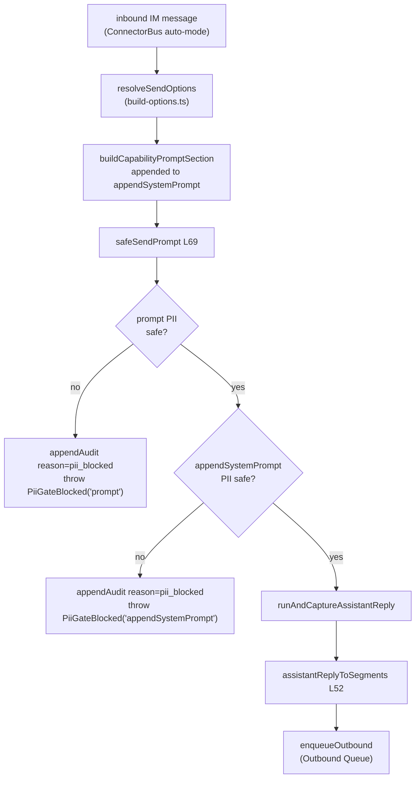
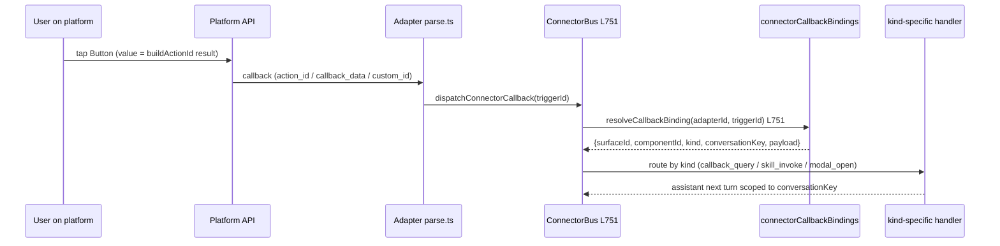
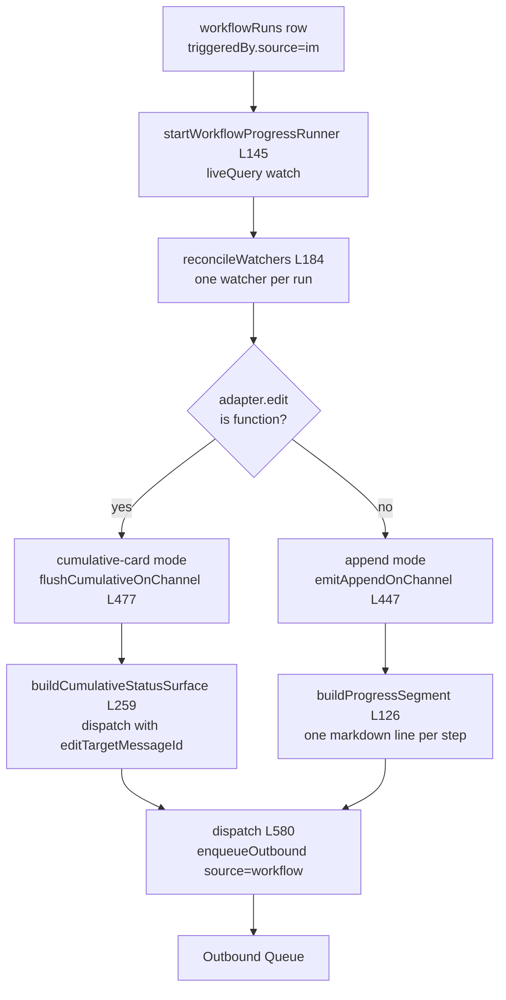

# Auto-mode AI Loop & A2UI Bridge

<Status variant="stable" />

<TLDR>
When an inbound IM message drives a Claude turn with no human in the loop, the connector subsystem cannot reuse the reviewed chat composer path — so `safeSendPrompt` (`lib/connectors/ai-loop/safe-send-prompt.ts:69`) wraps `runAndCaptureAssistantReply` with the same PII red-line `lib/twin/ingest/` enforces: walk the prompt and the build-options `appendSystemPrompt`, call `hasNoLeakingPii` on each, and **abort before the model** (writing a `pii_blocked` audit row) rather than redact — there is no human to decide what to drop. The captured reply is projected to transferable segments by `assistantReplyToSegments` (`a2ui-to-segments.ts:52`), inbound platform-rich content is lifted into surfaces by `segmentsToA2UI` (`segments-to-a2ui.ts:48`), plugins author surfaces declaratively via `createA2UIBuilder` (`surface-builder.ts:315`), the build-options resolver appends a capability-aware downgrade section (`capability-evaluator.ts:106`), interactive components round-trip through `buildActionId` / `recordCallbackBinding` / `resolveCallbackBinding` (`_shared/a2ui-mapper.ts`), and IM-triggered workflow runs fan progress into edit-in-place status cards via `startWorkflowProgressRunner` (`workflow-progress-runner.ts:145`).
</TLDR>

<StatGrid>
  <Stat label="PII gate" value="abort, not redact" hint="no human → no redaction decision" />
  <Stat label="A2UI component kinds" value="37" hint="A2UI_COMPONENT_KINDS" />
  <Stat label="Callback binding TTL" value="30d" hint="DEFAULT_CALLBACK_BINDING_TTL_MS" />
  <Stat label="Attachment LRU" value="500 MB" hint="LRU_TOTAL_CAP_BYTES, 7d default TTL" />
</StatGrid>

This page is the **middle** of the connector pipeline. The [ConnectorBus](./connector-bus) decides *whether* to reply; this layer decides *what* to say and *how to shape* it for the channel; everything terminates by calling `enqueueOutbound` and handing off to the [Outbound Queue](./outbound-queue). The A2UI vocabulary itself lives in [A2UI](../a2ui); workflow runs that trigger from IM are covered by [Visual Workflows](../visual-workflows). See the [subsystem overview](./index) for where this sits in the larger stack.

## The Auto-mode Loop: safeSendPrompt

The renderer chat composer is reviewed by a human before anything leaves the device, so it never has to enforce the PII red-line itself. The IM-driven auto-mode loop has no such reviewer — so `safeSendPrompt` re-applies the exact gate that `lib/twin/ingest/` and `lib/goal/` enforce: *raw user-supplied text MUST pass `hasNoLeakingPii` before it leaves the device*. It returns the same shape as `runAndCaptureAssistantReply`, so callers substitute it transparently.

The gate runs in three steps. Step 1 walks the inbound prompt; Step 2 walks the `appendSystemPrompt` tail that build-options injects (capability context, twin runtime hints); Step 3 delegates. Crucially, a leak **aborts** rather than redacts — `PiiGateBlocked` (`safe-send-prompt.ts:46`, discriminated by `source: "prompt" | "appendSystemPrompt"`) is thrown after the `pii_blocked` audit row is written, so the operator can see why the auto reply never fired.

```ts
// lib/connectors/ai-loop/safe-send-prompt.ts:75 — Step 1: prompt PII gate
if (!isPiiSafeSendContent(prompt)) {
  await appendAudit({
    adapterId: opts.adapterId,
    kind: "adapter.error",
    at: Date.now(),
    conversationKey: opts.conversationKey,
    reason: "pii_blocked",
    message: "auto-mode prompt rejected by PII gate before sendPrompt",
  })
  throw new PiiGateBlocked("prompt", opts.adapterId, opts.conversationKey)
}
```

`isPiiSafeSendContent` (`safe-send-prompt.ts:123`) walks every `type: "text"` block of the `SendContent` union via `hasNoLeakingPii` (from `@/lib/twin/ingest/redact`) — image/file blocks are skipped because the gate is about leakable text; binary attachments are encrypted on disk by `attachments.rs` instead. The convergence is: build-options' `resolveSendOptions` assembles the prompt and capability tail → `safeSendPrompt` gates → `runAndCaptureAssistantReply` runs the turn → `assistantReplyToSegments` projects the captured reply → `enqueueOutbound` hands off to the queue.



## Outbound Projection: assistantReplyToSegments

The chat page consumes A2UI parts as renderer-side React state; the IM outbound path needs them as transferable `MessageSegment`s. `assistantReplyToSegments` (`a2ui-to-segments.ts:52`) bridges the two. A2UI surfaces come **first**, in creation order (`reply.a2uiSurfaceOrder ?? Object.keys(surfaces)`), each wrapped by `buildA2UISegment`. The remaining trimmed markdown is appended as a single `{ type: "markdown" }` segment (`a2ui-to-segments.ts:67`); if the reply has neither text nor surfaces, an empty `{ type: "text" }` segment is emitted (`a2ui-to-segments.ts:72`) so the runner always has something to dispatch — an empty `OutboundRequest` would be rejected as malformed.

`buildA2UISegment` (`a2ui-to-segments.ts:84`) bakes the `plainTextMirror`: a model-supplied `widget.fallbackText` wins over the auto-generated `generatePlainTextMirror`. This same builder is reused directly by `scheduled-outbound.ts` and by the workflow progress runner for surfaces emitted outside the normal assistant-reply path. The runtime calls `assistantReplyToSegments` at `runtime.ts:437`.

## Inbound Projection: segmentsToA2UI

`segmentsToA2UI` (`segments-to-a2ui.ts:48`) is the inverse: it lifts a flat inbound `MessageSegment[]` (built from Slack rich_text / Lark interactive cards / Telegram caption + inline keyboard / Discord embed + components) into **one** A2UI Surface so the bus and renderer treat the inbound message identically to one the assistant would have generated. The segment-kind switch maps `text`/`markdown` → `Text`, `image` → `Image`, `card` → `Card`, `video`/`voice`/`file` → `Link`, `location` → `Text`; an inbound `a2ui` segment is handed back unchanged (`segments-to-a2ui.ts:138`). All children hang off one `Column` root (`segments-to-a2ui.ts:150`), and the `plainTextMirror` is the joined text parts.

This is distinct from the renderer-side `projectInboundToA2UI` (which builds an `InboundA2UIBlock`): `segmentsToA2UI` is the canonical "this is what A2UI looks like" projection that platform parsers call so the maintenance of that shape lives in one place.

## The Plugin Surface Builder

Plugins that want to send rich, interactive content through `ctx.connectors.send` need an `A2UIMessageSegment` whose `content` is a valid **id-keyed** component graph. Hand-authoring that graph (keying by id, wiring child refs, minting a mirror) is exactly the friction `surface-builder.ts` removes. Construction is **pure and ungated** — the side-effecting `send()` it feeds stays gated by `connectors:send`.

`validateA2UISurfaceComponents` (`surface-builder.ts:116`) asserts unique ids, resolves the root, and throws `A2UISurfaceBuildError` (`surface-builder.ts:48`) on any dangling child reference:

```ts
// lib/connectors/a2ui-bridge/surface-builder.ts:135 — root resolution
const resolvedRoot = rootId ?? (ids.has("root") ? "root" : components[0].id)
if (!ids.has(resolvedRoot)) {
  throw new A2UISurfaceBuildError(`rootId "${resolvedRoot}" is not among the components`)
}
```

The pipeline of pure builders: `buildA2UISurfaceContent` (`surface-builder.ts:158`) assembles the id-keyed `A2UISegmentContent` → `buildA2UIMessageSegment` (`surface-builder.ts:182`) wraps it as a transferable segment → `buildA2UIOutboundRequest` (`surface-builder.ts:195`) mints a `surfaceId` + idempotency key and appends optional trailing markdown, producing an `OutboundRequest` ready for `send()`. The `a2uiComponent` factory set (`surface-builder.ts:218`) gives 13 typed constructors — `text` / `button` / `card` / `row` / `column` / `alert` / `image` / `link` / `select` / `textField` / `list` / `divider` / `badge` — each returning the canonical `A2UIComponent` subtype, so output is renderer- and mapper-ready with no further shaping. `createA2UIBuilder()` (`surface-builder.ts:315`) bundles these into the `ctx.connectors.a2ui` namespace.

## Capability-aware Downgrade

Not every platform renders every A2UI kind. `evaluateSurfaceAgainstCapability` (`capability-evaluator.ts:55`) walks a surface via `walkA2UISurface`, buckets each present kind by its entry in the adapter's `A2UICapabilityMatrix` into `native` / `simulated` / `fallback` / `unsupported`, and computes a **worst-case** verdict via a strict downgrade ladder — `unsupported > fallback > simulated > native`:

```ts
// lib/connectors/a2ui-bridge/capability-evaluator.ts:77 — worst-case ladder
if (support === "native") {
  native.push(kind)
} else if (support === "simulated") {
  simulated.push(kind)
  if (worstCase === "native") worstCase = "simulated"
} else if (support === "fallback") {
  fallback.push(kind)
  if (worstCase === "native" || worstCase === "simulated") worstCase = "fallback"
} else {
  unsupported.push(kind)
  worstCase = "unsupported"
}
```

Unknown kinds (custom plugins / future additions) are treated as `fallback` because the renderer guarantees a best-effort mirror. `buildCapabilityPromptSection` (`capability-evaluator.ts:106`) renders the matrix into the concise system-prompt section that `build-options.ts:resolveSendOptions` appends to `appendSystemPrompt` — telling the assistant which kinds render natively, which are available only via multi-step UX (do not assume a synchronous same-turn reply), which degrade to plain text, and which must not be emitted at all. An optional `skillCapabilities` bullet declares the built-in skill families this channel serves so the assistant skips per-tool probing.

## Callback Round-trip

Interactive components need their button presses to find their way back to the originating surface. Each platform mapper calls `buildActionId(surfaceId, componentId, action)` (`_shared/a2ui-mapper.ts:119`), which returns the namespaced value the platform delivers back on callback (Slack `action_id`, Telegram `callback_data`, Discord `custom_id`, Lark `value.tag`):

```ts
// lib/connectors/adapters/_shared/a2ui-mapper.ts:119
export function buildActionId(surfaceId: string, componentId: string, action: string): string {
  return `a2ui:${surfaceId}:${componentId}:${action}`
}
```

Telegram caps `callback_data` at 64 bytes, so `truncateActionId` (`_shared/a2ui-mapper.ts:129`) SHA-1-hashes the over-long id for the wire while the full id stays in the binding row. `recordCallbackBinding` (`_shared/a2ui-mapper.ts:171`) upserts a `connectorCallbackBindings` row keyed `${adapterId}:${actionId}`, `kind` defaulting to `"callback_query"`, `expiresAt` defaulting to `createdAt + DEFAULT_CALLBACK_BINDING_TTL_MS` (30d). On the return trip the bus (`bus.ts:751`) reverse-looks up the binding:

```ts
// lib/connectors/adapters/_shared/a2ui-mapper.ts:216 — reverse lookup
export async function resolveCallbackBinding(
  adapterId: string,
  actionId: string
): Promise<ConnectorCallbackBindingRow | undefined> {
  return getDb()
    .connectorCallbackBindings.where("[adapterId+actionId]")
    .equals([adapterId, actionId])
    .first()
}
```

`pruneOldCallbackBindings` (`_shared/a2ui-mapper.ts:231`) reaps stale rows; `generatePlainTextMirror` (`_shared/a2ui-mapper.ts:257`) is the content-driven (not layout-driven) fallback that every mapper shares.



## Workflow Progress Fan-out

When a workflow run is triggered from IM (`triggeredBy.source === "im"`), `startWorkflowProgressRunner` (`workflow-progress-runner.ts:145`) `liveQuery`-watches `workflowRuns` and reconciles one watcher per run (`reconcileWatchers`, `workflow-progress-runner.ts:184`). Each channel picks one of two modes:

- **cumulative-card** — adapters whose `adapter.edit` is a function (`defaultSupportsEdit`, `workflow-progress-runner.ts:136`). One status surface is **edited in place** on each event via `buildCumulativeStatusSurface` (`workflow-to-a2ui.ts:259`). `flushCumulativeOnChannel` (`workflow-progress-runner.ts:477`) resolves the entry job's `platformMessageId` from `outboundQueue.get`, then re-dispatches with `editTargetMessageId`.
- **append** — adapters without edit (WeCom, wechat-personal). One compact markdown line per step via `buildProgressSegment` (`workflow-to-a2ui.ts:126`), emitted by `emitAppendOnChannel` (`workflow-progress-runner.ts:447`), plus a `buildFinalSurface` summary at the end.

The approval handshake uses distinct action-id namespaces — `WF_APPROVE_PREFIX = "wfapp:"` and `WF_CANCEL_PREFIX = "wfcan:"` (`workflow-to-a2ui.ts:40`) — so the bus routes `wf_approve` vs `wf_cancel` by prefix without sniffing the payload:

```ts
// lib/connectors/a2ui-bridge/workflow-to-a2ui.ts:64 — approve/cancel Card
const approveActionId = WF_APPROVE_PREFIX + input.bindingId
const cancelActionId = WF_CANCEL_PREFIX + input.bindingId
const safeSummary = (input.summary ?? "").trim()
const components: Record<string, unknown> = {
  root: {
    component: "Card",
    title: input.workflowName,
    children: safeSummary.length > 0 ? ["summary", "actions"] : ["actions"],
  },
```

Every dispatch funnels through `dispatch` (`workflow-progress-runner.ts:580`), which `enqueueOutbound`s with `source: "workflow"` and a `sourceWorkflow: { workflowId, runId, nodeId }` provenance tag — and, for cumulative mode, the resolved `editTargetMessageId` so the platform edits the existing message instead of posting a new one:

```ts
// lib/connectors/a2ui-bridge/workflow-progress-runner.ts:511 — edit-in-place dispatch
await dispatch(
  watcher,
  channel,
  [segment],
  `wf-status:${watcher.runId}:${channel.channelKey}:${watcher.lastEmittedTs}`,
  "",
  enqueue,
  channel.entryPlatformMessageId
)
```

The terminal `buildFinalSurface` / `buildCumulativeStatusSurface` both embed a `buildWorkflowRunDeepLink` (`workflow-to-a2ui.ts:173`) — `cognia://workflow-run/<workflowId>/<runId>` — so a tap opens the run-detail page in the desktop / mobile shell.



## Attachment Cache

Inbound media is fetched once and reused. `fetchAttachment` (`attachment-fetcher.ts:65`) is cache-or-recover: it looks up the `connectorAttachments` row keyed `[adapterId+remoteRef]` and, on a non-expired hit, returns it **without** touching Rust:

```ts
// lib/connectors/attachment-fetcher.ts:73 — cache hit short-circuit
if (existing && !isExpired(existing, now)) {
  return {
    ref: { localUrl: existing.localPath, remoteRef: existing.remoteRef },
    cached: true,
  }
}
```

On a miss (or after TTL) it calls the Tauri `connectorsAttachmentFetch` command, upserts the row with `expiresAt = now + ttl` (default 7 days, pass `0` to opt out), then runs a best-effort `runLruEviction(LRU_TOTAL_CAP_BYTES)` (`attachment-fetcher.ts:124`) — walking newest-first, summing `sizeBytes`, dropping the oldest rows once the running total exceeds the 500 MB cap. `pruneAttachmentsForAdapter` (`attachment-fetcher.ts:109`) bulk-purges an adapter's rows on removal. The Rust side (`src-tauri/src/connectors/attachments.rs`) owns the SHA-256 cache key and AES-256-GCM on-disk encryption — which is exactly why the PII gate skips binary blocks: they never travel as plaintext.

## Related

<Cards>
  <Card title="ConnectorBus" href="./connector-bus" description="The dispatcher that decides whether to reply and routes inbound callbacks via dispatchConnectorCallback." />
  <Card title="Outbound Queue & Delivery" href="./outbound-queue" description="Where every projected segment terminates — durable queue, retries, rate limiting, edit-in-place delivery." />
  <Card title="A2UI" href="../a2ui" description="The A2UI component vocabulary, schema, and renderer that this bridge projects to and from." />
  <Card title="Visual Workflows" href="../visual-workflows" description="The workflow runtime whose IM-triggered runs fan progress through this bridge." />
  <Card title="Built-in Adapters" href="./built-in-adapters" description="The per-platform mappers that consume buildActionId / capability matrices and emit native rich content." />
  <Card title="Adapter Model" href="./adapter-model" description="The adapter interface — edit(), capability matrix, parse.ts — these projections target." />
</Cards>
