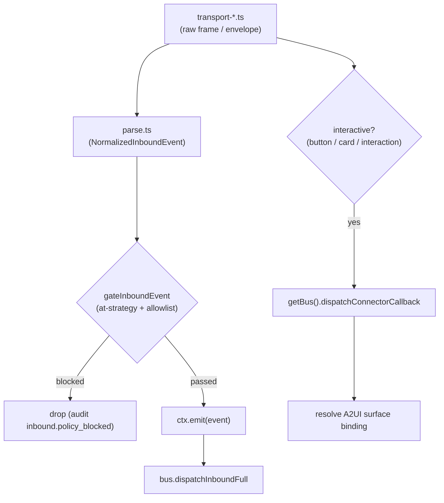

# Built-in Adapters

<Status variant="stable" />

<TLDR>
  Eleven built-in adapters ship in-tree under `lib/connectors/adapters/<platform>/`. Each follows the
  **same decomposition** — `parse.ts` (platform envelope → `NormalizedInboundEvent`), `serialize.ts`
  (`OutboundRequest` → platform call), one or more `transport-*.ts` drivers, a `capability.ts` matrix,
  and an `index.ts` `createXxxAdapter(opts)` factory that wires them together. Inbound takes a single
  path: the transport yields raw frames, the parser normalises them, `gateInboundEvent` (`lib/connectors/at-gate.ts`)
  applies the at-strategy + allow/blocklist gate, then `ctx.emit(event)` lands on `bus.dispatchInboundFull`.
  **Interactive callbacks bypass emit** — inline buttons / cards / interactions call
  `getBus().dispatchConnectorCallback(...)` directly so the A2UI surface binding is recovered. Transports
  span long-poll, webhook, gateway (WSS), reverse-WS, Socket Mode, Stream Mode, and Matrix `/sync`.
</TLDR>

<StatGrid>
  <Stat label="Built-in adapters" value="11" hint="one createXxxAdapter factory each" />
  <Stat label="Deep-documented" value="4" hint="Telegram / Discord / Lark / OneBot" />
  <Stat label="Long-poll" value="telegram / matrix / wechat-personal" hint="cursor-driven HTTP loop" />
  <Stat label="Persistent WSS" value="discord / qq-official / lark / wecom / slack / dingtalk" hint="op-coded, bridged, Socket Mode, or Stream Mode" />
  <Stat label="Reverse-WS" value="onebot" hint="client dials cognia (Rust axum)" />
  <Stat label="Webhook-only" value="wechat-oa" hint="Rust verify + decrypt" />
</StatGrid>

The eleven adapters are the concrete implementations of the [`PlatformAdapter`](./adapter-model) contract.
This page covers what is *common* to all of them, the full transport/signature matrix, and a deep dive into
the four reference adapters. The Rust signaling/decrypt plane they lean on is documented in
[the Rust layer](./rust-layer); how inbound events are gated is in [inbound gating](./inbound-gating); how
each adapter advertises rich content is in [AI & A2UI](./ai-and-a2ui).

## Common Decomposition

Every adapter directory is the same shape, so once you know one you know all eleven:

| File | Responsibility |
| --- | --- |
| `parse.ts` | Platform event envelope → `NormalizedInboundEvent` (sender, channel, mentions, segments). |
| `serialize.ts` | `OutboundRequest` → platform API call(s) (text, media, reactions, edits). |
| `transport-*.ts` | The connection driver (long-poll loop, gateway WS client, webhook subscriber, …). |
| `capability.ts` | The static capability flags + A2UI capability matrix for this platform. |
| `index.ts` | The `createXxxAdapter(opts)` factory that assembles all of the above into a `PlatformAdapter`. |

Signature verification, where it exists, lives in **Rust** (`src-tauri/src/connectors/sigverify/*`) because the
static-export caveat means there is no Next.js HTTP server to receive webhooks — the axum server owns the socket
and hands already-verified frames to TS through Tauri events.

The `buildXxx` step inside `buildAdapterFromRow` ([adapter-model](./adapter-model)) resolves credentials via
keyring resolvers (lazy, rotation-safe), resolves the bot's own id via an identity probe, then calls the factory.

### Inbound path (one path for every adapter)



The split is load-bearing: **regular messages** go through the gate and `ctx.emit`; **interactive callbacks**
(`callback_query`, `INTERACTION_CREATE`, `im.interactive_message.action_triggered_v1`, …) skip the gate and call
`dispatchConnectorCallback` so the bus can recover the `surfaceId` / `componentId` written at outbound time and
drive the next assistant turn.

## Transport & Signature Matrix

| platform | transport (file) | signature / auth (file / Rust) | self-id resolution | notable caps |
| --- | --- | --- | --- | --- |
| **telegram** | longpoll `getUpdates` cursor (`transport-longpoll.ts`) OR webhook | `X-Telegram` secret-token (Rust `sigverify/telegram.rs`) | `getMe` → `result.id` | reply / edit (`editMessageText`) / delete / react (`setMessageReaction`); TextField = ForceReply simulated |
| **discord** | Gateway v10 WSS (`gateway-client.ts`, opcodes / IDENTIFY / RESUME / heartbeat) | `Authorization: Bot`; Rust Ed25519 verifier exists but is reserved for a future webhook transport | READY `user.id` (or `/users/@me`) | reply / edit / delete / react / fetchHistory; embeds + ActionRow; modal simulated |
| **lark** | long-connection (Rust `lark_ws.rs` protobuf, TS `transport-long-conn.ts` thin consumer) OR webhook | `tenant_access_token` Bearer (`auth.ts`) + webhook AES-CBC + verification_token (Rust `sigverify/lark.rs`) | `bot/v3/info` → `open_id` cached | richest cards (`rich-card.lark`) interactive cards 2.0; bot-menu quick commands |
| **onebot** | reverse-WS (Rust `ws_server.rs`, `transport-reverse-ws.ts`) OR forward-WS | optional bearer, **NO signature** | first event `self_id` | reply / delete (recall) / react (NapCat `set_msg_emoji_like`) / fetchHistory (v11); **NO** edit / markdown / cards (interactive → plainTextMirror tail); v11/v12 auto-detect |
| **slack** | Socket Mode WSS (`transport-socket-mode.ts`) OR events-api webhook | bot `xoxb` + app `xapp` + webhook HMAC (Rust `sigverify/slack.rs`) | `auth.test` → `user_id` | `rich-card.slack` Block Kit + `rich-markdown.slack`; richest native A2UI set |
| **qq-official** | Gateway WSS (`gateway-client.ts`, Discord-clone opcodes) OR webhook (Rust Ed25519 verify, `transport-webhook.ts`) | app access token QQBot (`auth.ts`; `clearTokenCache` injected by the registry, evicted on 401/403 + gateway `INVALID_SESSION`) | gateway READY | reply text-only (passive `msg_seq` derived from the idempotency key); `delete` (scene-scoped recall — `platformMessageId` is `scene:sceneId:id`); `typing` (C2C only, `msg_type 6 input_notify`, ≤4 slots); `send.reaction` (channel scene only); A2UI all fallback (templates need approval) |
| **wecom** | generic Rust WS bridge `ws_client.rs` (`protocol.ts` plain-JSON `aibot_subscribe` + 30s ping) | `botId` + `secret`, **NO** encryption / signature | `aibotid` from first frame | **streamReply (the only impl)**; `send.card` template_card; no edit / delete / history |
| **wechat-oa** | webhook only (Rust `wechat_oa_handler` verify + decrypt, `transport-webhook.ts` yields `{xml}`) | token + EncodingAESKey, GET signature + POST msg_signature + AES (Rust `sigverify/wechat.rs`) | first-message id | text-only; `typing` (`custom/typing` Typing / CancelTyping, 45015 / 45047 swallowed); 48h 客服 (customer-service) window (`errcode 45015` non-retryable); no delete / edit / history |
| **wechat-personal** | HTTP long-poll iLink (~35s cursor, `protocol.ts` + index loop) | iLink `bot_token` QR-login, echoes `context_token`, **NO** proactive send | login session id | reply-only text + numeric-action-registry for numbered replies; `ret -14` session expired |
| **dingtalk** | Stream Mode WSS (`stream-client.ts`, gateway ticket + ack + ping) | AppKey / AppSecret = Stream clientId / secret + OpenAPI app access token (`auth.ts`) | `chatbotUserId` optional selfId | markdown-first; outbound `oToMessages/batchSend` + `groupMessages/send` sampleMarkdown; `delete` (recall via `groupMessages/recall` / `otoMessages/batchRecall` — `platformMessageId` = `dt:<scope>:<robotCode>:<openConversationId>:<processQueryKey>`, session-webhook sends not recallable); every inbound `selfMentioned`; Button simulated |
| **matrix** | `/sync` long-poll (`transport-sync.ts`, `next_batch` cursor, HTTP via Tauri proxy) | access token Bearer (`auth.ts` `normalizeHomeserver`), **NO** signature | whoami → `@bot:hs` + `device_id` | reply / edit (`m.replace`) / delete (redaction) / react (`m.annotation`) / thread / typing; HTML `formatted_body`; native `m.image` / `m.file` / `m.audio` / `m.video` media upload; Button / Select / TextField simulated via reply-correlation |

> Where the `transportModes` meta field says `gateway` it covers any persistent-WS driver — Discord/QQ opcode
> gateways, the Lark long-connection, the WeCom WS bridge, and Slack Socket Mode all report `gateway`; real long-poll
> drivers (Telegram, Matrix, WeChat-Personal) report `longpoll`; DingTalk also reports `longpoll` as a legacy outbound-dialing bucket even though its provider transport is Stream Mode WSS; WeChat-OA reports `webhook`.

## Telegram

Factory `createTelegramAdapter(opts)` (`lib/connectors/adapters/telegram/index.ts:52`). `start()`
(`index.ts:132`) picks the feed by `opts.transport`: long-poll (`startLongPoll`) or webhook
(`startWebhookTransport`). The drive loop routes each update three ways:

1. `update.callback_query` → `parseTelegramCallbackQuery` → `dispatchConnectorCallback` + best-effort
   `answerCallbackQuery` (`index.ts:156-175`).
2. A reply matching an outstanding ForceReply binding → `parseTelegramForceReplyCorrelation` →
   `dispatchConnectorCallback` with `actionType:"input"` (`index.ts:183-198`).
3. Otherwise `parseTelegramUpdate` → `gateInboundEvent` → `ctx.emit` (`index.ts:201-207`).

**Parse pipeline.** `parseTelegramUpdate` (`parse.ts:676-717`) demultiplexes the update envelope:
`edited_message` / `edited_channel_post` → `kind:"edit"` with `replacesMessageId`; `message_reaction` →
`reactionToEvent` system event; `callback_query` → `null` (handled on the callback channel); otherwise the
`message`/`channel_post` is projected by `messageToEvent` (`parse.ts:391-469`) which calls `buildConversationKey`,
`detectMentions` (shared `MentionAccumulator`), and `buildSegments` (media → `tg://file/<file_id>` URLs).

Characteristic snippet — the long-poll cursor advance that makes `getUpdates` exactly-once:

```ts
// lib/connectors/adapters/telegram/transport-longpoll.ts:76-81
attempts = 0
for (const update of body.result) {
  if (opts.signal.aborted) return
  offset = update.update_id + 1
  yield update
}
```

## Discord

Factory `createDiscordAdapter(opts)` (`lib/connectors/adapters/discord/index.ts:58`). `start()`
(`index.ts:87`) opens the Gateway client and `for await`s its `dispatches`. `INTERACTION_CREATE`
(components / modal_submit) → `parseDiscordInteraction` → `dispatchConnectorCallback` (`index.ts:116-123`);
everything else → `parseDiscordDispatch` → `gateInboundEvent` → `ctx.emit` (`index.ts:125-131`). `selfId`
is refreshed from the gateway READY event captured in `client.selfId` (`index.ts:108-110`).

**Parse pipeline.** `parseDiscordDispatch` (`parse.ts:510-541`) switches on the dispatch type:
`MESSAGE_CREATE` → `messageToEvent`; `MESSAGE_UPDATE` → `messageToEvent(..., "edit")`; `MESSAGE_DELETE` →
`deleteToEvent`; `MESSAGE_REACTION_ADD` / `MESSAGE_REACTION_REMOVE` → `reactionToEvent`. `fetchHistory`
re-wraps each `GET /channels/:id/messages` row in a synthetic `MESSAGE_CREATE` and runs it through the same
parser so history events are shape-identical to live ones.

Characteristic snippet — Gateway opcode handling, including the READY self-id capture:

```ts
// lib/connectors/adapters/discord/gateway-client.ts:213-231
case OP_DISPATCH: {
  if (msg.t === "READY") {
    const ready = msg.d as {
      user?: { id?: string }
      session_id?: string
      resume_gateway_url?: string
    }
    selfId = ready.user?.id ?? selfId
    session.sessionId = ready.session_id ?? null
    session.resumeGatewayUrl = ready.resume_gateway_url ?? null
    attempts = 0
  } else if (msg.t === "MESSAGE_CREATE" || msg.t === "MESSAGE_UPDATE") {
```

## Lark

Factory `createLarkAdapter(opts)` (`lib/connectors/adapters/lark/index.ts:97`). `start()` (`index.ts:159`)
does a **pre-flight credential check** — a row with no appId/appSecret is skipped cleanly instead of looping a
doomed reconnect — then drives the long-connection or webhook transport, routing every frame through the shared
`dispatchEnvelope`. That dispatcher special-cases two event types before the normal message path:
`im.interactive_message.action_triggered_v1` → `parseLarkInteractiveCallback` → `dispatchConnectorCallback`
(`index.ts:211-218`); `application.bot.menu_v6` → `parseLarkBotMenuEvent` (quick-command) → gate → emit
(`index.ts:221-234`); otherwise `parseLarkEventEnvelope` → gate → emit (`index.ts:235-255`).

**Parse pipeline.** `parseLarkEventEnvelope` (`parse.ts:228-353`) reads `header.event_type`:
`im.message.message_read_v1` → `read_indicator` system event; `im.message.recalled_v1` → `kind:"delete"`;
`im.chat.member.*` → member-added/removed system event; `im.message.receive_v1` → `kind:"create"` (sender via
`open_id`, mentions, segments, `chat_type === "p2p"` → private). Auth: `getTenantAccessToken`
(`auth.ts:65-100`) caches the `tenant_access_token` for its TTL (`expire ?? 7200` seconds) keyed by
`appId:appSecret`.

Characteristic snippet — the long-connection consume loop that resets backoff on each delivered envelope:

```ts
// lib/connectors/adapters/lark/transport-long-conn.ts:127-137
while (!ended && !opts.signal.aborted) {
  if (queue.length === 0) {
    await new Promise<void>((r) => {
      wakeResolve = r
    })
  }
  while (queue.length > 0 && !opts.signal.aborted) {
    attempts = 0 // reset backoff on successful data
    yield queue.shift()!
  }
}
```

## OneBot

Factory `createOneBotAdapter(opts)` (`lib/connectors/adapters/onebot/index.ts:91`). It selects the transport up
front — `forward-ws` when a URL is present, else the reverse-WS default. `start()` (`index.ts:173`) calls
`transport.start(...)` with `onOpen`/`onClose`/`onEvent` handlers; `onOpen` fires `probeUpstreamImpl` which calls
the OneBot `get_version_info` action and records NapCat / Lagrange feature flags (`markdown-card`,
`upload_group_file`, `set_msg_emoji_like`) onto the adapter row. `onEvent` runs `parseOneBotEvent` → gate →
`ctx.emit`.

**Parse pipeline.** `parseOneBotEvent` (`parse.ts:42-60`) detects the protocol variant once
(`detectVariant`, cached per adapter) then delegates to `parseV11Event` or `parseV12Event`. `parseV11Event`
(`v11.ts:189-320`) filters the bot's own `message_sent` echo, maps `notice_type` recalls →`kind:"delete"`,
member-change notices → system events, and `message` posts → `kind:"create"` with CQ-code segments. There is no
edit API, no markdown, and no cards — interactive A2UI surfaces degrade to a plain-text mirror tail.

Characteristic snippet — the echo-matched RPC frame that pairs an outbound action with its response:

```ts
// lib/connectors/adapters/onebot/transport-reverse-ws.ts:136-152
return new Promise<OneBotRpcResponse>((resolve, reject) => {
  const timer = setTimeout(() => {
    pendingRpcs.delete(call.echo)
    reject(new Error(`OneBot RPC timeout: echo=${call.echo} action=${call.action}`))
  }, timeoutMs)

  pendingRpcs.set(call.echo, (resp) => {
    clearTimeout(timer)
    resolve(resp)
  })

  emit(sendTopic, JSON.stringify(call)).catch((err) => {
```

## Self-identity (whoami)

Each adapter resolves its bot's own id so it can detect self-mentions and label the UI. The dedicated probes
under `lib/connectors/whoami/` call the platform identity endpoint with the keyring token and persist
`lastWhoamiResult` + `lastWhoamiAt` onto the adapter row:

- **Telegram** — `probeTelegramIdentity` calls `getMe` and stores `@username` / `result.id`
  (`telegram-whoami.ts:54-108`).
- **Slack** — `probeSlackIdentity` calls `auth.test` and stores `user @ team` / `user_id` / `team_id`
  (`slack-whoami.ts:47-109`).
- **Discord** — `probeDiscordIdentity` calls `GET /users/@me` and stores the bot name + avatar + snowflake id
  (`discord-whoami.ts:49-102`).
- **Matrix** — `probeMatrixIdentity` calls `/account/whoami` and stores the Matrix user id plus device id when
  the homeserver returns one (`matrix-whoami.ts`).

The persisted result is rendered in **Adapters → Config** as "Connected as …", giving operators a one-glance
confirmation that the token is valid and bound to the expected bot.

## Related

<Cards>
  <Card title="Adapter Model & Registry" href="./adapter-model" description="The PlatformAdapter contract, buildAdapterFromRow, and the lazy credential resolvers these factories plug into." />
  <Card title="Rust Layer" href="./rust-layer" description="The axum signaling / sigverify / decrypt plane that webhooks, reverse-WS, Lark long-conn, and the WeCom bridge depend on." />
  <Card title="Inbound Gating" href="./inbound-gating" description="gateInboundEvent — the at-strategy + allow/blocklist gate every adapter calls before ctx.emit." />
  <Card title="AI & A2UI" href="./ai-and-a2ui" description="How each adapter advertises rich content and maps A2UI surfaces to native cards / blocks / fallbacks." />
  <Card title="Slack setup" href="../../connectors/slack-setup" description="Socket Mode tokens, scopes, and webhook signing for the Slack adapter." />
  <Card title="Lark setup" href="../../connectors/lark-setup" description="App ID / secret, long-connection vs webhook, and bot-menu quick commands." />
  <Card title="OneBot setup" href="../../connectors/onebot-setup" description="NapCat / Lagrange reverse-WS wiring and the get_version_info feature probe." />
  <Card title="Discord setup" href="../../connectors/discord-setup" description="Gateway intents, bot token, and the reserved public-key field." />
</Cards>
