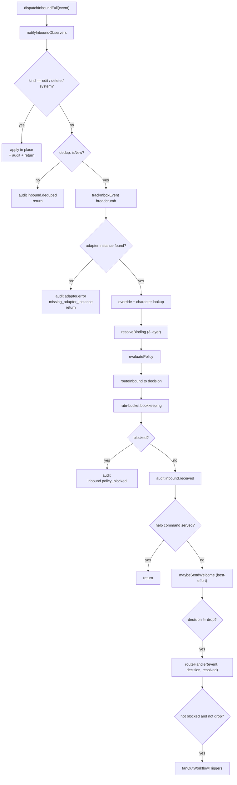
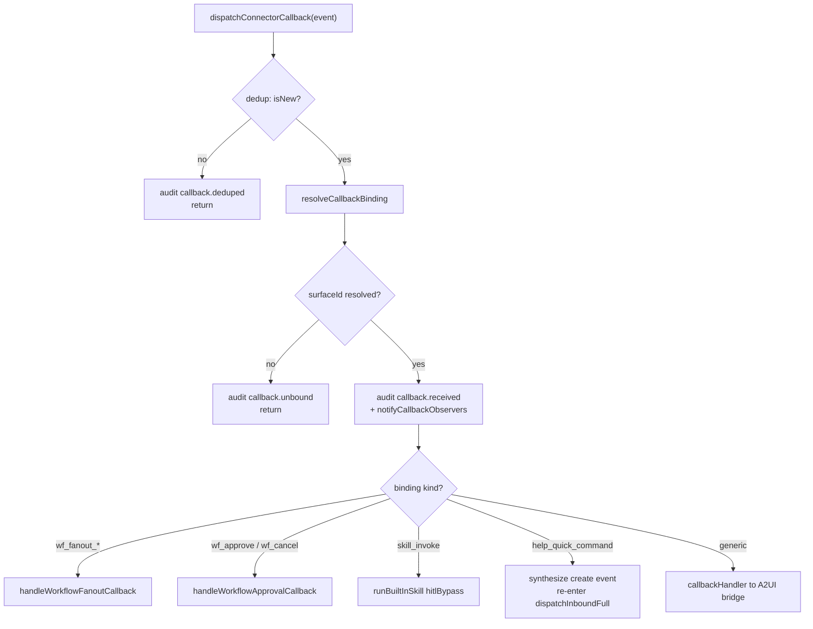
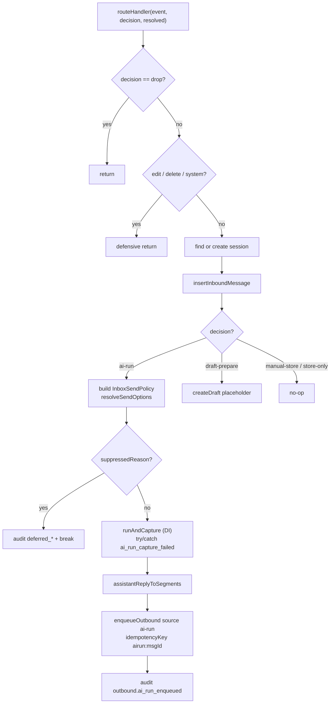

# ConnectorBus & Runtime

<Status variant="stable" />

<TLDR>
`ConnectorBus` is the single in-process hub every platform adapter fans into. One method — `dispatchInboundFull` (`lib/connectors/bus.ts:208`) — drives the ordered 11-step inbound pipeline (dedup → adapter lookup → binding → policy → route → fan-out). A parallel method, `dispatchConnectorCallback` (`lib/connectors/bus.ts:721`), handles interactive button/select/form events with five kind-specific short-circuits. The runtime (`lib/connectors/runtime.ts:288`) installs `bus.routeHandler` to turn an `ai-run` decision into a captured Claude turn enqueued for outbound delivery. Lifecycle (`lib/connectors/lifecycle.ts`) tracks running adapters and hot-reloads them on credential rotation.
</TLDR>

<StatGrid>
  <Stat label="bus.ts" value="1087 lines" hint="ConnectorBus class + getBus()" />
  <Stat label="Inbound pipeline" value="11 steps" hint="dedup → fan-out, ordered" />
  <Stat label="Callback short-circuits" value="5 kinds" hint="before generic handler" />
  <Stat label="runtime decisions" value="4 + drop" hint="ai-run / draft / store / drop" />
</StatGrid>

The ConnectorBus is the **single owner of the routing decision** for every inbound platform event. Adapters never decide whether to reply — they normalize a platform payload into a `NormalizedInboundEvent` and hand it to the bus. Everything downstream (dedup, character binding, policy gate, AI turn, workflow fan-out) is the bus's responsibility. See [the subsystem overview](./index) for where the bus sits in the larger connector stack, and [adapter model](./adapter-model) for what an adapter contributes.

## The Singleton

`ConnectorBus` is a class (`lib/connectors/bus.ts:78`) reached through a lazy singleton `getBus()` (`lib/connectors/bus.ts:1079`). Adapters register on start and unregister on stop:

```ts
// lib/connectors/bus.ts:119 — registry mutators
registerAdapter(adapter: PlatformAdapter): void {
  this.adapters.set(adapter.id, adapter)
}

unregisterAdapter(adapterId: string): void {
  this.adapters.delete(adapterId)
}
```

Two **passive observer channels** let plugins tap traffic without owning the decision. `subscribeInbound` (`lib/connectors/bus.ts:137`) feeds every inbound event to `ctx.connectors.onInbound` before routing; `subscribeCallback` (`lib/connectors/bus.ts:162`) feeds every resolved interactive callback to `ctx.connectors.onCallback`. Both are strictly read-only — a throwing observer is swallowed and never alters routing (`lib/connectors/bus.ts:144`, `lib/connectors/bus.ts:171`).

The authoritative seams are two nullable fields: `routeHandler` (`lib/connectors/bus.ts:103`, installed by the runtime) and `callbackHandler` (`lib/connectors/bus.ts:111`, wired to the A2UI bridge). Outbound delivery methods — `sendOutbound` (`lib/connectors/bus.ts:567`), `editOutbound` (`lib/connectors/bus.ts:585`), `deleteOutbound` (`lib/connectors/bus.ts:611`), `setTypingOutbound` (`lib/connectors/bus.ts:635`), `uploadFileOutbound` (`lib/connectors/bus.ts:651`), `streamReplyOutbound` (`lib/connectors/bus.ts:669`), `fetchHistoryAll` (`lib/connectors/bus.ts:682`) — and capability readers `getAdapterA2UICapability` (`lib/connectors/bus.ts:1046`) / `getAdapterSkillCapabilities` (`lib/connectors/bus.ts:1058`) all key off the same in-memory adapter map.

## The 11-step Inbound Pipeline

`dispatchInboundFull(event)` (`lib/connectors/bus.ts:208`) is the heart of the subsystem. It runs in strict order; several steps **short-circuit and return** so a duplicate, an orphan, or a blocked event never reaches the AI turn.

1. **Stamp** `now = Date.now()` (`lib/connectors/bus.ts:209`).
2. **Notify observers** — passive plugin tap, up front (`lib/connectors/bus.ts:212`).
3. **Edit/Delete/System short-circuit** — each branch applies in place and returns (`lib/connectors/bus.ts:215`).
4. **Dedup** — `recordAndCheckInbound`; if already seen, audit `inbound.deduped` and stop (`lib/connectors/bus.ts:229`).
5. **Breadcrumb** — `trackInboxEvent("inbound.received")` fired *after* dedup so duplicates don't inflate the counter (`lib/connectors/bus.ts:242`).
6. **Adapter lookup** — missing instance audits `adapter.error` with `missing_adapter_instance` and returns (`lib/connectors/bus.ts:250`).
7. **Override lookup** — `readForResolution(conversationKey)` (`lib/connectors/bus.ts:262`).
8. **Character lookup** — `override.characterId ?? adapterRow.defaultCharacterId` (`lib/connectors/bus.ts:265`).
9. **Resolve binding** — 3-layer merge via `resolveBinding` (`lib/connectors/bus.ts:269`).
10. **Evaluate policy** then **route** — `evaluatePolicy` (`lib/connectors/bus.ts:272`) → `routeInbound` → `decision` (`lib/connectors/bus.ts:275`).
11. **Bookkeep, audit, help/welcome, route, fan-out** — rate-bucket push keyed `sender.id:channel.id` (`lib/connectors/bus.ts:286`); audit `inbound.policy_blocked` or `inbound.received` (`lib/connectors/bus.ts:292`); `maybeHandleHelpCommand` returns early if served + `maybeSendWelcome` (`lib/connectors/bus.ts:316`); `routeHandler` if `decision !== "drop"` (`lib/connectors/bus.ts:333`); `fanOutWorkflowTriggers` if not blocked and not dropped (`lib/connectors/bus.ts:347`).



The key invariant: the bus writes the `inbound.policy_blocked` / `inbound.received` audit row **before** calling `routeHandler` — the runtime only adds rows for the distinct actions it takes (ai-run enqueue, draft creation, deferred suppression). See [inbound gating](./inbound-gating) for the policy/binding layers feeding steps 9–10.

## Edit / Delete / System short-circuits

Edit, delete, and system events branch out at the very top (`lib/connectors/bus.ts:215`) because they carry no fresh user message. They never run the policy gate and they **never fan out to workflows**.

`applyMessageEdit` (`lib/connectors/bus.ts:359`) and `applyMessageDelete` (`lib/connectors/bus.ts:430`) both resolve the target via the **v49 `platformMessageId` index** plus a platform safety filter, so a Telegram `12345` edit cannot clobber a Discord row with the same numeric id:

```ts
// lib/connectors/bus.ts:375 — indexed lookup + platform safety filter
const db = getDb()
const target = await db.messages
  .where("platformMessageId")
  .equals(replaces)
  .filter((m) => m.metadata?.platformMessage?.platform === event.platform)
  .first()
```

An edit maps `event.segments` back to text parts and stamps `editedMetadata` (`editedAt` + incremented `editCount`, `lib/connectors/bus.ts:403`). A delete soft-deletes (parts become `[deleted]`, `metadata.deletedAt` set, `lib/connectors/bus.ts:451`). `applySystemEvent` (`lib/connectors/bus.ts:476`) maps `systemKind` → audit kind (`read_indicator` / `member_added` / `member_removed`); on `member_added` it pushes a one-time welcome card (`lib/connectors/bus.ts:510`). Each path audits regardless of whether a matching row was found.

## Interactive Callback Dispatch

`dispatchConnectorCallback(event)` (`lib/connectors/bus.ts:721`) is the parallel pipeline for interactive surfaces (Slack `block_actions`, Lark interactive card, Telegram `callback_query`, Discord component interaction). It dedups under the `"callback"` namespace (`lib/connectors/bus.ts:725`), resolves the `(surfaceId, componentId, conversationKey)` binding via `resolveCallbackBinding` (`lib/connectors/bus.ts:751`), bails to `callback.unbound` when no anchoring surface exists (`lib/connectors/bus.ts:763`), audits `callback.received` (`lib/connectors/bus.ts:782`), and notifies observers (`lib/connectors/bus.ts:801`). Then it runs **five kind-specific short-circuits** before the generic handoff:

| Binding kind | Lines | Action |
| --- | --- | --- |
| `wf_fanout_approve` / `wf_fanout_cancel` | `lib/connectors/bus.ts:808` | `handleWorkflowFanoutCallback` (writes/drops fan-out subscription) |
| `wf_approve` / `wf_cancel` | `lib/connectors/bus.ts:849` | `handleWorkflowApprovalCallback` (start/cancel run, tight reply) |
| `skill_invoke` | `lib/connectors/bus.ts:886` | `runBuiltInSkill` with `hitlBypass: true` |
| `help_quick_command` | `lib/connectors/bus.ts:937` | synthesize `create` event + re-enter pipeline |
| (generic) | `lib/connectors/bus.ts:1000` | `callbackHandler` handoff to A2UI bridge |

The `help_quick_command` branch is the most interesting: a help/welcome card's quick-command button is treated **exactly as if the user typed the command**. It builds a synthetic inbound event with `selfMentioned: true` (so a mention-only trigger never drops it) and re-enters the top of the inbound pipeline:

```ts
// lib/connectors/bus.ts:982 — re-entrancy into dispatchInboundFull
  kind: "create",
}
try {
  await this.dispatchInboundFull(synthetic)
} catch (err) {
```



See [AI and A2UI](./ai-and-a2ui) for how the generic handoff projects a callback into an A2UI ActionEvent.

## Workflow Fan-out

`fanOutWorkflowTriggers(event)` (`lib/connectors/bus.ts:525`) is the last step of a successful inbound run. It resolves every workflow subscribed to `trigger.connector.inbound` via `findMatchingWorkflows` and dispatches each one through `dispatchTrigger`, isolating per-workflow failures so one bad workflow never crashes the bus:

```ts
// lib/connectors/bus.ts:538 — per-workflow isolation
const dispatches = matches.map(async (m) => {
  try {
    await dispatchTrigger({
      workflowId: m.workflowId,
      kind: "trigger.connector.inbound",
      payload: event,
      originAt,
      binding: { adapterId: event.adapterId, conversationKey: event.conversationKey },
    })
  } catch (err) { /* audit adapter.error workflow_dispatch_failed */ }
})
```

Fan-out runs for **every** non-dropped, non-blocked decision — even `draft-prepare` — because a workflow may legitimately react to a draft-mode message. It is suppressed for `decision === "drop"` (no StoredMessage to act on) and for blocked events (so it can't bypass the rate-limit gate indirectly). See [visual workflows](../visual-workflows) for the trigger-bridge side.

## Runtime: routeHandler

`installRuntime(bus, opts)` (`lib/connectors/runtime.ts:288`) installs `bus.routeHandler`. The handler short-circuits on `drop` (`lib/connectors/runtime.ts:297`) and defensively returns on edit/delete/system (`lib/connectors/runtime.ts:306`), then finds-or-creates the session (`findSessionByConversationKey` `lib/connectors/runtime.ts:105`, reused by scheduled-outbound), inserts the inbound `StoredMessage` (`insertInboundMessage` `lib/connectors/runtime.ts:200`, which reverse-projects native rich content via `projectInboundToA2UI`), and switches on the decision (`lib/connectors/runtime.ts:323`).

The **ai-run** path (`lib/connectors/runtime.ts:324`) is the substantive one. Every lookup is best-effort; it builds an `InboxSendPolicy` from `quietHours` / `muted` / `forcedMode`, resolves send options, runs the suppression gate, captures the turn via the **dependency-injected** `runAndCapture`, projects the reply, and enqueues outbound:

```ts
// lib/connectors/runtime.ts:368 — resolveSendOptions then suppression gate
const sendOptions = await resolveSendOptions({
  session, character, appSettings,
  conversationKey: event.conversationKey,
  platformBinding: session.platformBinding,
  inboxPolicy,
})
if (sendOptions.suppressedReason) {
  await appendAudit({ adapterId: event.adapterId,
    kind: suppressedReasonToAuditKind(sendOptions.suppressedReason), /* ... */ })
  break
}
```

When the target adapter implements `streamReply`, `onPartial` is wired so the growing reply drives platform-side stream frames (`lib/connectors/runtime.ts:397`); the authoritative final still flows through the durable queue. The capture call is `try`/`catch`'d into `ai_run_capture_failed` (`lib/connectors/runtime.ts:413`); the reply is projected via `assistantReplyToSegments` (`lib/connectors/runtime.ts:437`); the outbound job carries an idempotency key `airun:<messageId>` (`lib/connectors/runtime.ts:442`) and is enqueued with `source: "ai-run"` (`lib/connectors/runtime.ts:443`), followed by an `outbound.ai_run_enqueued` audit (`lib/connectors/runtime.ts:457`). The other branches: **draft-prepare** creates a placeholder draft (`lib/connectors/runtime.ts:472`); **manual-store** / **store-only** are no-ops (`lib/connectors/runtime.ts:483`).



See [outbound queue](./outbound-queue) for what happens to the enqueued job downstream.

## Lifecycle & Credential Hot-reload

`lib/connectors/lifecycle.ts` is the registry of *running* adapters (distinct from the bus's *registered* adapter map). Each `AdapterRuntimeEntry` (`lib/connectors/lifecycle.ts:20`) holds the adapter handle, its `abortController`, and a `restart` starter. `registerRunningAdapter` (`lib/connectors/lifecycle.ts:29`) populates it; `unregisterRunningAdapter` (`lib/connectors/lifecycle.ts:33`) aborts the transport and best-effort `stop()`s; `requeueAdapter` (`lib/connectors/lifecycle.ts:67`) tears down then re-runs the starter. Heartbeats are **not** per-entry — a single bus-scope sweep (v51) drives them.

Credential rotation is a separate process-wide `EventTarget` bus (`lib/connectors/credentials-events.ts`). A Settings save calls `emitCredentialsRotated(adapterId)` (`lib/connectors/credentials-events.ts:33`); `onCredentialsRotated` (`lib/connectors/credentials-events.ts:42`) registers a listener. Adapters read credentials lazily via keyring getters, so the **next** call already sees the new value — the event only signals *which* adapter to tear down and rebuild (long-poll cursor, gateway socket, webhook signature cache). Lifecycle bridges the two:

```ts
// lib/connectors/lifecycle.ts:89 — rotation drives a requeue + audit
export function subscribeCredentialsRotatedToLifecycle(): () => void {
  return onCredentialsRotated(({ adapterId, rotatedAt }) => {
    void (async () => {
      const present = entries.has(adapterId)
      if (!present) return
      await requeueAdapter(adapterId)
      await appendAudit({ adapterId, kind: "adapter.credentials_rotated",
        at: rotatedAt, fields: { via: "settings_save" } })
    })()
  })
}
```

The handler is idempotent: if the adapter isn't currently registered (disabled / not yet started), the event is a no-op. The `via: "settings_save"` field lets the Audit tab tell credential-driven requeues apart from manual "Reconnect now" clicks.

## Related

<Cards>
  <Card title="Adapter model" href="./adapter-model" description="What each PlatformAdapter contributes — send, edit, capabilities, history." />
  <Card title="Inbound gating" href="./inbound-gating" description="The policy / binding / mode-router layers feeding pipeline steps 9–10." />
  <Card title="Outbound queue" href="./outbound-queue" description="Where the ai-run enqueued job lands and how delivery is driven." />
</Cards>
