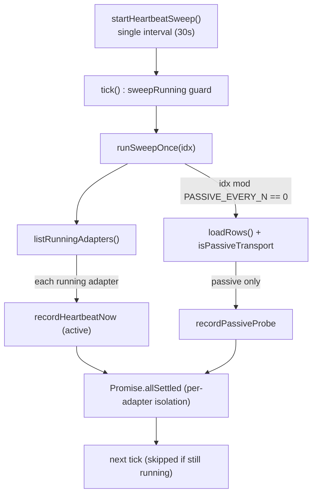
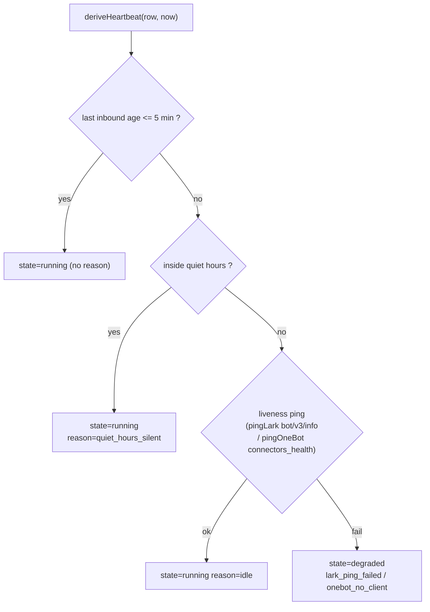
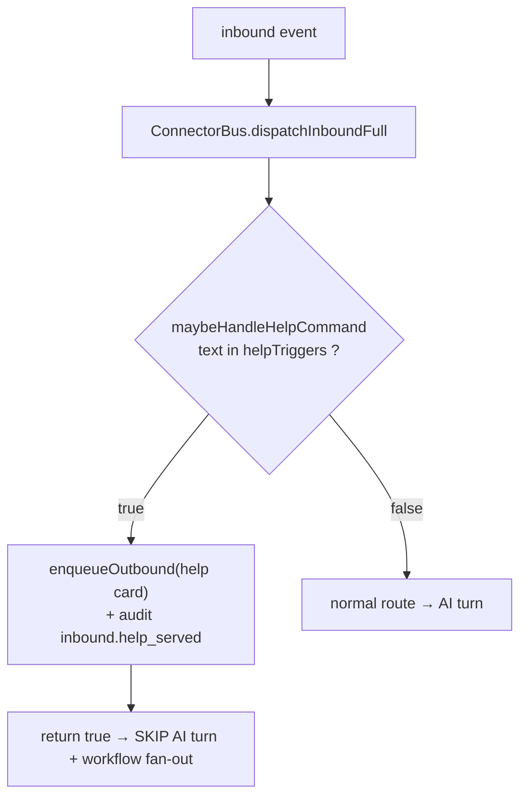

# Health, Audit & Help

<Status variant="stable" />

<TLDR>
Every running adapter is probed by a **single bus-scope heartbeat sweep**: an
active `adapter.health()` snapshot every 30 s, plus a passive liveness probe
every 2nd tick for transports that sit idle (Lark webhook, OneBot reverse-WS).
Heartbeats land in a dedicated `connectorHeartbeats` table; real events land in
a 5000-row capped `connectorAudit` ring spanning a **48-kind vocabulary**. A
pure `deriveHistory` folds both into the Health Tab's 24h × 30 min dot grid.
The same audit ring records the cross-provider **help / welcome** dispatch,
which short-circuits the AI turn when a user types `/help`.
</TLDR>

<StatGrid>
  <Stat label="Active heartbeat interval" value="30 s" />
  <Stat label="Passive probe cadence" value="60 s / every 2nd tick" />
  <Stat label="Heartbeat retention" value="48 h" />
  <Stat label="Audit ring cap" value="5000 rows" />
  <Stat label="AuditKind vocabulary" value="48 kinds" />
</StatGrid>

This page covers the observability and self-description plane of the connector
runtime. For the dispatch core see [Connector Bus](./connector-bus), for send
mechanics see [Outbound Queue](./outbound-queue), for the rich-card builder see
[AI & A2UI](./ai-and-a2ui), and for the axum transports see
[Rust Layer](./rust-layer).

## Two-tier Liveness

Adapters fall into two transport classes. **Active** transports drive an
explicit health signal — a Telegram long-poll loop, a Discord Gateway socket,
Slack Socket Mode — so when the transport detaches, `adapter.health()` flips to
`degraded` on its own. **Passive** transports (Lark webhook, OneBot
reverse-WS) sit idle waiting for the platform or client to push events; from
the adapter's point of view "no events for an hour" and "we're fine, traffic is
quiet" look identical (`passive-heartbeat.ts:10-13`). The two are
distinguished by a single predicate:

```ts
// lib/connectors/health/passive-heartbeat.ts:57
export function isPassiveTransport(row: AdapterInstanceRow): boolean {
  if (row.type === "onebot") return true
  if (row.type === "lark") {
    const settings = (row.settings ?? {}) as { transport?: string }
    return settings.transport === "webhook"
  }
  return false
}
```

Since schema v51 a **single bus-scope interval** (`heartbeat-sweep.ts`)
services every running adapter per tick, replacing the old per-adapter timer
fan-out (up to 2N timers). It reuses `recordHeartbeatNow` /
`recordPassiveProbe` verbatim, so the rows written are identical — only the
scheduling is consolidated.



The Nth-tick cadence is derived from the two intervals so the relationship
stays explicit:

```ts
// lib/connectors/health/heartbeat-sweep.ts:39
export const PASSIVE_EVERY_N = Math.max(
  1,
  Math.round(PASSIVE_HEARTBEAT_INTERVAL_MS / HEARTBEAT_INTERVAL_MS)
)
```

The first tick fires immediately so the Health view has data without waiting a
full interval (`heartbeat-sweep.ts:139`), and `sweepRunning` skips the next
scheduler fire rather than piling a second concurrent sweep on top of a slow
one (`heartbeat-sweep.ts:97`, `129-137`).

## Active Heartbeat

`recordHeartbeatNow(adapter, options?)` takes one snapshot now — exported so the
Health Tab's Reconnect-now button and integration tests can force a probe
without waiting for the interval (`heartbeat.ts:60`). It prunes rows older than
48 h via an indexed `[adapterId+at]` range delete (`heartbeat.ts:69`, `40-53`),
calls `adapter.health()` (a throw becomes `degraded`, `heartbeat.ts:72-79`),
counts pending+sending outbound jobs (`heartbeat.ts:80`, `24-38`), and folds in
the outbound-runner's circuit-breaker + token-bucket snapshot
(`heartbeat.ts:84`). The row is written to the **dedicated `connectorHeartbeats`
table**, never `connectorAudit`:

```ts
// lib/connectors/health/heartbeat.ts:86
  await getDb()
    .connectorHeartbeats.put({
      id: crypto.randomUUID(),
      adapterId: adapter.id,
      kind: "adapter.heartbeat",
      at: now,
      reason: health.reason,
```

At 2 880 rows/day per adapter, writing heartbeats into the audit ring would
churn the global 5000-row `pruneOldest` on every append and evict real
operator-visible events — so the dedicated table keeps the audit log a record
of *real* events, bounded separately by the 48 h sweep (`heartbeat.ts:8-14`).

## Passive Heartbeat

For passive adapters, `deriveHeartbeat(row, options?)` decides liveness through
a four-step decision tree (`passive-heartbeat.ts:129`). `fetchLastInboundAt`
reads the newest `inbound.received` row through the `[adapterId+kind+at]` (v51)
index — a pure index `.last()`, no table scan (`passive-heartbeat.ts:66`).



`PASSIVE_HEARTBEAT_INTERVAL_MS` is 60 s and `IDLE_THRESHOLD_MS` is 5 min
(`passive-heartbeat.ts:42-43`). Quiet-hours silence is *expected*, so it is
marked `running` but annotated `quiet_hours_silent` so the Health view can hint
at the cause (`passive-heartbeat.ts:147-158`). `recordPassiveProbe` writes the
derived state into `connectorHeartbeats` with `fields.source: "passive_probe"`
(`passive-heartbeat.ts:187`). The probe never throws — Dexie, network, and
audit failures are all swallowed so the timer keeps running.

## Health History Derivation

`deriveHistory(entries, options)` is a **pure** helper (no Dexie reads) that
buckets a stream of audit + heartbeat rows into the 24h × 30 min dot grid (48
cells, `derive-history.ts:103`). Within one bucket the **max-severity** colour
wins (`derive-history.ts:130`), ranked by a fixed severity map:

```ts
// lib/connectors/health/derive-history.ts:90
const SEVERITY: Record<HealthCellState, number> = {
  down: 4,
  degraded: 3,
  starting: 2,
  running: 1,
  unknown: 0,
}
```

`classify(entry)` maps each row to a cell state with this precedence
(`derive-history.ts:45`):

| Cell state  | Triggered by                                                                                                      |
| ----------- | ----------------------------------------------------------------------------------------------------------------- |
| `down`      | `adapter.error`, `delivery.deadlettered`, `inbound.signature_failed`                                              |
| `degraded`  | `circuit.opened`, `delivery.error`, `rate_limit.tripped`, `inbound.deferred_*`, `inbound.policy_blocked`          |
| `running`   | `adapter.heartbeat` (state running), `delivery.success`, `inbound.received`, `outbound.enqueued`, `adapter.started` |
| `starting`  | `adapter.heartbeat` (state starting), `adapter.stopped`, `circuit.half_opened`                                    |
| `unknown`   | no events in the bucket                                                                                            |

Three sibling reducers feed the Health Tab pill and callouts:
`deriveCurrentState` returns the latest heartbeat snapshot or synthesises from
the newest classifying event (`derive-history.ts:142`); `deriveLastError`
finds the most recent error/deadletter/signature-failure
(`derive-history.ts:172`); `deriveLastOk` finds the most recent
success/inbound/running-heartbeat (`derive-history.ts:188`).

## The Audit Ring

`appendAudit(entry)` is a thin wrapper (`audit.ts:12`) over
`lib/db/connector-audit.ts:append`, which adds the row and prunes the oldest in
**one transaction** so the table never exceeds `AUDIT_CAP = 5000`
(`connector-audit.ts:13`):

```ts
// lib/db/connector-audit.ts:31
  await db.transaction("rw", db.connectorAudit, async () => {
    await db.connectorAudit.add(row)
    await pruneOldest(AUDIT_CAP)
  })
```

`listRecent(adapterId?, limit)` returns rows newest-first, optionally scoped to
one adapter (`connector-audit.ts:42`). Operators can hand the log to a teammate
via `audit-export.ts`: `toCsv(rows)` RFC-4180-escapes every cell with `fields`
JSON-stringified into one column (`audit-export.ts:78`), `toJson(rows)`
pretty-prints verbatim (`audit-export.ts:87`), and `buildExportFilename` stamps
a UTC-sortable name `cognia-audit-<all|adapterId>-<YYYYMMDDHHmm>.<ext>`
(`audit-export.ts:108`). `exportAuditView(options)` serialises + names +
triggers the browser download in one call (`audit-export.ts:156`).

## The AuditKind Vocabulary

The `AuditKind` union (`types/connectors/audit.ts:1`) is the 48-kind alphabet
of everything the connector runtime records. By family:

| Family            | Kinds                                                                                                                                                                                                       |
| ----------------- | --------------------------------------------------------------------------------------------------------------------------------------------------------------------------------------------------------- |
| `delivery.*`      | `delivery.success`, `delivery.error`, `delivery.deadlettered`, `delivery.downgraded`                                                                                                                        |
| `inbound.*`       | `inbound.received`, `inbound.deduped`, `inbound.policy_blocked`, `inbound.signature_failed`, `inbound.edited`, `inbound.deleted`, `inbound.read_indicator`, `inbound.member_added`, `inbound.member_removed` |
| `inbound.deferred_*` | `inbound.deferred_quiet_hours`, `inbound.deferred_muted`, `inbound.deferred_manual_mode`                                                                                                                 |
| help / welcome    | `inbound.help_served`, `inbound.welcome_sent`                                                                                                                                                               |
| `outbound.*`      | `outbound.enqueued`, `outbound.ai_run_enqueued`, `outbound.queue_capped`                                                                                                                                    |
| `callback.*`      | `callback.binding_expired`, `callback.received`, `callback.deduped`, `callback.unbound`, `callback.handler_failed`                                                                                          |
| `goal.*.im`       | `goal.started.im`, `goal.blocked.im`                                                                                                                                                                        |
| `circuit.*`       | `circuit.opened`, `circuit.half_opened`, `circuit.closed`                                                                                                                                                   |
| `adapter.*`       | `adapter.started`, `adapter.stopped`, `adapter.error`, `adapter.credentials_rotated`, `adapter.heartbeat`                                                                                                   |
| `builtin_skill_*` | `builtin_skill_invoked`, `builtin_skill_denied`, `builtin_skill_hitl_pending`, `builtin_skill_hitl_approved`, `builtin_skill_hitl_rejected`, `builtin_skill_failed`                                          |
| `workflow_*`      | `workflow_approval_failed`, `workflow_fanout_failed`                                                                                                                                                        |
| singletons        | `rate_limit.tripped`, `credential.refreshed`, `override.computer_use_changed`                                                                                                                               |

Two things sit *outside* this ring. The `adapter.heartbeat` rows are written to
`connectorHeartbeats` (the `kind` pinned literal `"adapter.heartbeat"`, the
table being all-heartbeats), and `inboxTelemetryEvents`
(`lib/db/inbox-telemetry.ts`, cap 3000) is a separate high-volume breadcrumb
log decoupled from `connectorAudit` so its rotation never displaces an
operator-visible audit row (`inbox-telemetry.ts:1-12`).

## Help & Welcome

The bus calls two dispatchers inline. `maybeHandleHelpCommand(event, row,
deps?)` matches the inbound text against the adapter's help triggers (default
`["/help", "帮助"]`, `help-dispatch.ts:35`); on a hit it enqueues a help card,
audits `inbound.help_served`, and **returns `true` so the bus skips the AI turn
+ workflow fan-out** (`help-dispatch.ts:79`). `maybeSendWelcome(event, row,
deps?)` pushes a welcome card at most once per conversation — deduped through
the inbound ledger's `"welcome"` namespace with idempotency key
`welcome:<conversationKey>` — and audits `inbound.welcome_sent`
(`help-dispatch.ts:121`).



Both build the surface with the platform-agnostic `buildHelpSurface(input)`
(`build-help-surface.ts:121`), a pure function producing an
`A2UISegmentContent` Card: an intro Text, the quick-command Buttons, optional
skill families, and an optional @-strategy hint. Default labels are Chinese and
fully overridable (`build-help-surface.ts:64`). Each quick command becomes a
Button carrying the binding hint the per-platform mapper records:

```ts
// lib/connectors/help/build-help-surface.ts:159
    input.quickCommands.forEach((cmd, i) => {
      const id = `qc_${i}`
      const label = cmd.label?.trim() || cmd.triggerKey
      const payload: HelpQuickCommandPayload = { action: cmd.action }
      components[id] = {
        component: "Button",
        text: label,
        action: `qc:${cmd.triggerKey}`,
        bindingKind: "help_quick_command",
        bindingPayload: payload,
      }
```

When the user clicks one, `ConnectorBus.dispatchConnectorCallback`
short-circuits and re-enters the inbound pipeline as if the command had been
typed.

## Quick Commands

`IMQuickCommand { triggerKey, label?, action }` (`quick-commands/types.ts:30`)
generalises the per-platform button identity — Feishu `event_key`, WeCom
button `key` — into a single `triggerKey`. `normalizeQuickCommand(row)` accepts
both the canonical shape and the legacy `eventKey` shape, returning a canonical
row or `null` for malformed input (`quick-commands/types.ts:72`);
`normalizeQuickCommandList(input)` maps that over an array, silently dropping
malformed entries (`quick-commands/types.ts:95`). The write path always emits
`triggerKey`, with no Dexie migration — the JSON column shape is opaque to
IndexedDB and the runtime read path is the only place that touches it.

## Related

<Cards>
  <Card title="Connector Bus" href="./connector-bus" description="The dispatch core that calls the help/welcome dispatchers inline and routes quick-command callbacks." />
  <Card title="AI & A2UI" href="./ai-and-a2ui" description="The A2UI surface builders the help card shares — native rich-card rendering and plain-text fallback." />
  <Card title="Outbound Queue" href="./outbound-queue" description="Where help/welcome cards are enqueued and where the pending-count heartbeat field comes from." />
  <Card title="Rust Layer" href="./rust-layer" description="The axum transports and connectors_health probe behind the passive heartbeat." />
  <Card title="Overview" href="./index" description="Platform Connectors subsystem map." />
</Cards>
