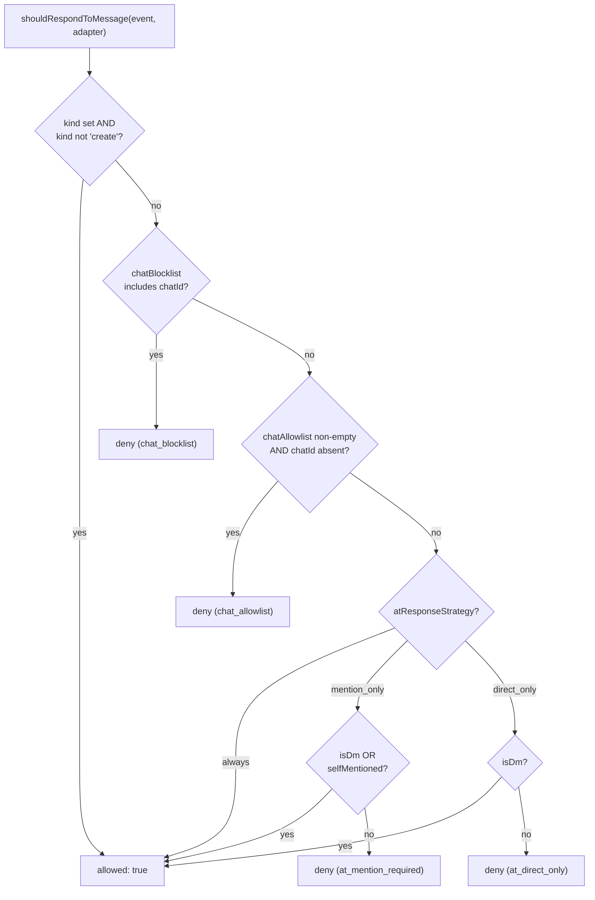
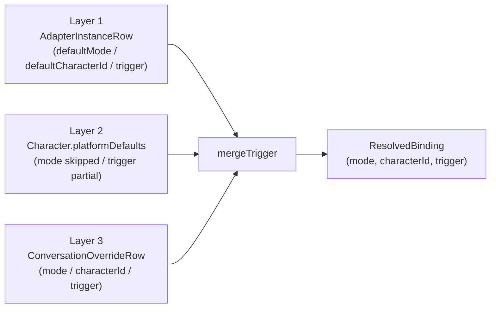
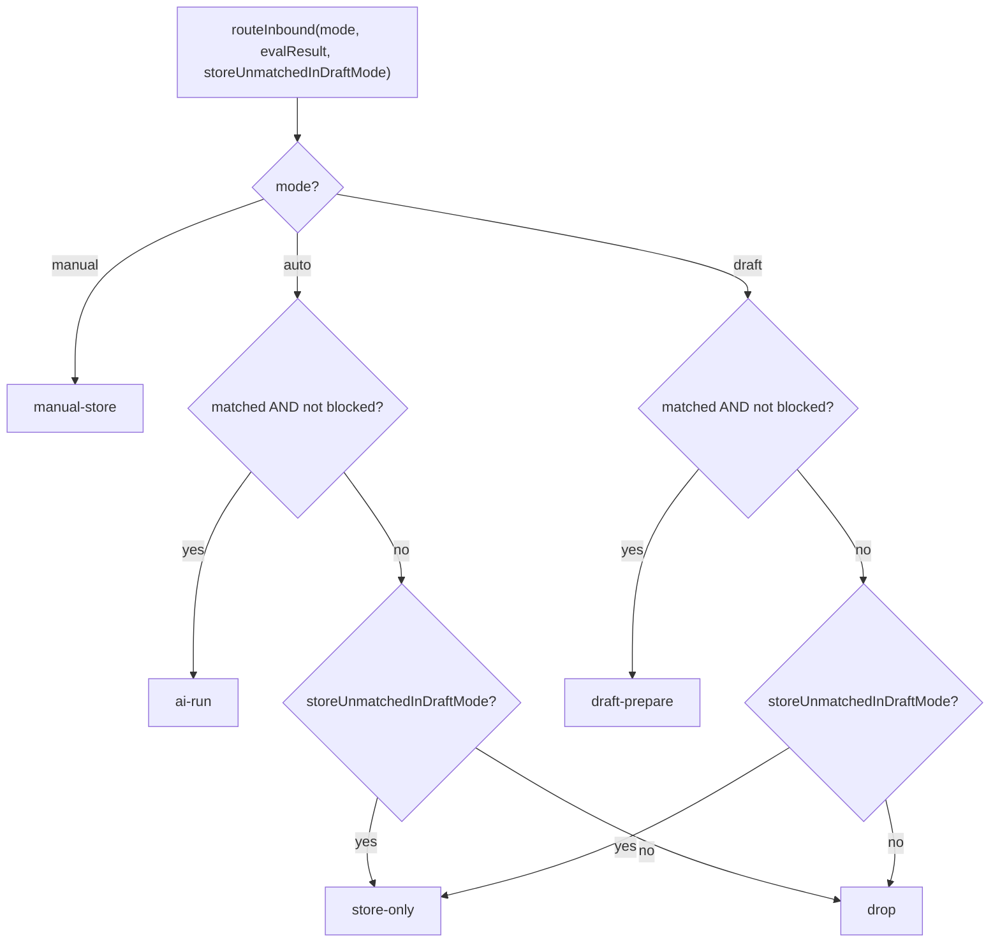

# Inbound Gating & Policy

<Status variant="stable" />

<TLDR>
Every inbound platform message runs a gauntlet before it can reach `ctx.emit()` and the AI. First a **dedup ledger** drops replays. Then a per-adapter **@-gate** (`shouldRespondToMessage`) applies blocklist / allowlist / at-strategy guardrails. Surviving events hit the bus, which resolves a **three-layer binding** (adapter → character → conversation override) into a `(mode, characterId, trigger)` triple, runs the pure **`evaluatePolicy`** evaluator (OR-ed rules, first-match blockers), and feeds the result to the **mode router** which picks one of five `RouteDecision`s — `ai-run`, `manual-store`, `draft-prepare`, `store-only`, or `drop`.
</TLDR>

<StatGrid>
  <Stat label="Ledger cap" value="10,000" />
  <Stat label="Connector modes" value="3" />
  <Stat label="Route decisions" value="5" />
  <Stat label="Trigger rule kinds" value="7" />
</StatGrid>

## Two-stage gating

Inbound gating is intentionally split into two stages that run at different points in the pipeline:

1. **Adapter-side @-gate** — runs inside each adapter dispatcher, immediately **before** `ctx.emit()`. It is platform-agnostic (`lib/connectors/at-gate.ts`, schema v45) and answers a coarse question: *should the bot even acknowledge this chat / message at all?* It reads operator-configured fields off the `AdapterInstanceRow` (chat blocklist / allowlist, at-strategy) and short-circuits before the event ever crosses into the bus.
2. **Bus-side policy** — once an event is emitted, the bus resolves the binding and runs the fine-grained `TriggerPolicy` (`lib/connectors/policy-eval.ts`) to decide *how* to respond: AI-run now, store for a human, or prepare a draft.

Before either stage, the **dedup ledger** (`lib/connectors/dedup.ts`) guarantees a given platform message is processed exactly once.

## Dedup Ledger

`recordAndCheckInbound` is the idempotency guard. It records `(adapterId, namespace, platformMessageId)` and returns `true` only the first time that tuple is seen, so retried webhooks, reconnect replays, and duplicate callback deliveries are dropped cheaply.

```ts
// lib/connectors/dedup.ts:32
export async function recordAndCheckInbound(
  adapterId: string,
  platformMessageId: string,
  namespace: InboundLedgerNamespace = "inbound"
): Promise<boolean> {
  callCount++
  const isNew = await recordInbound(adapterId, platformMessageId, namespace)
  if (callCount % PRUNE_EVERY === 0) {
    await pruneOldest(LEDGER_CAP).catch(() => undefined)
  }
  return isNew
}
```

- **Namespace** (`InboundLedgerNamespace`) defaults to `"inbound"` (`dedup.ts:35`) for back-compat with every pre-v38 caller. Callback handlers pass `"callback"`; first-contact greeters pass `"welcome"`. Each namespace is an independent sliding window, so a message id can recur across buckets without colliding.
- **Lazy prune** — `PRUNE_EVERY = 200` (`dedup.ts:16`) and `LEDGER_CAP = 10_000` (`dedup.ts:17`). Every 200th call awaits `pruneOldest(LEDGER_CAP)` so the table is capped before the call returns; a prune failure is swallowed (non-fatal).

## The @-gate

`shouldRespondToMessage(event, adapter)` (`at-gate.ts:62`) is the pure decision; `gateInboundEvent(adapterId, event)` (`at-gate.ts:117`) is the async runtime wrapper that does the DB lookup and audits on deny. Three orthogonal checks run in order: chat blocklist, chat allowlist, then the at-strategy.



- **Non-create events pass** — edit / delete / system events bypass the gate (`at-gate.ts:66`); the at-strategy is only about responding to fresh messages.
- **chatId resolution** — `event.channel.platformChannelId ?? event.channel.id` (`at-gate.ts:53`), because operators paste platform-native ids verbatim into the lists.
- **Blocklist then allowlist** — blocklist hit denies (`at-gate.ts:72`); a non-empty allowlist that omits the chat denies (`at-gate.ts:76`). An empty / undefined allowlist means "any chat is fine".
- **at-strategy** — `AtResponseStrategy = "always" | "mention_only" | "direct_only"` (`at-gate.ts:32`). The default for fresh adapters is `DEFAULT_AT_RESPONSE_STRATEGY = "mention_only"` (`at-gate.ts:35`) — safer than `always`. DMs always bypass the mention requirement since they have no mention surface.

```ts
// lib/connectors/at-gate.ts:90 — mention_only branch
    case "mention_only":
      if (isDm) return { allowed: true }
      if (event.mentions.selfMentioned) return { allowed: true }
      return { allowed: false, reason: "at_mention_required" }
    case "direct_only":
      if (isDm) return { allowed: true }
      return { allowed: false, reason: "at_direct_only" }
```

**Fails open.** `gateInboundEvent` looks up the adapter row best-effort; if the row is missing it returns `true` (`at-gate.ts:121-122`) so a transient Dexie read failure does not silently drop every message. On a real deny it appends an `inbound.policy_blocked` audit row carrying the `AtGateReason` (`at-gate.ts:125-131`) and returns `false`.

### Block stats for the Health panel

`summariseAtGateBlocks(rows, options)` (`at-gate-stats.ts:71`) is a pure summariser over `inbound.policy_blocked` audit rows — no new instrumentation, no schema bump. It filters a 24h window (`DEFAULT_WINDOW_MS`), buckets by `AtGateReason`, sorts descending, and optionally folds the tail beyond `topN` into a single `"other"` entry (`at-gate-stats.ts:94-108`). The Health Detail panel consumes it to render "filtered N inbound messages in the last 24h, top reasons: …".

## TriggerPolicy & evaluatePolicy

Once an event reaches the bus, the resolved `TriggerPolicy` decides whether the AI is *triggered*. `evaluatePolicy(policy, event, state, now)` (`policy-eval.ts:131`) is pure — state is injected and never mutated, so the dispatch pipeline owns the mutable rate-limit buckets and updates them after a decision.

Rules and blockers are independent: **any rule matching** sets `matched = true` (OR semantics, `policy-eval.ts:138`); **the first blocker hitting** sets `blocked = true` and short-circuits with a reason (`policy-eval.ts:141-145`). The router downstream only proceeds when `matched && !blocked`.

### Trigger rules (OR)

| `TriggerRule.kind`  | Matches when                                                       | Source            |
| ------------------- | ------------------------------------------------------------------ | ----------------- |
| `private-default`   | `event.channel.kind === "private"`                                 | `policy-eval.ts:37` |
| `self-mention`      | `event.mentions.selfMentioned`                                     | `policy-eval.ts:40` |
| `reply-to-bot`      | `event.replyTo?.messageId` is present                              | `policy-eval.ts:43` |
| `slash-command`     | `plainText` (trimmed) starts with any of `prefixes`                | `policy-eval.ts:49` |
| `keyword`           | `plainText` includes any of `words` (optional case-insensitive)    | `policy-eval.ts:54` |
| `user-allowlist`    | `userIds` includes `event.sender.id`                               | `policy-eval.ts:62` |
| `channel-allowlist` | `channelIds` includes `event.channel.id`                           | `policy-eval.ts:65` |

### Trigger blockers (first match wins)

| `TriggerBlocker.kind`       | Blocks when                                                              | Source              |
| --------------------------- | ------------------------------------------------------------------------ | ------------------- |
| `user-blocklist`            | `userIds` includes `event.sender.id`                                     | `policy-eval.ts:79` |
| `channel-blocklist`         | `channelIds` includes `event.channel.id`                                | `policy-eval.ts:83` |
| `keyword-blocklist`         | `plainText` includes any of `words`                                     | `policy-eval.ts:87` |
| `rate-limit`                | user bucket OR channel bucket over the 60s window exceeds its cap        | `policy-eval.ts:93` |
| `cooldown-after-bot-reply`  | a bot reply happened in this conversation within `secs`                  | `policy-eval.ts:107` |

The rate-limit blocker keeps **two buckets** over a rolling 60-second window — per `(user, channel)` and per channel (summed across all users):

```ts
// lib/connectors/policy-eval.ts:93 — rate-limit dual bucket
    case "rate-limit": {
      const bucketKey = `${event.sender.id}:${event.channel.id}`
      const window = now - 60_000
      const recent = (state.recentByUserAndChannel[bucketKey] ?? []).filter((t) => t > window)
      if (recent.length >= blocker.perUserPerMin) return "rate-limit (user bucket)"
      const channelTotal = Object.entries(state.recentByUserAndChannel)
        .filter(([key]) => key.endsWith(`:${event.channel.id}`))
        .flatMap(([, ts]) => ts)
        .filter((t) => t > window).length
      if (channelTotal >= blocker.perChannelPerMin) return "rate-limit (channel bucket)"
      return null
    }
```

The built-in `defaultPrivateChatPolicy()` (`policy.ts:33`) uses a single `private-default` rule with a generous `30/60` rate-limit and `storeUnmatchedInDraftMode: true`; `defaultGroupChatPolicy()` (`policy.ts:41`) gates on `self-mention` / `reply-to-bot` / `/ask`+`/agent` slash-commands, with a tighter `5/20` rate-limit, a 3-second post-reply cooldown, and `storeUnmatchedInDraftMode: false`.

## Three-layer Binding Resolution

Before the policy runs, the bus resolves *which* policy, mode, and character apply to this conversation. `resolveBinding(input)` (`policy-resolve.ts:49`) layers three sources into a single `ResolvedBinding { mode, characterId, trigger }` (`policy-resolve.ts:27`).



- **mode** — starts at `adapter.defaultMode` (`policy-resolve.ts:54`); the character layer is skipped (a `Character` has no `mode` field); `override.mode` wins last if defined (`policy-resolve.ts:57`).
- **characterId** — starts at `adapter.defaultCharacterId` (`policy-resolve.ts:61`); character layer skipped; `override.characterId` wins last (`policy-resolve.ts:64`).
- **trigger** — base is a shallow copy of `adapter.trigger` (`policy-resolve.ts:68`), then `character.platformDefaults.trigger` merges in (`policy-resolve.ts:71`), then `override.trigger` (`policy-resolve.ts:77`) — each via `mergeTrigger`.

The merge is **replace-not-concat**: a higher layer that defines `rules` (or `blockers`) replaces the whole array rather than appending to it.

```ts
// lib/connectors/policy-resolve.ts:38
function mergeTrigger(base: TriggerPolicy, patch: Partial<TriggerPolicy>): TriggerPolicy {
  return {
    rules: patch.rules !== undefined ? patch.rules : base.rules,
    blockers: patch.blockers !== undefined ? patch.blockers : base.blockers,
    storeUnmatchedInDraftMode:
      patch.storeUnmatchedInDraftMode !== undefined
        ? patch.storeUnmatchedInDraftMode
        : base.storeUnmatchedInDraftMode,
  }
}
```

`CharacterPlatformDefaults { mode?, trigger? }` (`binding.ts:14`) is what a Character ships per platform; `PlatformBinding` (`binding.ts:5`) persists the `(adapterId, conversationKey, platform, conversationRef)` handle so proactive outbound has somewhere to send.

## Mode Router

With the resolved `mode`, the `evaluatePolicy` result, and the `storeUnmatchedInDraftMode` flag, `routeInbound` (`mode-router.ts:21`) maps the inbound to exactly one of five `RouteDecision`s (`mode-router.ts:11`).

| `mode`   | `matched && !blocked` | otherwise                                            |
| -------- | --------------------- | --------------------------------------------------- |
| `auto`   | `ai-run`              | `storeUnmatchedInDraftMode ? "store-only" : "drop"` |
| `manual` | `manual-store`        | `manual-store` (always — policy ignored)            |
| `draft`  | `draft-prepare`       | `storeUnmatchedInDraftMode ? "store-only" : "drop"` |



`manual` mode always returns `manual-store` regardless of policy — every message is parked for human review. `auto` and `draft` share the same fallback: store the unmatched message only when the policy opted in, otherwise drop it silently.

## Inbound Event & Segment Types

Every gate, rule, and blocker reads from a single normalised shape so platform specifics never leak past the adapter parser.

### NormalizedInboundEvent

`NormalizedInboundEvent` (`event.ts:62`) is the cross-platform inbound payload. Key fields the gating layer reads:

| Field                | Type                       | Used by                                          |
| -------------------- | -------------------------- | ------------------------------------------------ |
| `kind?`              | `InboundEventKind`         | @-gate (non-create bypass), bus insert/update    |
| `channel`            | `ChannelDescriptor`        | @-gate chatId, `private-default` / channel rules |
| `mentions`           | `MentionDescriptor`        | `self-mention`, `mention_only` strategy          |
| `replyTo?`           | `ReplyDescriptor`          | `reply-to-bot` rule                              |
| `sender`             | `PlatformIdentity`         | user allow/blocklist, rate-limit bucket key      |
| `plainText`          | `string`                   | `keyword` / `slash-command` rules + blockers     |
| `segments`           | `MessageSegment[]`         | source of `plainText` via `segmentsToPlainText`  |
| `conversationKey`    | `string`                   | cooldown bucket, audit row                       |

`InboundEventKind = "create" | "edit" | "delete" | "system"` (`event.ts:60`) — defaults to `"create"` when omitted; only `create` events are at-gated. `ChannelKind = "private" | "group" | "channel" | "thread"` (`event.ts:27`) drives the DM bypass. `buildConversationKey` (`event.ts:107`) / `parseConversationKey` (`event.ts:124`) construct and split the `platform:adapterId:remoteChatId[:threadId]` key.

### MessageSegment

`MessageSegment` (`segment.ts:9`) is the discriminated union projected by every adapter parser. `segmentsToPlainText(segments)` (`segment.ts:110`) flattens it into the `plainText` that the `keyword` and `slash-command` matchers read — non-text segments project to stable placeholders so a regex never accidentally fires on raw URLs or code.

| `type`                                   | Plain-text projection                  |
| ---------------------------------------- | -------------------------------------- |
| `text` / `markdown`                      | the literal text / markdown            |
| `mention`                                | `@displayName` (or `@userId`)          |
| `image` / `video` / `card`               | ` [image] ` / ` [video] ` / ` [card] ` |
| `voice`                                  | transcript if present, else ` [voice] ` |
| `file`                                   | ` [file:name] `                        |
| `code`                                   | the raw code                           |
| `reply` / `location` / `poll`            | ` [reply:…] ` / ` [location:…] ` / ` [poll:…] ` |
| `a2ui`                                   | `plainTextMirror` (or ` [a2ui] `)      |

## Related

<Cards>
  <Card title="Connector Bus" href="./connector-bus" description="The dispatch pipeline that calls the gate, resolves the binding, and runs the mode router." />
  <Card title="Adapter Model" href="./adapter-model" description="AdapterInstanceRow fields the @-gate reads — chat lists, at-strategy, defaultMode." />
  <Card title="Outbound Queue" href="./outbound-queue" description="Where ai-run / draft-prepare decisions flow once a message is admitted." />
  <Card title="AI & A2UI" href="./ai-and-a2ui" description="How admitted events drive AI runs and project A2UI surfaces back to the platform." />
  <Card title="Subsystem Overview" href="./index" description="The Platform Connectors subsystem map." />
</Cards>
