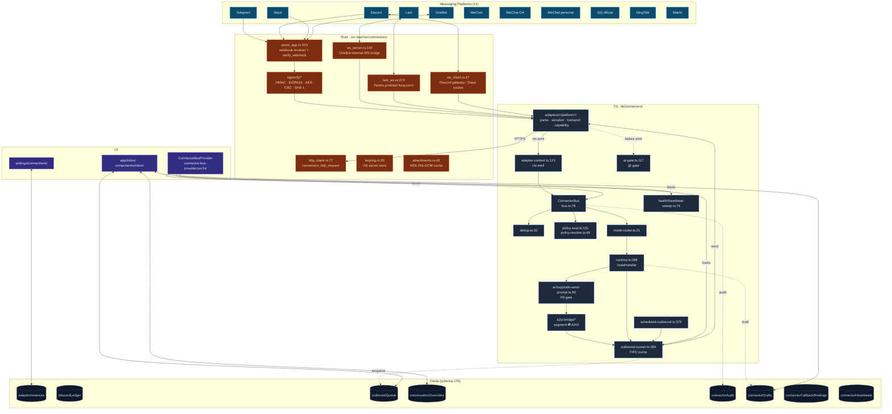
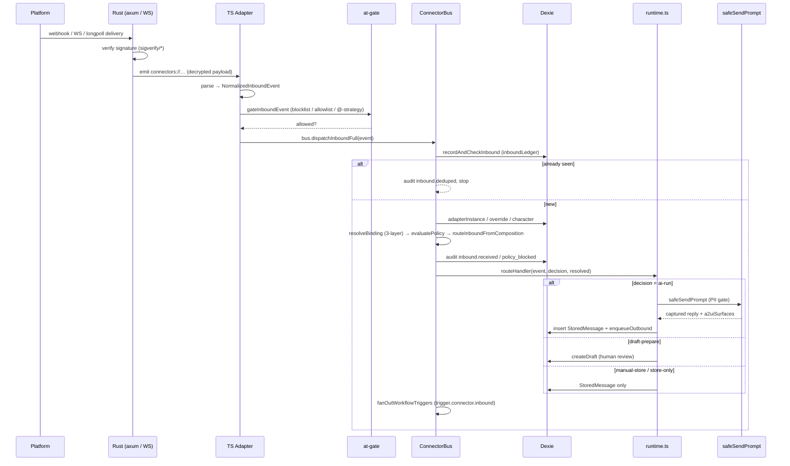
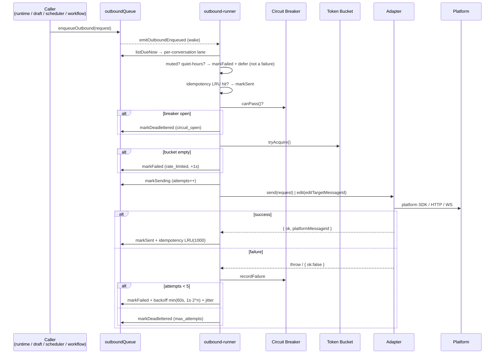

# Platform Connectors

<Status variant="stable" />

<TLDR>
  Eleven built-in IM adapters (Telegram · Discord · Slack · Lark · OneBot v11/v12 · WeCom · WeChat OA ·
  personal WeChat · QQ official · DingTalk · Matrix) fan in to a singleton **ConnectorBus**
  (`lib/connectors/bus.ts:78`). Every inbound message runs an 11-step pipeline — dedup → adapter lookup →
  three-layer binding resolve → `TriggerPolicy` evaluate → mode route → audit → help/welcome → route
  handler → workflow fan-out. Outbound goes through a Dexie FIFO queue
  (`lib/connectors/outbound-runner.ts:284`) wrapped in a per-conversation lane, circuit breaker, token
  bucket, exponential backoff, idempotency LRU, and a dead-letter sink. Three modes — `auto` (PII-gated
  AI reply), `manual` (human typed), `draft` (AI drafts, human approves). Webhook signature verification
  (HMAC / Ed25519 / AES-CBC) and the OneBot / Discord / Lark sockets run in Rust
  (`src-tauri/src/connectors/`). Rich interactive content is projected through the **A2UI bridge** both
  directions, with callback bindings persisted in Dexie.
</TLDR>

<StatGrid>
  <Stat label="Built-in adapters" value="11" hint="telegram · discord · slack · lark · onebot · wecom · wechat-oa · wechat-personal · qq-official · dingtalk · matrix" />
  <Stat label="Runtime modes" value="3" hint="auto · manual · draft" />
  <Stat label="Dexie tables" value="10" hint="adapterInstances · platformIdentities · inboundLedger · outboundQueue · conversationOverrides · connectorAudit · connectorDrafts · connectorAttachments · connectorCallbackBindings · connectorHeartbeats" />
  <Stat label="Audit kinds" value="48" hint="AuditKind union in types/connectors/audit.ts" />
  <Stat label="Sigverify algorithms" value="5" hint="Telegram secret-token · Slack HMAC v0 · Discord Ed25519 · Lark AES-CBC · WeChat SHA-1+AES" />
  <Stat label="Tauri commands" value="18" hint="src-tauri/src/connectors/commands.rs" />
  <Stat label="Audit cap" value="5000" hint="connectorAudit FIFO ring (lib/db/connector-audit.ts:13)" />
</StatGrid>

## What It Is

Platform Connectors turns any Cognia character into a real bot on real IM platforms. An operator
configures an adapter in **Settings → Connections**, binds it to a character, and the bot answers — in
`auto` mode it runs a full Claude turn through the same build-options pipeline as the in-app chat; in
`draft` mode the AI prepares a reply a human approves from the Inbox; in `manual` mode a human types
through the bot.

The subsystem is a clean fan-in / fan-out around one singleton:

- **Fan-in** — each adapter normalizes its platform payload into a `NormalizedInboundEvent` and calls
  `bus.dispatchInboundFull(event)`. The bus dedups, resolves the binding, evaluates the trigger policy,
  routes by mode, and hands off to the runtime.
- **Fan-out** — outbound replies (AI / manual / draft-approved / workflow) are enqueued into a single
  Dexie queue and drained by one pump that applies quiet-hours, mute, circuit breaking, rate limiting,
  backoff, and dead-lettering — uniformly, regardless of source.

This page is the **architectural hub**. Each box in the module map is a dedicated technical page with
line-accurate internals. For per-platform setup guides see the companion
[Connector Setup](../../connectors/slack-setup) section.

## Module Map

<Cards>
  <Card title="ConnectorBus & Runtime" href="./connector-bus" description="The singleton: the 11-step dispatchInboundFull pipeline, edit/delete/system short-circuits, the 5-branch callback dispatcher, workflow fan-out, runtime routeHandler, lifecycle registry, credential hot-reload" />
  <Card title="Adapter Model & Registry" href="./adapter-model" description="The PlatformAdapter contract, AdapterContext, the capability flags + A2UI matrix, the buildAdapterFromRow factory, OAuth registry, the shared mention-extractor" />
  <Card title="Built-in Adapters" href="./built-in-adapters" description="All 11 platforms — transport + signature matrix, the four deep adapters (Telegram / Discord / Lark / OneBot), parse pipelines, self-id whoami probes" />
  <Card title="Inbound Gating & Policy" href="./inbound-gating" description="dedup ledger, the @-gate, evaluatePolicy rules/blockers, the three-layer resolveBinding stack, mode-router decisions, NormalizedInboundEvent + MessageSegment types" />
  <Card title="Outbound Queue & Delivery" href="./outbound-queue" description="The FIFO pump gauntlet, circuit breaker FSM, token bucket, backoff formula, idempotency LRU, dead-letter, scheduled outbound, DLQ export, job badges" />
  <Card title="Auto-mode AI Loop & A2UI Bridge" href="./ai-and-a2ui" description="The PII-gated safeSendPrompt loop, segment ⇄ A2UI projection, the surface builder, capability-aware downgrade, workflow progress fan-out, the callback round-trip, attachment cache" />
  <Card title="Health, Audit & Help" href="./health-audit" description="Active + passive heartbeats, the bus-scope sweep, health-history derivation, the audit ring + export, the 48-kind AuditKind union, help/welcome cards, quick commands" />
  <Card title="Rust Layer" href="./rust-layer" description="The axum webhook receiver, the 5 signature verifiers, the OneBot reverse-WS bridge, the Lark protobuf long-connection, media upload, the AES-256-GCM attachment cache, the OS keyring, the 21 Tauri commands" />
  <Card title="Inbox UI & Plugin Extension" href="./ui-and-plugins" description="The ConnectorBusProvider bootstrap sequence, the 3-pane Inbox shell, the mode switcher / draft editor / outbound pill, the 7-tab Connections settings, the plugin adapter bridge" />
</Cards>

## Layered Architecture

## Data Flow: Inbound

## Data Flow: Outbound

## Data Model (Dexie, schema v70)

| Table | Primary key / indexes | Purpose | Introduced |
| --- | --- | --- | --- |
| `adapterInstances` | `id, type, enabled, [type+enabled]` | One row per configured bot (type, settings, defaultCharacterId, trigger, quietHours, muted, capabilities) | v18 |
| `platformIdentities` | `id, [platform+remoteUserId]` | One row per observed platform user | v18 |
| `inboundLedger` | `&id, [adapterId+platformMessageId]`, `namespace` | Inbound + callback + welcome dedup, 10k cap | v18 (namespace v38) |
| `outboundQueue` | `&id, [conversationKey+createdAt], [status+nextAttemptAt]` | Delivery job; `pending → sending → sent \| failed \| deadlettered`, 5k soft cap | v18 (compound idx v51) |
| `conversationOverrides` | `&id, &conversationKey` | Per-conversation mode / character / quiet-hours override | v18 |
| `connectorAudit` | `&id, [adapterId+at], [adapterId+kind+at]` | Operator audit log, 5000 FIFO ring | v18 ([adapterId+kind+at] v51) |
| `connectorDrafts` | `&id, [conversationKey+createdAt]` | Drafts awaiting human approval | v18 |
| `connectorAttachments` | `&id, [adapterId+remoteRef], expiresAt` | Attachment metadata mirror (blobs encrypted on disk by Rust) | v18 |
| `connectorCallbackBindings` | `&id, [adapterId+actionId]`, `kind` | Interactive-action → surface binding, TTL 30 d | v41 |
| `connectorHeartbeats` | `&id, [adapterId+at]` | Per-adapter liveness, 48 h retention | v51 |

`inboxTelemetryEvents` (v49, 3000 cap) is a separate high-volume breadcrumb log, decoupled from
`connectorAudit` so rotation never displaces operator-visible audit rows.

## What Changed Since the Old Doc

The single-page doc this section replaces drifted from the implementation. Concrete corrections:

| Claim in the old doc | Reality | Source |
| --- | --- | --- |
| "Seven built-in adapters" | **Eleven** adapters ship (added QQ official, WeCom, WeChat OA, personal WeChat, DingTalk, Matrix) | `lib/connectors/adapter-registry.ts:42` |
| "Dexie v18" | Connector tables started at v18; the schema is now **v70** (callback bindings v41, heartbeats v51) | `lib/db/schema.ts:163`, `:1535` |
| "Auto-mode AI loop is a Phase 1 stub" | The loop is **real** — `safeSendPrompt` runs a full Claude turn behind a PII gate | `lib/connectors/ai-loop/safe-send-prompt.ts:69` |
| "`connectorAttachments` is schema-only" | The fetch + AES-256-GCM cache pipeline is **live** | `lib/connectors/attachment-fetcher.ts:65`, `src-tauri/src/connectors/attachments.rs:40` |
| (absent) interactive content | A bidirectional **A2UI bridge** projects rich cards both directions with persisted callback bindings | `lib/connectors/a2ui-bridge/`, `adapters/_shared/a2ui-mapper.ts:171` |
| (absent) liveness | Active + passive **heartbeats** drive the Health tab via one bus-scope sweep | `lib/connectors/health/heartbeat-sweep.ts:74` |

## Trust Boundaries & Web-mode Degradation

- **Signature verification is in Rust.** Telegram secret-token, Slack HMAC v0 (with a 300 s replay
  window), Discord Ed25519, Lark AES-CBC decrypt + verification-token, and WeChat SHA-1 + AES all run in
  `src-tauri/src/connectors/sigverify/` before any payload reaches TS. The axum server binds loopback-only
  by default (`connectors_start_server`, `commands.rs:57`).
- **Secrets never cross the IPC boundary in plaintext beyond the keyring wrappers.** App secrets are read
  inside Rust for the Lark long-connection; credential getters in TS are lazy resolvers so a rotated
  secret is picked up on the next call.
- **The auto-mode loop is PII-gated.** `safeSendPrompt` aborts (no redaction, no model call) if inbound
  text or the appended system prompt fails `hasNoLeakingPii` — the shared red-line used by Twin, Goal, and
  Agent Team.
- **Web mode (no Tauri) has no adapters.** Every transport needs the Rust runtime. The Connections section
  shows a banner; the Inbox mode switcher and Composer Send are disabled for platform-bound sessions.

## Related Subsystems

<Cards>
  <Card title="A2UI" href="./a2ui" description="The surface format the connector bridge projects to/from" />
  <Card title="Visual Workflows" href="./visual-workflows" description="trigger.connector.inbound + the IM-triggered run progress fan-out" />
  <Card title="Scheduler" href="./scheduler" description="connection:outbound:send + connection:scheduled:digest executors" />
  <Card title="Plugin System" href="./plugin-system" description="Contribute new platform adapters via manifest.connectors[]" />
  <Card title="Connector Setup" href="../../connectors/slack-setup" description="Per-platform operator quick-start guides" />
</Cards>

## Related ADRs

- [ADR 0009 — Platform Connectors](../../adr/0009-platform-connectors)
- [ADR 0025 — Unified Subscription](../../adr/0025-unified-subscription) (credential / keyring model)
- [ADR 0036 — WeChat / WeCom Connectors](../../adr/0036-wechat-wecom-connectors)
