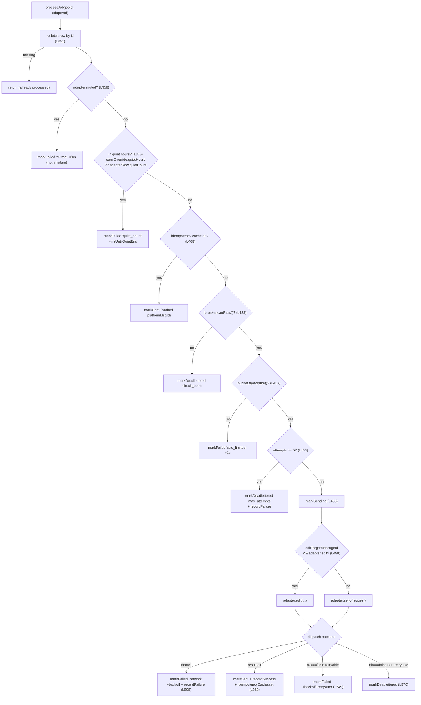
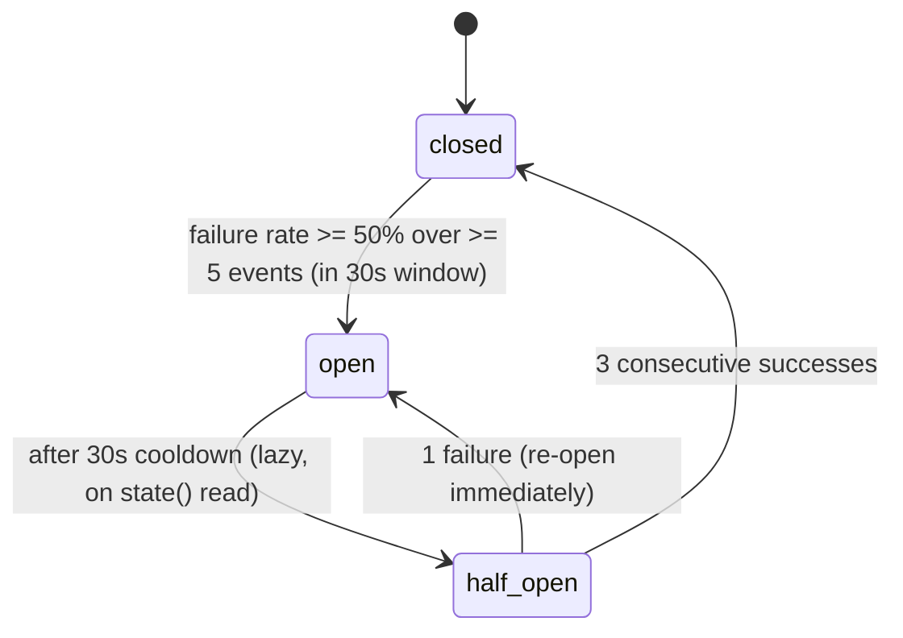

# Outbound Queue & Delivery

<Status variant="stable" />

<TLDR>
Every reply the assistant sends to a platform is a durable row in the Dexie `outboundQueue` table, not a direct adapter call. A single wake-driven loop — `startOutboundRunner` (`lib/connectors/outbound-runner.ts:284`) — drains due rows into per-conversation FIFO lanes and runs each job through an ordered gauntlet: re-fetch → muted → quiet-hours → idempotency → circuit breaker → token bucket → max-attempts → dispatch (`processJob`, `lib/connectors/outbound-runner.ts:345`). Failures retry with exponential backoff + jitter up to `MAX_ATTEMPTS=5`, then dead-letter. The loop never busy-polls: it sleeps until the next retry deadline (`peekNextWakeAt`) or a fresh enqueue wake (`subscribeOutboundEnqueued`, `lib/db/outbound-jobs.ts:64`). Two scheduler executors (`lib/connectors/scheduled-outbound.ts:375`) feed the queue — one direct, one a full AI turn — and three housekeeping sweeps prune callback bindings, age the queue at its soft cap, and export the dead-letter queue.
</TLDR>

<StatGrid>
  <Stat label="Max attempts" value="5" hint="MAX_ATTEMPTS — then dead-letter" />
  <Stat label="Backoff cap" value="60s" hint="MAX_BACKOFF_MS + random jitter" />
  <Stat label="Token bucket" value="20 / 5/s" hint="capacity / refillPerSec per adapter" />
  <Stat label="Breaker threshold" value="50%" hint="over >=5 events in 30s window" />
  <Stat label="Queue soft cap" value="5000" hint="oldest pending aged to dead-letter" />
</StatGrid>

Outbound delivery is the **back half** of the connector pipeline. The [ConnectorBus](./connector-bus) decides *whether* to reply and [AI & A2UI](./ai-and-a2ui) decides *what* to say; both terminate by calling `enqueueOutbound`. From that point the runner owns reliability — ordering, retries, rate limiting, and the circuit breaker — so no inbound path or workflow node ever blocks on a slow or failing platform API. See the [subsystem overview](./index) for where this sits in the larger stack.

## The Queue

`outboundQueue` is a Dexie table (`lib/db/outbound-jobs.ts`) whose rows move through a five-state lifecycle. `OutboundJobStatus` is `"pending" | "sending" | "sent" | "failed" | "deadlettered"`; `OutboundJobSource` records provenance as `"ai-run" | "manual" | "workflow" | "draft-approved"` so the inbox UI can badge each row and the audit log can drill down on origin.

Every enqueue funnels through one chokepoint:

```ts
// lib/db/outbound-jobs.ts:105 — the single enqueue chokepoint
export async function enqueueOutbound(input: EnqueueInput): Promise<OutboundJobRow> {
  const now = Date.now()
  const row: OutboundJobRow = {
    id: newId(), adapterId: input.adapterId,
    conversationKey: input.conversationKey, request: input.request,
    status: "pending", attempts: 0, createdAt: now,
    nextAttemptAt: input.nextAttemptAt ?? now,
    idempotencyKey: input.request.metadata.idempotencyKey,
    source: input.source,
    ...(input.source === "workflow" && input.sourceWorkflow
      ? { sourceWorkflow: input.sourceWorkflow } : {}),
  }
```

The request body is an `OutboundRequest` (`types/connectors/outbound.ts:4`): `conversationRef`, `segments`, optional `replyTo` / `threadId` / `editTargetMessageId` (`types/connectors/outbound.ts:17`), and a `metadata` object whose `idempotencyKey` is **required** (`types/connectors/outbound.ts:20`). The adapter answers with an `OutboundResult` (`types/connectors/outbound.ts:43`): `ok`, optional `platformMessageId`, an `OutboundError` (`code`, `message`, `retryable`, `retryAfterMs?`, `types/connectors/outbound.ts:28`), and any segment `downgrades`. `newIdempotencyKey()` (`types/connectors/outbound.ts:54`) wraps `crypto.randomUUID()` for callers that don't bring their own.

### The EventTarget wake bus

The runner used to busy-poll every 200 ms. It now sleeps until something actionable changes, woken by an `EventTarget` that `enqueueOutbound` fires from the single chokepoint above — so every enqueue path (`ai-run` / `manual` / `workflow` / `draft-approved`) wakes the loop without each call-site knowing the runner exists (`lib/db/outbound-jobs.ts:56`):

```ts
// lib/db/outbound-jobs.ts:64 — pure wake signal, no payload
export function subscribeOutboundEnqueued(handler: () => void): () => void {
  const listener = () => { try { handler() } catch (err) { /* log */ } }
  outboundBus.addEventListener(OUTBOUND_ENQUEUED_EVENT, listener)
  return () => outboundBus.removeEventListener(OUTBOUND_ENQUEUED_EVENT, listener)
}
```

The dependency direction is preserved: the runner imports this module; this module imports nothing from `lib/connectors`. Three read helpers drive the loop's scheduling: `listDueNow()` (`lib/db/outbound-jobs.ts:199`) returns every `pending`/`failed` row with `nextAttemptAt <= now`, oldest-first, via the `[status+nextAttemptAt]` compound index; `peekNextWakeAt()` (`lib/db/outbound-jobs.ts:224`) returns the earliest *future* deadline so the loop sleeps exactly until then; and the lifecycle mutators `markSending` (`lib/db/outbound-jobs.ts:257`, increments `attempts`), `markSent` (`lib/db/outbound-jobs.ts:271`), `markFailed` (`lib/db/outbound-jobs.ts:279`, whose `nextAttemptAt` drives every backoff/defer), and `markDeadlettered` (`lib/db/outbound-jobs.ts:294`).

When the table crosses `OUTBOUND_QUEUE_SOFT_CAP=5000` (`lib/db/outbound-jobs.ts:38`), `enqueueOutbound` calls `enforceQueueSoftCap` (`lib/db/outbound-jobs.ts:142`) which ages the oldest still-`pending` rows to `deadlettered` with code `queue_capped` and emits one audit row each. Only `pending` rows are aged — `sending`/`failed` are in flight, terminal rows are already done.

## The Pump Gauntlet

`processJob(jobId, adapterId)` (`lib/connectors/outbound-runner.ts:345`) is the heart of delivery. It runs **strictly in order** — each gate either short-circuits the job (mark + audit + return) or falls through to the next. The first gate to fire wins:



In order, the gauntlet is:

1. **Re-fetch** the row by id (`outbound-runner.ts:351`) — a prior lane execution may have incremented `attempts`; missing row returns silently.
2. **Muted** (`outbound-runner.ts:358`) — if `adapterRow.muted === true`, `markFailed("muted", …)` deferred `+60_000` ms. Not counted as a failure (the breaker is untouched).
3. **Quiet hours** (`outbound-runner.ts:375`) — the effective window is `convOverride.quietHours ?? adapterRow.quietHours`, so a single bot can have different on-call windows per chat. If `isInQuietHours` is true, `markFailed("quiet_hours", …)` deferred by `msUntilQuietEnd`.
4. **Idempotency short-circuit** (`outbound-runner.ts:408`) — if the LRU already holds this `idempotencyKey`, the platform already acked; `markSent` with the cached `platformMessageId` and audit `delivery.success` (`idempotency_cache_hit`).
5. **Circuit breaker** (`outbound-runner.ts:423`) — if `!breaker.canPass()`, `markDeadlettered("circuit_open", …)`. Dead-letter, not retry: the breaker stays open through its cooldown.
6. **Token bucket** (`outbound-runner.ts:437`) — if `!bucket.tryAcquire()`, `markFailed("rate_limited", …)` deferred `+1_000` ms so the next refill window re-picks it.
7. **Max attempts** (`outbound-runner.ts:453`) — if `job.attempts >= MAX_ATTEMPTS`, `markDeadlettered("max_attempts", …)` **and** `breaker.recordFailure()`.
8. **markSending** (`outbound-runner.ts:468`) — flips status and increments `attempts`.
9. **Edit-vs-send dispatch** (`outbound-runner.ts:490`) — if the request carries `editTargetMessageId` and the adapter implements `edit()`, route to `adapter.edit()` for in-place update; otherwise `adapter.send()` (and, if an edit was requested but unsupported, audit the `edit_unsupported` fallback).
10. **Outcome**: a **thrown** error → `markFailed("network", …)` + backoff + `recordFailure` (`outbound-runner.ts:509`); **`result.ok`** → `markSent` + `recordSuccess` + `idempotencyCache.set` + audit `delivery.success` (`outbound-runner.ts:526`); **`result.ok === false`** → if `error.retryable`, `markFailed` with backoff + `retryAfterMs` (`outbound-runner.ts:549`), else `markDeadlettered` immediately (`outbound-runner.ts:570`).

The backoff is exponential in the attempt count, capped, with random jitter to de-correlate retries across adapters:

```ts
// lib/connectors/outbound-runner.ts:511 — exponential backoff + jitter
const backoff = Math.min(MAX_BACKOFF_MS, BASE_BACKOFF_MS * 2 ** job.attempts) + jitter()
```

Constants: `MAX_ATTEMPTS=5` (`outbound-runner.ts:137`), `BASE_BACKOFF_MS=1_000` (`:138`), `MAX_BACKOFF_MS=60_000` (`:139`), default `jitter = () => Math.random() * 500` (`:287`). `startOutboundRunner` **resolves** when its `AbortSignal` aborts and **never rejects** (`outbound-runner.ts:284`) — every delivery error is surfaced via the audit log, never thrown to the caller. The idle-sleep is a safety net, not a poll: the loop normally wakes precisely (`DEFAULT_IDLE_CAP_MS=60_000`, `:147`).

## Platform Idempotency

The in-memory LRU and the row-evidence dedupe (gate 4 above) cannot close the crash window between a successful `adapter.send()` and `markSent` — the ack died with the runner, so no local evidence exists. That window is closed **platform-side** by the contract each adapter declares in `ambiguousDelivery` (`types/connectors/runtime-capability.ts`), and every shipped platform must declare it explicitly (`hasExplicitRuntimeCapabilityOverride`, pinned by `runtime-capability.test.ts`):

| platform | `ambiguousDelivery` | per-message token the adapter forwards | retry after a lost ack |
| --- | --- | --- | --- |
| **lark** | `remote_idempotent` | message-create `uuid` = `idempotencyKey` | platform returns the original message |
| **matrix** | `remote_idempotent` | `PUT …/send/{type}/{txnId}` with `txnId = idempotencyKey:<chunk>` | homeserver returns the same event id |
| **discord** | `remote_idempotent` | `nonce` + `enforce_nonce: true` on every message-create (`discordNonce(idempotencyKey, index)`, FNV-1a → base36, ≤25 chars, one per REST chunk / voice / media lane; the Rust multipart upload emits the same fields) | Discord returns the original message (window "a few minutes" — UNVERIFIED vs the ≥5 min stale-`sending` recovery, so row-evidence dedupe stays) |
| **qq-official** | `reconciliation_required` | passive `msg_seq = 1 + fnv1a(idempotencyKey) % 65535` (same job → same `msg_id + msg_seq`) | platform **rejects** the duplicate pair (dead-lettered `platform_4xx`, error code UNVERIFIED) — never a silent double, but not the original id either |
| **slack / telegram / onebot / wecom / wechat-personal / wechat-oa / dingtalk** | `reconciliation_required` | none | may duplicate; the audit trail + `delivery_unknown` status are what the operator reconciles against |

The contract test `lib/connectors/adapters/runtime-contract.test.ts` asserts that every `remote_idempotent` adapter really threads the key onto the wire (Lark `uuid`, Matrix `txnId` path segment, Discord `nonce` body field).

## Per-conversation FIFO Lanes

Messages within one conversation must arrive in `createdAt` order, but cross-conversation sends should run in parallel. The runner achieves both with a `Map<conversationKey, ConversationLane>`. A `ConversationLane` (`outbound-runner.ts:189`) is a promise-chain tail — each enqueued work item runs after the previous one settles:

```ts
// lib/connectors/outbound-runner.ts:193 — serialize per-conversation work
enqueue(work: () => Promise<void>): Promise<void> {
  this.tail = this.tail
    .then(() => work())
    .catch(() => {
      // Errors are handled inside `work`; lane must not stall on them.
    })
  return this.tail
}
```

The drain loop pulls every due row into its conversation's lane in one pass, guarded by an `inFlight` set so a job that is still `pending` in the DB (because `markSending` happens *late*, after the gauntlet's gates) isn't double-enqueued; the lane's `finally` clears the id and `wake()`s the loop in case the job was rescheduled to a sooner deadline.

Idempotency is an insertion-ordered, capped `LruMap` (`outbound-runner.ts:151`, `IDEMPOTENCY_LRU_CAP=1000`, `:140`) keyed by `idempotencyKey`. On success the runner records the `platformMessageId`; a later retry that hits the same key short-circuits to `markSent` without a second adapter round-trip. Eviction is oldest-first:

```ts
// lib/connectors/outbound-runner.ts:168 — LRU set with oldest-eviction
set(key: K, value: V): void {
  if (this.map.has(key)) {
    this.map.delete(key)
  } else if (this.map.size >= this.cap) {
    this.map.delete(this.map.keys().next().value as K) // evict oldest
  }
  this.map.set(key, value)
}
```

The runner also publishes its live per-adapter state map to a module-level registry so the heartbeat probe can read snapshots without a runner reference, via `getAdapterRuntimeStateSnapshot(adapterId)` (`outbound-runner.ts:261`) — `null` when no runner is running or the adapter hasn't sent yet.

## Circuit Breaker

Each adapter has a sliding-window circuit breaker (`lib/connectors/circuit-breaker.ts`). The runner constructs it passing only `now` + `onStateChange` (`outbound-runner.ts:307`), so **all five thresholds use their defaults**. The state machine has three states:



Transitions are evaluated lazily. `evaluateThreshold` only fires while `closed`, prunes the window, requires `minEvents`, and opens when the failure rate clears the threshold:

```ts
// lib/connectors/circuit-breaker.ts:120 — open only from closed, on rate
function evaluateThreshold(now: number): void {
  if (_state !== "closed") return
  pruneWindow(now)
  if (events.length < cfg.minEvents) return
  const failures = events.filter((e) => !e.success).length
  const rate = (failures / events.length) * 100
  if (rate >= cfg.failureThresholdPct) {
    openedAt = now
    transition("open", now)
  }
}
```

`recordSuccess` (`circuit-breaker.ts:133`) closes the breaker after `closeOnSuccessCount` consecutive half-open successes (and resets the window); `recordFailure` (`circuit-breaker.ts:149`) re-opens immediately on any half-open failure; `state()` (`circuit-breaker.ts:162`) lazily promotes `open → half_open` once `cooldownMs` has elapsed; and `canPass()` (`circuit-breaker.ts:173`) returns true only when `closed` or `half_open` (the half-open state allows exactly the probe sends that decide recovery).

| Option | Default | Source |
| --- | --- | --- |
| `windowMs` | 30000 | `circuit-breaker.ts:41` |
| `minEvents` | 5 | `circuit-breaker.ts:42` |
| `failureThresholdPct` | 50 | `circuit-breaker.ts:43` |
| `cooldownMs` | 30000 | `circuit-breaker.ts:44` |
| `closeOnSuccessCount` | 3 | `circuit-breaker.ts:45` |

The runner wires `onStateChange` to emit `breaker.open` / `breaker.close` telemetry breadcrumbs (`outbound-runner.ts:312`) so the [Health & Audit](./health-audit) surfaces can replay breaker history.

## Token Bucket

Rate limiting is a classic token bucket (`lib/connectors/rate-limit.ts`). `createTokenBucket` (`rate-limit.ts:52`) starts **full**; `refill` (`rate-limit.ts:59`) adds `elapsedSec * refillPerSec` tokens capped at `capacity`; `tryAcquire(n=1)` (`rate-limit.ts:67`) deducts `n` only when `tokens >= n`, otherwise returns `false` without consuming anything (so a denied send never partially drains the bucket). The runner tunes each adapter to **capacity 20 / refillPerSec 5** (`outbound-runner.ts:328`) — a burst of 20, sustained at 5/s. A denied acquire defers the job `+1_000` ms (gate 6 above), letting the next refill window re-pick it.

## Scheduled Outbound

Proactive sends don't wait for an inbound event. `installScheduledOutboundHandlers()` (`lib/connectors/scheduled-outbound.ts:375`) registers two scheduler `TaskExecutor`s with the [Scheduler](../scheduler):

- **`connection:outbound:send`** — `handleOutboundSend` (`scheduled-outbound.ts:96`) validates the payload, recovers the platform via `parseConversationKey`, and calls `enqueueOutbound` directly with `source: "manual"` (or `"workflow"`). **No AI** — a human or a [Visual Workflow](../visual-workflows) node queuing a future send (recurring reminder, time-zone-aware broadcast).
- **`connection:scheduled:digest`** — `handleScheduledDigest` (`scheduled-outbound.ts:346`) delegates to `runConnectorDigestTurn` (`scheduled-outbound.ts:197`), a full AI turn: `resolveSendOptions` → suppression gate (quiet-hours / muted / forced-manual) → `injectedDigestSender` (defaults to `safeSendPrompt`, the **PII gate**) → `assistantReplyToSegments` → `enqueueOutbound` with `source: "ai-run"`. The session must already exist (`findSessionByConversationKey`) — a scheduled digest never auto-creates one, because there is no inbound user event to seed conversation context.

`runConnectorDigestTurn` is a pure async function with no scheduler coupling, so the connector-callback channel can reuse the same production-grade AI loop without registering an extra task type. See [AI & A2UI](./ai-and-a2ui) for the turn internals.

## Housekeeping & Diagnostics

Four supporting modules keep the queue healthy and observable:

- **`daily-schedule.ts`** — generic `startDailySchedule(options)` (`lib/connectors/daily-schedule.ts`): a `setTimeout` initial delay (default 60 s, so it doesn't fight app boot) hands off to a `setInterval` (default 24 h). Returns a `{ dispose, runNow }` handle; a thrown task is caught and logged so one failure never kills the schedule. The terminal-row retention sweep (`sweepTerminalOutboundRows`) is **not** scheduled here any more — it is the managed scheduler task `connection:housekeeping:outbound-retention` in `housekeeping-scheduler.ts`, so it survives restarts and shows in the scheduler UI.
- **`callback-binding-cleanup.ts`** — `cleanupExpiredCallbackBindings(options?)` (`lib/connectors/callback-binding-cleanup.ts:60`) prunes `connectorCallbackBindings` rows whose `expiresAt < now`, plus legacy rows with no `expiresAt` older than the 60-day grace window (`LEGACY_GRACE_MS`, `:44`). `startCallbackBindingCleanupSchedule` (`:174`) runs it on its own 24 h timer and audits each prune as `callback.binding_expired`.
- **`dlq-export.ts`** — `buildDlqDownload(rows, format)` (`lib/connectors/dlq-export.ts:105`) renders dead-letter rows as CSV or JSON for the Settings panel to hand to the browser download flow. The CSV column set (`CSV_FIELDS`, `:13`) round-trips id / adapter / conversation / status / attempts / timestamps / `lastError` / `idempotencyKey` with RFC-4180 escaping.
- **`derive-job-badge.ts`** — `deriveJobBadge(inputs)` (`lib/connectors/derive-job-badge.ts:76`) is a pure UI helper computing one of `normal | paused-muted | paused-quiet-hours | circuit-blocked` for a queue row. It **reuses `isInQuietHours` / `msUntilQuietEnd` from the runner** (`derive-job-badge.ts:25`) so the badge the operator sees and the deferral the runtime applies always agree — the same `etaMs` ("resumes in 42 min") comes from the same function that scheduled the defer.

Those two quiet-hours helpers are exported from the runner precisely so this UI derivation can share them: `isInQuietHours(nowMs, from, to, tz)` (`outbound-runner.ts:53`) supports cross-midnight windows, and `msUntilQuietEnd(nowMs, to, tz)` (`outbound-runner.ts:100`) is an O(1) computation of the ms until the window's `to` time next occurs.

## Related

<Cards>
  <Card title="Cross-shell relay" href="./cross-shell-relay" description="How a phone or browser gets a reply into this queue, and the mirrored rows the local runner must never dispatch." />
  <Card title="ConnectorBus & Runtime" href="./connector-bus" description="The inbound pipeline whose ai-run decision terminates by enqueuing an outbound job." />
  <Card title="AI & A2UI" href="./ai-and-a2ui" description="resolveSendOptions, the PII gate, and assistantReplyToSegments behind runConnectorDigestTurn." />
  <Card title="Scheduler" href="../scheduler" description="The TaskExecutor host that fires connection:outbound:send and connection:scheduled:digest." />
</Cards>
